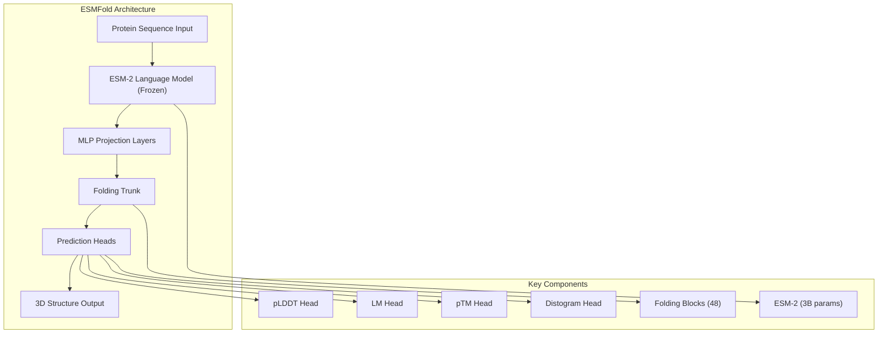
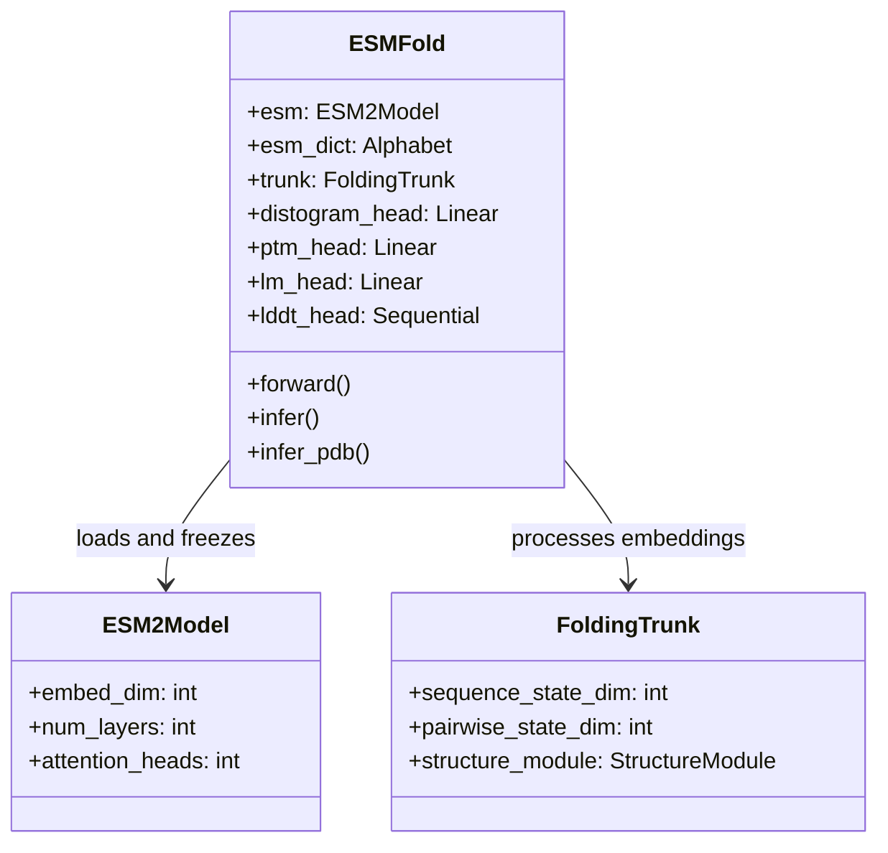
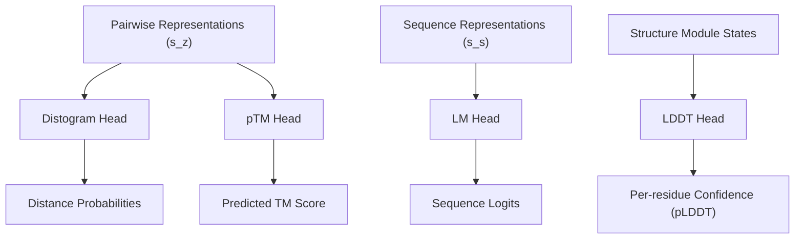
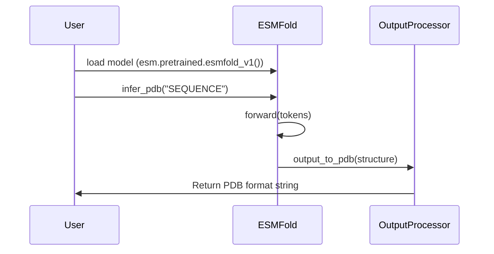

# ESMFold

> **Relevant source files**
> * [README.md](https://github.com/facebookresearch/esm/blob/2b369911/README.md?plain=1)
> * [esm/esmfold/v1/esmfold.py](https://github.com/facebookresearch/esm/blob/2b369911/esm/esmfold/v1/esmfold.py)
> * [esm/esmfold/v1/pretrained.py](https://github.com/facebookresearch/esm/blob/2b369911/esm/esmfold/v1/pretrained.py)
> * [tests/test_readme.py](https://github.com/facebookresearch/esm/blob/2b369911/tests/test_readme.py)

ESMFold is a state-of-the-art end-to-end protein structure prediction model that generates accurate atomic-level protein structures directly from amino acid sequences. Released in November 2022 as part of the Evolutionary Scale Modeling (ESM) framework, ESMFold leverages the powerful ESM-2 protein language model to extract meaningful sequence representations and transforms these into precise 3D structures.

For information about the ESM-2 language models that power ESMFold, see [ESM-1 and ESM-2](/facebookresearch/esm/2.1-esm-1-and-esm-2).

## Architecture Overview

ESMFold combines a frozen pretrained ESM-2 language model with a specialized structure module to predict protein structures with high accuracy. The architecture follows an encoder-decoder pattern where the ESM-2 model serves as an encoder for protein sequences, and the structure module acts as a decoder to transform sequence representations into 3D coordinates.



Sources: [esm/esmfold/v1/esmfold.py L50-L364](https://github.com/facebookresearch/esm/blob/2b369911/esm/esmfold/v1/esmfold.py#L50-L364)

 [README.md L203-L237](https://github.com/facebookresearch/esm/blob/2b369911/README.md?plain=1#L203-L237)

## Core Components

### 1. ESM-2 Language Model

ESMFold utilizes a frozen ESM-2 transformer language model (typically the 3B parameter version) that has been pretrained on millions of protein sequences. The language model:

* Converts input amino acid sequences into contextualized embeddings
* Is kept in half precision (FP16) to optimize memory usage
* Has weights frozen during structure prediction
* Provides both sequence representations and attention maps

The following code shows how ESMFold loads and initializes the ESM-2 model:



Sources: [esm/esmfold/v1/esmfold.py L59-L64](https://github.com/facebookresearch/esm/blob/2b369911/esm/esmfold/v1/esmfold.py#L59-L64)

 [esm/esmfold/v1/esmfold.py L118-L145](https://github.com/facebookresearch/esm/blob/2b369911/esm/esmfold/v1/esmfold.py#L118-L145)

### 2. Structure Module (Folding Trunk)

The folding trunk is responsible for converting the language model representations into 3D protein structures. It consists of:

* A sequence of folding blocks that iteratively refine the structure
* Multilayer perceptrons (MLPs) that project ESM embeddings to sequence and pair representations
* A structure module that produces atom coordinates from internal representations

The trunk handles the recurrent portion of the architecture, allowing for multiple "recycling" iterations to refine predictions.

Sources: [esm/esmfold/v1/esmfold.py L73-L93](https://github.com/facebookresearch/esm/blob/2b369911/esm/esmfold/v1/esmfold.py#L73-L93)

 [esm/esmfold/v1/esmfold.py L212-L214](https://github.com/facebookresearch/esm/blob/2b369911/esm/esmfold/v1/esmfold.py#L212-L214)

### 3. Prediction Heads

ESMFold includes several prediction heads that provide different aspects of the structure prediction:

1. **Distogram Head**: Predicts distances between residue pairs
2. **pTM Head**: Predicts template modeling (TM) score
3. **LM Head**: Predicts amino acid identities (useful for validation)
4. **LDDT Head**: Predicts local distance difference test (pLDDT) confidence scores

These heads allow the model to output not just the 3D structure, but also confidence measures and quality assessments.



Sources: [esm/esmfold/v1/esmfold.py L95-L104](https://github.com/facebookresearch/esm/blob/2b369911/esm/esmfold/v1/esmfold.py#L95-L104)

 [esm/esmfold/v1/esmfold.py L232-L256](https://github.com/facebookresearch/esm/blob/2b369911/esm/esmfold/v1/esmfold.py#L232-L256)

## Available Models

### Main Production Models

ESMFold offers two primary production-ready models:

1. **ESMFold v1** (`esmfold_v1()`): The recommended model for most use cases, delivering state-of-the-art performance
2. **ESMFold v0** (`esmfold_v0()`): The original model used in the Lin et al. 2022 paper

Both models use the 3B parameter ESM-2 language model with 48 folding blocks. The v1 model represents an improved version with better performance.

### Ablation Models

For research purposes, ESMFold also provides various ablation models to study the effect of language model size on structure prediction:

| Model Name | ESM-2 Size | Training Updates | Folding Blocks |
| --- | --- | --- | --- |
| `esmfold_structure_module_only_8M` | 8M | 500K | 0 |
| `esmfold_structure_module_only_35M` | 35M | 500K | 0 |
| `esmfold_structure_module_only_150M` | 150M | 500K | 0 |
| `esmfold_structure_module_only_650M` | 650M | 500K | 0 |
| `esmfold_structure_module_only_3B` | 3B | 500K | 0 |
| `esmfold_structure_module_only_15B` | 15B | 270K | 0 |

These models are typically used for research and ablation studies rather than for production use.

Sources: [esm/esmfold/v1/pretrained.py L41-L181](https://github.com/facebookresearch/esm/blob/2b369911/esm/esmfold/v1/pretrained.py#L41-L181)

 [README.md L232-L237](https://github.com/facebookresearch/esm/blob/2b369911/README.md?plain=1#L232-L237)

## Using ESMFold

### Python API

The most flexible way to use ESMFold is through the Python API:



Basic usage example:

```javascript
import torchimport esm # Load modelmodel = esm.pretrained.esmfold_v1()model = model.eval().cuda() # Optional: reduce memory usage with chunking# model.set_chunk_size(128) # Predict structure from sequencesequence = "MKTVRQERLKSIVRILERSKEPVSGAQLAEELSVSRQVIVQDIAYLRSLGYNIVATPRGYVLAGG"with torch.no_grad():    output = model.infer_pdb(sequence) # Save PDB filewith open("result.pdb", "w") as f:    f.write(output)
```

Sources: [esm/esmfold/v1/esmfold.py L281-L352](https://github.com/facebookresearch/esm/blob/2b369911/esm/esmfold/v1/esmfold.py#L281-L352)

 [README.md L205-L231](https://github.com/facebookresearch/esm/blob/2b369911/README.md?plain=1#L205-L231)

### Command Line Interface

ESMFold provides a command line tool (`esm-fold`) that efficiently predicts structures in bulk from a FASTA file:

```
esm-fold -i input.fasta -o output_directory [--num-recycles 4] [--chunk-size 128]
```

Options:

* `-i, --fasta`: Path to input FASTA file
* `-o, --pdb`: Path to output PDB directory
* `--num-recycles`: Number of recycles to run (default: 4)
* `--max-tokens-per-batch`: Maximum tokens per batch for efficient processing
* `--chunk-size`: Chunk size for axial attention computation (reduces memory usage)
* `--cpu-only`: Run on CPU only
* `--cpu-offload`: Enable CPU offloading for larger sequences

Sources: [README.md L238-L272](https://github.com/facebookresearch/esm/blob/2b369911/README.md?plain=1#L238-L272)

### Alternative Interfaces

ESMFold is available through several other interfaces:

1. **HuggingFace Transformers**: ```javascript from transformers import AutoModelForProteinFoldingmodel = AutoModelForProteinFolding.from_pretrained("facebook/esmfold_v1") ```
2. **ColabFold**: Available through a Google Colab notebook for browser-based usage
3. **REST API**: For simple predictions without installation: ``` curl -X POST --data "SEQUENCE" https://api.esmatlas.com/foldSequence/v1/pdb/ ```
4. **Web Interface**: Available at [https://esmatlas.com/resources?action=fold](https://esmatlas.com/resources?action=fold)

Sources: [README.md L114-L126](https://github.com/facebookresearch/esm/blob/2b369911/README.md?plain=1#L114-L126)

## Advanced Features

### Multimer Prediction

ESMFold can predict structures for protein complexes (multimers) with multiple chains:

```markdown
# Chains separated by ':' charactermultimer_sequence = "CHAIN1:CHAIN2:CHAIN3"output = model.infer_pdb(multimer_sequence)
```

Options:

* `residue_index_offset`: Controls spacing between chains (default: 512)
* `chain_linker`: Sequence used to join chains during processing (default: 25 glycines)

Sources: [esm/esmfold/v1/esmfold.py L283-L305](https://github.com/facebookresearch/esm/blob/2b369911/esm/esmfold/v1/esmfold.py#L283-L305)

### Memory Optimization

For long sequences or larger models, ESMFold provides several memory optimization techniques:

1. **Chunked Attention**: Reduces memory usage from O(L²) to O(L) by processing attention in chunks ```markdown model.set_chunk_size(128)  # Process attention in chunks of 128 tokens ```
2. **CPU Offloading**: Moves parameters to CPU RAM when not in use ``` esm-fold -i input.fasta -o output_dir --cpu-offload ```
3. **FSDP Integration**: For very large models (like ESM-2 15B), Fully Sharded Data Parallel can be used to distribute computation

Sources: [esm/esmfold/v1/esmfold.py L354-L360](https://github.com/facebookresearch/esm/blob/2b369911/esm/esmfold/v1/esmfold.py#L354-L360)

 [README.md L255-L264](https://github.com/facebookresearch/esm/blob/2b369911/README.md?plain=1#L255-L264)

## Performance

ESMFold demonstrates excellent structure prediction performance, especially considering its speed compared to other methods that use multiple sequence alignments:

| Model | CASP14 (TM-Score) | CAMEO (TM-Score) |
| --- | --- | --- |
| ESM-1b | 41.6 | 64.5 |
| ESM-2 (8M) | 36.7 | 48.1 |
| ESM-2 (35M) | 41.4 | 56.4 |
| ESM-2 (150M) | 49.0 | 64.9 |
| ESM-2 (650M) | 51.3 | 70.1 |
| ESM-2 (3B) | 52.5 | 71.8 |
| ESM-2 (15B) | 55.4 | 72.1 |

The performance scales with the size of the ESM-2 language model, with larger models producing more accurate structure predictions.

Sources: [README.md L552-L690](https://github.com/facebookresearch/esm/blob/2b369911/README.md?plain=1#L552-L690)

## Applications

ESMFold has been used for:

1. **ESM Metagenomic Atlas**: A repository of 600M+ predicted metagenomic protein structures
2. **Protein Design**: Used in combination with programming language concepts for generative protein design
3. **Large-scale Structure Prediction**: Enables rapid structure prediction for entire proteomes

For more information on the ESM Metagenomic Atlas, see [ESM Metagenomic Atlas](/facebookresearch/esm/6-esm-metagenomic-atlas).

Sources: [README.md L406-L418](https://github.com/facebookresearch/esm/blob/2b369911/README.md?plain=1#L406-L418)

 [README.md L12-L18](https://github.com/facebookresearch/esm/blob/2b369911/README.md?plain=1#L12-L18)