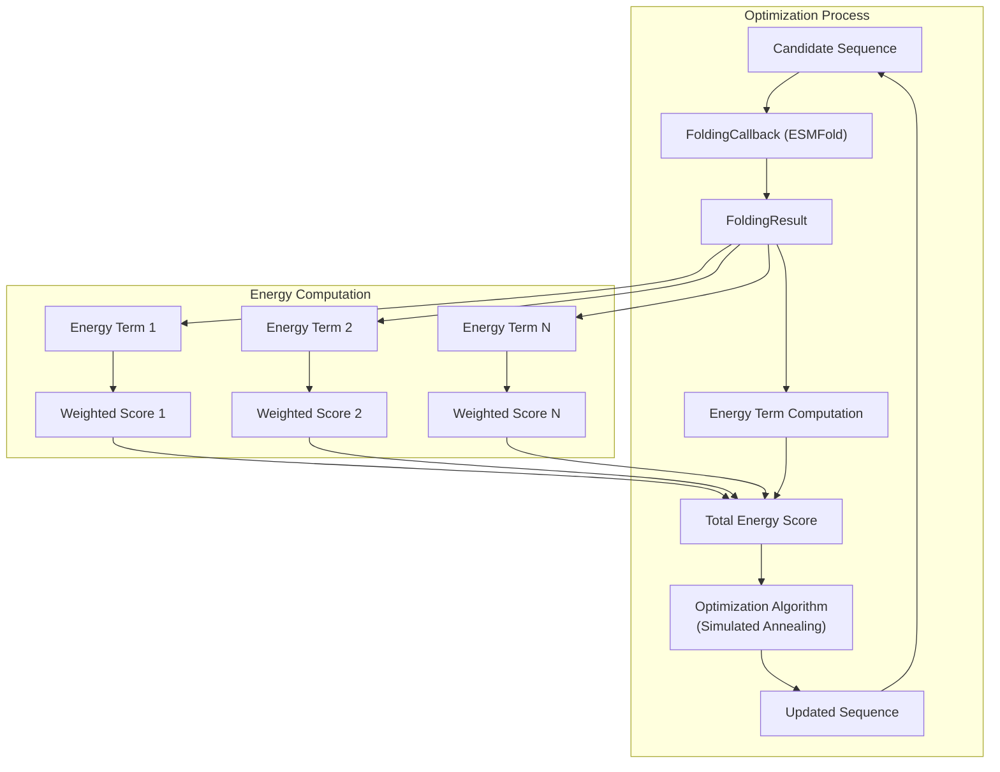
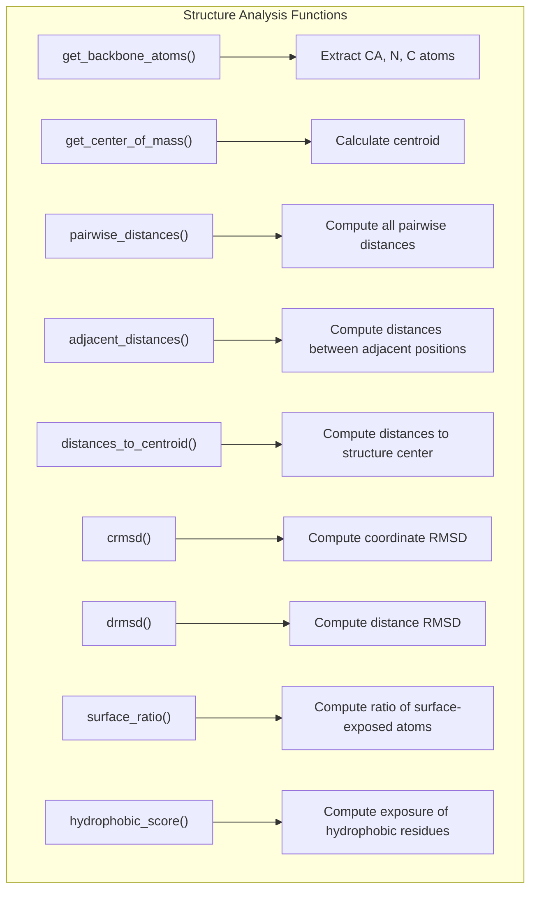
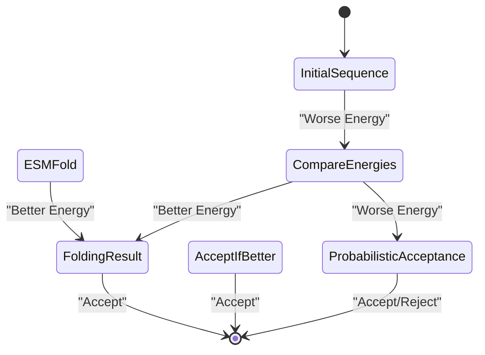
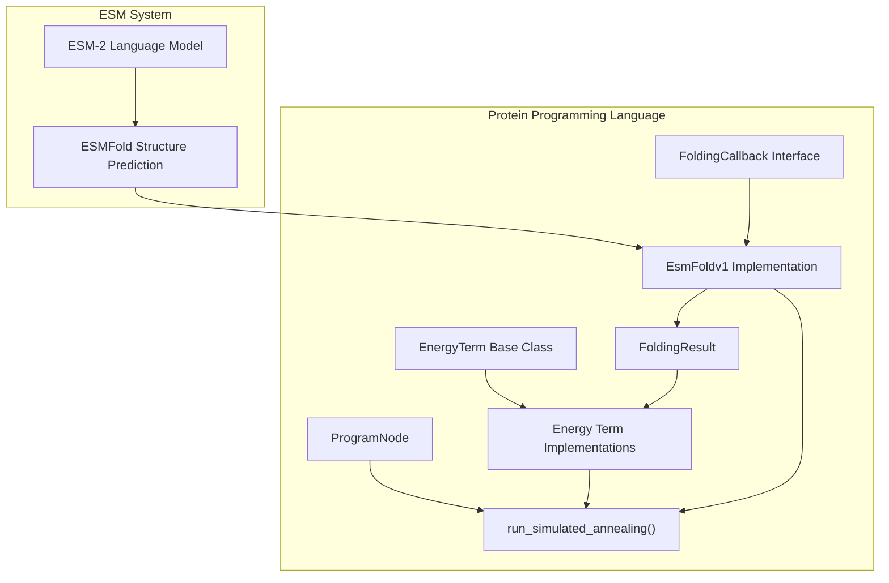

# Energy Terms and Optimization

> **Relevant source files**
> * [examples/protein-programming-language/language/__init__.py](https://github.com/facebookresearch/esm/blob/2b369911/examples/protein-programming-language/language/__init__.py)
> * [examples/protein-programming-language/language/energy.py](https://github.com/facebookresearch/esm/blob/2b369911/examples/protein-programming-language/language/energy.py)
> * [examples/protein-programming-language/programs/__init__.py](https://github.com/facebookresearch/esm/blob/2b369911/examples/protein-programming-language/programs/__init__.py)

## Purpose and Scope

This document details the energy terms and optimization process used in the ESM protein programming language. Energy terms define optimization objectives for protein design, while the optimization process uses these terms to guide protein sequence and structure generation. For information about the overall Protein Programming Language architecture, see [Protein Programming Language](/facebookresearch/esm/8-protein-programming-language).

## Energy Terms Architecture

The protein programming language uses energy terms to define objectives that should be optimized during the protein design process. Each energy term evaluates a specific property of a protein structure and returns a score that should be minimized during optimization.

```mermaid
classDiagram
    class EnergyTerm {
        «Abstract»
        +compute(node, folding_result) : float
    }
    class MaximizePTM {
        +compute(node, folding_result) : float
    }
    class MaximizePLDDT {
        +compute(node, folding_result) : float
    }
    class SymmetryRing {
        -all_to_all_protomer_symmetry: bool
        +compute(node, folding_result) : float
    }
    class MinimizeSurfaceHydrophobics {
        +compute(node, folding_result) : float
    }
    class MinimizeSurfaceExposure {
        +compute(node, folding_result) : float
    }
    class MaximizeSurfaceExposure {
        +compute(node, folding_result) : float
    }
    class MaximizeGlobularity {
        +compute(node, folding_result) : float
    }
    class MinimizeCRmsd {
        -template: AtomArray
        -backbone_only: bool
        +compute(node, folding_result) : float
    }
    class MinimizeDRmsd {
        -template: AtomArray
        -backbone_only: bool
        +compute(node, folding_result) : float
    }
    class MatchSecondaryStructure {
        -secondary_structure_element: str
        +compute(node, folding_result) : float
    }
    EnergyTerm <|-- MaximizePTM
    EnergyTerm <|-- MaximizePLDDT
    EnergyTerm <|-- SymmetryRing
    EnergyTerm <|-- MinimizeSurfaceHydrophobics
    EnergyTerm <|-- MinimizeSurfaceExposure
    EnergyTerm <|-- MaximizeSurfaceExposure
    EnergyTerm <|-- MaximizeGlobularity
    EnergyTerm <|-- MinimizeCRmsd
    EnergyTerm <|-- MinimizeDRmsd
    EnergyTerm <|-- MatchSecondaryStructure
```



Sources: [examples/protein-programming-language/language/energy.py L16-L318](https://github.com/facebookresearch/esm/blob/2b369911/examples/protein-programming-language/language/energy.py#L16-L318)

All energy terms inherit from the abstract base class `EnergyTerm` and implement the `compute` method, which takes a program node and a folding result as input and returns a float score. Lower scores are better, so energy terms that aim to maximize a property return (1.0 - property_value).

## Energy Computation Process

The energy terms are used in the optimization process to evaluate candidate protein designs. The system uses a folding callback (such as ESMFold) to predict the structure of a protein sequence, then evaluates that structure using the defined energy terms.



Sources: [examples/protein-programming-language/language/energy.py L16-L318](https://github.com/facebookresearch/esm/blob/2b369911/examples/protein-programming-language/language/energy.py#L16-L318)

 [examples/protein-programming-language/language/__init__.py L1-L23](https://github.com/facebookresearch/esm/blob/2b369911/examples/protein-programming-language/language/__init__.py#L1-L23)

## Available Energy Terms

The energy terms are categorized based on their purpose:

### Structure Quality Terms

These terms evaluate the quality of the predicted protein structure:

1. **MaximizePTM**: Maximizes the predicted TM-score (Template Modeling score) of the structure, which indicates structural quality.
2. **MaximizePLDDT**: Maximizes the predicted LDDT (Local Distance Difference Test) score, which indicates confidence in the predicted structure.

Sources: [examples/protein-programming-language/language/energy.py L25-L41](https://github.com/facebookresearch/esm/blob/2b369911/examples/protein-programming-language/language/energy.py#L25-L41)

### Geometric Terms

These terms enforce geometric properties of the structure:

1. **SymmetryRing**: Enforces rotational symmetry in a complex by penalizing deviations from perfect symmetry. Can evaluate symmetry between adjacent protomers or all pairs of protomers.
2. **MaximizeGlobularity**: Encourages a globular shape by minimizing the standard deviation of distances from each atom to the center of mass.

Sources: [examples/protein-programming-language/language/energy.py L43-L222](https://github.com/facebookresearch/esm/blob/2b369911/examples/protein-programming-language/language/energy.py#L43-L222)

### Surface Property Terms

These terms control properties of the protein surface:

1. **MinimizeSurfaceHydrophobics**: Minimizes the exposure of hydrophobic residues (VAL, ILE, LEU, PHE, MET, TRP) on the protein surface.
2. **MinimizeSurfaceExposure**: Minimizes the overall surface exposure of specified residues.
3. **MaximizeSurfaceExposure**: Maximizes the overall surface exposure of specified residues.

Sources: [examples/protein-programming-language/language/energy.py L102-L202](https://github.com/facebookresearch/esm/blob/2b369911/examples/protein-programming-language/language/energy.py#L102-L202)

### Template Matching Terms

These terms encourage similarity to a template structure:

1. **MinimizeCRmsd**: Minimizes the coordinate root-mean-square deviation (RMSD) after superimposition with a template structure.
2. **MinimizeDRmsd**: Minimizes the distance RMSD, which compares pairwise distances between atoms rather than absolute coordinates.

Sources: [examples/protein-programming-language/language/energy.py L234-L298](https://github.com/facebookresearch/esm/blob/2b369911/examples/protein-programming-language/language/energy.py#L234-L298)

### Secondary Structure Terms

These terms control the secondary structure of the protein:

1. **MatchSecondaryStructure**: Encourages specific secondary structure elements (helix, sheet, or coil) in designated regions.

Sources: [examples/protein-programming-language/language/energy.py L301-L318](https://github.com/facebookresearch/esm/blob/2b369911/examples/protein-programming-language/language/energy.py#L301-L318)

## Utility Functions

The energy terms use several utility functions for structure analysis:



Sources: [examples/protein-programming-language/language/energy.py L74-L318](https://github.com/facebookresearch/esm/blob/2b369911/examples/protein-programming-language/language/energy.py#L74-L318)

## Optimization Process

The protein programming language uses simulated annealing to optimize protein sequences against the defined energy terms. The optimization process follows these steps:

1. Start with an initial protein sequence
2. Predict its structure using ESMFold
3. Evaluate the structure using the defined energy terms
4. Make a random mutation to the sequence
5. Predict the structure of the mutated sequence
6. Evaluate the new structure
7. Accept or reject the mutation based on the energy difference and temperature
8. Repeat steps 4-7 until convergence or maximum iterations



Sources: [examples/protein-programming-language/language/__init__.py L14](https://github.com/facebookresearch/esm/blob/2b369911/examples/protein-programming-language/language/__init__.py#L14-L14)

## Using Energy Terms in Protein Design

To use energy terms in a protein design program:

1. Define a list of energy terms with appropriate weights
2. Create a program node structure representing your protein design
3. Run simulated annealing optimization with the energy terms
4. Analyze the resulting optimized sequence and structure

Here's an example of how energy terms would be defined and weighted:

```markdown
energy_terms = [    (MaximizePTM(), 1.0),                       # Maximize structure quality    (MinimizeSurfaceHydrophobics(), 0.5),       # Reduce hydrophobics on surface    (SymmetryRing(all_to_all_protomer_symmetry=True), 2.0),  # Enforce symmetry    (MatchSecondaryStructure("H"), 0.8)         # Encourage helical structure]
```

The optimization would then be performed using the `run_simulated_annealing` function:

```
optimized_sequence = run_simulated_annealing(    program_node,    energy_terms,    folding_callback=EsmFoldv1(),    initial_temperature=1.0,    cooling_factor=0.95,    max_iterations=1000)
```

Sources: [examples/protein-programming-language/language/__init__.py L1-L23](https://github.com/facebookresearch/esm/blob/2b369911/examples/protein-programming-language/language/__init__.py#L1-L23)

## Integration with ESM System

The energy terms and optimization system integrates with the broader ESM ecosystem by using ESMFold for structure prediction during the optimization process.



Sources: [examples/protein-programming-language/language/__init__.py L1-L23](https://github.com/facebookresearch/esm/blob/2b369911/examples/protein-programming-language/language/__init__.py#L1-L23)

The system is designed to be extensible, allowing for:

* Addition of new energy terms by subclassing `EnergyTerm`
* Custom folding callbacks by implementing the `FoldingCallback` interface
* Different optimization strategies beyond simulated annealing

This architecture enables the development of sophisticated protein design programs that can leverage the structural prediction power of ESMFold while optimizing for specific biophysical properties.