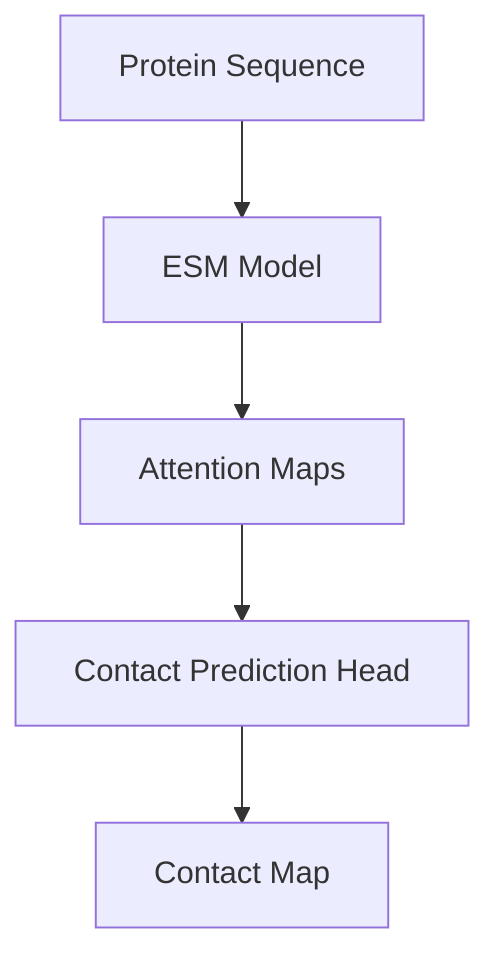
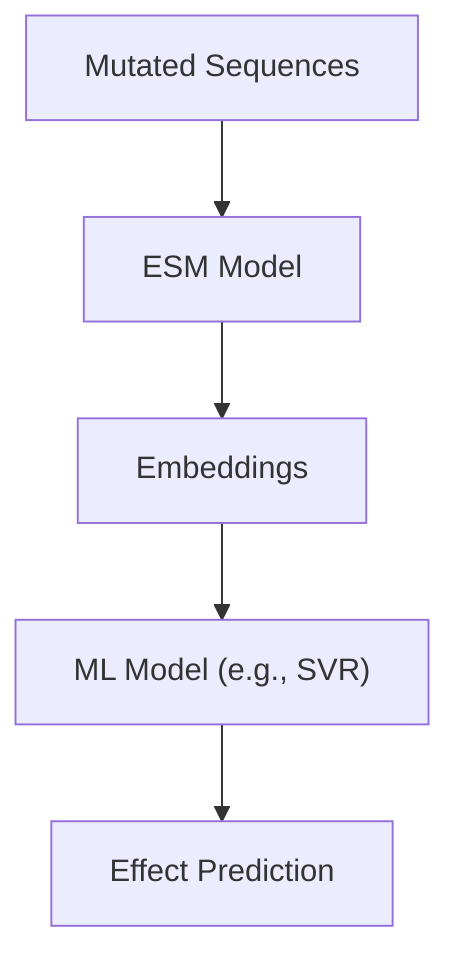
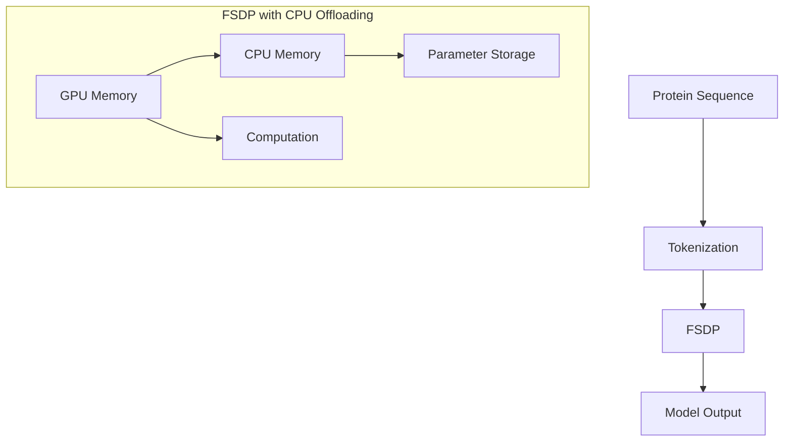
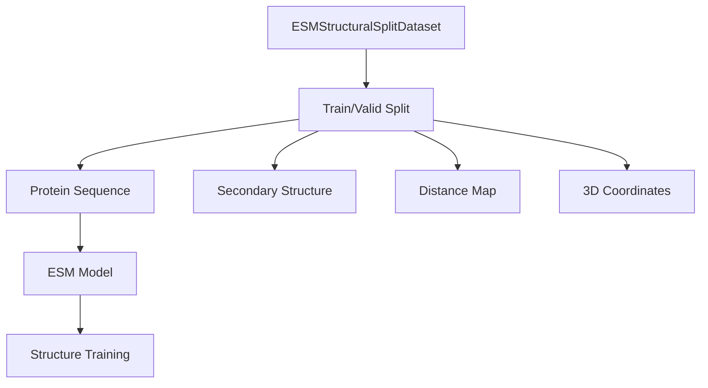
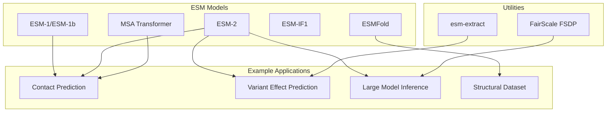

# Example Applications

> **Relevant source files**
> * [esm/model/esm1.py](https://github.com/facebookresearch/esm/blob/2b369911/esm/model/esm1.py)
> * [esm/model/esm2.py](https://github.com/facebookresearch/esm/blob/2b369911/esm/model/esm2.py)
> * [esm/model/msa_transformer.py](https://github.com/facebookresearch/esm/blob/2b369911/esm/model/msa_transformer.py)
> * [esm/rotary_embedding.py](https://github.com/facebookresearch/esm/blob/2b369911/esm/rotary_embedding.py)
> * [examples/README.md](https://github.com/facebookresearch/esm/blob/2b369911/examples/README.md?plain=1)
> * [examples/contact_prediction.ipynb](https://github.com/facebookresearch/esm/blob/2b369911/examples/contact_prediction.ipynb)
> * [examples/esm2_infer_fairscale_fsdp_cpu_offloading.py](https://github.com/facebookresearch/esm/blob/2b369911/examples/esm2_infer_fairscale_fsdp_cpu_offloading.py)
> * [examples/esm_structural_dataset.ipynb](https://github.com/facebookresearch/esm/blob/2b369911/examples/esm_structural_dataset.ipynb)
> * [examples/sup_variant_prediction.ipynb](https://github.com/facebookresearch/esm/blob/2b369911/examples/sup_variant_prediction.ipynb)

This page provides an overview of practical applications of ESM (Evolutionary Scale Modeling) models for protein sequence analysis tasks. It demonstrates how to use ESM in various biological applications, showing concrete implementations using the available API and tools.

For information about the models themselves, see [Models](/facebookresearch/esm/2-models), and for tools and utilities, see [Tools and Utilities](/facebookresearch/esm/4-tools-and-utilities).

## Contact Prediction

Contact prediction is the task of predicting which amino acid residues in a protein are physically close to each other in the 3D structure. ESM models can predict these contacts directly from sequence information, without requiring structural data for training.

### Using ESM for Contact Prediction

The contact prediction workflow involves:

1. Loading a protein sequence or MSA (Multiple Sequence Alignment)
2. Processing it through an ESM model
3. Extracting attention weights
4. Using these weights to predict contacts

**Contact Prediction Workflow**



The following code demonstrates how to use ESM-2 for contact prediction:

```python
import esm
import torch 

# Load model
model, alphabet = esm.pretrained.esm2_t33_650M_UR50D()
model = model.eval().cuda()
batch_converter = alphabet.get_batch_converter() 

# Prepare data
data = [("protein_name", "MKTVRQERLKSIVRILERSKEPVSGAQLAEELSVSRQVIVQDIAYLRSLGYNIVATPRGYVLAGG")]
batch_labels, batch_strs, batch_tokens = batch_converter(data)
batch_tokens = batch_tokens.cuda() 

# Predict contacts
with torch.no_grad():    
    results = model(batch_tokens, repr_layers=[33], return_contacts=True)
contacts = results["contacts"]
```

ESM-2 models can infer contacts using self-attention patterns learned during pretraining on protein sequences. The `predict_contacts` method makes this straightforward.

### Visualizing Contact Predictions

Contact predictions can be visualized as a heatmap, where each cell indicates the probability of a contact between two amino acids.

```python
import matplotlib.pyplot as plt
import numpy as np 
plt.figure(figsize=(10, 10))
plt.imshow(contacts[0].cpu(), cmap="Blues")
plt.colorbar()
plt.title("Contact Map")
plt.xlabel("Residue")
plt.ylabel("Residue")
plt.show()
```

These predictions can be compared against experimentally determined contacts from structures (often using Cβ distances < 8Å as the criterion for contact).

Sources: [examples/contact_prediction.ipynb L255-L641](https://github.com/facebookresearch/esm/blob/2b369911/examples/contact_prediction.ipynb#L255-L641)

## Variant Effect Prediction

Variant effect prediction involves determining how mutations in a protein sequence affect its function. ESM models can be used for this task in both supervised and zero-shot settings.

### Supervised Variant Prediction

For supervised variant prediction, ESM embeddings are used as features for a machine learning model that predicts the effect of mutations:

**Supervised Variant Prediction Workflow**



The process involves:

1. Extracting embeddings for wild-type and mutated sequences
2. Training a machine learning model (like Support Vector Regression) on these embeddings
3. Using the model to predict effects of new mutations

This example demonstrates how to train a variant effect predictor for β-lactamase:

```python
# Extract embeddings
ys = []  # Effect scores
Xs = []  # Embeddings
for header, _seq in esm.data.read_fasta("P62593.fasta"):
    scaled_effect = header.split('|')[-1]
    ys.append(float(scaled_effect))
    fn = f'P62593_emb_esm1v/{header[1:]}.pt'
    embs = torch.load(fn)
    Xs.append(embs['mean_representations'][33])

# Train-test split and model fitting
from sklearn.model_selection import train_test_split
from sklearn.svm import SVR

Xs_train, Xs_test, ys_train, ys_test = train_test_split(Xs, ys, train_size=0.8)
svr = SVR()
svr.fit(Xs_train, ys_train)
predictions = svr.predict(Xs_test)
```

Visualizing the results shows how well the model predicts the effects:

```python
plt.figure(figsize=(8, 8))
plt.scatter(ys_test, predictions)
plt.plot([min(ys_test), max(ys_test)], [min(ys_test), max(ys_test)], 'k--')
plt.xlabel("True values")
plt.ylabel("Predictions")
plt.title("Variant Effect Prediction")
plt.show()
```

Sources: [examples/sup_variant_prediction.ipynb L33-L277](https://github.com/facebookresearch/esm/blob/2b369911/examples/sup_variant_prediction.ipynb#L33-L277)

### Zero-Shot Variant Prediction

ESM also supports zero-shot variant effect prediction, which doesn't require labeled training data. This approach uses the model's internal representations to estimate the impact of mutations directly.

For zero-shot variant prediction, the key insight is that ESM models implicitly learn an energy function over protein sequences during pretraining. Changes in this energy can be used to estimate mutation effects.

## Large Model Inference with FSDP

The largest ESM-2 model (ESM-2 15B) requires significant GPU memory. FairScale's Fully Sharded Data Parallel (FSDP) with CPU offloading allows running this model on machines with limited GPU memory.

**Large Model Inference Architecture**



To use ESM-2 15B with FSDP CPU offloading:

```python
import torch
from fairscale.nn.data_parallel import FullyShardedDataParallel as FSD
from fairscale.nn.wrap import enable_wrap, wrap
import esm

# Initialize distributed environment
torch.distributed.init_process_group(backend="nccl", init_method="tcp://localhost:23456", world_size=1, rank=0)

# Load model with FSDP wrapper
model_name = "esm2_t48_15B_UR50D"
model_data = esm.pretrained._download_model_and_regression_data(model_name)

fsdp_params = dict(
    mixed_precision=True,
    flatten_parameters=True,
    state_dict_device=torch.device("cpu"),  # Reduce GPU memory
    cpu_offload=True,  # Enable CPU offloading
)

with enable_wrap(wrapper_cls=FSDP, **fsdp_params):
    model, alphabet = esm.pretrained.load_model_and_alphabet_core(model_name, model_data)
    batch_converter = alphabet.get_batch_converter()
    model.eval()

    # Wrap each layer separately
    for name, child in model.named_children():
        if name == "layers":
            for layer_name, layer in child.named_children():
                wrapped_layer = wrap(layer)
                setattr(child, layer_name, wrapped_layer)
    model = wrap(model)

# Use the model
data = [("protein1", "MKTVRQERLKSIVRILERSKEPVSGAQLAEELSVSRQVIVQDIAYLRSLGYNIVATPRGYVLAGG")]
batch_labels, batch_strs, batch_tokens = batch_converter(data)
batch_tokens = batch_tokens.cuda()
with torch.no_grad():
    results = model(batch_tokens, repr_layers=[48], return_contacts=True)
```

This approach allows you to run the 15B parameter model even on GPUs with limited memory by offloading parameters to CPU when not in use.

Sources: [examples/esm2_infer_fairscale_fsdp_cpu_offloading.py L1-L56](https://github.com/facebookresearch/esm/blob/2b369911/examples/esm2_infer_fairscale_fsdp_cpu_offloading.py#L1-L56)

## ESM Structural Dataset Example

ESM provides a structural dataset for training and evaluating structure prediction models. This dataset contains protein sequences along with their secondary structure annotations, distance maps, and 3D coordinates.

**ESM Structural Dataset Workflow**



To use the ESM Structural Dataset:

```python
from esm.data import ESMStructuralSplitDataset 
# Load dataset for a specific split level and cross-validation partition
dataset = ESMStructuralSplitDataset(    
    split_level='superfamily',  # Options: 'family', 'superfamily', 'fold'    
    cv_partition='0',  # Cross-validation partition    
    split='train',  # 'train' or 'valid'    
    root_path='~/.cache/torch/data/esm',    
    download=True) 
    
# Access a sample
sample = dataset[0]
sequence = sample['seq']
secondary_structure = sample['ssp']
distance_map = sample['dist']
coordinates = sample['coords']
```

The dataset is organized by evolutionary relatedness (family, superfamily, or fold) to allow testing of structure prediction generalization to proteins with different levels of sequence similarity.

Sources: [examples/esm_structural_dataset.ipynb L1-L178](https://github.com/facebookresearch/esm/blob/2b369911/examples/esm_structural_dataset.ipynb#L1-L178)

## Integration with ESM Applications

The following diagram shows how the example applications fit into the broader ESM ecosystem:



Sources: [examples/README.md L1-L11](https://github.com/facebookresearch/esm/blob/2b369911/examples/README.md?plain=1#L1-L11)

 [esm/model/esm1.py L1-L201](https://github.com/facebookresearch/esm/blob/2b369911/esm/model/esm1.py#L1-L201)

 [esm/model/esm2.py L1-L148](https://github.com/facebookresearch/esm/blob/2b369911/esm/model/esm2.py#L1-L148)

 [esm/model/msa_transformer.py L1-L239](https://github.com/facebookresearch/esm/blob/2b369911/esm/model/msa_transformer.py#L1-L239)

## Advanced Use Cases and Integration

These example applications can be extended and integrated into larger workflows:

1. **Structural Biology** - Using contact prediction to guide experimental structure determination or as constraints for protein folding simulations
2. **Protein Engineering** - Using variant effect prediction to design proteins with desired properties
3. **Drug Discovery** - Identifying key residues through contact prediction for drug targeting
4. **Metagenomics** - Processing large datasets with efficient inference techniques for protein annotation

The modular nature of the ESM codebase allows these applications to be combined and customized for specific research needs.

Sources: [examples/contact_prediction.ipynb L255-L641](https://github.com/facebookresearch/esm/blob/2b369911/examples/contact_prediction.ipynb#L255-L641)

 [examples/sup_variant_prediction.ipynb L33-L277](https://github.com/facebookresearch/esm/blob/2b369911/examples/sup_variant_prediction.ipynb#L33-L277)

 [examples/esm2_infer_fairscale_fsdp_cpu_offloading.py L1-L56](https://github.com/facebookresearch/esm/blob/2b369911/examples/esm2_infer_fairscale_fsdp_cpu_offloading.py#L1-L56)