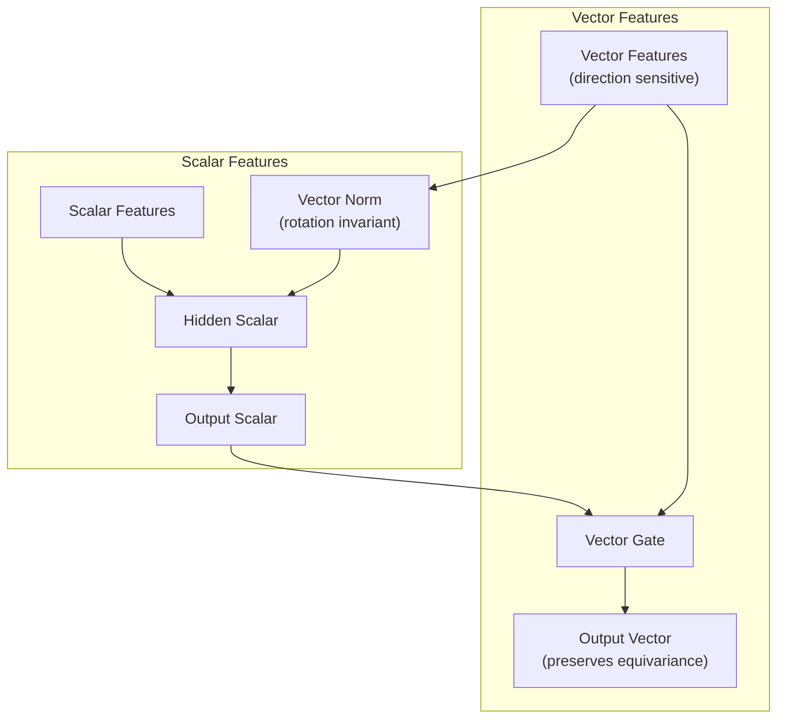
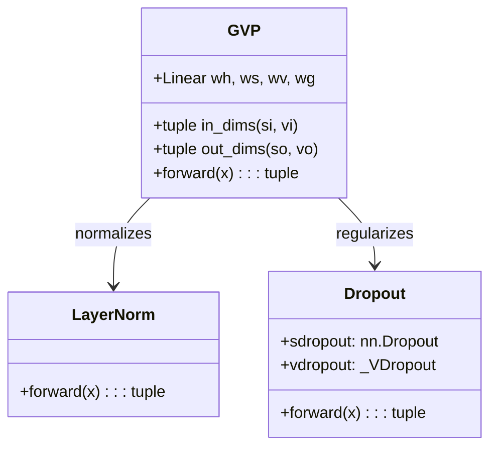
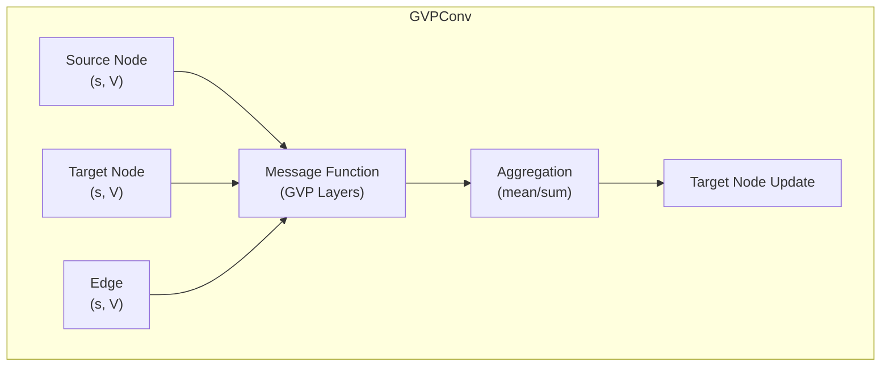
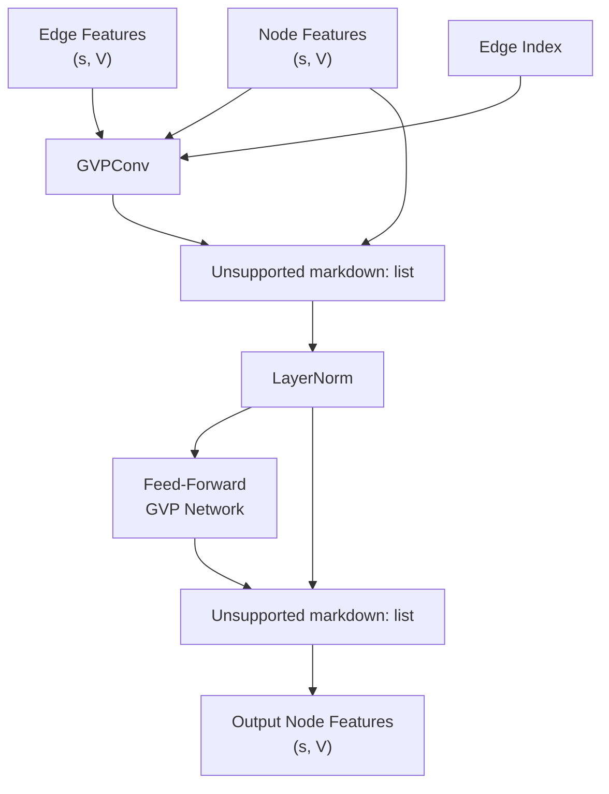
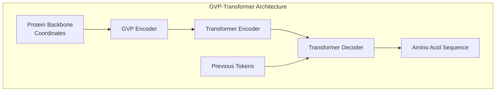
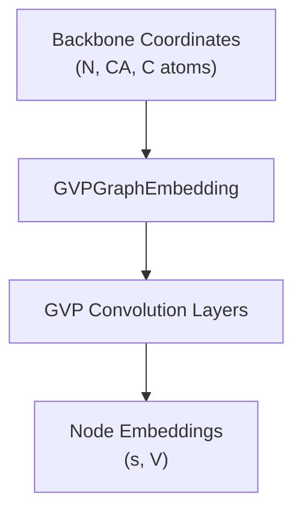
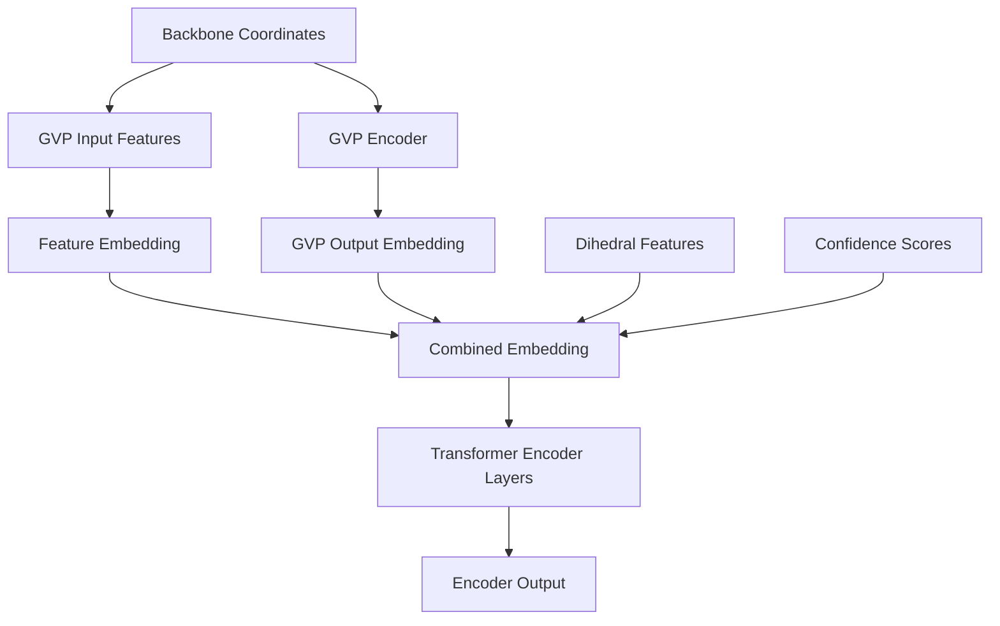
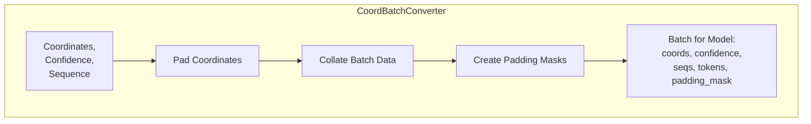
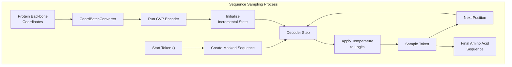

# GVP Architecture

> **Relevant source files**
> * [esm/inverse_folding/gvp_encoder.py](https://github.com/facebookresearch/esm/blob/2b369911/esm/inverse_folding/gvp_encoder.py)
> * [esm/inverse_folding/gvp_modules.py](https://github.com/facebookresearch/esm/blob/2b369911/esm/inverse_folding/gvp_modules.py)
> * [esm/inverse_folding/gvp_transformer.py](https://github.com/facebookresearch/esm/blob/2b369911/esm/inverse_folding/gvp_transformer.py)
> * [esm/inverse_folding/gvp_transformer_encoder.py](https://github.com/facebookresearch/esm/blob/2b369911/esm/inverse_folding/gvp_transformer_encoder.py)
> * [esm/inverse_folding/gvp_utils.py](https://github.com/facebookresearch/esm/blob/2b369911/esm/inverse_folding/gvp_utils.py)
> * [esm/inverse_folding/multichain_util.py](https://github.com/facebookresearch/esm/blob/2b369911/esm/inverse_folding/multichain_util.py)
> * [esm/inverse_folding/transformer_decoder.py](https://github.com/facebookresearch/esm/blob/2b369911/esm/inverse_folding/transformer_decoder.py)
> * [esm/inverse_folding/transformer_layer.py](https://github.com/facebookresearch/esm/blob/2b369911/esm/inverse_folding/transformer_layer.py)
> * [esm/inverse_folding/util.py](https://github.com/facebookresearch/esm/blob/2b369911/esm/inverse_folding/util.py)
> * [examples/variant-prediction/README.md](https://github.com/facebookresearch/esm/blob/2b369911/examples/variant-prediction/README.md?plain=1)

## Purpose and Scope

This document details the Geometric Vector Perceptron (GVP) architecture used in ESM's inverse folding system. The GVP architecture provides a framework for processing geometric information in protein structures while maintaining equivariance to 3D rotations, which is crucial for structure-based protein sequence design. For information about the broader inverse folding system and its applications, see [Inverse Folding](/facebookresearch/esm/5-inverse-folding) and [Inverse Folding Examples](/facebookresearch/esm/5.2-inverse-folding-examples).

## Core Concepts

The GVP is a neural network architecture designed to handle both scalar and vector features in 3D geometric data while preserving rotation equivariance.

### Tuple Representation

A central concept in GVP is the tuple representation `(s, V)`, where:

* `s` is a scalar feature tensor of shape `[batch_size, n_nodes, scalar_dim]`
* `V` is a vector feature tensor of shape `[batch_size, n_nodes, vector_dim, 3]` where the last dimension represents 3D coordinates

This separation allows the model to maintain equivariance with respect to 3D rotations for the vector components while processing scalar features normally.

Sources: [esm/inverse_folding/gvp_modules.py L36-L66](https://github.com/facebookresearch/esm/blob/2b369911/esm/inverse_folding/gvp_modules.py#L36-L66)

 [esm/inverse_folding/util.py L146-L159](https://github.com/facebookresearch/esm/blob/2b369911/esm/inverse_folding/util.py#L146-L159)

### Equivariance to 3D Rotations

For protein structure processing, equivariance to 3D rotations is essential - a protein's function is invariant to its orientation in space. The GVP architecture achieves this by:

1. Handling scalar and vector features separately
2. Applying appropriate transformations to vectors that preserve their relative orientations
3. Using norms of vectors to create rotation-invariant scalar features



Sources: [esm/inverse_folding/gvp_modules.py L113-L188](https://github.com/facebookresearch/esm/blob/2b369911/esm/inverse_folding/gvp_modules.py#L113-L188)

 [esm/inverse_folding/util.py L169-L179](https://github.com/facebookresearch/esm/blob/2b369911/esm/inverse_folding/util.py#L169-L179)

## GVP Components

### GVP Module

The core GVP module is implemented as a PyTorch `nn.Module` that transforms an input tuple `(s, V)` to an output tuple of potentially different dimensions.



The GVP class implements the core geometric vector perceptron logic:

1. Processes vector inputs with a linear transformation (`wh`)
2. Computes vector norms (rotation-invariant)
3. Concatenates with scalar features and processes through another linear layer (`ws`)
4. Optionally applies a vector gate mechanism to control vector features

Sources: [esm/inverse_folding/gvp_modules.py L113-L188](https://github.com/facebookresearch/esm/blob/2b369911/esm/inverse_folding/gvp_modules.py#L113-L188)

### GVP Graph Convolution

GVP is extended to graph neural networks via the `GVPConv` module, which implements message passing on graphs where nodes and edges contain both scalar and vector features.



Sources: [esm/inverse_folding/gvp_modules.py L267-L328](https://github.com/facebookresearch/esm/blob/2b369911/esm/inverse_folding/gvp_modules.py#L267-L328)

### GVP Convolution Layer

The `GVPConvLayer` combines graph convolution with residual connections and feed-forward networks to create a complete layer for processing protein structure graphs.



Sources: [esm/inverse_folding/gvp_modules.py L331-L475](https://github.com/facebookresearch/esm/blob/2b369911/esm/inverse_folding/gvp_modules.py#L331-L475)

## Integration with Transformer for Inverse Folding

The GVP architecture is integrated into a sequence-to-structure transformer model for the inverse folding task.

### Overall Architecture



The GVP-Transformer combines the strengths of:

* GVP for processing geometric protein structure information
* Transformer for sequence modeling and autoregressive generation

Sources: [esm/inverse_folding/gvp_transformer.py L24-L141](https://github.com/facebookresearch/esm/blob/2b369911/esm/inverse_folding/gvp_transformer.py#L24-L141)

### GVP Encoder

The GVP Encoder transforms protein backbone coordinates into a graph representation and processes it through multiple GVP convolution layers.



Sources: [esm/inverse_folding/gvp_encoder.py L18-L56](https://github.com/facebookresearch/esm/blob/2b369911/esm/inverse_folding/gvp_encoder.py#L18-L56)

### GVP Transformer Encoder

The GVP Transformer Encoder combines the GVP-processed structure information with positional encodings and other features to create a comprehensive representation for the Transformer decoder.



Sources: [esm/inverse_folding/gvp_transformer_encoder.py L23-L184](https://github.com/facebookresearch/esm/blob/2b369911/esm/inverse_folding/gvp_transformer_encoder.py#L23-L184)

## Data Processing and Batching

The inverse folding system employs specialized data conversion utilities to handle the unique requirements of protein structural data.

### CoordBatchConverter

The `CoordBatchConverter` extends ESM's `BatchConverter` to handle protein backbone coordinates, confidence scores, and sequences.



Sources: [esm/inverse_folding/util.py L220-L323](https://github.com/facebookresearch/esm/blob/2b369911/esm/inverse_folding/util.py#L220-L323)

## Example: Sequence Sampling from Structure

The GVP-Transformer model enables sampling protein sequences based on a given backbone structure.



Sources: [esm/inverse_folding/gvp_transformer.py L88-L140](https://github.com/facebookresearch/esm/blob/2b369911/esm/inverse_folding/gvp_transformer.py#L88-L140)

## Applications of GVP in ESM

The GVP architecture enables several key applications in the ESM codebase:

1. **Sequence design from structure**: Generating optimal sequences for a given protein backbone
2. **Scoring sequence-structure compatibility**: Evaluating how well a sequence matches a structure
3. **Multi-chain protein design**: Designing sequences for protein complexes
4. **Structure-conditioned protein engineering**: Designing sequences with specific structural constraints

Sources: [esm/inverse_folding/util.py L108-L131](https://github.com/facebookresearch/esm/blob/2b369911/esm/inverse_folding/util.py#L108-L131)

 [esm/inverse_folding/multichain_util.py L80-L105](https://github.com/facebookresearch/esm/blob/2b369911/esm/inverse_folding/multichain_util.py#L80-L105)

## Technical Implementation Details

### GVP Tuple Operations

The GVP modules use several specialized operations for working with the tuple representation `(s, V)`:

| Operation | Description |
| --- | --- |
| `tuple_sum` | Adds two tuples elementwise: `(s1, v1) + (s2, v2) = (s1+s2, v1+v2)` |
| `tuple_cat` | Concatenates tuples along a specified dimension |
| `tuple_index` | Indexes into both elements of a tuple |
| `_norm_no_nan` | Computes L2 norm while handling NaN values |
| `normalize` | Normalizes vectors while handling NaN values |

Sources: [esm/inverse_folding/gvp_modules.py L35-L65](https://github.com/facebookresearch/esm/blob/2b369911/esm/inverse_folding/gvp_modules.py#L35-L65)

### Handling Rotation Frames

The system uses rotation frames based on protein backbone atoms to achieve rotation equivariance:

```python
def get_rotation_frames(coords):    """    Returns a local rotation frame defined by N, CA, C positions.    """    v1 = coords[:, :, 2] - coords[:, :, 1]  # C - CA vector    v2 = coords[:, :, 0] - coords[:, :, 1]  # N - CA vector    # Construct orthonormal basis    e1 = normalize(v1, dim=-1)    u2 = v2 - e1 * torch.sum(e1 * v2, dim=-1, keepdim=True)    e2 = normalize(u2, dim=-1)    e3 = torch.cross(e1, e2, dim=-1)    R = torch.stack([e1, e2, e3], dim=-2)    return R
```

This allows the model to work in a local coordinate system defined by each residue's backbone atoms.

Sources: [esm/inverse_folding/util.py L162-L180](https://github.com/facebookresearch/esm/blob/2b369911/esm/inverse_folding/util.py#L162-L180)

 [esm/inverse_folding/util.py L146-L159](https://github.com/facebookresearch/esm/blob/2b369911/esm/inverse_folding/util.py#L146-L159)