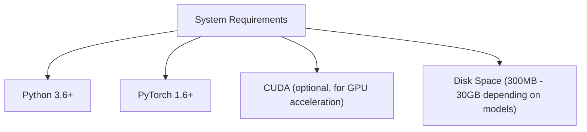
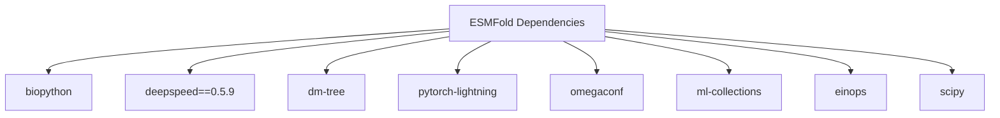
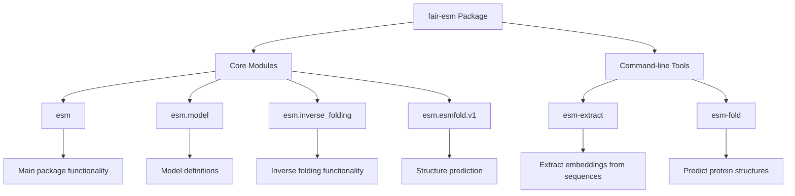
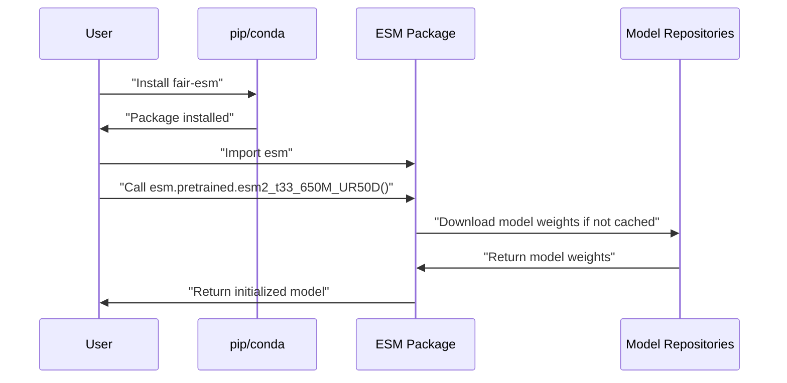

# Installation and Setup

> **Relevant source files**
> * [esm/version.py](https://github.com/facebookresearch/esm/blob/2b369911/esm/version.py)
> * [setup.py](https://github.com/facebookresearch/esm/blob/2b369911/setup.py)

This page provides detailed instructions for installing and setting up the ESM (Evolutionary Scale Modeling) repository, which contains pretrained protein language models and associated tools. For information about using specific models after installation, see [Models](/facebookresearch/esm/2-models).

## System Requirements

Before installing ESM, ensure your system meets the following requirements:



Sources: [setup.py L1-L56](https://github.com/facebookresearch/esm/blob/2b369911/setup.py#L1-L56)

## Installation Methods

There are several ways to install ESM depending on your needs:

### Basic Installation via pip

The simplest method is to install ESM via pip:

```
pip install fair-esm
```

This installs the core ESM functionality without ESMFold support.

### Installation with ESMFold Support

To install ESM with ESMFold support, use:

```
pip install "fair-esm[esmfold]"
```

This will install additional dependencies required for ESMFold:



Sources: [setup.py L15-L26](https://github.com/facebookresearch/esm/blob/2b369911/setup.py#L15-L26)

### Installation from Source

For the latest development version or to contribute to ESM:

```
git clone https://github.com/facebookresearch/esm.gitcd esmpip install -e .
```

To install with ESMFold support from source:

```
pip install -e ".[esmfold]"
```

## Package Structure

The ESM package has the following structure:



Sources: [setup.py L28-L55](https://github.com/facebookresearch/esm/blob/2b369911/setup.py#L28-L55)

## Verifying Installation

After installation, verify that ESM is correctly installed:

### Check Package Version

```javascript
import esmprint(esm.__version__)  # Should print the current version, e.g., "2.0.1"
```

Sources: [esm/version.py L6](https://github.com/facebookresearch/esm/blob/2b369911/esm/version.py#L6-L6)

### Test Command-line Tools

The installation should provide two command-line tools:

1. `esm-extract`: For extracting embeddings from protein sequences
2. `esm-fold`: For predicting protein structures

Verify they're correctly installed:

```
esm-extract --helpesm-fold --help
```

Sources: [setup.py L50-L55](https://github.com/facebookresearch/esm/blob/2b369911/setup.py#L50-L55)

## Model Downloading

When you first use an ESM model, it will be automatically downloaded from the repository. Models range in size from around 40MB to over 15GB for the largest ones.

The installation flow typically looks like:



Sources: [setup.py L36-L48](https://github.com/facebookresearch/esm/blob/2b369911/setup.py#L36-L48)

## Environment Variable Configuration

No specific environment variables are required for basic ESM functionality. However, for models that use the PyTorch Hub or Hugging Face model repositories, the following environment variables may be useful:

* `TORCH_HOME`: Directory where PyTorch Hub models are cached
* `HF_HOME`: Directory where Hugging Face models are cached

## Troubleshooting Common Issues

### CUDA/GPU Issues

If you encounter GPU-related errors:

* Ensure PyTorch is installed with CUDA support matching your installed CUDA version
* Try running with CPU-only by setting: `export CUDA_VISIBLE_DEVICES=""`

### Memory Issues with Large Models

ESM-2 models, especially the larger variants (t33, t36, t48), require significant memory:

* Use a smaller model if memory is limited
* Consider using model parallelism with FairScale FSDP for very large models (see [Large Model Inference](/facebookresearch/esm/7.3-large-model-inference))

### Package Not Found Errors

If you encounter "package not found" errors after installation:

* Ensure your Python environment is activated
* Verify the package is installed with `pip list | grep fair-esm`
* Try reinstalling with `pip install --force-reinstall fair-esm`

## Compatibility Notes

The current version of ESM (2.0.1) is compatible with:

* PyTorch 1.6+
* Python 3.6+

For optimal performance with ESMFold, using the exact dependency versions listed in the extras requirements is recommended.

Sources: [esm/version.py L6](https://github.com/facebookresearch/esm/blob/2b369911/esm/version.py#L6-L6)

 [setup.py L15-L26](https://github.com/facebookresearch/esm/blob/2b369911/setup.py#L15-L26)