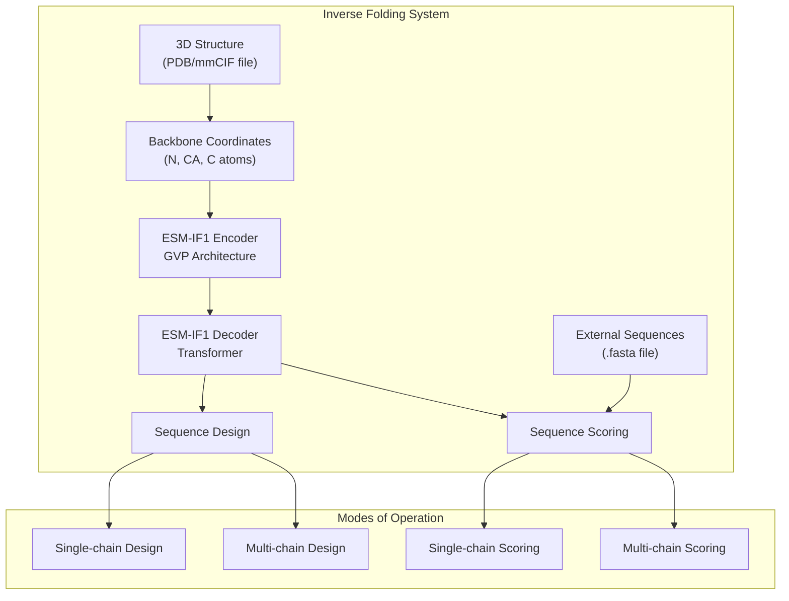
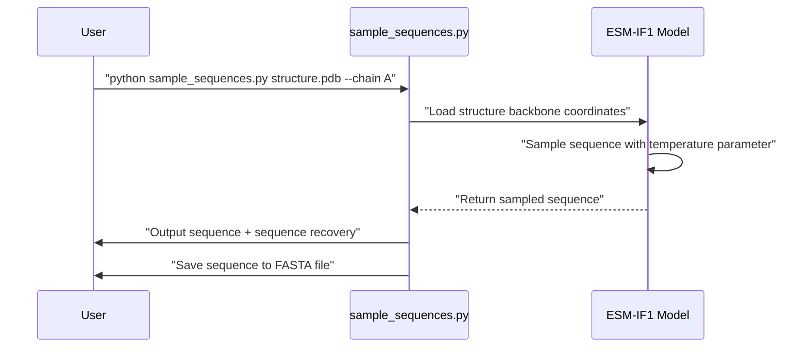
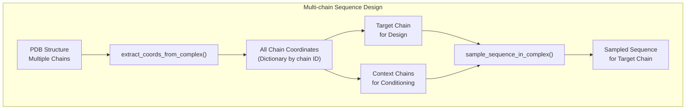
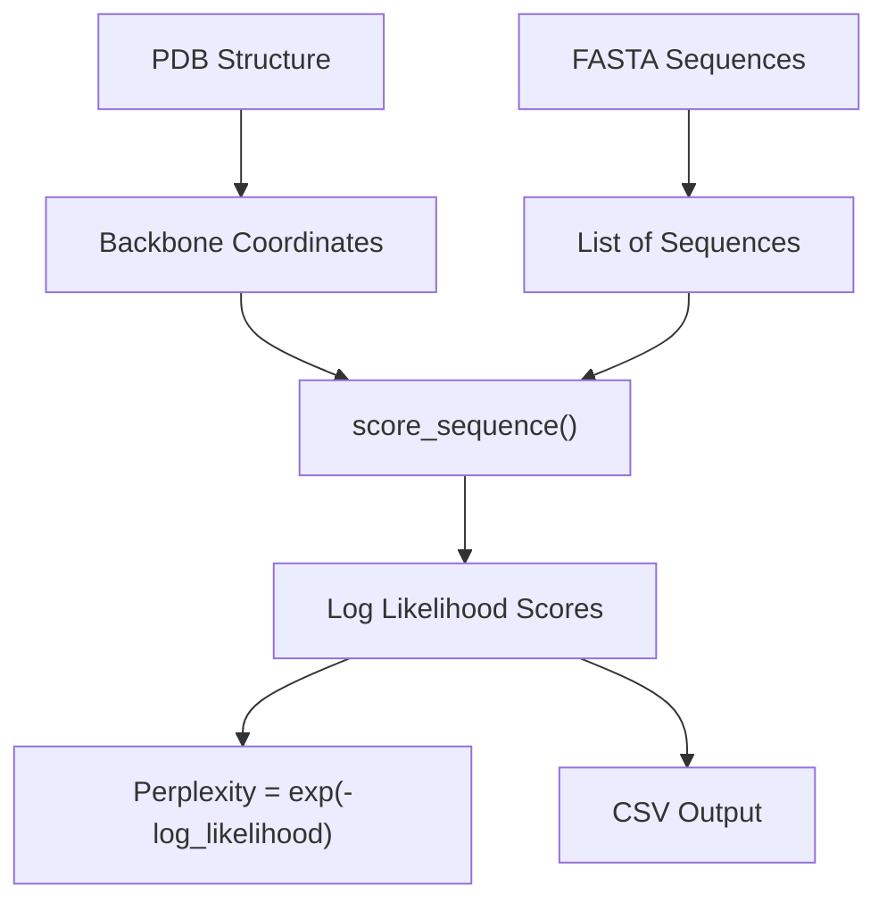
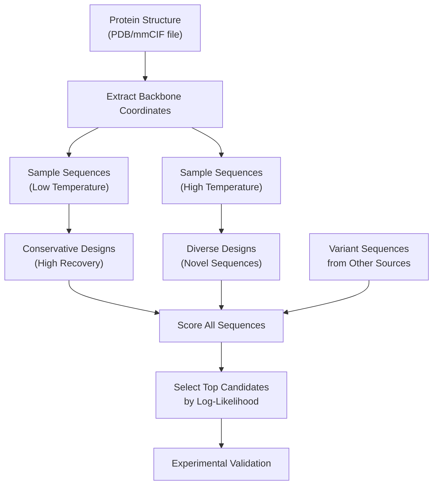

# Inverse Folding Examples

> **Relevant source files**
> * [esm/inverse_folding/__init__.py](https://github.com/facebookresearch/esm/blob/2b369911/esm/inverse_folding/__init__.py)
> * [esm/inverse_folding/features.py](https://github.com/facebookresearch/esm/blob/2b369911/esm/inverse_folding/features.py)
> * [examples/inverse_folding/README.md](https://github.com/facebookresearch/esm/blob/2b369911/examples/inverse_folding/README.md?plain=1)
> * [examples/inverse_folding/notebook_multichain.ipynb](https://github.com/facebookresearch/esm/blob/2b369911/examples/inverse_folding/notebook_multichain.ipynb)
> * [examples/inverse_folding/sample_sequences.py](https://github.com/facebookresearch/esm/blob/2b369911/examples/inverse_folding/sample_sequences.py)
> * [examples/inverse_folding/score_log_likelihoods.py](https://github.com/facebookresearch/esm/blob/2b369911/examples/inverse_folding/score_log_likelihoods.py)
> * [tests/test_inverse_folding.py](https://github.com/facebookresearch/esm/blob/2b369911/tests/test_inverse_folding.py)

This page provides practical examples and usage patterns for the ESM-IF1 inverse folding system in ESM. Inverse folding refers to the task of predicting protein sequences from their backbone atom coordinates, essentially the reverse of structure prediction. For information about the underlying GVP architecture used in inverse folding, see [GVP Architecture](/facebookresearch/esm/5.1-gvp-architecture).

## 1. Overview of Inverse Folding Capabilities

The ESM-IF1 inverse folding model can perform two primary functions:

1. **Sequence design**: Generating novel protein sequences that are predicted to fold into a given backbone structure
2. **Sequence scoring**: Evaluating how well existing sequences match a target structure

The model achieves 51% native sequence recovery on structurally held-out backbones and 72% recovery for buried residues. It was trained on 12M protein structures predicted by AlphaFold2.



Sources: [examples/inverse_folding/README.md L1-L14](https://github.com/facebookresearch/esm/blob/2b369911/examples/inverse_folding/README.md?plain=1#L1-L14)

 [examples/inverse_folding/sample_sequences.py L6-L8](https://github.com/facebookresearch/esm/blob/2b369911/examples/inverse_folding/sample_sequences.py#L6-L8)

 [examples/inverse_folding/score_log_likelihoods.py L6-L9](https://github.com/facebookresearch/esm/blob/2b369911/examples/inverse_folding/score_log_likelihoods.py#L6-L9)

## 2. Loading the ESM-IF1 Model

Before using any of the inverse folding functionality, you need to load the pre-trained ESM-IF1 model and its corresponding alphabet:

```javascript
import esmmodel, alphabet = esm.pretrained.esm_if1_gvp4_t16_142M_UR50()model = model.eval()  # Important: set the model in evaluation mode for best performance
```

Sources: [examples/inverse_folding/README.md L116-L128](https://github.com/facebookresearch/esm/blob/2b369911/examples/inverse_folding/README.md?plain=1#L116-L128)

 [examples/inverse_folding/sample_sequences.py L114-L115](https://github.com/facebookresearch/esm/blob/2b369911/examples/inverse_folding/sample_sequences.py#L114-L115)

 [examples/inverse_folding/score_log_likelihoods.py L120-L121](https://github.com/facebookresearch/esm/blob/2b369911/examples/inverse_folding/score_log_likelihoods.py#L120-L121)

## 3. Sequence Design Examples

### 3.1 Single-chain Sequence Design

The simplest form of inverse folding is generating a sequence for a single protein chain structure:



A practical example using the sample script:

```
python sample_sequences.py data/5YH2.pdb --chain C --temperature 1 --num-samples 3 --outpath output/sampled_sequences.fasta
```

In this example:

* `data/5YH2.pdb` is the protein structure file
* `--chain C` specifies which chain to design a sequence for
* `--temperature 1` controls the sampling diversity (higher = more diverse)
* `--num-samples 3` generates three different sequence variants
* `--outpath output/sampled_sequences.fasta` specifies where to save the results

The script will load the structure, sample sequences, and provide sequence recovery statistics that compare the sampled sequences to the native sequence in the structure file.

Sources: [examples/inverse_folding/sample_sequences.py L20-L42](https://github.com/facebookresearch/esm/blob/2b369911/examples/inverse_folding/sample_sequences.py#L20-L42)

 [examples/inverse_folding/README.md L37-L45](https://github.com/facebookresearch/esm/blob/2b369911/examples/inverse_folding/README.md?plain=1#L37-L45)

### 3.2 Multi-chain Sequence Design

For proteins that exist in complexes with multiple chains, ESM-IF1 can design sequences for a specific chain while considering the structural context of the entire complex:

```
python sample_sequences.py data/5YH2.pdb --chain C --temperature 1 --num-samples 3 --outpath output/sampled_sequences_multichain.fasta --multichain-backbone
```

The critical difference is the addition of the `--multichain-backbone` flag, which tells the model to consider the entire complex structure when designing the sequence for chain C.



Sources: [examples/inverse_folding/sample_sequences.py L44-L70](https://github.com/facebookresearch/esm/blob/2b369911/examples/inverse_folding/sample_sequences.py#L44-L70)

 [examples/inverse_folding/README.md L54-L64](https://github.com/facebookresearch/esm/blob/2b369911/examples/inverse_folding/README.md?plain=1#L54-L64)

### 3.3 Understanding Temperature Parameter

The temperature parameter controls the diversity of sampled sequences:

| Temperature | Effect | Use Case |
| --- | --- | --- |
| High (>1) | More diverse sequences, lower recovery | Exploring sequence space |
| 1 | Balanced diversity and recovery (default) | General purpose design |
| Low (<1) | Less diverse, higher native recovery | Conservative designs |
| Very low (≈0) | Near-deterministic, highest recovery | Recovering native-like sequences |

For maximal native sequence recovery, a temperature as low as 1e-6 is recommended.

Sources: [examples/inverse_folding/README.md L65-L71](https://github.com/facebookresearch/esm/blob/2b369911/examples/inverse_folding/README.md?plain=1#L65-L71)

 [examples/inverse_folding/README.md L187-L192](https://github.com/facebookresearch/esm/blob/2b369911/examples/inverse_folding/README.md?plain=1#L187-L192)

## 4. Sequence Scoring Examples

### 4.1 Single-chain Sequence Scoring

The ESM-IF1 model can score how well a sequence matches a given structure by calculating the conditional log-likelihood of the sequence given the structure:



Example command using the provided script:

```
python score_log_likelihoods.py data/5YH2.pdb data/5YH2_mutated_seqs.fasta --chain C --outpath output/5YH2_mutated_seqs_scores.csv
```

This command will:

1. Load the structure from `data/5YH2.pdb`
2. Score each sequence in `data/5YH2_mutated_seqs.fasta` against chain C of the structure
3. Output the results to `output/5YH2_mutated_seqs_scores.csv`

The output includes the log-likelihood score for each sequence, with higher values indicating better compatibility with the structure.

Sources: [examples/inverse_folding/score_log_likelihoods.py L23-L49](https://github.com/facebookresearch/esm/blob/2b369911/examples/inverse_folding/score_log_likelihoods.py#L23-L49)

 [examples/inverse_folding/README.md L83-L95](https://github.com/facebookresearch/esm/blob/2b369911/examples/inverse_folding/README.md?plain=1#L83-L95)

### 4.2 Multi-chain Sequence Scoring

Similar to sequence design, you can score sequences against a structure while considering the context of a multi-chain complex:

```
python score_log_likelihoods.py data/5YH2.pdb data/5YH2_mutated_seqs.fasta --chain C --outpath output/5YH2_mutated_seqs_scores.csv --multichain-backbone
```

The `--multichain-backbone` flag tells the model to use the entire complex structure for conditioning when scoring sequences for the target chain.

Sources: [examples/inverse_folding/score_log_likelihoods.py L52-L81](https://github.com/facebookresearch/esm/blob/2b369911/examples/inverse_folding/score_log_likelihoods.py#L52-L81)

 [examples/inverse_folding/README.md L97-L107](https://github.com/facebookresearch/esm/blob/2b369911/examples/inverse_folding/README.md?plain=1#L97-L107)

## 5. Common Workflows for Protein Design

A typical inverse folding workflow might combine sequence sampling and scoring to identify promising design candidates:



### 5.1 Programming Example for a Complete Workflow

Here's a conceptual example that shows how to combine sampling and scoring in a Python script:

```javascript
import esmimport esm.inverse_folding # 1. Load the modelmodel, alphabet = esm.pretrained.esm_if1_gvp4_t16_142M_UR50()model = model.eval() # 2. Load structurecoords, native_seq = esm.inverse_folding.util.load_coords("protein.pdb", "A") # 3. Sample sequences at different temperaturesconservative_seqs = []diverse_seqs = []for i in range(5):    seq_conservative = model.sample(coords, temperature=0.1)    seq_diverse = model.sample(coords, temperature=2.0)    conservative_seqs.append(seq_conservative)    diverse_seqs.append(seq_diverse) # 4. Score all sequencesall_seqs = conservative_seqs + diverse_seqs + [native_seq]scores = []for seq in all_seqs:    ll, _ = esm.inverse_folding.util.score_sequence(model, alphabet, coords, seq)    scores.append((seq, ll)) # 5. Select top candidatestop_candidates = sorted(scores, key=lambda x: x[1], reverse=True)[:3]print("Top 3 sequences by log-likelihood:")for seq, score in top_candidates:    print(f"Score: {score:.2f}, Sequence: {seq}")
```

Sources: [examples/inverse_folding/README.md L193-L211](https://github.com/facebookresearch/esm/blob/2b369911/examples/inverse_folding/README.md?plain=1#L193-L211)

 [examples/inverse_folding/sample_sequences.py L34](https://github.com/facebookresearch/esm/blob/2b369911/examples/inverse_folding/sample_sequences.py#L34-L34)

 [examples/inverse_folding/score_log_likelihoods.py L46-L47](https://github.com/facebookresearch/esm/blob/2b369911/examples/inverse_folding/score_log_likelihoods.py#L46-L47)

## 6. Advanced Usage

### 6.1 Partially Masked Structures

ESM-IF1 can handle partially masked backbone coordinates, enabling design of specific regions while considering the rest of the structure:

```markdown
# Mask the first 10 residues of the structurecoords[:10, :] = float('inf') # Sample a sequence - the model will predict for the masked region# while being conditioned on the unmasked portionssampled_seq = model.sample(coords, temperature=1.0)
```

This is useful for tasks like loop redesign or insertion design where only part of the structure needs to be modified.

Sources: [examples/inverse_folding/README.md L214-L220](https://github.com/facebookresearch/esm/blob/2b369911/examples/inverse_folding/README.md?plain=1#L214-L220)

### 6.2 Extracting Encoder Output as Structure Representation

The encoder part of ESM-IF1 can be used to generate fixed-dimensional embeddings of protein structures, which can be useful for structure comparison or machine learning applications:

```markdown
# Get structure representation (embedding)rep = esm.inverse_folding.util.get_encoder_output(model, alphabet, coords) # For multichain complexesrep = esm.inverse_folding.multichain_util.get_encoder_output_for_complex(    model, alphabet, coords, target_chain_id)
```

For a structure with L residues, the encoder output will have shape L x 512, providing a rich representation of the structure that can be used for downstream tasks.

Sources: [examples/inverse_folding/README.md L222-L235](https://github.com/facebookresearch/esm/blob/2b369911/examples/inverse_folding/README.md?plain=1#L222-L235)

## 7. Implementation Details

The inverse folding functionality is implemented through several key files and functions:

| Component | Purpose | File |
| --- | --- | --- |
| `sample_sequences.py` | Script for sampling sequence designs | [examples/inverse_folding/sample_sequences.py](https://github.com/facebookresearch/esm/blob/2b369911/examples/inverse_folding/sample_sequences.py) |
| `score_log_likelihoods.py` | Script for scoring sequence-structure compatibility | [examples/inverse_folding/score_log_likelihoods.py](https://github.com/facebookresearch/esm/blob/2b369911/examples/inverse_folding/score_log_likelihoods.py) |
| `util.load_coords` | Load backbone coordinates from PDB/mmCIF files | [esm/inverse_folding/util.py](https://github.com/facebookresearch/esm/blob/2b369911/esm/inverse_folding/util.py) |
| `multichain_util.extract_coords_from_complex` | Extract coordinates from multi-chain complexes | [esm/inverse_folding/multichain_util.py](https://github.com/facebookresearch/esm/blob/2b369911/esm/inverse_folding/multichain_util.py) |
| `GVPInputFeaturizer` | Process backbone coordinates into features | [esm/inverse_folding/features.py L77-L186](https://github.com/facebookresearch/esm/blob/2b369911/esm/inverse_folding/features.py#L77-L186) |
| `GVPGraphEmbedding` | Create graph embeddings from protein structure | [esm/inverse_folding/features.py L259-L352](https://github.com/facebookresearch/esm/blob/2b369911/esm/inverse_folding/features.py#L259-L352) |

The implementation leverages the Geometric Vector Perceptron (GVP) architecture to create rotation-equivariant representations of protein structures before feeding them to a sequence-to-sequence transformer model.

Sources: [esm/inverse_folding/features.py L77-L186](https://github.com/facebookresearch/esm/blob/2b369911/esm/inverse_folding/features.py#L77-L186)

 [esm/inverse_folding/features.py L259-L352](https://github.com/facebookresearch/esm/blob/2b369911/esm/inverse_folding/features.py#L259-L352)

 [esm/inverse_folding/__init__.py L6-L8](https://github.com/facebookresearch/esm/blob/2b369911/esm/inverse_folding/__init__.py#L6-L8)