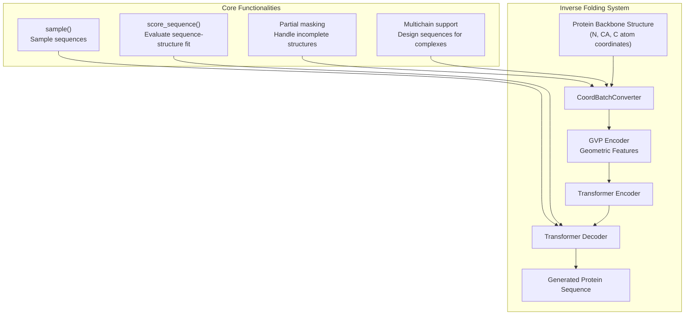
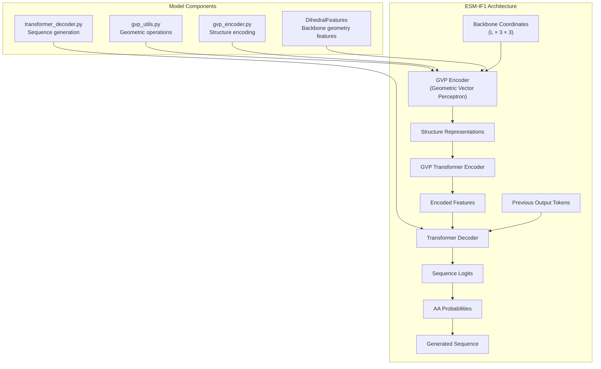
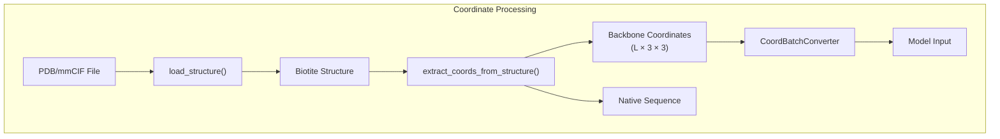
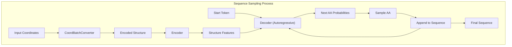
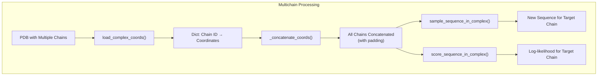

# Inverse Folding

> **Relevant source files**
> * [esm/inverse_folding/__init__.py](https://github.com/facebookresearch/esm/blob/2b369911/esm/inverse_folding/__init__.py)
> * [esm/inverse_folding/gvp_transformer.py](https://github.com/facebookresearch/esm/blob/2b369911/esm/inverse_folding/gvp_transformer.py)
> * [esm/inverse_folding/multichain_util.py](https://github.com/facebookresearch/esm/blob/2b369911/esm/inverse_folding/multichain_util.py)
> * [esm/inverse_folding/util.py](https://github.com/facebookresearch/esm/blob/2b369911/esm/inverse_folding/util.py)
> * [examples/inverse_folding/README.md](https://github.com/facebookresearch/esm/blob/2b369911/examples/inverse_folding/README.md?plain=1)
> * [examples/inverse_folding/notebook_multichain.ipynb](https://github.com/facebookresearch/esm/blob/2b369911/examples/inverse_folding/notebook_multichain.ipynb)

## Purpose and Scope

This document covers the Inverse Folding system in ESM (Evolutionary Scale Modeling), which predicts protein sequences from their backbone 3D structure. Unlike traditional protein folding which predicts structure from sequence, inverse folding goes in the reverse direction—from structure to sequence. The ESM-IF1 model described here can sample novel sequences for given protein backbones and score existing sequences for compatibility with specific structures.

For information about the ESM model family in general, see [Models](/facebookresearch/esm/2-models). For information about structure prediction with ESMFold, see [ESMFold](/facebookresearch/esm/2.3-esmfold).

## System Overview

The ESM Inverse Folding system (ESM-IF1) consists of a Geometric Vector Perceptron (GVP) transformer model that processes 3D backbone coordinates and generates or evaluates protein sequences. It was trained on 12M protein structures predicted by AlphaFold2 and achieves 51% native sequence recovery on structurally held-out backbones, with 72% recovery for buried residues.



Sources: [esm/inverse_folding/gvp_transformer.py L24-L141](https://github.com/facebookresearch/esm/blob/2b369911/esm/inverse_folding/gvp_transformer.py#L24-L141)

 [esm/inverse_folding/util.py L27-L145](https://github.com/facebookresearch/esm/blob/2b369911/esm/inverse_folding/util.py#L27-L145)

 [examples/inverse_folding/README.md L7-L13](https://github.com/facebookresearch/esm/blob/2b369911/examples/inverse_folding/README.md?plain=1#L7-L13)

## Architecture

The inverse folding model architecture (ESM-IF1) combines geometric structural encoding with transformer-based sequence modeling:



Sources: [esm/inverse_folding/gvp_transformer.py L24-L45](https://github.com/facebookresearch/esm/blob/2b369911/esm/inverse_folding/gvp_transformer.py#L24-L45)

 [examples/inverse_folding/README.md L7-L10](https://github.com/facebookresearch/esm/blob/2b369911/examples/inverse_folding/README.md?plain=1#L7-L10)

### GVPTransformerModel

The core model is implemented as `GVPTransformerModel`, which combines:

1. A GVP encoder that extracts geometric features from backbone coordinates
2. A transformer encoder that processes these features
3. A transformer decoder that generates amino acid sequences

The model can be instantiated and loaded from a pretrained checkpoint:

```markdown
model, alphabet = esm.pretrained.esm_if1_gvp4_t16_142M_UR50()model = model.eval()  # Important: set to eval mode for inference
```

Sources: [esm/inverse_folding/gvp_transformer.py L24-L45](https://github.com/facebookresearch/esm/blob/2b369911/esm/inverse_folding/gvp_transformer.py#L24-L45)

 [examples/inverse_folding/README.md L124-L128](https://github.com/facebookresearch/esm/blob/2b369911/examples/inverse_folding/README.md?plain=1#L124-L128)

### Input Representation

The model takes protein backbone coordinates as input, specifically the 3D coordinates of the N, CA, and C atoms for each amino acid:

* Input shape: `L × 3 × 3`, where L is the protein length
* For each position i: * `coords[i][0]`: Coordinates for N atom * `coords[i][1]`: Coordinates for CA atom * `coords[i][2]`: Coordinates for C atom

Sources: [examples/inverse_folding/README.md L131-L137](https://github.com/facebookresearch/esm/blob/2b369911/examples/inverse_folding/README.md?plain=1#L131-L137)

 [esm/inverse_folding/util.py L62-L74](https://github.com/facebookresearch/esm/blob/2b369911/esm/inverse_folding/util.py#L62-L74)

### Coordinate Processing

The `CoordBatchConverter` class handles conversion between raw coordinate data and model inputs:



Sources: [esm/inverse_folding/util.py L27-L88](https://github.com/facebookresearch/esm/blob/2b369911/esm/inverse_folding/util.py#L27-L88)

 [esm/inverse_folding/util.py L220-L323](https://github.com/facebookresearch/esm/blob/2b369911/esm/inverse_folding/util.py#L220-L323)

## Core Functionalities

### Sequence Sampling

The model can generate likely sequences for a given protein backbone structure:



The main sampling function is `sample()`, which takes backbone coordinates and returns a probable protein sequence:

```
sampled_seq = model.sample(coords, temperature=1.0)
```

The `temperature` parameter controls sampling diversity:

* Lower temperatures (e.g., 1e-6): More conservative, higher sequence recovery
* Higher temperatures: More diverse sequences, lower native recovery

Sources: [esm/inverse_folding/gvp_transformer.py L88-L140](https://github.com/facebookresearch/esm/blob/2b369911/esm/inverse_folding/gvp_transformer.py#L88-L140)

 [examples/inverse_folding/README.md L171-L191](https://github.com/facebookresearch/esm/blob/2b369911/examples/inverse_folding/README.md?plain=1#L171-L191)

### Sequence Scoring

The model can evaluate how well a given sequence fits a structural backbone:

```
ll_fullseq, ll_withcoord = esm.inverse_folding.util.score_sequence(    model, alphabet, coords, seq)
```

This returns:

* `ll_fullseq`: Average log-likelihood over the full sequence
* `ll_withcoord`: Average log-likelihood only over positions with valid coordinates

Sources: [esm/inverse_folding/util.py L108-L131](https://github.com/facebookresearch/esm/blob/2b369911/esm/inverse_folding/util.py#L108-L131)

 [examples/inverse_folding/README.md L193-L205](https://github.com/facebookresearch/esm/blob/2b369911/examples/inverse_folding/README.md?plain=1#L193-L205)

### Multichain Support

The system can design sequences for entire protein complexes or individual chains while considering the entire complex structure:



Key functions for multichain operation:

* `sample_sequence_in_complex()`: Sample a sequence for one chain in a complex
* `score_sequence_in_complex()`: Score a sequence for one chain in a complex
* `get_encoder_output_for_complex()`: Get structure embeddings for one chain in a complex

Sources: [esm/inverse_folding/multichain_util.py L20-L152](https://github.com/facebookresearch/esm/blob/2b369911/esm/inverse_folding/multichain_util.py#L20-L152)

 [examples/inverse_folding/README.md L164-L169](https://github.com/facebookresearch/esm/blob/2b369911/examples/inverse_folding/README.md?plain=1#L164-L169)

### Partial Structure Masking

The model can handle incomplete structures or design only parts of a protein:

```markdown
# Mask first 10 amino acidscoords[:10, :] = float('inf')
```

When coordinates are set to infinity, the model treats those positions as unknown structure.

Sources: [examples/inverse_folding/README.md L214-L220](https://github.com/facebookresearch/esm/blob/2b369911/examples/inverse_folding/README.md?plain=1#L214-L220)

 [esm/inverse_folding/util.py L183-L188](https://github.com/facebookresearch/esm/blob/2b369911/esm/inverse_folding/util.py#L183-L188)

## Usage Examples

### Basic Sequence Design

```javascript
import esm.inverse_folding # Load the modelmodel, alphabet = esm.pretrained.esm_if1_gvp4_t16_142M_UR50()model = model.eval() # Load structurestructure = esm.inverse_folding.util.load_structure("protein.pdb", chain_id="A")coords, native_seq = esm.inverse_folding.util.extract_coords_from_structure(structure) # Sample a sequencesampled_seq = model.sample(coords, temperature=0.1)
```

### Sequence Scoring

```markdown
# Score how well a sequence fits the structurell_fullseq, ll_withcoord = esm.inverse_folding.util.score_sequence(    model, alphabet, coords, sequence_to_score)
```

### Multichain Design

```markdown
# Load entire complexstructure = esm.inverse_folding.util.load_structure("complex.pdb",                                                   chain_ids=["A", "B", "C"])coords, native_seqs = esm.inverse_folding.multichain_util.extract_coords_from_complex(structure) # Sample sequence for chain A while considering the entire complexsampled_seq = esm.inverse_folding.multichain_util.sample_sequence_in_complex(    model, coords, target_chain_id="A", temperature=0.1)
```

Sources: [examples/inverse_folding/README.md L124-L236](https://github.com/facebookresearch/esm/blob/2b369911/examples/inverse_folding/README.md?plain=1#L124-L236)

## Command Line Tools

The package includes ready-to-use scripts for inverse folding operations:

| Script | Purpose | Example |
| --- | --- | --- |
| `sample_sequences.py` | Sample sequence designs for a structure | `python sample_sequences.py protein.pdb --chain A --temperature 1 --num-samples 3` |
| `score_log_likelihoods.py` | Score sequences for a structure | `python score_log_likelihoods.py protein.pdb sequences.fasta --chain A` |

Both scripts support single-chain and multichain modes (via the `--multichain-backbone` flag).

Sources: [examples/inverse_folding/README.md L37-L112](https://github.com/facebookresearch/esm/blob/2b369911/examples/inverse_folding/README.md?plain=1#L37-L112)

## Performance and Applications

ESM-IF1 achieves 51% native sequence recovery on structurally held-out backbones, with 72% recovery for buried residues. The model can be used for:

1. **Protein design**: Generate novel sequences for existing or designed protein backbones
2. **Sequence scoring**: Evaluate how well sequences fit specific structures
3. **Structure representation**: Extract encoder output as a structural embedding
4. **Partial design**: Design sequences for specific regions while fixing others

Sources: [examples/inverse_folding/README.md L7-L13](https://github.com/facebookresearch/esm/blob/2b369911/examples/inverse_folding/README.md?plain=1#L7-L13)

 [examples/inverse_folding/README.md L222-L228](https://github.com/facebookresearch/esm/blob/2b369911/examples/inverse_folding/README.md?plain=1#L222-L228)

## Technical Implementation Details

### Coordinate Handling

The system includes specialized functions for handling protein coordinates:

* `load_structure()`: Loads structures from PDB or mmCIF files
* `extract_coords_from_structure()`: Extracts backbone coordinates and sequence
* `get_atom_coords_residuewise()`: Gets specific atom coordinates for each residue

Sources: [esm/inverse_folding/util.py L27-L105](https://github.com/facebookresearch/esm/blob/2b369911/esm/inverse_folding/util.py#L27-L105)

### Geometric Processing

The model uses several geometric operations for structure processing:

* `get_rotation_frames()`: Calculates local rotation frames from backbone atoms
* `rotate()`: Applies rotation to vectors
* `rbf()`: Radial basis function encoding of distances

Sources: [esm/inverse_folding/util.py L146-L200](https://github.com/facebookresearch/esm/blob/2b369911/esm/inverse_folding/util.py#L146-L200)

## Related Systems

For more information on related systems in the ESM codebase:

* [GVP Architecture](/facebookresearch/esm/5.1-gvp-architecture) explains the Geometric Vector Perceptron architecture used in inverse folding
* [Inverse Folding Examples](/facebookresearch/esm/5.2-inverse-folding-examples) provides detailed examples of using inverse folding for sequence design and scoring