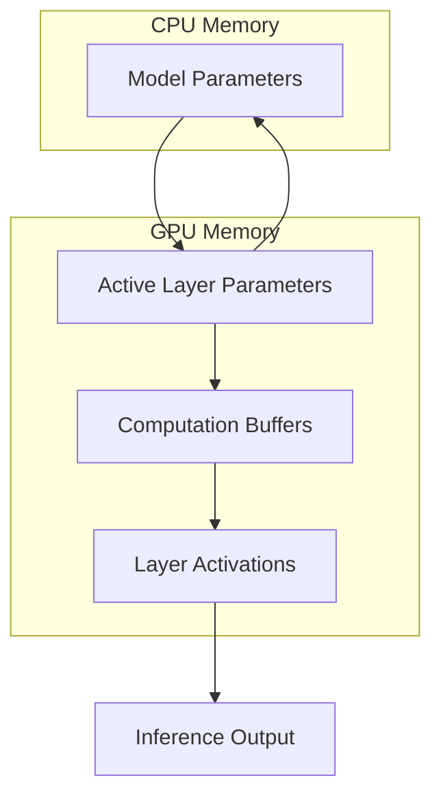
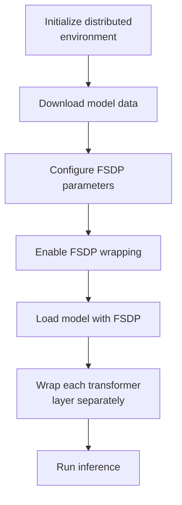
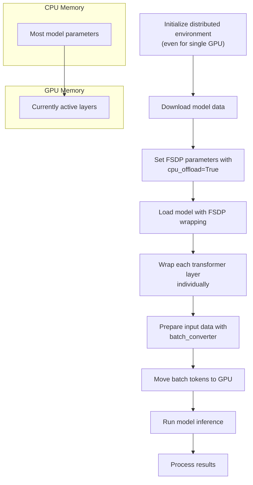

# Large Model Inference

> **Relevant source files**
> * [README.md](https://github.com/facebookresearch/esm/blob/2b369911/README.md?plain=1)
> * [esm/model/esm1.py](https://github.com/facebookresearch/esm/blob/2b369911/esm/model/esm1.py)
> * [esm/model/esm2.py](https://github.com/facebookresearch/esm/blob/2b369911/esm/model/esm2.py)
> * [esm/model/msa_transformer.py](https://github.com/facebookresearch/esm/blob/2b369911/esm/model/msa_transformer.py)
> * [esm/rotary_embedding.py](https://github.com/facebookresearch/esm/blob/2b369911/esm/rotary_embedding.py)
> * [examples/esm2_infer_fairscale_fsdp_cpu_offloading.py](https://github.com/facebookresearch/esm/blob/2b369911/examples/esm2_infer_fairscale_fsdp_cpu_offloading.py)
> * [tests/test_readme.py](https://github.com/facebookresearch/esm/blob/2b369911/tests/test_readme.py)

This documentation covers techniques for running inference with large ESM models that may not fit into a single GPU's memory. While smaller ESM models can run on standard hardware, the larger models like ESM-2 T48 15B parameters require special handling. This page focuses specifically on utilizing FairScale's Fully Sharded Data Parallel (FSDP) feature with CPU offloading to enable inference on larger models with limited GPU resources.

For information about the ESM-2 models themselves, see [ESM-1 and ESM-2](/facebookresearch/esm/2.1-esm-1-and-esm-2). For details on structure prediction using ESMFold, see [ESMFold](/facebookresearch/esm/2.3-esmfold).

## Memory Challenges with Large Protein Language Models

ESM-2 models range from small (8M parameters) to very large (15B parameters). The largest models present significant memory challenges during inference, especially when processing long protein sequences.


Sources: [README.md L99-L107](https://github.com/facebookresearch/esm/blob/2b369911/README.md?plain=1#L99-L107)

The key factors affecting memory usage during inference include:

1. **Model size**: The number of parameters (e.g., 15B for ESM-2 T48)
2. **Sequence length**: Longer protein sequences require more memory for attention computations
3. **Batch size**: Processing multiple sequences simultaneously increases memory usage

When these factors exceed the available GPU memory, traditional inference methods fail with out-of-memory (OOM) errors.

## FairScale FSDP for Memory-Efficient Inference

ESM provides support for using FairScale's Fully Sharded Data Parallel (FSDP) with CPU offloading to run inference on large models with limited GPU resources.



Sources: [examples/esm2_infer_fairscale_fsdp_cpu_offloading.py L19-L40](https://github.com/facebookresearch/esm/blob/2b369911/examples/esm2_infer_fairscale_fsdp_cpu_offloading.py#L19-L40)

### How CPU Offloading Works

FSDP with CPU offloading works as follows:

1. Model parameters are stored in CPU memory by default
2. When a layer needs to compute, its parameters are loaded to the GPU
3. After computation, parameters can be offloaded back to CPU
4. Only the active layer parameters and computation buffers need to be in GPU memory

This approach significantly reduces the GPU memory requirements, making it possible to run inference with the 15B parameter model on a single GPU with limited memory.

## Implementation Details

### Setting Up the Environment

To use FSDP for inference, you need to:

1. Initialize a distributed environment (even with a single GPU)
2. Configure FSDP parameters
3. Wrap the model with FSDP

Here's how the distributed environment is set up:



Sources: [examples/esm2_infer_fairscale_fsdp_cpu_offloading.py L13-L40](https://github.com/facebookresearch/esm/blob/2b369911/examples/esm2_infer_fairscale_fsdp_cpu_offloading.py#L13-L40)

### FSDP Configuration Parameters

The key parameters for FSDP configuration are:

| Parameter | Value | Purpose |
| --- | --- | --- |
| `mixed_precision` | `True` | Use mixed precision for better memory efficiency |
| `flatten_parameters` | `True` | Flatten parameters for more efficient sharding |
| `state_dict_device` | `torch.device("cpu")` | Store state dictionary on CPU to reduce GPU memory |
| `cpu_offload` | `True` | Enable CPU offloading of parameters |

Sources: [examples/esm2_infer_fairscale_fsdp_cpu_offloading.py L20-L26](https://github.com/facebookresearch/esm/blob/2b369911/examples/esm2_infer_fairscale_fsdp_cpu_offloading.py#L20-L26)

### Wrapping the Model Layers

For optimal memory usage, each transformer layer is wrapped separately with FSDP:

```markdown
# Wrap each layer in FSDP separatelyfor name, child in model.named_children():    if name == "layers":        for layer_name, layer in child.named_children():            wrapped_layer = wrap(layer)            setattr(child, layer_name, wrapped_layer)model = wrap(model)
```

This granular wrapping allows the model to offload individual layers to CPU memory when they're not being used.

Sources: [examples/esm2_infer_fairscale_fsdp_cpu_offloading.py L34-L40](https://github.com/facebookresearch/esm/blob/2b369911/examples/esm2_infer_fairscale_fsdp_cpu_offloading.py#L34-L40)

## Usage Example

Below is a complete workflow for running inference with CPU offloading:



Sources: [examples/esm2_infer_fairscale_fsdp_cpu_offloading.py L13-L56](https://github.com/facebookresearch/esm/blob/2b369911/examples/esm2_infer_fairscale_fsdp_cpu_offloading.py#L13-L56)

### Step-by-Step Implementation

1. **Initialize distributed environment**: ``` url = "tcp://localhost:23456"torch.distributed.init_process_group(backend="nccl", init_method=url, world_size=1, rank=0) ```
2. **Configure FSDP parameters**: ``` fsdp_params = dict(    mixed_precision=True,    flatten_parameters=True,    state_dict_device=torch.device("cpu"),    cpu_offload=True,) ```
3. **Load and wrap the model**: ```markdown with enable_wrap(wrapper_cls=FSDP, **fsdp_params):    model, vocab = esm.pretrained.load_model_and_alphabet_core(        model_name, model_data, regression_data    )    # Wrap layers and model ```
4. **Run inference**: ``` batch_tokens = batch_tokens.cuda()with torch.no_grad():    results = model(batch_tokens, repr_layers=[48], return_contacts=True) ```

Sources: [examples/esm2_infer_fairscale_fsdp_cpu_offloading.py L13-L56](https://github.com/facebookresearch/esm/blob/2b369911/examples/esm2_infer_fairscale_fsdp_cpu_offloading.py#L13-L56)

## Performance Considerations

When using FSDP with CPU offloading, consider the following trade-offs:

| Consideration | Impact |
| --- | --- |
| Inference speed | Slower due to CPU-GPU data transfer |
| Memory usage | Significantly reduced GPU memory requirements |
| CPU memory | Higher CPU RAM requirements |
| Sequence length | Can process longer sequences than without offloading |
| Hardware requirements | Requires sufficient CPU memory and fast CPU-GPU connection |

For the best performance:

1. Use NVLink or PCIe 4.0 for faster CPU-GPU data transfer
2. Ensure sufficient CPU memory (32GB+ recommended for the 15B model)
3. Consider using a smaller batch size to reduce GPU memory requirements
4. For very long sequences, adjust the chunk size in ESMFold to reduce memory usage further

Sources: [README.md L332-L337](https://github.com/facebookresearch/esm/blob/2b369911/README.md?plain=1#L332-L337)

 [examples/esm2_infer_fairscale_fsdp_cpu_offloading.py L13-L56](https://github.com/facebookresearch/esm/blob/2b369911/examples/esm2_infer_fairscale_fsdp_cpu_offloading.py#L13-L56)

## Alternatives to FSDP

If FSDP with CPU offloading is not suitable for your use case, consider these alternatives:

1. **Use a smaller model**: The ESM-2 T36 3B model provides good performance with lower memory requirements
2. **Use ESMFold with chunking**: For structure prediction, ESMFold supports chunking with the `set_chunk_size` method
3. **Use the HuggingFace implementation**: The ESM models are also available in the HuggingFace transformers library with optimized implementations
4. **Use the ESM Atlas API**: For structure prediction only, you can use the RESTful API provided by the ESM Metagenomic Atlas

Sources: [README.md L115-L125](https://github.com/facebookresearch/esm/blob/2b369911/README.md?plain=1#L115-L125)

 [README.md L205-L218](https://github.com/facebookresearch/esm/blob/2b369911/README.md?plain=1#L205-L218)