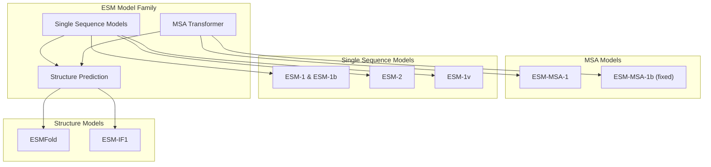
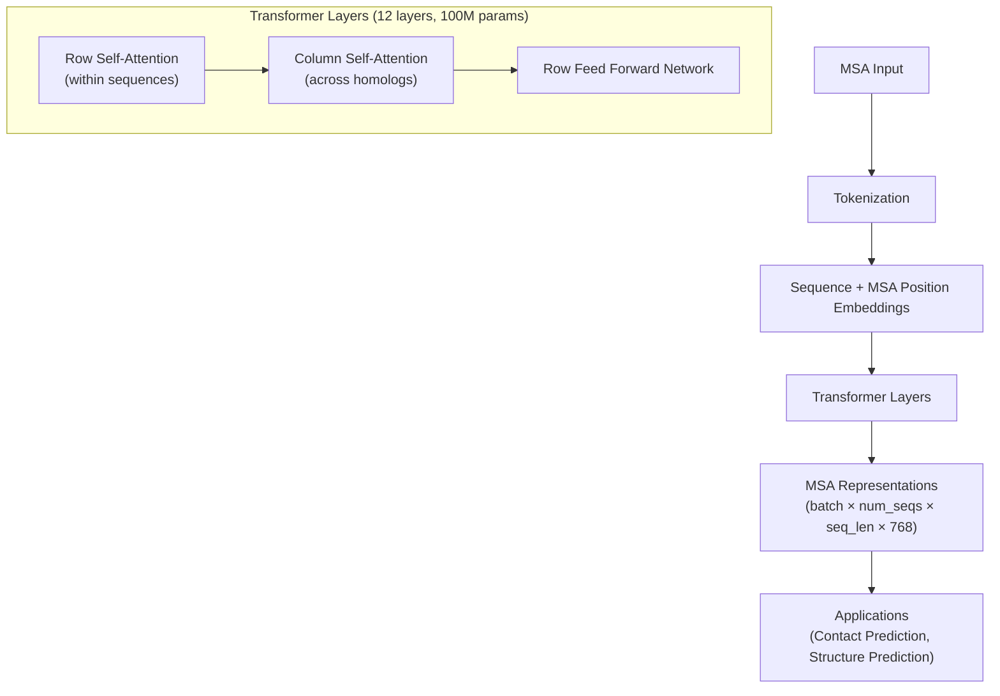
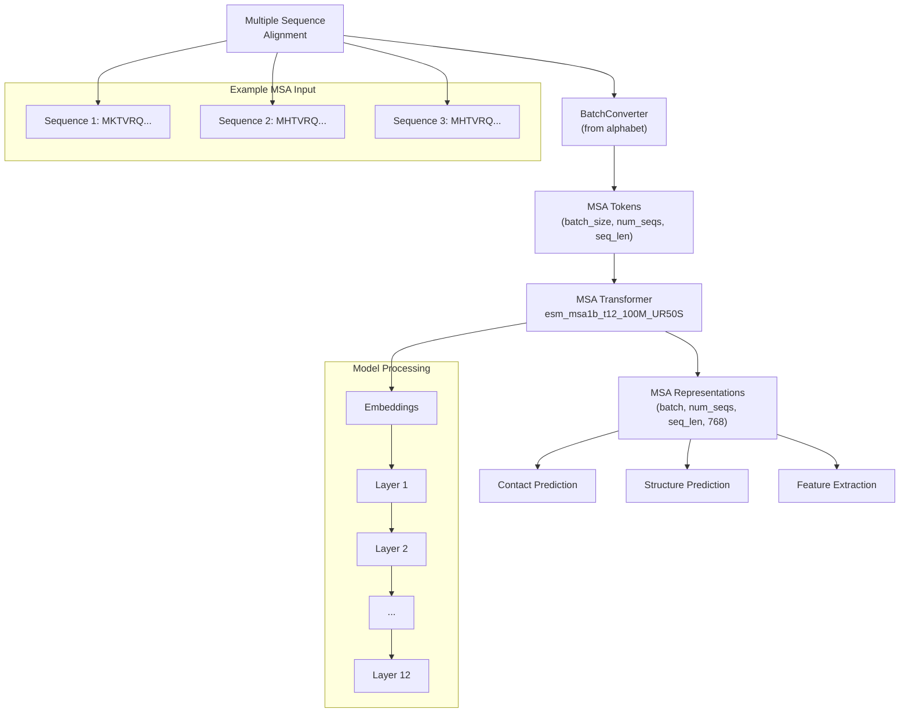
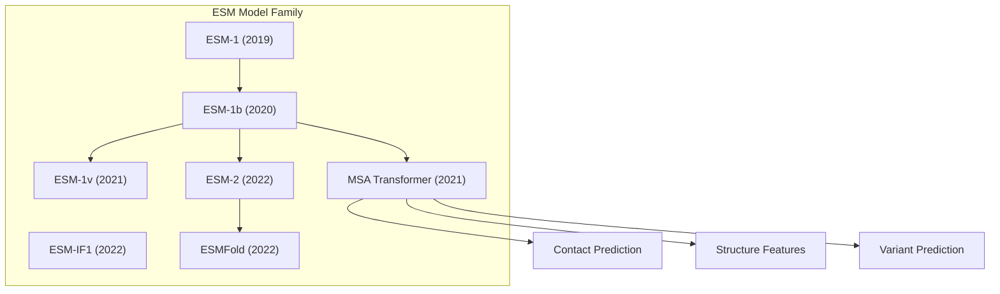

# MSA Transformer

> **Relevant source files**
> * [README.md](https://github.com/facebookresearch/esm/blob/2b369911/README.md?plain=1)
> * [esm/pretrained.py](https://github.com/facebookresearch/esm/blob/2b369911/esm/pretrained.py)
> * [hubconf.py](https://github.com/facebookresearch/esm/blob/2b369911/hubconf.py)
> * [tests/test_readme.py](https://github.com/facebookresearch/esm/blob/2b369911/tests/test_readme.py)

The MSA Transformer is a specialized protein language model designed to process Multiple Sequence Alignments (MSAs) rather than individual protein sequences. This document covers the architecture, purpose, and usage of the MSA Transformer model in the ESM (Evolutionary Scale Modeling) repository. For information about single-sequence models like ESM-1 and ESM-2, see [ESM-1 and ESM-2](/facebookresearch/esm/2.1-esm-1-and-esm-2).

## Overview

MSA Transformer extends the transformer architecture to operate on aligned sets of evolutionarily related protein sequences. By simultaneously attending to residues across both sequence and alignment dimensions, the model captures evolutionary conservation patterns and covariation signals that single-sequence models cannot access.

The model enables state-of-the-art inference of protein structure by leveraging the rich evolutionary information encoded in MSAs.



Sources: [README.md L104-L107](https://github.com/facebookresearch/esm/blob/2b369911/README.md?plain=1#L104-L107)

 [esm/pretrained.py L274-L282](https://github.com/facebookresearch/esm/blob/2b369911/esm/pretrained.py#L274-L282)

## Model Architecture

The MSA Transformer uses a modified transformer architecture that processes multiple protein sequences simultaneously. It has 12 transformer layers with 100M parameters and produces 768-dimensional embeddings.

Key architectural features:

1. **Row/Column Attention**: The model applies self-attention both within sequences (row-wise) and across aligned positions (column-wise)
2. **MSA Positional Embeddings**: Special positional embeddings that encode sequence position and MSA depth
3. **Axial Attention**: Separate attention mechanisms for row and column dimensions, reducing computational complexity



Sources: [esm/pretrained.py L111-L126](https://github.com/facebookresearch/esm/blob/2b369911/esm/pretrained.py#L111-L126)

 [tests/test_readme.py L130-L149](https://github.com/facebookresearch/esm/blob/2b369911/tests/test_readme.py#L130-L149)

## Available Pretrained Models

The ESM repository provides two versions of the MSA Transformer:

1. **ESM-MSA-1** (Original): The initial release, which had a bug in the positional embeddings
2. **ESM-MSA-1b** (Recommended): Fixed version with corrected positional embeddings

Both models have the same architecture (12 layers, 100M parameters) and were trained on UniRef50 sequence data with MSAs.

| Model Name | Description | Parameters | Output Dimension | Notes |
| --- | --- | --- | --- | --- |
| ESM-MSA-1 | Original MSA Transformer | 100M | 768 | Has a bug in positional embeddings |
| ESM-MSA-1b | Fixed MSA Transformer | 100M | 768 | Recommended version |

Sources: [README.md L105](https://github.com/facebookresearch/esm/blob/2b369911/README.md?plain=1#L105-L105)

 [esm/pretrained.py L274-L282](https://github.com/facebookresearch/esm/blob/2b369911/esm/pretrained.py#L274-L282)

## Using MSA Transformer

### Loading the Model

The MSA Transformer can be loaded using the pretrained module:

```javascript
import esm # Load the recommended MSA Transformer modelmodel, alphabet = esm.pretrained.esm_msa1b_t12_100M_UR50S()model.eval()  # Set to evaluation mode
```

Sources: [esm/pretrained.py L281-L282](https://github.com/facebookresearch/esm/blob/2b369911/esm/pretrained.py#L281-L282)

 [tests/test_readme.py L131-L132](https://github.com/facebookresearch/esm/blob/2b369911/tests/test_readme.py#L131-L132)

### Processing MSA Data

MSA data consists of multiple aligned sequences. The model expects inputs in a specific format:

```python
# Create a batch converter for the alphabetbatch_converter = alphabet.get_batch_converter() # Example MSA with 3 sequences (gaps represented with '-')data = [    ("protein1", "MKTVRQERLKSIVRILERSKEPVSGAQLAEELSVSRQVIVQDIAYLRSLGYNIVATPRGYVLAGG"),    ("protein2", "MHTVRQSRLKSIVRILEMSKEPVSGAQLAEELSVSRQVIVQDIAYLRSLGYNIVATPRGYVLAGG"),    ("protein3", "MHTVRQSRLKSIVRILEMSKEPVSGAQL---LSVSRQVIVQDIAYLRSLGYNIVAT----VLAGG"),] # Convert the data to batch formatbatch_labels, batch_strs, batch_tokens = batch_converter(data) # Run the modelwith torch.no_grad():    results = model(batch_tokens, repr_layers=[12], return_contacts=True) # Extract per-token representations from the last layertoken_representations = results["representations"][12]# Shape: (batch_size, num_sequences, sequence_length, embedding_dim)# For the example above: (1, 3, 66, 768)
```

Sources: [tests/test_readme.py L136-L148](https://github.com/facebookresearch/esm/blob/2b369911/tests/test_readme.py#L136-L148)

## Data Flow

The following diagram illustrates how data flows through the MSA Transformer, from input sequences to the final representations:



Sources: [tests/test_readme.py L136-L148](https://github.com/facebookresearch/esm/blob/2b369911/tests/test_readme.py#L136-L148)

 [esm/pretrained.py L111-L126](https://github.com/facebookresearch/esm/blob/2b369911/esm/pretrained.py#L111-L126)

## Key Differences from Single-Sequence Models

The MSA Transformer differs from ESM-1 and ESM-2 in several important ways:

1. **Input data**: Takes MSAs instead of individual sequences
2. **Architecture**: Uses specialized row/column attention mechanisms
3. **Information capture**: Can model conservation patterns and covariation across evolutionary related sequences
4. **Output dimensions**: Produces representations for each sequence in the MSA

## Relationship to Other ESM Models



Sources: [README.md L98-L107](https://github.com/facebookresearch/esm/blob/2b369911/README.md?plain=1#L98-L107)

 [README.md L728-L742](https://github.com/facebookresearch/esm/blob/2b369911/README.md?plain=1#L728-L742)

## Known Issues

The initial ESM-MSA-1 model had a bug in the positional embeddings. This was fixed in ESM-MSA-1b, which is the recommended version to use.

When using the MSA Transformer, it's important to properly align the input sequences and handle gaps appropriately, as the model was trained on MSAs and expects sequences to be aligned.

Sources: [esm/pretrained.py L274-L277](https://github.com/facebookresearch/esm/blob/2b369911/esm/pretrained.py#L274-L277)

 [README.md L91-L92](https://github.com/facebookresearch/esm/blob/2b369911/README.md?plain=1#L91-L92)

## Performance

The MSA Transformer (ESM-MSA-1b) achieves 57.4% precision in unsupervised contact prediction on the "Large valid" test set, significantly outperforming single-sequence models like ESM-1b (41.1%) and approaching the performance of more complex dedicated structure prediction systems.

The model's ability to capture evolutionary information makes it particularly effective for structure-related tasks when provided with an MSA for the protein of interest.

Sources: [README.md L634-L640](https://github.com/facebookresearch/esm/blob/2b369911/README.md?plain=1#L634-L640)

## Citation

If you use MSA Transformer in your research, please cite:

```yaml
Rao, Roshan, et al. "MSA Transformer." bioRxiv (2021).
https://www.biorxiv.org/content/10.1101/2021.02.12.430858v1
```

Sources: [README.md L735-L742](https://github.com/facebookresearch/esm/blob/2b369911/README.md?plain=1#L735-L742)