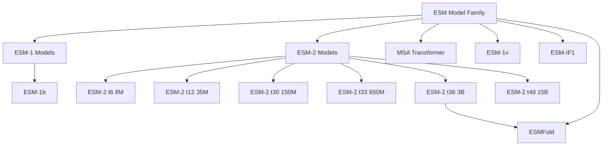
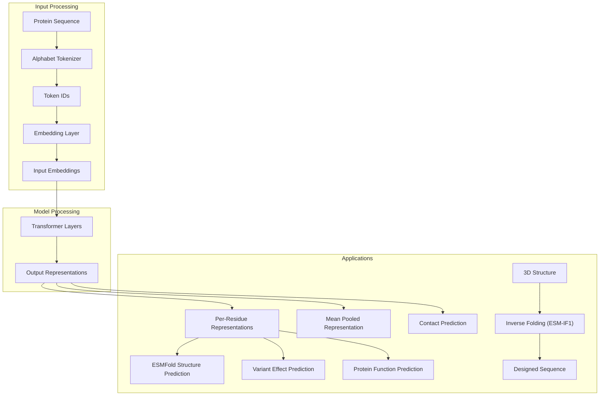
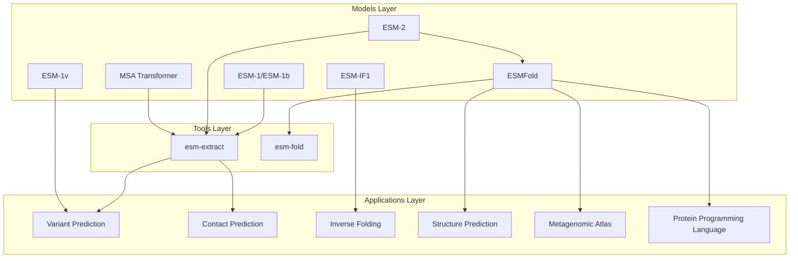

# Models

> **Relevant source files**
> * [README.md](https://github.com/facebookresearch/esm/blob/2b369911/README.md?plain=1)
> * [esm/pretrained.py](https://github.com/facebookresearch/esm/blob/2b369911/esm/pretrained.py)
> * [hubconf.py](https://github.com/facebookresearch/esm/blob/2b369911/hubconf.py)
> * [tests/test_readme.py](https://github.com/facebookresearch/esm/blob/2b369911/tests/test_readme.py)

## Purpose and Scope

This document provides an overview of the Evolutionary Scale Modeling (ESM) protein language model family and their architectures. It covers the various model types, their relationships, key features, and how to access them. For specific details about implementations of individual model types, see [ESM-1 and ESM-2](/facebookresearch/esm/2.1-esm-1-and-esm-2), [MSA Transformer](/facebookresearch/esm/2.2-msa-transformer), and [ESMFold](/facebookresearch/esm/2.3-esmfold).

## Model Family Overview

The ESM suite consists of several protein language models designed to learn representations of protein sequences and structures at evolutionary scale. These models are trained on massive datasets of protein sequences and have been shown to capture information about protein structure and function.

### ESM Model Family Hierarchy



Sources: [README.md L99-L108](https://github.com/facebookresearch/esm/blob/2b369911/README.md?plain=1#L99-L108)

## Key Model Types

### 1. Protein Language Models (ESM-1, ESM-2)

The core of the ESM family consists of Transformer-based protein language models that learn from millions to billions of protein sequences. These models are trained to predict masked amino acids in protein sequences, similar to how BERT-like models work in NLP.

* **ESM-1**: The first generation of ESM models, with variants ranging from 6 to 34 layers and 43M to 670M parameters.
* **ESM-1b**: An improved version of ESM-1 with 33 layers and 650M parameters, trained on UniRef50.
* **ESM-2**: The latest generation with models ranging from 8M to 15B parameters, offering state-of-the-art performance for protein representation learning.

ESM-2 significantly outperforms ESM-1 on structure prediction tasks and serves as the foundation for ESMFold.

Sources: [README.md L487-L493](https://github.com/facebookresearch/esm/blob/2b369911/README.md?plain=1#L487-L493)

 [esm/pretrained.py L349-L397](https://github.com/facebookresearch/esm/blob/2b369911/esm/pretrained.py#L349-L397)

### 2. MSA Transformer

The MSA (Multiple Sequence Alignment) Transformer models process entire protein families rather than individual sequences. They take multiple sequence alignments as input and learn evolutionary patterns across related proteins.

* **ESM-MSA-1**: The initial MSA Transformer model with 12 layers and 100M parameters.
* **ESM-MSA-1b**: An improved version that fixed a bug in the positional embeddings.

Sources: [README.md L487-L489](https://github.com/facebookresearch/esm/blob/2b369911/README.md?plain=1#L487-L489)

 [esm/pretrained.py L273-L282](https://github.com/facebookresearch/esm/blob/2b369911/esm/pretrained.py#L273-L282)

### 3. Variant Effect Prediction (ESM-1v)

ESM-1v models are specialized for predicting the functional effects of sequence variations. The model family includes 5 individual models (typically ensembled) with the same architecture as ESM-1b but trained on UniRef90.

Sources: [README.md L487-L489](https://github.com/facebookresearch/esm/blob/2b369911/README.md?plain=1#L487-L489)

 [esm/pretrained.py L285-L336](https://github.com/facebookresearch/esm/blob/2b369911/esm/pretrained.py#L285-L336)

### 4. Inverse Folding (ESM-IF1)

The ESM-IF1 model is designed for the inverse protein folding problem: predicting potential amino acid sequences that would fold into a given 3D structure. This model enables protein design and can predict functional effects of sequence variations when the structure is known.

Sources: [README.md L487-L489](https://github.com/facebookresearch/esm/blob/2b369911/README.md?plain=1#L487-L489)

 [esm/pretrained.py L339-L347](https://github.com/facebookresearch/esm/blob/2b369911/esm/pretrained.py#L339-L347)

### 5. Structure Prediction (ESMFold)

ESMFold integrates the ESM-2 language model with a dedicated structure module to directly predict protein 3D structures from sequences. It offers fast, accurate structure prediction without requiring multiple sequence alignments as input.

* **ESMFold v0**: The original model used in research papers.
* **ESMFold v1**: The latest version, recommended for most users.

Sources: [README.md L487-L489](https://github.com/facebookresearch/esm/blob/2b369911/README.md?plain=1#L487-L489)

 [esm/pretrained.py L400-L420](https://github.com/facebookresearch/esm/blob/2b369911/esm/pretrained.py#L400-L420)

## Model Implementation and Connection to Code

The following diagram illustrates how the model interfaces are implemented in the codebase:


Sources: [esm/pretrained.py L24-L222](https://github.com/facebookresearch/esm/blob/2b369911/esm/pretrained.py#L24-L222)

 [hubconf.py L8-L42](https://github.com/facebookresearch/esm/blob/2b369911/hubconf.py#L8-L42)

## Available Pre-trained Models

The ESM repository provides a wide range of pre-trained models with different parameter sizes and training objectives. The table below summarizes the key models:

| Model Type | Function | #Layers | #Params | Dataset | Embedding Dim |
| --- | --- | --- | --- | --- | --- |
| ESM-2 | `esm2_t48_15B_UR50D()` | 48 | 15B | UR50/D | 5120 |
| ESM-2 | `esm2_t36_3B_UR50D()` | 36 | 3B | UR50/D | 2560 |
| ESM-2 | `esm2_t33_650M_UR50D()` | 33 | 650M | UR50/D | 1280 |
| ESM-2 | `esm2_t30_150M_UR50D()` | 30 | 150M | UR50/D | 640 |
| ESM-2 | `esm2_t12_35M_UR50D()` | 12 | 35M | UR50/D | 480 |
| ESM-2 | `esm2_t6_8M_UR50D()` | 6 | 8M | UR50/D | 320 |
| ESMFold | `esmfold_v1()` | 48+36 | 690M+3B | UR50/D | - |
| ESM-IF1 | `esm_if1_gvp4_t16_142M_UR50()` | 20 | 124M | CATH+UR50 | 512 |
| ESM-1v | `esm1v_t33_650M_UR90S_[1-5]()` | 33 | 650M | UR90/S | 1280 |
| MSA Transformer | `esm_msa1b_t12_100M_UR50S()` | 12 | 100M | UR50/S+MSA | 768 |
| ESM-1b | `esm1b_t33_650M_UR50S()` | 33 | 650M | UR50/S | 1280 |
| ESM-1 | `esm1_t34_670M_UR50S()` | 34 | 670M | UR50/S | 1280 |

Sources: [README.md L477-L493](https://github.com/facebookresearch/esm/blob/2b369911/README.md?plain=1#L477-L493)

 [esm/pretrained.py L224-L420](https://github.com/facebookresearch/esm/blob/2b369911/esm/pretrained.py#L224-L420)

## Loading and Using Models

Models can be loaded using several interfaces:

### 1. Direct Loading with ESM API

```javascript
import esm # Load ESM-2 modelmodel, alphabet = esm.pretrained.esm2_t33_650M_UR50D()batch_converter = alphabet.get_batch_converter()model.eval()  # disables dropout for deterministic results
```

Sources: [README.md L164-L169](https://github.com/facebookresearch/esm/blob/2b369911/README.md?plain=1#L164-L169)

 [tests/test_readme.py L22-L29](https://github.com/facebookresearch/esm/blob/2b369911/tests/test_readme.py#L22-L29)

### 2. PyTorch Hub

```javascript
import torch model, alphabet = torch.hub.load("facebookresearch/esm:main", "esm2_t33_650M_UR50D")
```

Sources: [README.md L157-L159](https://github.com/facebookresearch/esm/blob/2b369911/README.md?plain=1#L157-L159)

 [tests/test_readme.py L16-L19](https://github.com/facebookresearch/esm/blob/2b369911/tests/test_readme.py#L16-L19)

### 3. ESMFold Usage

```javascript
import esm model = esm.pretrained.esmfold_v1()model = model.eval().cuda() # Predict structure for a sequencesequence = "MKTVRQERLKSIVRILERSKEPVSGAQLAEELSVSRQVIVQDIAYLRSLGYNIVATPRGYVLAGG"with torch.no_grad():    output = model.infer_pdb(sequence)
```

Sources: [README.md L207-L222](https://github.com/facebookresearch/esm/blob/2b369911/README.md?plain=1#L207-L222)

 [tests/test_readme.py L69-L83](https://github.com/facebookresearch/esm/blob/2b369911/tests/test_readme.py#L69-L83)

## Model Data Flow

The following diagram illustrates how data flows through the ESM models:



Sources: [README.md L164-L200](https://github.com/facebookresearch/esm/blob/2b369911/README.md?plain=1#L164-L200)

 [tests/test_readme.py L22-L60](https://github.com/facebookresearch/esm/blob/2b369911/tests/test_readme.py#L22-L60)

## Relationship to Other Components

The ESM models serve as the foundation for various tools and applications in the ESM ecosystem:



Sources: [README.md L61-L77](https://github.com/facebookresearch/esm/blob/2b369911/README.md?plain=1#L61-L77)

## Chronological Release History

The ESM models have been released over time with progressive improvements:

| Model | Release Date | Notes |
| --- | --- | --- |
| ESM-1 | Aug 2020 | Initial release with Rives et al. 2019 paper |
| ESM-1b | Dec 2020 | Improved version described in Rives et al. 2019 Appendix B |
| ESM-MSA-1 | Feb 2021 | Initial MSA Transformer (Rao et al. 2021 preprint v1) |
| ESM-MSA-1b | Jun 2021 | Fixed positional embeddings (ICML'21 version) |
| ESM-1v | Jul 2021 | Specialized for variant effect prediction (Meier et al. 2021) |
| ESM-IF1 | Apr 2022 | Inverse folding model (Hsu et al. 2022) |
| ESM-2 | Aug 2022 | State-of-the-art language models (Lin et al. 2022) |
| ESMFold | Nov 2022 | End-to-end structure prediction (Lin et al. 2022) |

Sources: [README.md L498-L508](https://github.com/facebookresearch/esm/blob/2b369911/README.md?plain=1#L498-L508)

## Performance Comparison

The ESM-2 models significantly outperform previous models on structure prediction tasks:

| Model | Unsupervised Contact Prediction (Large Valid) | CASP14 Contact | CAMEO Contact |
| --- | --- | --- | --- |
| ESM-1b | 41.1 | 24.4 | 39.0 |
| ESM-1v | 35.3 | - | - |
| ESM-MSA-1b | 57.4 | - | - |
| ESM-2 (8M) | 15.9 | 9.8 | 15.7 |
| ESM-2 (35M) | 28.8 | 16.4 | 28.4 |
| ESM-2 (150M) | 42.2 | 26.8 | 40.1 |
| ESM-2 (650M) | 50.1 | 32.5 | 47.6 |
| ESM-2 (3B) | 52.7 | 34.0 | 49.9 |
| ESM-2 (15B) | 54.5 | 37.0 | 51.7 |

Sources: [README.md L551-L690](https://github.com/facebookresearch/esm/blob/2b369911/README.md?plain=1#L551-L690)