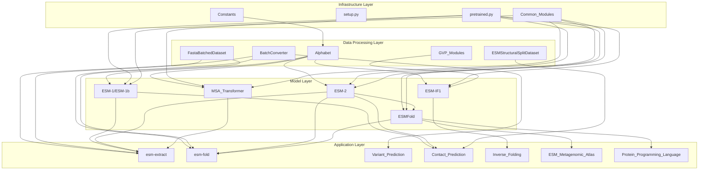
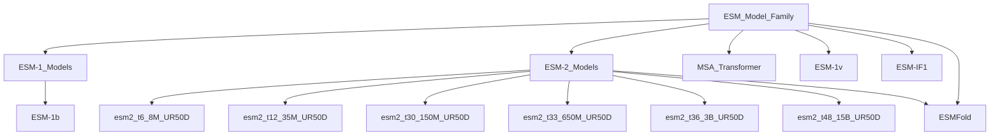
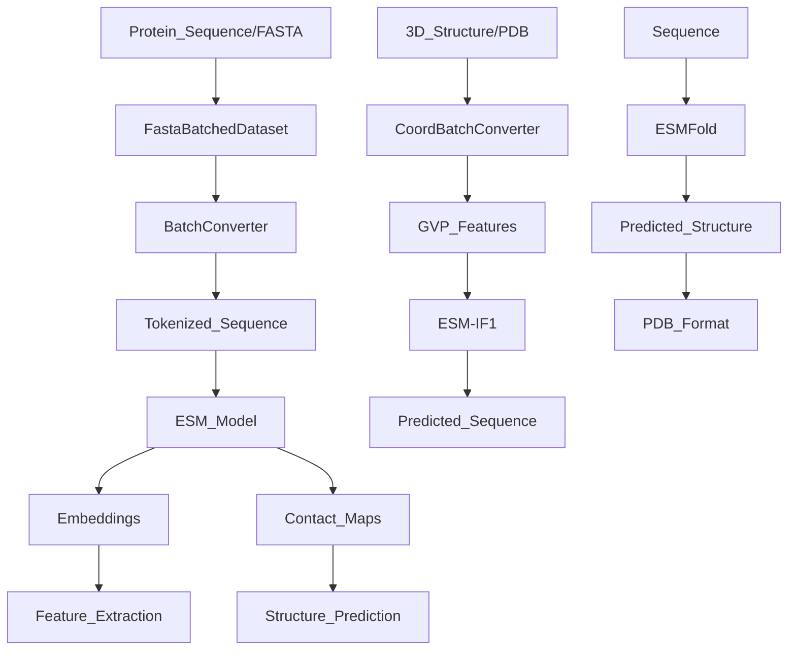
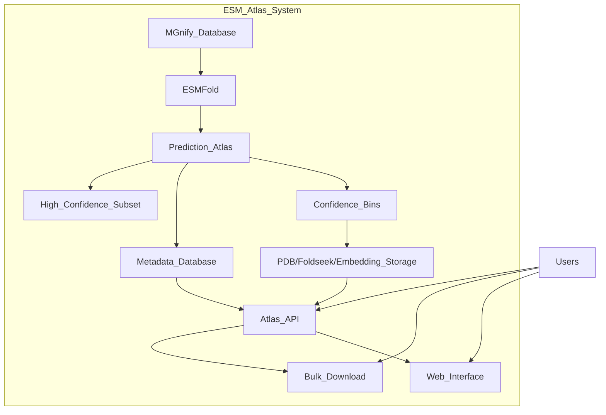

# Overview

> **Relevant source files**
> * [README.md](https://github.com/facebookresearch/esm/blob/2b369911/README.md?plain=1)
> * [tests/test_readme.py](https://github.com/facebookresearch/esm/blob/2b369911/tests/test_readme.py)

This page provides a technical introduction to the Evolutionary Scale Modeling (ESM) repository, which contains Transformer-based protein language models developed by Meta's Fundamental AI Research Protein Team (FAIR). This overview covers the core architecture, main models, and key components of the system.

For specific details on model implementations, see [Models](/facebookresearch/esm/2-models). For information about data processing, refer to [Data Handling](/facebookresearch/esm/3-data-handling). For application tools, see [Tools and Utilities](/facebookresearch/esm/4-tools-and-utilities).

## Purpose and Scope

ESM is a repository that provides:

1. Pre-trained protein language models for understanding protein sequences at the evolutionary scale
2. End-to-end protein structure prediction capabilities
3. Tools for extracting embeddings and predicting structures from protein sequences
4. Models for inverse folding (predicting sequences from structures)
5. Resources for variant effect prediction

The system enables researchers and developers to leverage state-of-the-art deep learning models for protein research, engineering, and design tasks.

Sources: [README.md L5-L11](https://github.com/facebookresearch/esm/blob/2b369911/README.md?plain=1#L5-L11)

## System Architecture

The ESM codebase is organized into several layers that work together to provide protein language modeling and structure prediction capabilities.



Sources: [README.md L1-L20](https://github.com/facebookresearch/esm/blob/2b369911/README.md?plain=1#L1-L20)

 [README.md L99-L109](https://github.com/facebookresearch/esm/blob/2b369911/README.md?plain=1#L99-L109)

## Model Family Overview

The ESM repository contains multiple protein language models that have evolved over time, with ESM-2 and ESMFold representing the current state-of-the-art.



Sources: [README.md L99-L109](https://github.com/facebookresearch/esm/blob/2b369911/README.md?plain=1#L99-L109)

 [README.md L473-L496](https://github.com/facebookresearch/esm/blob/2b369911/README.md?plain=1#L473-L496)

## Main Models and Their Functions

### ESM-2

ESM-2a is the current flagship protein language model family that comes in different sizes (from 8M to 15B parameters). These models are trained on large protein sequence datasets (UniRef50) and can predict protein structure, function, and other properties directly from sequences.

### ESMFold

ESMFold is an end-to-end protein structure prediction model that leverages the ESM-2 language model to generate accurate 3D structure predictions directly from a sequence. It combines the protein language model with a structure module to predict coordinates.

### MSA Transformer

MSA Transformer processes Multiple Sequence Alignments (MSAs) rather than single sequences, enabling more accurate structure prediction by leveraging evolutionary information across related sequences.

### ESM-1v

Specialized model for predicting the effects of mutations on protein function, enabling zero-shot prediction of sequence variation effects.

### ESM-IF1

Inverse folding model that predicts protein sequences from their backbone atom coordinates, useful for protein design.

Sources: [README.md L99-L109](https://github.com/facebookresearch/esm/blob/2b369911/README.md?plain=1#L99-L109)

 [README.md L200-L237](https://github.com/facebookresearch/esm/blob/2b369911/README.md?plain=1#L200-L237)

 [README.md L340-L361](https://github.com/facebookresearch/esm/blob/2b369911/README.md?plain=1#L340-L361)

## Data Flow

This diagram illustrates how data flows through the different components of the ESM system:



Sources: [README.md L163-L198](https://github.com/facebookresearch/esm/blob/2b369911/README.md?plain=1#L163-L198)

 [README.md L275-L276](https://github.com/facebookresearch/esm/blob/2b369911/README.md?plain=1#L275-L276)

 [README.md L363-L403](https://github.com/facebookresearch/esm/blob/2b369911/README.md?plain=1#L363-L403)

## Command Line Tools and APIs

ESM provides both command-line tools and Python APIs for working with the models:

### Command Line Tools

* `esm-extract`: Extracts embeddings from protein sequences in FASTA format
* `esm-fold`: Predicts protein structures using ESMFold

### Python API

The primary interfaces for working with ESM models are:

```javascript
# Load modelimport esmmodel, alphabet = esm.pretrained.esm2_t33_650M_UR50D()batch_converter = alphabet.get_batch_converter() # For structure predictionmodel = esm.pretrained.esmfold_v1()output = model.infer_pdb(sequence)
```

Sources: [README.md L275-L322](https://github.com/facebookresearch/esm/blob/2b369911/README.md?plain=1#L275-L322)

 [README.md L163-L198](https://github.com/facebookresearch/esm/blob/2b369911/README.md?plain=1#L163-L198)

## Available Pre-trained Models

The following table shows the main pre-trained models available in the ESM repository:

| Model Type | Function | Sizes Available | Dataset |
| --- | --- | --- | --- |
| ESM-2 | General protein language model | 8M to 15B parameters | UniRef50/D 2021_04 |
| ESMFold | Structure prediction | 690M (+3B) | UniRef50/D 2021_04 |
| ESM-MSA-1b | MSA processing | 100M | UniRef50/S + MSA 2018_03 |
| ESM-1v | Variant prediction | 650M | UniRef90/S 2020_03 |
| ESM-IF1 | Inverse folding | 142M | CATH + predicted structures |

Sources: [README.md L473-L496](https://github.com/facebookresearch/esm/blob/2b369911/README.md?plain=1#L473-L496)

 [README.md L99-L109](https://github.com/facebookresearch/esm/blob/2b369911/README.md?plain=1#L99-L109)

## ESM Metagenomic Atlas

The ESM Metagenomic Atlas is a repository of over 617 million predicted protein structures from metagenomic data, created using ESMFold. The Atlas provides:

* A searchable database of predicted structures
* API access for programmatic queries
* Bulk download options
* Web interface for exploring structures



Sources: [README.md L11-L14](https://github.com/facebookresearch/esm/blob/2b369911/README.md?plain=1#L11-L14)

 [README.md L405-L419](https://github.com/facebookresearch/esm/blob/2b369911/README.md?plain=1#L405-L419)

## Applications and Use Cases

ESM models can be used for various protein research and engineering applications:

1. **Protein Structure Prediction**: Using ESMFold to predict 3D structures from amino acid sequences
2. **Protein Function Prediction**: Using embeddings from ESM-2 to predict protein function
3. **Variant Effect Prediction**: Using ESM-1v to predict the effects of mutations
4. **Protein Design**: Using ESM-IF1 for inverse folding and sequence design
5. **Contact Prediction**: Using attention maps for protein contact prediction
6. **Feature Extraction**: Using ESM-2 embeddings as features for downstream tasks

Sources: [README.md L420-L470](https://github.com/facebookresearch/esm/blob/2b369911/README.md?plain=1#L420-L470)

 [README.md L16-L18](https://github.com/facebookresearch/esm/blob/2b369911/README.md?plain=1#L16-L18)

 [README.md L340-L365](https://github.com/facebookresearch/esm/blob/2b369911/README.md?plain=1#L340-L365)