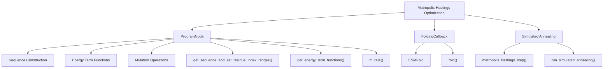
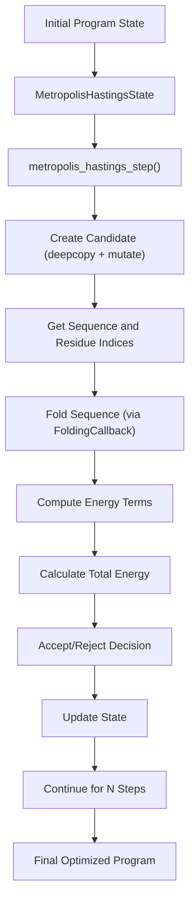
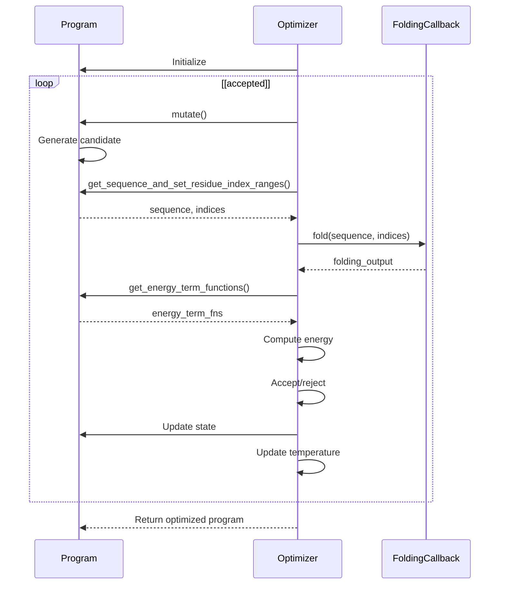

# Protein Programming Language

> **Relevant source files**
> * [examples/protein-programming-language/README.md](https://github.com/facebookresearch/esm/blob/2b369911/examples/protein-programming-language/README.md?plain=1)
> * [examples/protein-programming-language/language/optimize.py](https://github.com/facebookresearch/esm/blob/2b369911/examples/protein-programming-language/language/optimize.py)

The Protein Programming Language is a high-level programming system for generative protein design within the ESM framework. It provides a structured approach to define, optimize, and evaluate protein sequences with specific constraints and properties. This system leverages ESMFold's structure prediction capabilities to enable a programmatic approach to protein design.

For information about specific energy terms and optimization techniques used in this system, see [Energy Terms and Optimization](/facebookresearch/esm/8.1-energy-terms-and-optimization).

## Overview

The Protein Programming Language implementation is based on the paper [A high-level programming language for generative protein design](https://www.biorxiv.org/content/10.1101/2022.12.21.521526v1). It allows researchers to express protein design constraints as programs, which are then optimized using simulated annealing to produce sequences that satisfy desired criteria.

### Key Components

The language consists of several core components that work together to enable programmatic protein design:

Sources: [examples/protein-programming-language/language/optimize.py L14](https://github.com/facebookresearch/esm/blob/2b369911/examples/protein-programming-language/language/optimize.py#L14-L14)

 [examples/protein-programming-language/language/optimize.py L13](https://github.com/facebookresearch/esm/blob/2b369911/examples/protein-programming-language/language/optimize.py#L13-L13)

## Design Tasks

The Protein Programming Language supports various design tasks, each implemented as a specific type of program:

| Design Task | Description | Program File |
| --- | --- | --- |
| Free hallucination | Generating novel protein sequences without specific constraints | programs/free_hallucination.py |
| Fixed backbone design | Designing sequences that fold into a specified backbone structure | programs/fixed_backbone.py |
| Secondary structure design | Creating proteins with specific secondary structure patterns | programs/secondary_structure.py |
| Functional site scaffolding | Designing proteins that incorporate functional sites | programs/functional_site_scaffolding.py |
| Symmetric monomer design | Creating proteins with internal symmetry | programs/symmetric_monomer.py |
| Two-level symmetric homo-oligomer design | Designing multi-chain symmetric protein complexes | programs/symmetric_two_level_multimer.py |
| Symmetric binding site scaffolding | Creating proteins with symmetric binding interfaces | programs/symmetric_binding.py |

Sources: [examples/protein-programming-language/README.md L12-L25](https://github.com/facebookresearch/esm/blob/2b369911/examples/protein-programming-language/README.md?plain=1#L12-L25)

## Optimization Process

The core of the Protein Programming Language is its optimization engine, which uses simulated annealing via the Metropolis-Hastings algorithm to search for optimal protein designs.

### Metropolis-Hastings Implementation

The optimization process follows these steps:

Sources: [examples/protein-programming-language/language/optimize.py L31-L90](https://github.com/facebookresearch/esm/blob/2b369911/examples/protein-programming-language/language/optimize.py#L31-L90)

 [examples/protein-programming-language/language/optimize.py L93-L158](https://github.com/facebookresearch/esm/blob/2b369911/examples/protein-programming-language/language/optimize.py#L93-L158)

### Optimization Flow

The following sequence diagram shows the interactions between the main components during the optimization process:

Sources: [examples/protein-programming-language/language/optimize.py L31-L90](https://github.com/facebookresearch/esm/blob/2b369911/examples/protein-programming-language/language/optimize.py#L31-L90)

 [examples/protein-programming-language/language/optimize.py L93-L158](https://github.com/facebookresearch/esm/blob/2b369911/examples/protein-programming-language/language/optimize.py#L93-L158)

## Key Classes and Functions

### MetropolisHastingsState

The `MetropolisHastingsState` class maintains the state of the optimization process, including:

* Current program
* Temperature and annealing rate
* Current, candidate, and best energies
* Energy term function values
* Step count

Sources: [examples/protein-programming-language/language/optimize.py L17-L29](https://github.com/facebookresearch/esm/blob/2b369911/examples/protein-programming-language/language/optimize.py#L17-L29)

### metropolis_hastings_step

This function performs a single step of the Metropolis-Hastings algorithm:

1. Creates a candidate program by copying and mutating the current program
2. Folds the candidate sequence using a folding callback (ESMFold)
3. Calculates energy terms and total energy
4. Accepts or rejects the candidate based on the Metropolis criterion
5. Returns an updated state

Sources: [examples/protein-programming-language/language/optimize.py L31-L90](https://github.com/facebookresearch/esm/blob/2b369911/examples/protein-programming-language/language/optimize.py#L31-L90)

### run_simulated_annealing

This function runs the complete simulated annealing process:

1. Initializes the optimization state
2. Executes a specified number of Metropolis-Hastings steps
3. Tracks and displays progress
4. Returns the optimized program

Sources: [examples/protein-programming-language/language/optimize.py L93-L158](https://github.com/facebookresearch/esm/blob/2b369911/examples/protein-programming-language/language/optimize.py#L93-L158)

## Using the Protein Programming Language

To use the Protein Programming Language, you typically:

1. Define a program that specifies your protein design constraints
2. Set up a folding callback (usually using ESMFold)
3. Configure optimization parameters (temperature, annealing rate, steps)
4. Run the optimization process
5. Analyze the resulting protein design

A tutorial notebook is available that demonstrates the basics of writing programs and running optimization loops. The tutorial can be run in Google Colab.

Sources: [examples/protein-programming-language/README.md L5-L10](https://github.com/facebookresearch/esm/blob/2b369911/examples/protein-programming-language/README.md?plain=1#L5-L10)

## Integration with ESM

The Protein Programming Language integrates with other components of the ESM system, particularly ESMFold for structure prediction. The `FoldingCallback` interface provides a standardized way to invoke ESMFold during the optimization process, enabling the evaluation of structural properties for candidate protein designs.

## Summary

The Protein Programming Language provides a powerful framework for protein design, combining:

1. A high-level programming interface for expressing design constraints
2. Efficient optimization through simulated annealing
3. Structure prediction via ESMFold
4. Energy functions for evaluating design quality

This system enables researchers to tackle a wide range of protein design challenges in a structured, programmatic manner.