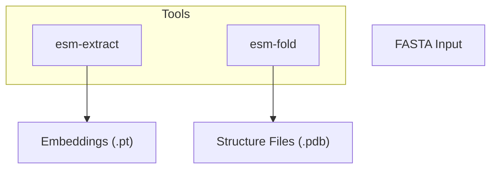
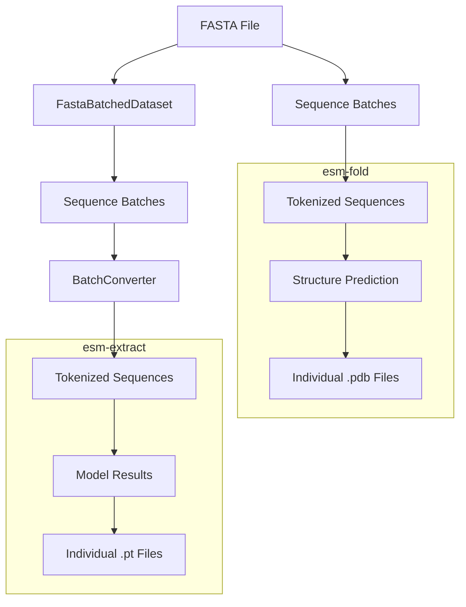
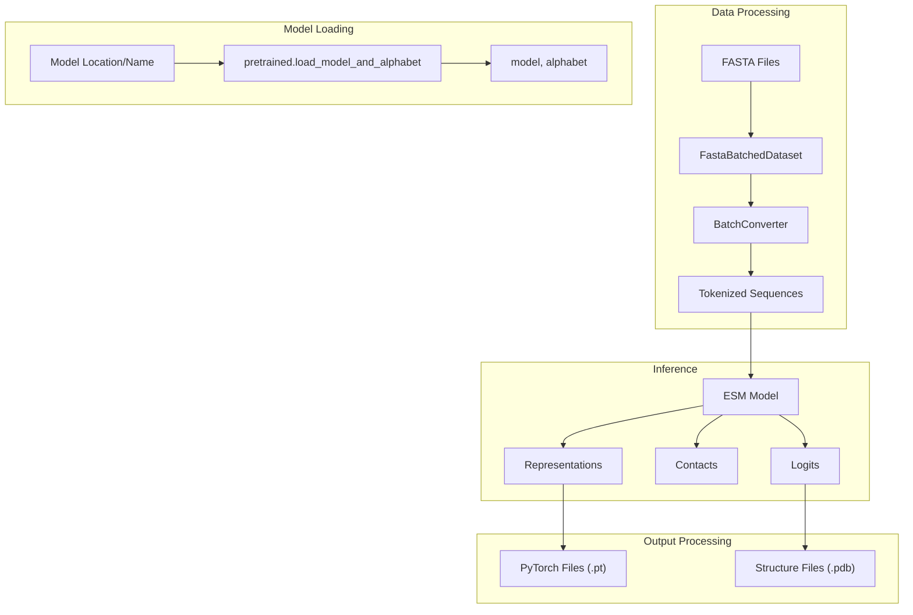
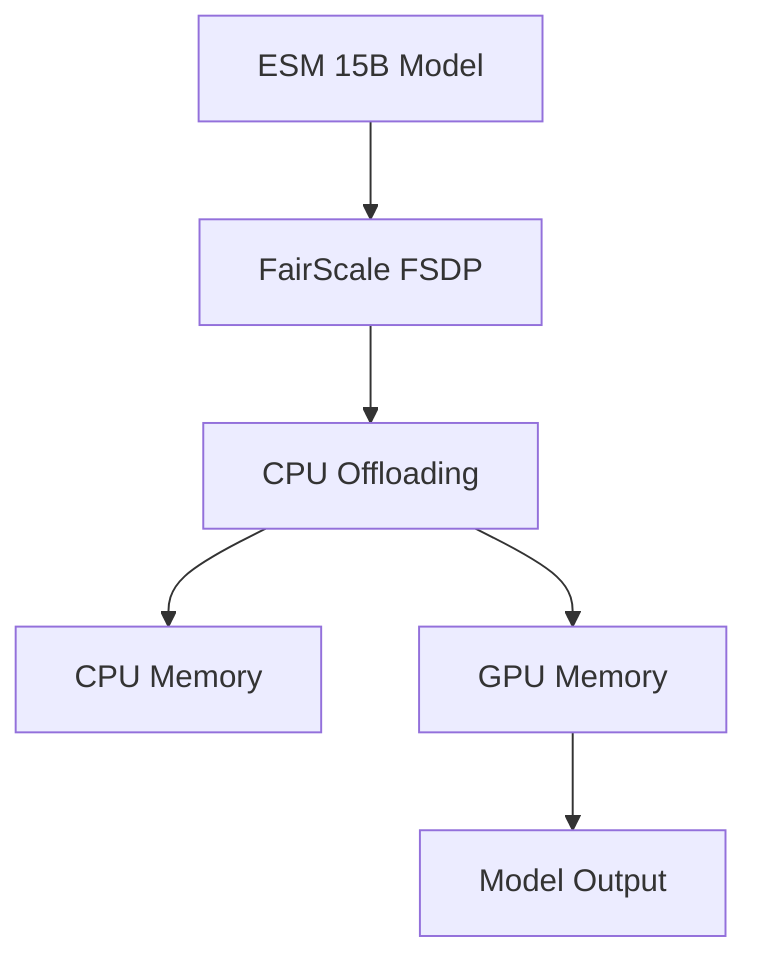

# Tools and Utilities

> **Relevant source files**
> * [.gitignore](https://github.com/facebookresearch/esm/blob/2b369911/.gitignore)
> * [README.md](https://github.com/facebookresearch/esm/blob/2b369911/README.md?plain=1)
> * [examples/variant-prediction/predict.py](https://github.com/facebookresearch/esm/blob/2b369911/examples/variant-prediction/predict.py)
> * [scripts/__init__.py](https://github.com/facebookresearch/esm/blob/2b369911/scripts/__init__.py)
> * [scripts/extract.py](https://github.com/facebookresearch/esm/blob/2b369911/scripts/extract.py)
> * [scripts/fold.py](https://github.com/facebookresearch/esm/blob/2b369911/scripts/fold.py)
> * [tests/test_readme.py](https://github.com/facebookresearch/esm/blob/2b369911/tests/test_readme.py)

This page provides an overview of the command-line tools and utilities provided by the ESM (Evolutionary Scale Modeling) repository. These tools enable users to extract embeddings from protein sequences and predict protein structures directly from the command line. For specific details about individual tools, see the dedicated pages for [esm-extract](/facebookresearch/esm/4.1-esm-extract) and [esm-fold](/facebookresearch/esm/4.2-esm-fold).

## ESM Command-Line Tools Overview

ESM provides two main command-line tools for working with protein sequences:



Sources: [README.md L276-L321](https://github.com/facebookresearch/esm/blob/2b369911/README.md?plain=1#L276-L321)

 [scripts/extract.py L1-L141](https://github.com/facebookresearch/esm/blob/2b369911/scripts/extract.py#L1-L141)

 [scripts/fold.py L1-L206](https://github.com/facebookresearch/esm/blob/2b369911/scripts/fold.py#L1-L206)

### esm-extract

The `esm-extract` tool is designed to efficiently extract embeddings in bulk from a FASTA file for downstream analysis. It processes one or more protein sequences and outputs embedding files in PyTorch format (.pt).

Usage:

```
esm-extract MODEL_LOCATION FASTA_FILE OUTPUT_DIR --include REPRESENTATION_TYPES --repr_layers LAYER_INDICES
```

Key parameters:

* `MODEL_LOCATION`: Path to a PyTorch model file or name of a pretrained model
* `FASTA_FILE`: FASTA file containing protein sequences
* `OUTPUT_DIR`: Output directory for extracted representations
* `--include`: Specify which representations to return (mean, per_tok, bos, contacts)
* `--repr_layers`: Layer indices from which to extract representations
* `--toks_per_batch`: Maximum batch size (default: 4096)
* `--truncation_seq_length`: Truncate sequences longer than specified value (default: 1022)

Example:

```
esm-extract esm2_t33_650M_UR50D examples/data/some_proteins.fasta examples/data/some_proteins_emb_esm2 --repr_layers 0 32 33 --include mean per_tok
```

This command extracts embeddings from layers 0, 32, and 33 of the ESM-2 model, including both per-token and mean representations for each sequence.

Sources: [README.md L276-L332](https://github.com/facebookresearch/esm/blob/2b369911/README.md?plain=1#L276-L332)

 [scripts/extract.py L14-L141](https://github.com/facebookresearch/esm/blob/2b369911/scripts/extract.py#L14-L141)

### esm-fold

The `esm-fold` tool predicts protein structures from sequences in a FASTA file using the ESMFold model. It processes sequences and outputs structure files in PDB format.

Usage:

```
esm-fold -i FASTA -o PDB [options]
```

Key parameters:

* `-i, --fasta`: Path to input FASTA file
* `-o, --pdb`: Path to output PDB directory
* `--num-recycles`: Number of recycles to run (default: 4)
* `--max-tokens-per-batch`: Maximum tokens per batch for grouping shorter sequences
* `--chunk-size`: Chunks axial attention computation to reduce memory usage
* `--cpu-only`: Run on CPU only
* `--cpu-offload`: Enable CPU offloading for large model inference

Example:

```
esm-fold -i sequences.fasta -o output_structures/ --chunk-size 128
```

This command predicts structures for all sequences in `sequences.fasta`, saving the results as PDB files in the `output_structures/` directory, with attention computation chunked to reduce memory usage.

Sources: [README.md L238-L271](https://github.com/facebookresearch/esm/blob/2b369911/README.md?plain=1#L238-L271)

 [scripts/fold.py L1-L206](https://github.com/facebookresearch/esm/blob/2b369911/scripts/fold.py#L1-L206)

## Data Flow in Command-Line Tools

The following diagram illustrates the internal data flow within the ESM command-line tools:



Sources: [scripts/extract.py L63-L132](https://github.com/facebookresearch/esm/blob/2b369911/scripts/extract.py#L63-L132)

 [scripts/fold.py L66-L196](https://github.com/facebookresearch/esm/blob/2b369911/scripts/fold.py#L66-L196)

## Internal Components

The tools leverage several key components from the ESM codebase:



Sources: [README.md L162-L200](https://github.com/facebookresearch/esm/blob/2b369911/README.md?plain=1#L162-L200)

 [scripts/extract.py L1-L141](https://github.com/facebookresearch/esm/blob/2b369911/scripts/extract.py#L1-L141)

 [scripts/fold.py L1-L206](https://github.com/facebookresearch/esm/blob/2b369911/scripts/fold.py#L1-L206)

## Python API Usage Examples

Besides the command-line tools, users can directly use the ESM Python API. Here are some examples:

### Loading a Pretrained Model

```javascript
import torchimport esm # Load ESM-2 modelmodel, alphabet = esm.pretrained.esm2_t33_650M_UR50D()batch_converter = alphabet.get_batch_converter()model.eval()  # disables dropout for deterministic results
```

### Extracting Embeddings

```markdown
# Prepare sequence datadata = [    ("protein1", "MKTVRQERLKSIVRILERSKEPVSGAQLAEELSVSRQVIVQDIAYLRSLGYNIVATPRGYVLAGG"),]batch_labels, batch_strs, batch_tokens = batch_converter(data) # Extract representationswith torch.no_grad():    results = model(batch_tokens, repr_layers=[33], return_contacts=True)token_representations = results["representations"][33]
```

### Structure Prediction with ESMFold

```javascript
import esm model = esm.pretrained.esmfold_v1()model = model.eval().cuda() sequence = "MKTVRQERLKSIVRILERSKEPVSGAQLAEELSVSRQVIVQDIAYLRSLGYNIVATPRGYVLAGG"with torch.no_grad():    output = model.infer_pdb(sequence) with open("result.pdb", "w") as f:    f.write(output)
```

Sources: [README.md L162-L231](https://github.com/facebookresearch/esm/blob/2b369911/README.md?plain=1#L162-L231)

 [tests/test_readme.py L16-L91](https://github.com/facebookresearch/esm/blob/2b369911/tests/test_readme.py#L16-L91)

## Memory Optimization for Large Models

For large models like ESM-2 15B, ESM provides CPU offloading functionality to enable inference on machines with limited GPU memory:



This can be used with both `esm-fold` (via the `--cpu-offload` flag) and in Python API using the FSDP wrapper functionality.

Sources: [README.md L332-L337](https://github.com/facebookresearch/esm/blob/2b369911/README.md?plain=1#L332-L337)

 [scripts/fold.py L38-L63](https://github.com/facebookresearch/esm/blob/2b369911/scripts/fold.py#L38-L63)

## Integration with Other Libraries

ESM tools can be integrated with other libraries and frameworks:

| Integration | Description | Usage Example |
| --- | --- | --- |
| PyTorch Hub | Load models directly from PyTorch Hub | `model, alphabet = torch.hub.load("facebookresearch/esm:main", "esm2_t33_650M_UR50D")` |
| HuggingFace | Use ESM models through HuggingFace transformers | `from transformers import AutoTokenizer, AutoModelForMaskedLM` |
| FairScale FSDP | Distribute large models across GPUs or offload to CPU | See CPU offloading section |
| ESM Atlas API | Access the ESM Atlas through the API | `curl -X POST --data "SEQUENCE" https://api.esmatlas.com/foldSequence/v1/pdb/` |

Sources: [README.md L114-L125](https://github.com/facebookresearch/esm/blob/2b369911/README.md?plain=1#L114-L125)

 [README.md L332-L337](https://github.com/facebookresearch/esm/blob/2b369911/README.md?plain=1#L332-L337)

## File Output Formats

### ESM-Extract Output (.pt files)

The `.pt` files generated by `esm-extract` are PyTorch tensor files containing:

* `label`: The sequence label from the FASTA file
* `representations`: Dictionary mapping layer indices to per-token embeddings
* `mean_representations`: Dictionary mapping layer indices to mean embeddings
* `bos_representations`: Dictionary mapping layer indices to beginning-of-sequence token embeddings
* `contacts`: Contact map predicted from self-attention

### ESM-Fold Output (.pdb files)

The `.pdb` files generated by `esm-fold` follow the standard PDB format with:

* Atomic coordinates of the predicted protein structure
* B-factor values representing the pLDDT (predicted local distance difference test) confidence scores
* Quality metrics like pTM (predicted TM-score) in the file header

Sources: [scripts/extract.py L95-L131](https://github.com/facebookresearch/esm/blob/2b369911/scripts/extract.py#L95-L131)

 [scripts/fold.py L180-L196](https://github.com/facebookresearch/esm/blob/2b369911/scripts/fold.py#L180-L196)