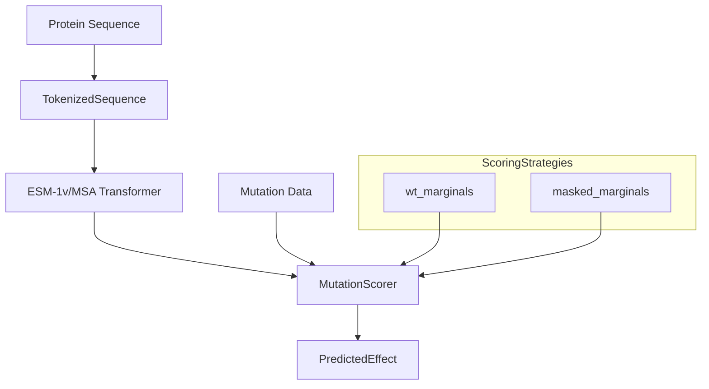
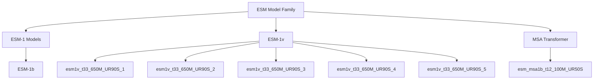
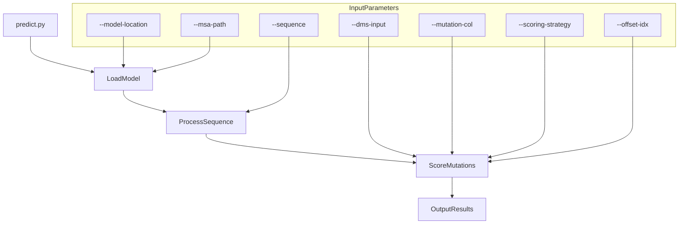
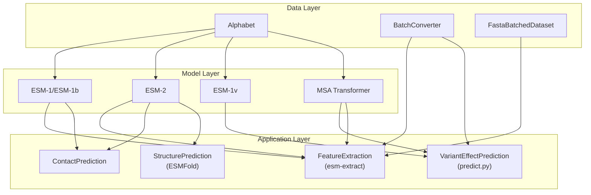

# Variant Effect Prediction

> **Relevant source files**
> * [esm/inverse_folding/gvp_modules.py](https://github.com/facebookresearch/esm/blob/2b369911/esm/inverse_folding/gvp_modules.py)
> * [examples/variant-prediction/README.md](https://github.com/facebookresearch/esm/blob/2b369911/examples/variant-prediction/README.md?plain=1)

## Purpose and Scope

This document describes the variant effect prediction functionality in ESM, which enables zero-shot prediction of how mutations affect protein function. The system uses pretrained protein language models to predict mutation effects without requiring mutation-specific training data. For related functionalities, see [Contact Prediction](/facebookresearch/esm/7.1-contact-prediction) for predicting protein residue contacts or [ESMFold](/facebookresearch/esm/2.3-esmfold) for protein structure prediction.

## System Overview

Variant effect prediction uses ESM protein language models to score the likelihood of mutations at specific positions in a protein sequence. The system calculates how "surprising" a mutation is to the model compared to the wild-type residue, which correlates with functional impact.



Sources: examples/variant-prediction/README.md:3-4

## Models for Variant Prediction

The variant effect prediction system primarily uses two types of models:

1. **ESM-1v Models**: A set of five identical transformer-based models (33 layers, 650M parameters) trained with different random seeds, used as an ensemble
2. **MSA Transformer**: An alternative approach that leverages multiple sequence alignments



Sources: examples/variant-prediction/README.md:3-4, examples/variant-prediction/README.md:10-12, examples/variant-prediction/README.md:22-23

## Scoring Strategies

The system supports multiple scoring strategies for computing mutation effects:

| Strategy | Description | Typical Use Case |
| --- | --- | --- |
| `wt-marginals` | Computes the difference in token log probabilities between mutant and wild-type sequences | Single sequence models (ESM-1v) |
| `masked-marginals` | Uses a masked language modeling approach where the mutated position is masked before prediction | MSA Transformer |

Sources: examples/variant-prediction/README.md:17, examples/variant-prediction/README.md:29

## Implementation and Usage

The variant effect prediction functionality is implemented in the `examples/variant-prediction` directory. The main entry point is the `predict.py` script, which processes a protein sequence and mutation data to predict the effects of specified mutations.



### Usage Examples

#### Using ESM-1v Ensemble:

```
python predict.py \
    --model-location esm1v_t33_650M_UR90S_1 esm1v_t33_650M_UR90S_2 esm1v_t33_650M_UR90S_3 esm1v_t33_650M_UR90S_4 esm1v_t33_650M_UR90S_5 \
    --sequence HPETLVKVKDAEDQLGARVGYIELDLNSGKILESFRPEERFPMMSTFKVLLCGAVLSRVDAGQEQLGRRIHYSQNDLVEYSPVTEKHLTDGMTVRELCSAAITMSDNTAANLLLTTIGGPKELTAFLHNMGDHVTRLDRWEPELNEAIPNDERDTTMPAAMATTLRKLLTGELLTLASRQQLIDWMEADKVAGPLLRSALPAGWFIADKSGAGERGSRGIIAALGPDGKPSRIVVIYTTGSQATMDERNRQIAEIGASLIKHW \
    --dms-input ./data/BLAT_ECOLX_Ranganathan2015.csv \
    --mutation-col mutant \
    --dms-output ./data/BLAT_ECOLX_Ranganathan2015_labeled.csv \
    --offset-idx 24 \
    --scoring-strategy wt-marginals
```

#### Using MSA Transformer:

```
python predict.py \
    --model-location esm_msa1b_t12_100M_UR50S \
    --sequence HPETLVKVKDAEDQLGARVGYIELDLNSGKILESFRPEERFPMMSTFKVLLCGAVLSRVDAGQEQLGRRIHYSQNDLVEYSPVTEKHLTDGMTVRELCSAAITMSDNTAANLLLTTIGGPKELTAFLHNMGDHVTRLDRWEPELNEAIPNDERDTTMPAAMATTLRKLLTGELLTLASRQQLIDWMEADKVAGPLLRSALPAGWFIADKSGAGERGSRGIIAALGPDGKPSRIVVIYTTGSQATMDERNRQIAEIGASLIKHW \
    --dms-input ./data/BLAT_ECOLX_Ranganathan2015.csv \
    --mutation-col mutant \
    --dms-output ./data/BLAT_ECOLX_Ranganathan2015_labeled.csv \
    --offset-idx 24 \
    --scoring-strategy masked-marginals \
    --msa-path ./data/BLAT_ECOLX_1_b0.5.a3m
```

Sources: examples/variant-prediction/README.md:9-18, examples/variant-prediction/README.md:20-31

### Input Parameters

| Parameter | Description |
| --- | --- |
| `--model-location` | Path or name of pretrained model(s) |
| `--sequence` | Wild-type protein sequence |
| `--dms-input` | CSV file with mutation data |
| `--mutation-col` | Column name containing mutations |
| `--dms-output` | Output file path |
| `--offset-idx` | Index offset for mutation positions (to align sequence numbering) |
| `--scoring-strategy` | Method for scoring mutations (`wt-marginals` or `masked-marginals`) |
| `--msa-path` | Path to MSA file (required only for MSA Transformer) |

Sources: examples/variant-prediction/README.md:9-31

## Data Processing

The variant prediction system processes mutation data typically formatted as:

```
original_amino_acid + position + mutated_amino_acid
```

For example, `A123G` would represent a mutation from alanine (A) to glycine (G) at position 123. The system handles both single-site mutations and multi-site mutations.

The `offset-idx` parameter is used to align the mutation positions with the input sequence, accounting for differences in numbering between the reference sequence and the mutation data.

## Performance Evaluation

The ESM repository includes performance data for 41 deep mutational scanning datasets as described in the paper "Language models enable zero-shot prediction of the effects of mutations on protein function" (Meier et al. 2021). Performance is measured using Spearman's rank correlation coefficient (ρ) between predicted and experimental mutation effects.

Data files are available at three levels of aggregation:

* `raw_df.csv`: Individual mutation scores
* `rho_pp`: Spearman correlations per protein
* `aggregated_rho`: Performance metrics averaged over validation/test proteins

Sources: examples/variant-prediction/README.md:34-43

## Integration with ESM Ecosystem

Variant effect prediction is one application in the ESM system that leverages the core protein language models:



Sources: examples/variant-prediction/README.md:3-4

The variant effect prediction functionality serves as a specialized application of ESM's protein language models, demonstrating how these models can be applied to understand the functional impact of protein mutations without requiring experimental data for the specific protein of interest.