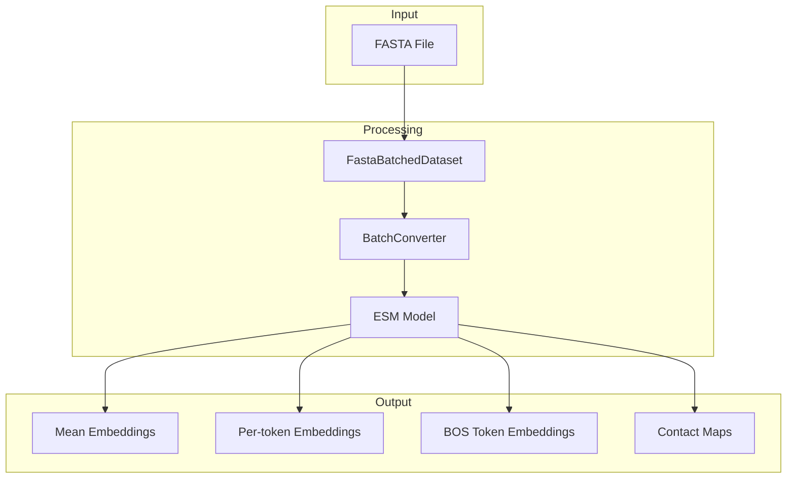
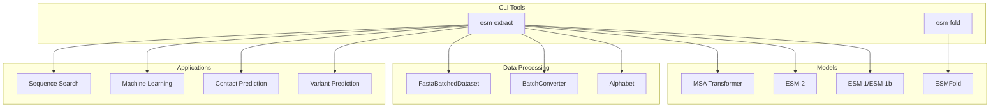
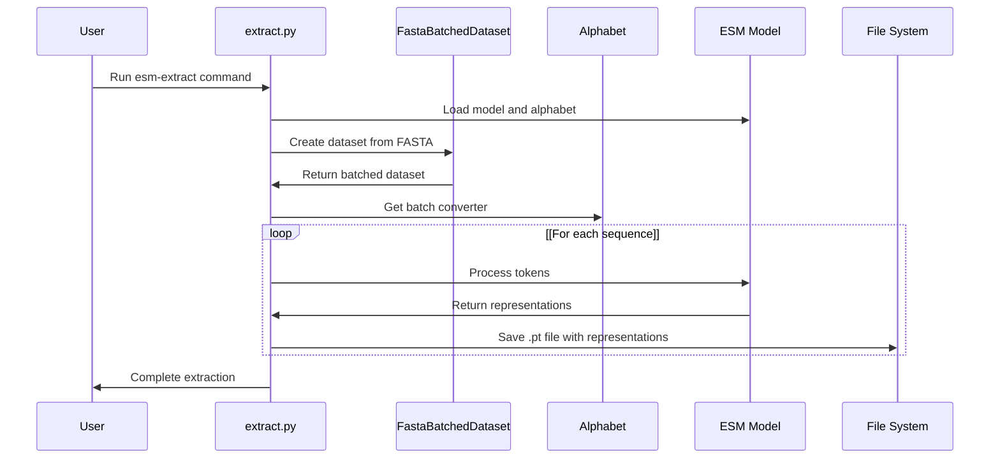

# esm-extract

> **Relevant source files**
> * [.gitignore](https://github.com/facebookresearch/esm/blob/2b369911/.gitignore)
> * [README.md](https://github.com/facebookresearch/esm/blob/2b369911/README.md?plain=1)
> * [examples/variant-prediction/predict.py](https://github.com/facebookresearch/esm/blob/2b369911/examples/variant-prediction/predict.py)
> * [scripts/__init__.py](https://github.com/facebookresearch/esm/blob/2b369911/scripts/__init__.py)
> * [scripts/extract.py](https://github.com/facebookresearch/esm/blob/2b369911/scripts/extract.py)
> * [scripts/fold.py](https://github.com/facebookresearch/esm/blob/2b369911/scripts/fold.py)
> * [tests/test_readme.py](https://github.com/facebookresearch/esm/blob/2b369911/tests/test_readme.py)

## Purpose and Overview

`esm-extract` is a command-line utility that efficiently extracts protein embeddings from ESM (Evolutionary Scale Modeling) language models. It processes protein sequences in FASTA format and outputs vector representations that capture biological and structural properties of proteins. These embeddings can be used for various downstream tasks such as protein property prediction, variant effect prediction, or as features for machine learning models.

For information about structure prediction using ESMFold, see [esm-fold](/facebookresearch/esm/4.2-esm-fold).

## Data Flow Overview

The following diagram illustrates how `esm-extract` processes protein sequences to generate embeddings:



Sources: [scripts/extract.py L74-L78](https://github.com/facebookresearch/esm/blob/2b369911/scripts/extract.py#L74-L78)

 [README.md L277-L306](https://github.com/facebookresearch/esm/blob/2b369911/README.md?plain=1#L277-L306)

## Command-line Interface

### Basic Usage

```
esm-extract MODEL_LOCATION FASTA_FILE OUTPUT_DIR --include REPRESENTATION_TYPES
```

Where:

* `MODEL_LOCATION`: Path to a PyTorch model file or name of a pretrained model
* `FASTA_FILE`: Path to the FASTA file containing protein sequences
* `OUTPUT_DIR`: Directory where extracted representations will be saved
* `--include`: Types of representations to extract (required)

### Required Arguments

| Argument | Description |
| --- | --- |
| `model_location` | PyTorch model file OR name of pretrained model to download |
| `fasta_file` | FASTA file containing protein sequences |
| `output_dir` | Directory for extracted representations |
| `--include` | Specify which representations to return (`mean`, `per_tok`, `bos`, `contacts`) |

### Optional Arguments

| Argument | Default | Description |
| --- | --- | --- |
| `--toks_per_batch` | 4096 | Maximum batch size |
| `--repr_layers` | [-1] | Layer indices to extract (0 to num_layers, inclusive) |
| `--truncation_seq_length` | 1022 | Truncate sequences longer than this value |
| `--nogpu` | - | Do not use GPU even if available |

Sources: [scripts/extract.py L15-L60](https://github.com/facebookresearch/esm/blob/2b369911/scripts/extract.py#L15-L60)

 [README.md L277-L329](https://github.com/facebookresearch/esm/blob/2b369911/README.md?plain=1#L277-L329)

## Integration with ESM System

The following diagram shows how `esm-extract` fits into the larger ESM ecosystem:



Sources: [README.md L99-L109](https://github.com/facebookresearch/esm/blob/2b369911/README.md?plain=1#L99-L109)

 [scripts/extract.py L63-L132](https://github.com/facebookresearch/esm/blob/2b369911/scripts/extract.py#L63-L132)

## Technical Implementation

`esm-extract` uses several key components to efficiently process protein sequences:

1. **Model loading**: Loads a pretrained ESM model specified by the user
2. **FASTA processing**: Uses `FastaBatchedDataset` to read and batch protein sequences
3. **Batch conversion**: Converts sequences to token IDs using the model's `Alphabet`
4. **Token processing**: Forwards tokens through the model and extracts representations
5. **Output generation**: Saves representations as PyTorch (.pt) tensor files

### Detailed Processing Workflow



Sources: [scripts/extract.py L63-L132](https://github.com/facebookresearch/esm/blob/2b369911/scripts/extract.py#L63-L132)

 [README.md L277-L329](https://github.com/facebookresearch/esm/blob/2b369911/README.md?plain=1#L277-L329)

## Output Format and Usage

For each sequence in the input FASTA file, `esm-extract` saves a separate PyTorch (.pt) file in the specified output directory. The file name corresponds to the header of the sequence in the FASTA file.

Each .pt file contains a dictionary with the following possible keys:

| Key | Description | When Included |
| --- | --- | --- |
| `label` | Sequence identifier from FASTA | Always |
| `representations` | Per-token embeddings for each layer | When `--include per_tok` |
| `mean_representations` | Mean embedding across sequence for each layer | When `--include mean` |
| `bos_representations` | Beginning-of-sequence token embedding for each layer | When `--include bos` |
| `contacts` | Predicted contact map | When `--include contacts` |

### Representation Types

1. **Per-token (`per_tok`)**: Provides an embedding for each amino acid in the sequence * Shape: `[sequence_length, embedding_dimension]` * Use case: Residue-level property prediction or fine-grained sequence analysis
2. **Mean (`mean`)**: Average of all token embeddings for the sequence * Shape: `[embedding_dimension]` * Use case: Sequence-level classification or property prediction
3. **BOS token (`bos`)**: Embedding of the beginning-of-sequence token * Shape: `[embedding_dimension]` * Use case: Alternative sequence representation (not recommended for pretrained models)
4. **Contacts (`contacts`)**: Predicted contact map from self-attention * Shape: `[sequence_length, sequence_length]` * Use case: Protein structure prediction or analysis

Sources: [scripts/extract.py L98-L126](https://github.com/facebookresearch/esm/blob/2b369911/scripts/extract.py#L98-L126)

 [README.md L323-L329](https://github.com/facebookresearch/esm/blob/2b369911/README.md?plain=1#L323-L329)

## Example Usage

### Basic Example

Extract mean and per-token embeddings from layers 0, 32, and 33 of the ESM-2 model:

```
esm-extract esm2_t33_650M_UR50D examples/data/some_proteins.fasta \  examples/data/some_proteins_emb_esm2 --repr_layers 0 32 33 --include mean per_tok
```

### Loading and Using Embeddings

After extraction, you can load and use the embeddings in Python:

```javascript
import torch # Load embeddings for a proteinprotein_emb = torch.load("examples/data/some_proteins_emb_esm2/protein1.pt") # Access mean representation from the final layer (33)mean_embedding = protein_emb["mean_representations"][33] # Access per-token embeddings from the final layerper_token_embeddings = protein_emb["representations"][33] # Use these embeddings for downstream tasks# ...
```

Sources: [README.md L310-L329](https://github.com/facebookresearch/esm/blob/2b369911/README.md?plain=1#L310-L329)

 [tests/test_readme.py L94-L106](https://github.com/facebookresearch/esm/blob/2b369911/tests/test_readme.py#L94-L106)

## Tips and Best Practices

### Handling Large Datasets

* Use the `--toks_per_batch` parameter to control memory usage
* Process FASTA files in chunks if they contain many sequences
* Consider pre-filtering sequences by length if memory is a concern

### GPU Usage

* By default, `esm-extract` will use a GPU if available
* Use the `--nogpu` flag to force CPU-only execution
* For very large models, see the CPU offloading guide in [Large Model Inference](/facebookresearch/esm/7.3-large-model-inference)

### Common Embedding Choices

* For general protein representation, use `mean` embeddings from the final layer
* For residue-level applications, use `per_tok` embeddings
* For contact prediction, include `contacts`
* The `bos` token embedding is generally not recommended for pretrained models

Sources: [README.md L332-L337](https://github.com/facebookresearch/esm/blob/2b369911/README.md?plain=1#L332-L337)

 [scripts/extract.py L57-L59](https://github.com/facebookresearch/esm/blob/2b369911/scripts/extract.py#L57-L59)

## Related Tools

For related functionality in the ESM ecosystem, see:

* [ESM-1 and ESM-2](/facebookresearch/esm/2.1-esm-1-and-esm-2) - Information about the core language models
* [ESM-Fold](/facebookresearch/esm/4.2-esm-fold) - Tool for protein structure prediction
* [Contact Prediction](/facebookresearch/esm/7.1-contact-prediction) - Using ESM for predicting protein contacts
* [Variant Effect Prediction](/facebookresearch/esm/7.2-variant-effect-prediction) - Predicting effects of mutations

Sources: [README.md L57-L76](https://github.com/facebookresearch/esm/blob/2b369911/README.md?plain=1#L57-L76)