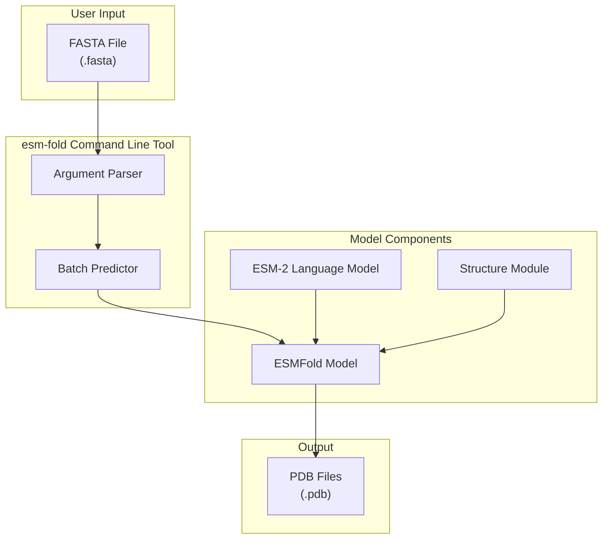
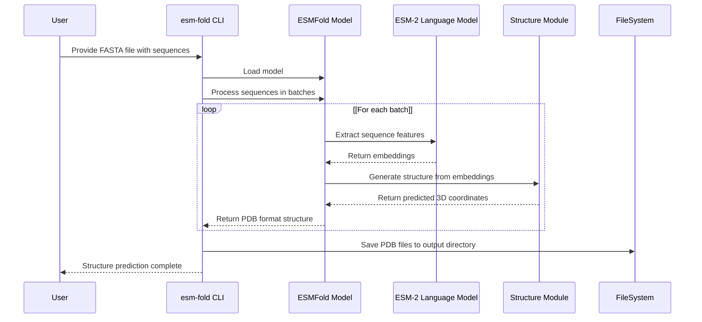

# esm-fold

> **Relevant source files**
> * [README.md](https://github.com/facebookresearch/esm/blob/2b369911/README.md?plain=1)
> * [scripts/download_weights.sh](https://github.com/facebookresearch/esm/blob/2b369911/scripts/download_weights.sh)
> * [tests/test_readme.py](https://github.com/facebookresearch/esm/blob/2b369911/tests/test_readme.py)

## Purpose and Scope

This document describes the `esm-fold` command-line tool provided by the ESM (Evolutionary Scale Modeling) repository. The tool enables efficient protein structure prediction in bulk from FASTA files using the ESMFold model. This page covers the installation, usage, and options of the command-line tool, as well as performance considerations. For information about the underlying ESMFold model architecture, see [ESMFold](/facebookresearch/esm/2.3-esmfold).

Sources: [README.md L1-L10](https://github.com/facebookresearch/esm/blob/2b369911/README.md?plain=1#L1-L10)

 [README.md L202-L273](https://github.com/facebookresearch/esm/blob/2b369911/README.md?plain=1#L202-L273)

## Overview

The `esm-fold` command-line tool provides a straightforward interface to predict protein 3D structures from their amino acid sequences. It leverages the ESMFold model, which harnesses the ESM-2 language model to generate accurate structure predictions end-to-end directly from the sequence of a protein. The tool is designed to efficiently process multiple sequences in batch mode, making it suitable for large-scale structure prediction tasks.

### ESM-fold in the ESM Ecosystem



Sources: [README.md L7-L10](https://github.com/facebookresearch/esm/blob/2b369911/README.md?plain=1#L7-L10)

 [README.md L202-L226](https://github.com/facebookresearch/esm/blob/2b369911/README.md?plain=1#L202-L226)

### Data Flow in ESM-fold



Sources: [README.md L238-L265](https://github.com/facebookresearch/esm/blob/2b369911/README.md?plain=1#L238-L265)

 [README.md L267-L273](https://github.com/facebookresearch/esm/blob/2b369911/README.md?plain=1#L267-L273)

## Installation

To use the `esm-fold` command-line tool, you need to install the ESM package with ESMFold support. This requires Python ≤ 3.9 and PyTorch. The installation process also sets up OpenFold dependencies.

```markdown
# Install ESM with ESMFold supportpip install "fair-esm[esmfold]" # Install OpenFold and its dependenciespip install 'dllogger @ git+https://github.com/NVIDIA/dllogger.git'pip install 'openfold @ git+https://github.com/aqlaboratory/openfold.git@4b41059694619831a7db195b7e0988fc4ff3a307'
```

Alternatively, you can use the provided conda environment:

```sql
conda env create -f environment.yml
```

Sources: [README.md L140-L153](https://github.com/facebookresearch/esm/blob/2b369911/README.md?plain=1#L140-L153)

## Usage

The `esm-fold` command-line tool takes a FASTA file containing protein sequences as input and outputs predicted 3D structures in PDB format. Each sequence in the FASTA file results in one prediction.

### Basic Usage

```
esm-fold -i input.fasta -o output_directory
```

This command will:

1. Read all sequences from `input.fasta`
2. Predict the 3D structure for each sequence
3. Save the predicted structures as PDB files in the `output_directory`

Sources: [README.md L238-L249](https://github.com/facebookresearch/esm/blob/2b369911/README.md?plain=1#L238-L249)

### Command-line Options

| Option | Description |
| --- | --- |
| `-i FASTA, --fasta FASTA` | Path to input FASTA file |
| `-o PDB, --pdb PDB` | Path to output PDB directory |
| `--num-recycles NUM_RECYCLES` | Number of recycles to run. Defaults to 4 (number used in training) |
| `--max-tokens-per-batch MAX_TOKENS_PER_BATCH` | Maximum number of tokens per GPU forward-pass for batched prediction |
| `--chunk-size CHUNK_SIZE` | Chunk size for axial attention to reduce memory usage (e.g., 128, 64, 32) |
| `--cpu-only` | Run predictions on CPU only |
| `--cpu-offload` | Enable CPU offloading for longer sequences |

Sources: [README.md L244-L264](https://github.com/facebookresearch/esm/blob/2b369911/README.md?plain=1#L244-L264)

## Performance Considerations

### Batch Processing

By default, the `esm-fold` tool processes shorter sequences in batches to improve prediction speed. This batching can be disabled by setting `--max-tokens-per-batch=0`. Batching significantly improves performance when working with many shorter sequences.

### Memory Management

For long sequences that may cause out-of-memory issues, two options are available:

1. **Chunking**: Use the `--chunk-size` parameter to reduce memory usage by chunking axial attention computation. This reduces memory from O(L²) to O(L), where L is the sequence length. Lower values reduce memory usage at the cost of speed. Recommended values are 128, 64, or 32.
2. **CPU Offloading**: Use the `--cpu-offload` flag to offload some parameters to CPU RAM instead of keeping them on the GPU.

Sources: [README.md L267-L273](https://github.com/facebookresearch/esm/blob/2b369911/README.md?plain=1#L267-L273)

## Working with Multimers

The `esm-fold` tool can predict structures for protein complexes with multiple chains. For multimer prediction, enter chains in the FASTA file as a single sequence with chains separated by a colon (`:`) character:

```yaml
>multimer_example
MKTVRQERLKSIVRILERSKEPVSGAQLAEELSVSRQVIVQDIAYLRSLGYNIVATPRGYVLAGG:KALTARQQEVFDLIRDHISQTGMPPTRAEIAQRLGFRSPNAAEEHLKALARKGVIEIVSGASRGIRLLQEE
```

Sources: [README.md L219](https://github.com/facebookresearch/esm/blob/2b369911/README.md?plain=1#L219-L219)

 [README.md L267-L268](https://github.com/facebookresearch/esm/blob/2b369911/README.md?plain=1#L267-L268)

## Available Models

The ESM repository provides two versions of the ESMFold model:

| Model Name | Function | Description |
| --- | --- | --- |
| `esmfold_v1()` | `esm.pretrained.esmfold_v1()` | Best performing model (recommended) |
| `esmfold_v0()` | `esm.pretrained.esmfold_v0()` | Used for experiments in the original paper |

The `esm-fold` command-line tool uses `esmfold_v1()` by default.

Sources: [README.md L234-L236](https://github.com/facebookresearch/esm/blob/2b369911/README.md?plain=1#L234-L236)

## Example Usage

### Basic Example

```markdown
# Predict structures for all sequences in proteins.fastaesm-fold -i proteins.fasta -o output_structures
```

### Optimizing for Longer Sequences

```markdown
# Use CPU offloading and chunking for longer sequencesesm-fold -i long_proteins.fasta -o output_structures --cpu-offload --chunk-size 64
```

### Batch Processing for Many Short Sequences

```markdown
# Process many short sequences efficiently with increased batch sizeesm-fold -i many_short_proteins.fasta -o output_structures --max-tokens-per-batch 8000
```

Sources: [README.md L238-L273](https://github.com/facebookresearch/esm/blob/2b369911/README.md?plain=1#L238-L273)

## Alternative Interfaces

In addition to the command-line tool, you can access ESMFold through:

1. **Python API**: Direct model usage through the ESM Python package
2. **ColabFold**: Online interface through Google Colab
3. **Web API**: REST API at `https://api.esmatlas.com/foldSequence/v1/pdb/`
4. **Web Interface**: Online interface at ESM Metagenomic Atlas

Sources: [README.md L114-L125](https://github.com/facebookresearch/esm/blob/2b369911/README.md?plain=1#L114-L125)

 [README.md L205-L226](https://github.com/facebookresearch/esm/blob/2b369911/README.md?plain=1#L205-L226)