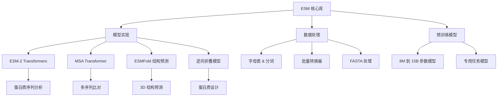

---
slug:1-overview
blog_type:normal
---


**Evolutionary Scale Modeling (ESM)** 代码库包含 Meta 最先进的 Transformer 蛋白质语言模型，旨在直接从氨基酸序列理解和预测蛋白质结构与功能。这个强大的工具包使研究人员能够利用深度学习进行蛋白质分析、结构预测和设计，而无需传统实验方法。

## 什么是 ESM？

ESM 代表了计算生物学的突破性进展，通过将大规模语言建模技术应用于蛋白质序列。正如语言模型从文本中学习模式一样，ESM 模型从数百万个自然序列中学习"蛋白质语言"，使其能够理解进化约束、结构关系和功能特性 [README.md](README.md#L1-L10)。

核心创新是将蛋白质序列视为生物语言中的句子，模型学习预测被掩码的氨基酸，从而深入理解蛋白质结构与功能关系。

## 架构概览

ESM 围绕几个关键架构组件构建，这些组件协同工作以提供全面的蛋白质分析能力：



## 关键组件

### 核心模型

代码库提供多个专用模型系列，每个系列针对不同的蛋白质分析任务进行了优化：

| 模型系列 | 主要用例 | 参数范围 | 关键特性 |
|--------------|------------------|-----------------|--------------|
| **ESM-2** | 通用蛋白质分析 | 8M - 15B | 最先进的序列理解、结构/功能预测 |
| **ESMFold** | 端到端结构预测 | 3B 基础 | 直接从序列生成 3D 结构，无需 MSA |
| **MSA Transformer** | 多序列比对分析 | 100M | 利用序列家族的进化信息 |
| **ESM-1v** | 变异效应预测 | 650M | 专用于突变影响分析 |
| **ESM-IF1** | 逆向折叠与设计 | 142M | 针对给定结构的序列设计 |

### 数据处理管道

ESM 提供围绕 [Alphabet 类](esm/data.py#L91-L143) 和 [BatchConverter](esm/data.py#L253-L263) 构建的精密数据处理系统，处理：

- **分词**：将氨基酸序列转换为数值表示
- **批量处理**：高效同时处理多个序列  
- **特殊标记**：支持掩码、填充和序列边界
- **MSA 支持**：多序列比对的专门处理

### 模型架构

[ESM-2 模型](esm/model/esm2.py#L14-L78) 是核心架构的典范：
- **基于 Transformer**：使用自注意力机制捕获长程依赖
- **分层表示**：多个 Transformer 层提取越来越抽象的特征
- **接触预测**：内置预测氨基酸相互作用的能力
- **可扩展设计**：模型参数范围从 8M 到 15B，适应不同计算预算

## 项目结构

代码库组织为逻辑组件以确保清晰性和可维护性：

```
esm/
├── model/           # 核心模型实现
│   ├── esm1.py     # 原始 ESM 模型
│   ├── esm2.py     # 最新的 ESM-2 架构
│   └── msa_transformer.py  # MSA 专用模型
├── data.py         # 数据处理工具
├── pretrained.py   # 模型加载函数
├── esmfold/        # 结构预测模块
└── inverse_folding/  # 蛋白质设计功能
```

## 快速开始

ESM 提供多种访问方式以满足不同需求：

1. **PyPI 安装**：使用 `pip install fair-esm` 快速设置
2. **HuggingFace 集成**：为 ESMFold 提供标准化 API 访问
3. **PyTorch Hub**：无需本地安装直接加载 [hubconf.py](hubconf.py#L1-L44)
4. **Web API**：通过 ESM 宏基因组 Atlas 进行基于浏览器的折叠

该库通过 Jupyter notebooks 提供全面的示例，涵盖：
- 基础蛋白质序列处理
- 从自注意力预测接触
- 变异效应预测
- 逆向折叠和蛋白质设计
- 大规模嵌入计算

## 科学影响

ESM 模型在多个蛋白质分析任务上展现了突破性性能：

- **结构预测**：ESMFold 在无需 MSA 的情况下实现了与 AlphaFold2 相当的准确性
- **变异预测**：突变效应的零样本预测与实验方法相匹配
- **蛋白质设计**：能够创建超越自然序列的从头蛋白质
- **宏基因组分析**：应用于 ESM Atlas 中的 6 亿多个蛋白质结构

这些模型在包括 UniRef50/90/100 在内的大规模数据集上训练，使其能够捕获深层进化模式并泛化到新序列。

## 下一步

要开始使用 ESM，请继续阅读 [快速开始](2-quick-start) 获取即时使用示例，然后参考 [安装与设置](3-installation-and-setup) 了解详细配置说明。如需理解底层技术，请探索 [ESM-2 架构与设计](9-esm-2-architecture-and-design) 和 [ESMFold 结构预测系统](10-esmfold-structure-prediction-system)。