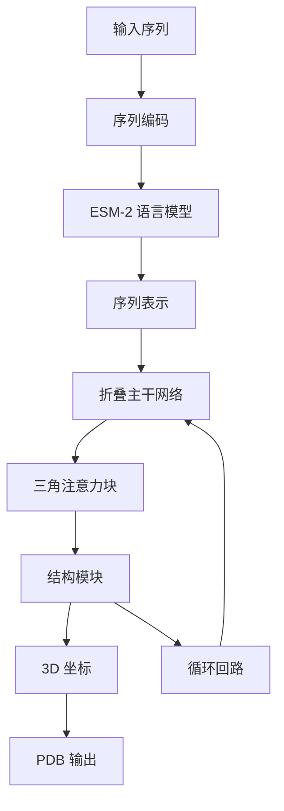

---
slug:10-esmfold-structure-prediction-system
blog_type:normal
---


ESMFold 代表了蛋白质结构预测领域的突破性进展，它利用蛋白质语言模型的力量，直接从单个蛋白质序列实现快速、准确的原子级结构预测。与传统需要多重序列比对（MSA）的方法不同，ESMFold 仅使用单一蛋白质序列作为输入，在保持竞争性准确性的同时，速度显著提升。

## 架构概述

ESMFold 将预训练的 ESM-2 蛋白质语言模型与专门的折叠主干网络相结合，将序列表示转换为 3D 坐标。系统通过一个复杂的流水线运行，集成了语言模型嵌入与几何推理模块。



核心架构由三个主要组件协同工作：

1. **ESM-2 语言模型**：从原始氨基酸序列中提取有意义的表示
2. **折叠主干网络**：通过三角注意力机制处理表示
3. **结构模块**：将处理后的特征转换为原子坐标

## 核心组件

### ESMFold 主模型

主 `ESMFold` 类协调整个预测流水线 [esmfold.py](esm/esmfold/v1/esmfold.py#L50-L365)。它集成了语言模型与折叠主干网络，并处理迭代优化预测的循环机制。

关键特性包括：
- **多种 ESM-2 变体**：支持从 8M 到 15B 参数的模型 [esmfold.py](esm/esmfold/v1/esmfold.py#L37-L50)
- **可配置循环**：默认 4 次迭代的优化 [esmfold.py](esm/esmfold/v1/esmfold.py#L158-L159)
- **分块推理**：针对长序列的内存高效处理 [esmfold.py](esm/esmfold/v1/esmfold.py#L354-L359)

### 折叠主干网络架构

`FoldingTrunk` 构成核心几何推理引擎 [trunk.py](esm/esmfold/v1/trunk.py#L110-L244)。它通过以下方式处理序列和成对表示：

- **48 个三角自注意力块**：捕获残基对之间的长程依赖关系 [trunk.py](esm/esmfold/v1/trunk.py#L126-L134)
- **位置嵌入**：编码相对残基位置 [trunk.py](esm/esmfold/v1/trunk.py#L75-L93)
- **循环机制**：使用先前的输出迭代优化预测 [trunk.py](esm/esmfold/v1/trunk.py#L137-L142)

主干网络处理两种并行表示：
- **序列特征**（1024 维）：每个残基的嵌入
- **成对特征**（128 维）：残基间关系嵌入

### 三角自注意力

`TriangularSelfAttentionBlock` 实现核心注意力机制 [tri_self_attn_block.py](esm/esmfold/v1/tri_self_attn_block.py#L25-L161)。这种专门的注意力模式：
- 同时处理序列和成对表示
- 使用三角乘法更新确保几何一致性
- 支持分块计算以提高内存效率

## 模型变体和配置

ESMFold 提供多种针对不同用例优化的模型变体：

| 模型变体 | ESM-2 参数 | 折叠块数 | 用例 |
|---------------|------------------|----------------|----------|
| esmfold_v0 | 3B | 48 | 研究基准（论文版本） |
| esmfold_v1 | 3B | 48 | 包含最新改进的生产模型 |
| structure_module_only_* | 8M-15B | 0 | 语言模型能力分析 |

<CgxTip>
"structure_module_only" 变体设计用于消融研究，以了解仅语言模型（不含折叠主干网络）的贡献。这些模型仅使用结构模块将 ESM-2 表示直接映射到坐标。
</CgxTip>

## 推理流水线

### 序列处理

ESMFold 接受单序列和多聚体复合物：

```python
# 单序列预测
model.infer("MKTAYIAKQRQISFVKSHFSRQLEERLGLIEVQAVDHERGLVDRFYKVELAPTHKGGFGLRGDGFNICKDG")

# 多聚体预测（链用':'分隔）
model.infer("MKTAYIAKQRQISF:VKSHFSRQLEERL")
```

系统自动处理：
- **序列编码**和分词 [misc.py](esm/esmfold/v1/misc.py#L18-L23)
- **链分离**与可配置连接子 [misc.py](esm/esmfold/v1/misc.py#L61-L67)
- **残基索引**以建立正确的几何关系

### 内存优化

ESMFold 提供多种内存优化策略：

1. **分块注意力**：将内存从 O(L²) 降低到 O(L) [trunk.py](esm/esmfold/v1/trunk.py#L150-L155)
2. **CPU 卸载**：利用 CPU 内存存储模型参数 [scripts/fold.py](scripts/fold.py#L25-L41)
3. **批量处理**：组合序列以提高 GPU 利用率 [scripts/fold.py](scripts/fold.py#L43-L54)

## 命令行界面

`scripts/fold.py` 提供了用于批量处理的全面 CLI：

```bash
python scripts/fold.py \
  -i input.fasta \
  -o output_directory/ \
  --num-recycles 4 \
  --chunk-size 128 \
  --max-tokens-per-batch 1024
```

关键选项：
- `--chunk-size`：控制内存使用（推荐值：128、64 或 32）
- `--cpu-offload`：为大型模型启用 CPU 内存卸载
- `--max-tokens-per-batch`：平衡速度与内存使用

## 输出和质量指标

ESMFold 提供全面的输出，包括：

- **3D 坐标**（PDB 格式）[misc.py](esm/esmfold/v1/misc.py#L93-L118)
- **pLDDT 分数**：每个残基的置信度指标
- **pTM 分数**：全局结构质量评估
- **距离图**：预测的距离分布

<CgxTip>
pLDDT（预测局部距离差异测试）分数范围从 0 到 100，高于 70 的值表示置信预测。这些分数特别适用于识别预测结构中的可靠区域。
</CgxTip>

## 性能特征

ESMFold 在保持准确性的同时实现了显著的速度优势：

- 比 AlphaFold2 **快 60 倍**（单序列）
- **无需 MSA** 消除了预处理时间
- **GPU 优化**并可选 CPU 卸载
- **可扩展**从 8M 到 15B 参数模型

系统的高效性源于其端到端可微分架构，以及 ESM-2 在数百万蛋白质序列上预训练期间学到的强大表示。

## 集成和使用

ESMFold 与更广泛的 ESM 生态系统无缝集成。在理解核心架构后，你可能想要探索：

- [ESM-2 架构和设计](9-esm-2-architecture-and-design) 以深入了解语言模型
- [内存高效的分块推理](20-memory-efficient-chunked-inference) 以了解优化技术
- [批量处理和嵌入](21-batch-processing-and-embeddings) 用于大规模应用

模块化设计允许轻松集成到现有的蛋白质分析流水线中，使其适用于研究和生产环境。