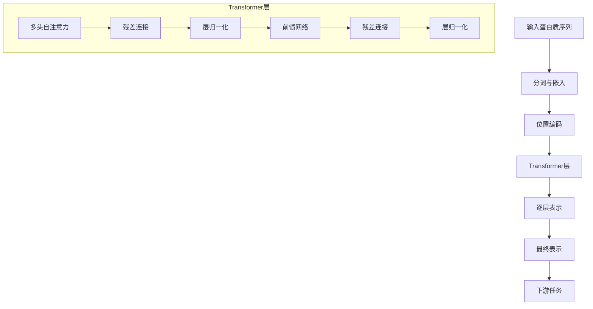

---
slug:11-language-model-representations
blog_type:normal
---


ESM（Evolutionary Scale Modeling）框架采用复杂的语言模型表示来捕捉蛋白质序列中的复杂模式和关系。这些表示构成了各种下游任务的基础，包括结构预测、变异效应预测和蛋白质设计。

## 表示架构概述

ESM模型基于transformer架构，通过多层自注意力机制和前馈网络处理蛋白质序列。核心表示管道遵循分层结构：



## 分词与词汇表

表示过程从使用`Alphabet`类[esm/data.py#L91-L130]进行分词开始，该类定义了词汇表和编码方案：

- **标准词元**：20种标准氨基酸残基
- **特殊词元**：`<pad>`、`<eos>`、`<unk>`、`<cls>`、`<mask>`、`<sep>`
- **词元映射**：每个词元映射到唯一索引用于嵌入查找

词汇表通过组合前置词元、标准词元、空词元（用于对齐）和后置词元构建[esm/data.py#L108-L112]。

## 嵌入层

嵌入层将离散词元索引转换为连续向量表示：

```python
self.embed_tokens = nn.Embedding(
    self.alphabet_size,
    self.embed_dim,
    padding_idx=self.padding_idx,
)
```

嵌入维度因模型大小而异（例如，ESM-2 650M参数模型为1280）[esm/model/esm2.py#L43-L47]。嵌入按`embed_scale`（通常为1.0）缩放，并通过词元dropout进行正则化[esm/model/esm2.py#L84-L92]。

## 位置编码

ESM-2通过`RotaryEmbedding`类[esm/rotary_embedding.py#L23-L70]引入旋转位置编码，提供：

- **相对位置感知**：旋转编码相对位置信息
- **高效性**：无需额外参数进行位置编码
- **兼容性**：与多头注意力机制无缝集成

旋转编码应用于注意力机制中的查询和键张量[esm/multihead_attention.py#L354-L355]。

## Transformer层表示

每个transformer层通过两个主要组件处理表示：

### 多头自注意力
`MultiheadAttention`模块[esm/multihead_attention.py#L68-L508]实现：
- **查询-键-值投影**：注意力计算的线性变换
- **缩放点积注意力**：带头维度缩放的注意力机制
- **多头处理**：不同表示子空间的并行注意力头
- **旋转嵌入**：位置感知的注意力计算

### 前馈网络
`FeedForwardNetwork`模块[esm/modules.py#L395-L415]提供：
- **两层MLP**：将嵌入维度扩展4倍后投影回原维度
- **GELU激活**：ReLU的平滑近似以改善梯度流
- **Dropout正则化**：防止训练期间过拟合

## 逐层表示提取

ESM模型支持通过`repr_layers`参数[esm/model/esm2.py#L77-L144]从任何层提取表示：

```python
def forward(self, tokens, repr_layers=[], need_head_weights=False, return_contacts=False):
    # ... 处理过程 ...
    repr_layers = set(repr_layers)
    hidden_representations = {}
    if 0 in repr_layers:
        hidden_representations[0] = x  # 嵌入层
    
    for layer_idx, layer in enumerate(self.layers):
        x, attn = layer(x, ...)
        if (layer_idx + 1) in repr_layers:
            hidden_representations[layer_idx + 1] = x.transpose(0, 1)
```

这使得可以精细控制为不同下游任务提取哪些表示。

## 表示属性

### 维度结构
- **批次维度**：同时处理的序列数量
- **序列维度**：可变长度（最大为模型上限）
- **特征维度**：嵌入大小（大型ESM-2模型为1280）

### 归一化
ESM-2使用`ESM1bLayerNorm`提高稳定性[esm/model/esm2.py#L69]，在最终transformer层之后和语言建模头之前应用层归一化。

### 注意力权重
当`need_head_weights=True`时，模型返回每个头的注意力权重[esm/model/esm2.py#L102-L121]，支持：
- **可解释性**：理解哪些序列位置相互影响
- **接触预测**：使用注意力模式进行结构预测
- **可视化**：分析模型注意力模式

## 下游应用

学习到的表示作为各种任务的输入特征：

- **结构预测**：ESMFold使用表示生成3D结构
- **变异效应预测**：突变影响的零样本预测
- **蛋白质设计**：生成新蛋白质序列的生成建模
- **功能预测**：蛋白质功能的分类和回归任务

## 模型加载与使用

预训练模型可通过`pretrained`模块加载[esm/pretrained.py#L24-L28]：

```python
model, alphabet = esm.pretrained.esm2_t33_650M_UR50D()
batch_converter = alphabet.get_batch_converter()
```

加载的模型通过前向传递提供对所有中间表示的访问，为不同研究和应用场景提供灵活的使用模式。

## 后续步骤

要深入了解架构，请探索：
- [ESM-2架构与设计](9-esm-2-architecture-and-design) 获取详细的架构分析
- [蛋白质的Transformer架构](12-transformer-architecture-for-proteins) 了解蛋白质特定适配
- [零样本变异预测](16-zero-shot-variant-prediction) 查看表示应用