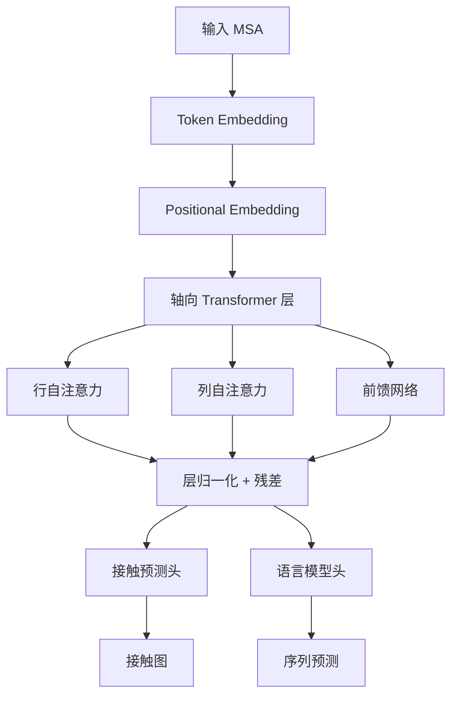

---
slug:13-msa-transformer-for-multiple-sequence-alignment
blog_type:normal
---


MSA Transformer 代表一种专门设计的架构，通过利用轴向注意力机制来处理多重序列比对（MSAs）。与处理一维序列的标准 Transformer 不同，MSA Transformer 在二维生物数据上运行，其中一个维度代表序列位置，另一个维度代表比对中的同源序列。

## 架构概述

MSA Transformer 扩展了标准 Transformer 架构，配备了专门化的注意力机制，可高效处理 MSAs 的二维结构。核心创新在于**轴向注意力**，它将完整的二维注意力分解为独立的行向和列向操作，将计算复杂度从 O(N²R²) 显著降低至 O(NR² + NR²)，其中 N 是序列长度，R 是序列数量。



## 核心组件

### MSATransformer 类

主模型类 [esm/model/msa_transformer.py](esm/model/msa_transformer.py#L21) 实现了完整的 MSA Transformer 架构，包含以下关键参数：

| 参数 | 默认值 | 描述 |
|-----------|---------|-------------|
| `num_layers` | 12 | Transformer 层数 |
| `embed_dim` | 768 | 嵌入维度 |
| `attention_heads` | 12 | 注意力头数 |
| `ffn_embed_dim` | 3072 | 前馈网络维度 |
| `max_tokens_per_msa` | 2¹⁴ | 批量推理的最大 token 数 |

<CgxTip>当梯度禁用时，模型会自动批量处理注意力计算，允许在测试时处理比 GPU 内存容量更大的 MSAs。此行为可通过 `max_tokens_per_msa_` 方法控制。</CgxTip>

### 轴向注意力机制

轴向注意力系统由两个专门组件组成：

**RowSelfAttention** [esm/axial_attention.py](esm/axial_attention.py#L11)：计算 MSA 中序列的自注意力，使模型能够捕获每个位置上同源序列之间的进化关系。

**ColumnSelfAttention** [esm/axial_attention.py](esm/axial_attention.py#L133)：计算每个序列位置的自注意力，使模型能够学习位置依赖性和结构约束。

这些组件被集成到 **AxialTransformerLayer** [esm/modules.py](esm/modules.py#L145) 中，该层协调注意力流：

```python
# 前向传播结构
x, row_attn = self.row_self_attention(x, ...)
x, column_attn = self.column_self_attention(x, ...)
x = self.feed_forward_layer(x)
```

### 嵌入层

模型采用多种嵌入策略：
- **Token 嵌入**：标准氨基酸 token 表示
- **位置嵌入**：[LearnedPositionalEmbedding](esm/modules.py#L224) 用于序列位置信息
- **MSA 位置嵌入**：当启用 `embed_positions_msa` 时，用于 MSA 深度的可选嵌入

## 关键特性

### 接触预测

MSA Transformer 包含专门的 **ContactPredictionHead** [esm/modules.py](esm/modules.py#L317)，可从注意力模式预测残基-残基接触。该头应用：

1. **对称化**：使注意力矩阵对称
2. **平均积校正（APC）**：减少背景噪声
3. **逻辑回归**：最终接触概率预测

### 内存高效推理

模型为大型 MSAs 实现了复杂的批处理策略。`max_tokens_per_msa_` 方法 [esm/model/msa_transformer.py](esm/model/msa_transformer.py#L229) 允许在推理期间动态调整批大小：

```python
# 启用内存高效处理
model.max_tokens_per_msa_(2**16)  # 增加批大小
```

## 可用模型

ESM 提供两个预训练的 MSA Transformer 模型：

| 模型 | 参数量 | 训练数据 | 状态 |
|-------|------------|---------------|--------|
| `esm_msa1_t12_100M_UR50S` | 100M | UniRef50 Sparse | 已弃用 |
| `esm_msa1b_t12_100M_UR50S` | 100M | UniRef50 Sparse | 推荐使用 |

<CgxTip>使用 `esm_msa1b_t12_100M_UR50S()`，因为它修复了原始模型中存在的位置嵌入错误。</CgxTip>

## 使用示例

### 基本模型加载

```python
import esm

# 加载推荐的 MSA Transformer 模型
model, alphabet = esm.pretrained.esm_msa1b_t12_100M_UR50S()
model.eval()

# MSA 数据的批量转换器
batch_converter = alphabet.get_batch_converter()
```

### 接触预测

```python
# 准备 MSA 数据（batch_size, num_sequences, seq_length）
msa_data = [("protein1", msa_sequences)]

# 转换为张量
batch_labels, batch_strs, batch_tokens = batch_converter(msa_data)

# 预测接触
with torch.no_grad():
    contacts = model.predict_contacts(batch_tokens)
```

### 特征提取

```python
# 从特定层提取表示
with torch.no_grad():
    results = model(
        batch_tokens,
        repr_layers=[6, 12],  # 从第 6 和 12 层提取
        need_head_weights=True
    )
    
    representations = results["representations"]
    attentions = results["attentions"]
```

## 与 ESM 生态系统的集成

MSA Transformer 与其他 ESM 组件无缝集成：

- **字母系统**：所有 ESM 模型保持一致的 tokenization
- **预训练权重**：通过 [esm/pretrained.py](esm/pretrained.py#L273) 集中加载模型
- **接触预测**：与其他 ESM 模型共享基础设施
- **批处理**：与 ESM 的数据加载工具兼容

## 应用

MSA Transformer 在需要进化信息的场景中表现出色：

1. **蛋白质结构预测**：从 MSAs 生成接触图
2. **变异效应预测**：利用进化约束
3. **蛋白质设计**：理解序列-结构关系
4. **功能注释**：从进化模式推断蛋白质功能

有关接触预测工作流程，请参阅 [自注意力接触预测](18-contact-prediction-from-self-attention) 文档。要探索变异预测应用，请参考 [零样本变异预测](16-zero-shot-variant-prediction)。

## 性能考虑

MSA Transformer 的计算复杂度随序列长度和 MSA 深度缩放。为获得最佳性能：

- 对大型 MSAs 使用内置批处理
- 考虑序列长度限制（通常 < 1024 个残基）
- 通过 `max_tokens_per_msa` 参数监控 GPU 内存使用情况
- 利用模型同时处理多个序列的能力

轴向注意力设计使 MSA Transformer 对于具有中等序列长度的深层 MSAs 特别高效，代表了相比完整二维注意力方法的重大进步。