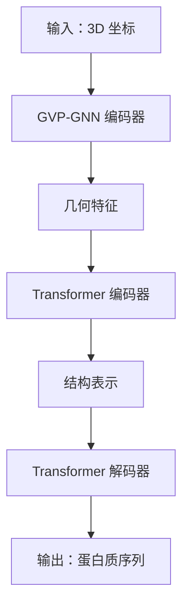

---
slug:14-esm-1v-and-esm-if1-models
blog_type:normal
---


ESM-1v 和 ESM-IF1 模型是进化尺度建模（ESM）系列中的专业变体，专为不同的蛋白质分析任务而设计：ESM-1v 通过集成方法进行变异预测，ESM-IF1 则从蛋白质结构进行逆折叠。这些模型通过任务特定的修改和训练策略扩展了核心 ESM 架构。

## ESM-1v：变异预测集成模型

ESM-1v 是一个优化的蛋白质语言模型，专门用于零样本变异效应预测。与单模型方法不同，ESM-1v 采用集成策略来提高对多样化蛋白质序列预测的鲁棒性和准确性。

### 架构与配置

ESM-1v 集成由五个独立训练的模型组成，每个模型具有相同的架构规范：

- **模型架构**：33 层 transformer，包含 650M 参数
- **训练数据**：UniRef90 数据集
- **嵌入维度**：1280
- **注意力头数**：20
- **FFN 嵌入维度**：5120

集成中的每个模型都在相同的数据集上训练，但使用不同的随机初始化，从而为蛋白质序列模式提供多样化的视角 [esm/pretrained.py#L285-L336]。集成方法减少了预测中的方差，提高了变异效应评估的可靠性。

### 模型加载与使用

加载 ESM-1v 模型遵循标准的 ESM 模式，使用特定的集成模型名称：

```python
import esm

# 加载单独的集成成员
model1, alphabet = esm.pretrained.esm1v_t33_650M_UR90S_1()
model2, alphabet = esm.pretrained.esm1v_t33_650M_UR90S_2()
# ... 继续加载所有 5 个模型
```

可以通过对所有五个模型的预测进行平均来集体使用集成，这是变异效应预测任务的推荐方法。

### 关键架构特性

ESM-1v 基于 ProteinBertModel 架构构建 [esm/model/esm1.py#L22]，针对 ESM-1v 变体进行了特定的初始化：

- **位置嵌入**：正弦位置嵌入，用于序列位置感知
- **嵌入缩放**：嵌入维度的平方根缩放（embed_scale = √embed_dim）
- **层归一化**：后嵌入层归一化，确保训练稳定

## ESM-IF1：逆折叠模型

ESM-IF1 代表了蛋白质建模的根本性不同方法，专注于逆折叠问题：从蛋白质骨架结构预测蛋白质序列。该模型将几何神经网络与 transformer 架构相结合，以弥合结构表示和序列表示之间的差距。

### 混合架构设计

ESM-IF1 采用复杂的混合架构，通过几何向量感知器（GVP）层处理几何信息，然后应用序列到序列 transformer [esm/inverse_folding/gvp_transformer.py#L24-L30]：



### 模型规格

ESM-IF1 架构包含 142M 参数，各组件细分如下 [esm/pretrained.py#L339-L347]：

- **GVP-GNN 层数**：4 个几何处理层
- **Transformer 编码器**：8 层，用于结构到序列映射
- **Transformer 解码器**：8 层，用于序列生成
- **训练数据**：CATH 结构 + 来自 UniRef50 的 12M AlphaFold2 预测结果

### 几何处理管道

GVP 编码器处理 3D 坐标信息以提取旋转不变特征 [esm/inverse_folding/gvp_encoder.py#L18]：

```python
def forward(self, coords, coord_mask, padding_mask, confidence):
    # 通过 GVP 层处理 3D 坐标
    # 生成几何表示
    # 处理缺失坐标的部分掩码
```

这种几何预处理使模型能够处理部分掩码的结构，使其在现实世界应用中具有鲁棒性，因为在这些应用中完整的结构数据可能不可用。

### 训练与性能

ESM-IF1 在逆折叠任务中取得了令人印象深刻的性能指标：
- **天然序列恢复率**：在结构保留骨架上达到 51%
- **埋藏残基恢复率**：结构约束残基达到 72%
- **跨度掩码**：经过训练可容忍缺失的骨架坐标

该模型在 1200 万个 AlphaFold2 预测结构上的训练为蛋白质序列-结构关系提供了广泛的覆盖 [examples/inverse_folding/README.md#L5-L9]。

## 模型比较与用例

| 特性 | ESM-1v | ESM-IF1 |
|---------|--------|---------|
| **主要任务** | 变异效应预测 | 逆折叠（从结构预测序列） |
| **输入类型** | 蛋白质序列 | 3D 骨架坐标 |
| **架构** | Transformer 集成 | GVP-GNN + Transformer seq2seq |
| **参数量** | 650M × 5 个模型 | 142M |
| **训练数据** | UniRef90 | CATH + 12M AlphaFold2 结构 |
| **关键创新** | 集成鲁棒性 | 几何-序列集成 |

## 实际实现

### ESM-1v 变异预测工作流程

1. 加载所有五个集成模型
2. 处理野生型和突变序列
3. 为每个序列生成嵌入
4. 计算集成的似然差异
5. 聚合预测以获得最终变异效应分数

### ESM-IF1 逆折叠工作流程

1. 准备 3D 坐标数据（PDB/mmCIF 格式）
2. 通过 GVP 编码器处理以获取几何特征
3. 使用 transformer 解码器生成序列预测
4. 采样多个序列以实现多样性
5. 基于似然对预测进行评分和排序

<CgxTip>对于 ESM-1v，始终使用完整的五个模型集成以获得最佳的变异预测性能。单个模型可能显示方差，但集成平均可提供更可靠的结果。</CgxTip>

<CgxTip>ESM-IF1 的跨度掩码能力使其能够处理部分不完整的结构。这对于具有缺失区域或低分辨率数据的实验结构特别有价值。</CgxTip>

## 与 ESM 生态系统的集成

两个模型都与更广泛的 ESM 框架无缝集成，共享蛋白质字母表和基本 transformer 模块等通用组件。然而，它们代表了特定领域的专业扩展：

- **ESM-1v** 扩展了基于序列的建模方法用于变异分析
- **ESM-IF1** 弥合了结构建模和序列建模范式之间的差距

这些模型补充了其他 ESM 变体，如用于通用蛋白质表示的 ESM-2 和用于结构预测的 ESMFold，为蛋白质分析和设计提供了全面的工具包。

要深入探索架构基础，请参阅 [ESM-2 架构与设计](9-esm-2-architecture-and-design)。有关蛋白质设计的实际应用，请继续阅读 [逆折叠与蛋白质设计](15-inverse-folding-and-protein-design)。