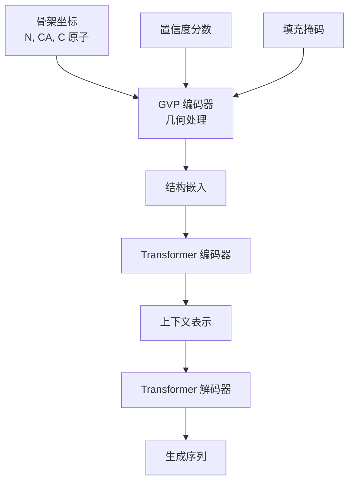

---
slug:15-inverse-folding-and-protein-design
blog_type:normal
---


ESM-IF1 逆向折叠模型在蛋白质序列设计领域取得了突破性进展，能够根据蛋白质骨架原子坐标预测蛋白质序列。该系统采用了一种融合几何向量感知器（GVP）与序列到序列 Transformer 的复杂架构，在蛋白质设计任务中实现了最先进的性能。

## 架构概览

ESM-IF1 模型采用两阶段架构设计：首先通过几何 GVP-GNN 层进行初始结构处理，然后采用序列到序列 Transformer 编码器-解码器架构 [gvp_transformer.py#L24-L30]。这种混合方法使模型能够有效捕捉蛋白质结构的 3D 几何约束和氨基酸序列的序列模式。



### 核心组件

**GVP-Transformer 模型**：主模型类 [gvp_transformer.py#L24] 协调整个逆向折叠过程。它为编码器和解码器初始化独立的嵌入标记，构建几何编码器，并构造 Transformer 解码器 [gvp_transformer.py#L32-L43]。

**GVP 编码器**：几何处理层 [gvp_encoder.py#L18] 处理 3D 坐标到学习表示的初始转换。该组件对于捕捉蛋白质结构中固有的空间关系和几何约束至关重要。

**Transformer 解码器**：序列生成组件 [transformer_decoder.py#L24] 实现了标准的 Transformer 解码器架构，采用掩码自注意力和编码器-解码器注意力机制进行自回归序列生成。

## 几何向量感知器 (GVP)

ESM-IF1 的几何处理能力源于几何向量感知器模块，该模块可同时处理标量和向量信息 [gvp_modules.py#L113]。这些专门的神经网络组件专为处理 3D 几何数据而设计：

- **GVP 层**：核心几何处理单元，转换输入的（标量，向量）表示元组 [gvp_modules.py#L125-L154]
- **GVP 卷积**：几何图神经网络的消息传递层 [gvp_modules.py#L267-L317]
- **组合操作**：专为几何数据设计的专用 dropout、层归一化和激活函数 [gvp_modules.py#L191-L254]

<CgxTip>
GVP 架构将蛋白质坐标作为标量和向量特征的元组进行处理，使模型能够保持旋转等变性——这是理解 3D 结构的关键特性。
</CgxTip>

## 模型加载与初始化

ESM-IF1 可以使用特定模型配置的预训练函数加载：

```python
import esm.inverse_folding
model, alphabet = esm.pretrained.esm_if1_gvp4_t16_142M_UR50()
model = model.eval()  # 关键：设置为评估模式以禁用 dropout
```

模型参数包括：
- **GVP 层**：4 个几何处理层
- **Transformer 层**：16 个注意力层
- **参数**：1.42 亿个可训练参数
- **训练数据**：1200 万个 AlphaFold2 预测结构

## 输入处理与数据格式

### 坐标表示

模型期望骨架原子坐标采用特定格式 [util.py#L62-L70]：
- **形状**：L × 3 × 3 数组，其中 L 是序列长度
- **原子**：每个残基的 N、CA、C 坐标
- **索引**：`coords[i][0]` = N 原子，`coords[i][1]` = CA 原子，`coords[i][2]` = C 原子

### 结构加载

对于单链结构 [util.py#L27-L35]：
```python
structure = esm.inverse_folding.util.load_structure(fpath, chain_id)
coords, seq = esm.inverse_folding.util.extract_coords_from_structure(structure)
```

对于多链复合物 [examples/inverse_folding/README.md]：
```python
structure = esm.inverse_folding.util.load_structure(fpath, chain_ids)
coords, native_seqs = esm.inverse_folding.multichain_util.extract_coords_from_complex(structure)
```

## 序列设计与采样

### 单链设计

核心采样方法基于多项式采样生成序列，不使用束搜索 [gvp_transformer.py#L88-L90]：

```python
sampled_seq = model.sample(coords, temperature=T)
```

**温度控制**：
- **高温度**（T > 1）：更多样化序列，较低恢复率
- **低温度**（T < 1）：较少多样化，较高天然恢复率
- **最优恢复率**：T = 1e-6 [examples/inverse_folding/README.md]

### 多链设计

对于复合物，ESM-IF1 可以在以整个复合物结构为条件的特定链上设计序列：

```python
sampled_seq = esm.inverse_folding.multichain_util.sample_sequence_in_complex(
    model, coords, target_chain_id, temperature=T
)
```

<CgxTip>
多链设计模式通过利用链间结构上下文通常能降低困惑度并提高序列恢复率，但对某些蛋白质而言，单链模式可能表现更佳。
</CgxTip>

## 序列评分与评估

### 对数似然评分

模型为序列-结构对提供条件对数似然评分 [util.py#L125-L134]：

```python
ll_fullseq, ll_withcoord = esm.inverse_folding.util.score_sequence(
    model, alphabet, coords, seq
)
```

**输出解释**：
- **ll_fullseq**：整个序列的平均对数似然
- **ll_withcoord**：具有可用坐标的残基的平均对数似然

### 性能指标

ESM-IF1 在保留结构基准测试中取得了令人瞩目的性能：
- **天然序列恢复率**：总体 51%
- **埋藏残基恢复率**：72%
- **训练数据集**：1200 万个 AlphaFold2 结构

## 批处理与实用工具

### CoordBatchConverter

专用批处理器处理坐标数据 [util.py#L220-L269]：

```python
converter = CoordBatchConverter()
batch_coords, batch_tokens, batch_labels = converter.from_lists(
    coords_list, confidence_list, seq_list, device=device
)
```

### 特征处理

模型包含以下实用工具：
- **RBF 编码**：距离的径向基函数编码 [util.py#L191-L194]
- **坐标变换**：旋转和归一化操作 [util.py#L146-L214]
- **缺失数据处理**：NaN 替换和掩码 [util.py#L183-L186]

## 实际应用

### 命令行界面

**序列采样** [sample_sequences.py]：
```bash
python sample_sequences.py data/5YH2.pdb \
    --chain C --temperature 1 --num-samples 3 \
    --outpath output/sampled_sequences.fasta
```

**多链模式**：
```bash
python sample_sequences.py data/5YH2.pdb \
    --chain C --temperature 1 --num-samples 3 \
    --outpath output/sampled_sequences_multichain.fasta \
    --multichain-backbone
```

**序列评分** [score_log_likelihoods.py]：
```bash
python score_log_likelihoods.py data/5YH2.pdb \
    data/5YH2_mutated_seqs.fasta --chain C \
    --outpath output/5YH2_mutated_seqs_scores.csv
```

### 质量控制

序列设计的推荐实践：
1. **过滤重复序列**：移除具有长氨基酸重复的序列（例如 "EEEEEEEE"）
2. **比较模式**：尝试单链和多链设计模式
3. **温度调整**：根据期望的多样性与恢复率权衡调整温度
4. **验证**：使用对数似然评估对设计序列进行评分

## 与其他 ESM 模型的集成

ESM-IF1 补充了 ESM 生态系统中的其他模型：
- **ESMFold**：从序列预测结构（逆向问题）
- **ESM-2**：用于下游任务的序列嵌入
- **MSA Transformer**：多序列比对处理

逆向折叠能力为蛋白质工程、药物设计和理解序列-结构关系开辟了新的应用。

有关高级使用模式以及与其他 ESM 组件的集成，请参考 [ESMFold 结构预测系统](10-esmfold-structure-prediction-system) 和 [语言模型表示](11-language-model-representations) 文档。