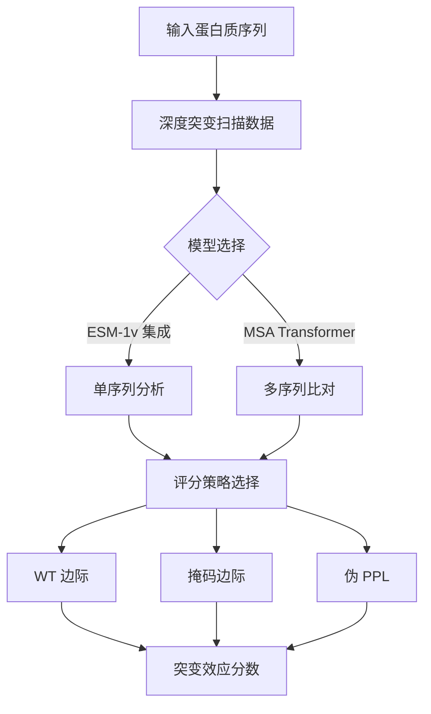

---
slug:16-zero-shot-variant-prediction
blog_type:normal
---


零样本变异预测能够在无需任务特定训练的情况下评估蛋白质突变效应，利用蛋白质语言模型中学习到的表示。这一能力代表了计算生物学领域的根本性进步，使研究人员能够直接从序列信息预测遗传变异的功能影响。

## 核心架构和模型

ESM 为零样本变异预测提供了专用模型，主要是 ESM-1v 集成模型和 MSA Transformer。ESM-1v 模型专门为此任务设计，包含五个独立训练的 33 层 transformer 模型，每个模型具有 650M 参数，在 UniRef90 上训练 [esm1v_t33_650M_UR90S_1() through esm1v_t33_650M_UR90S_5()](esm/pretrained.py#L294-L335)。这种集成方法通过模型多样性增强了预测的鲁棒性。



底层架构基于 ProteinBertModel [esm/model/esm1.py#L22]，通过 transformer 层处理序列以生成上下文表示。这些表示捕获了在大量蛋白质序列数据集上预训练期间隐式学习到的进化和结构信息。

## 评分策略

ESM 实现了三种不同的变异效应预测评分策略，每种策略利用模型学习表示的不同方面：

### 野生型边际策略
野生型边际方法通过比较每个位置上突变氨基酸与野生型氨基酸的对数概率来计算突变分数 [examples/variant-prediction/predict.py#L107-L116]。该策略计算效率高，因为只需要一次模型前向传播：

```python
score = token_probs[0, 1 + idx, mt_encoded] - token_probs[0, 1 + idx, wt_encoded]
```

### 掩码边际策略
掩码边际策略系统地掩码每个位置并计算可能氨基酸的概率分布 [examples/variant-prediction/predict.py#L171-L184]。这种方法以增加计算为代价提供更准确的预测，每个序列位置需要一次前向传播。对于 MSA Transformer 模型，这是唯一支持的策略 [examples/variant-prediction/predict.py#L158-L160]。

### 伪困惑度策略
伪困惑度方法通过计算突变序列在模型下的对数似然来评估突变 [examples/variant-prediction/predict.py#L118-L146]。这种方法对于评估多个突变特别有用，但计算密集，因为需要单独掩码每个位置。

## 实现流程

变异预测流程遵循结构化工作流程：

1. **数据准备**：从 CSV 格式加载深度突变扫描数据，包含指定格式的突变注释（例如，位置 123 上的丙氨酸替换为 B 表示为 "A123B"）[examples/variant-prediction/predict.py#L148]

2. **模型加载**：使用标准化接口加载预训练模型 [esm/pretrained.py#L24-L31]，在可用时自动启用 GPU 加速 [examples/variant-prediction/predict.py#L154-L158]

3. **序列编码**：使用模型的字母表将蛋白质序列转换为标记表示 [examples/variant-prediction/predict.py#L162-L166]

4. **评分计算**：使用选定的评分策略计算数据集中所有变异的突变效应

5. **集成聚合**：对于 ESM-1v 模型，计算所有五个集成成员的预测并可以聚合以提高鲁棒性

<CgxTip>
offset-idx 参数对于正确映射参考序列和突变数据之间的突变位置至关重要。这考虑了序列编号方案的差异，特别是在处理已加工或截断序列时。
</CgxTip>

## 性能和验证

零样本变异预测能力已在 41 个深度突变扫描数据集上得到广泛验证，显示出与实验测量的强相关性。性能指标按多个聚合级别组织 [examples/variant-prediction/README.md#L38-L45]：

- **原始预测**：每个蛋白质的个体突变分数
- **每蛋白质性能**：每个数据集的 Spearman 相关系数
- **聚合指标**：验证集和测试集上的性能摘要

这种全面评估展示了该方法在多样化蛋白质家族和功能分析中的泛化能力。

## 使用示例

### ESM-1v 集成预测
```bash
python predict.py \
    --model-location esm1v_t33_650M_UR90S_1 esm1v_t33_650M_UR90S_2 esm1v_t33_650M_UR90S_3 esm1v_t33_650M_UR90S_4 esm1v_t33_650M_UR90S_5 \
    --sequence HPETLVKVKDAEDQLGARVGYIELDLNSGKILESFRPEERFPMMSTFKVLLCGAVLSRVDAGQEQLGRRIHYSQNDLVEYSPVTEKHLTDGMTVRELCSAAITMSDNTAANLLLTTIGGPKELTAFLHNMGDHVTRLDRWEPELNEAIPNDERDTTMPAAMATTLRKLLTGELLTLASRQQLIDWMEADKVAGPLLRSALPAGWFIADKSGAGERGSRGIIAALGPDGKPSRIVVIYTTGSQATMDERNRQIAEIGASLIKHW \
    --dms-input ./data/BLAT_ECOLX_Ranganathan2015.csv \
    --mutation-col mutant \
    --dms-output ./data/BLAT_ECOLX_Ranganathan2015_labeled.csv \
    --offset-idx 24 \
    --scoring-strategy wt-marginals
```

### MSA Transformer 预测
```bash
python predict.py \
    --model-location esm_msa1b_t12_100M_UR50S \
    --sequence HPETLVKVKDAEDQLGARVGYIELDLNSGKILESFRPEERFPMMSTFKVLLCGAVLSRVDAGQEQLGRRIHYSQNDLVEYSPVTEKHLTDGMTVRELCSAAITMSDNTAANLLLTTIGGPKELTAFLHNMGDHVTRLDRWEPELNEAIPNDERDTTMPAAMATTLRKLLTGELLTLASRQQLIDWMEADKVAGPLLRSALPAGWFIADKSGAGERGSRGIIAALGPDGKPSRIVVIYTTGSQATMDERNRQIAEIGASLIKHW \
    --dms-input ./data/BLAT_ECOLX_Ranganathan2015.csv \
    --mutation-col mutant \
    --dms-output ./data/BLAT_ECOLX_Ranganathan2015_labeled.csv \
    --offset-idx 24 \
    --scoring-strategy masked-marginals \
    --msa-path ./data/BLAT_ECOLX_1_b0.5.a3m
```

<CgxTip>
对于 MSA Transformer 预测，确保你的 MSA 文件是 a3m 格式并包含足够的序列多样性。msa-samples 参数控制从 MSA 中使用的序列数量，平衡计算成本与预测准确性。
</CgxTip>

## 与其他 ESM 功能的集成

零样本变异预测补充了其他 ESM 功能，为蛋白质分析提供了全面的工具包。变异预测可以与 [ESMFold 结构预测系统](10-esmfold-structure-prediction-system) 结合以评估突变的结构影响，或与 [逆折叠和蛋白质设计](15-inverse-folding-and-protein-design) 结合用于理性蛋白质工程应用。

用于变异预测的底层表示与驱动其他 ESM 应用的嵌入相同，展示了学习到的蛋白质语言模型表示在多样化生物任务中的多功能性。

## 下一步

对于实际实现，从 [快速入门](2-quick-start) 指南开始设置你的环境，然后探索 [模型加载和预训练权重](5-model-loading-and-pre-trained-weights) 部分以获取详细的模型访问说明。对于结合变异预测与结构分析的高级应用，请继续阅读 [ESMFold 结构预测系统](10-esmfold-structure-prediction-system)。