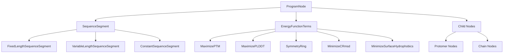
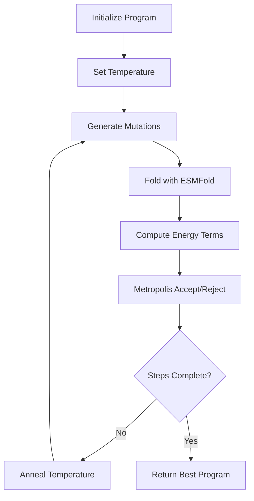

---
slug:17-protein-programming-language
blog_type:normal
---


蛋白质编程语言是一种用于生成式蛋白质设计的高级声明式语言，使研究人员能够通过组合程序指定蛋白质设计目标。这种创新方法在论文《一种用于生成式蛋白质设计的高级编程语言》中进行了描述，它抽象化了蛋白质优化的复杂性，同时提供了对设计目标的细粒度控制。

## 核心架构

该语言围绕分层程序结构构建，其中**ProgramNode**对象构成基本构建块。每个节点可以包含序列片段、能量函数项和子节点，从而支持复杂设计场景的递归组合[examples/protein-programming-language/language/program.py#L18-L50](examples/protein-programming-language/language/program.py#L18-L50)。



## 序列管理

该语言提供三种类型的序列片段工厂，处理不同的突变策略：

- **FixedLengthSequenceSegment**：保持恒定长度同时允许氨基酸替换[examples/protein-programming-language/language/sequence.py#L96-L124](examples/protein-programming-language/language/sequence.py#L96-L124)
- **VariableLengthSequenceSegment**：支持插入、删除和替换，具有可配置的操作概率[examples/protein-programming-language/language/sequence.py#L146-L209](examples/protein-programming-language/language/sequence.py#L146-L209)
- **ConstantSequenceSegment**：用于固定区域的不可变序列[examples/protein-programming-language/language/sequence.py#L81-L93](examples/protein-programming-language/language/sequence.py#L81-L93)

<CgxTip>序列片段使用复杂的突变系统，其中每个氨基酸位置维护自己的突变候选，在尊重半胱氨酸限制等生化约束的同时，实现序列空间的高效探索。</CgxTip>

## 能量函数框架

能量项作为抽象的**EnergyTerm**类实现，从折叠结果计算标量优化目标[examples/protein-programming-language/language/energy.py#L16-L22](examples/protein-programming-language/language/energy.py#L16-L22)。该框架包括：

| Energy Term | Purpose | Target Value |
|-------------|---------|--------------|
| MaximizePTM | 折叠质量的预测TM-score | 1.0 |
| MaximizePLDDT | 每残基置信度 | 1.0 |
| MinimizeCRmsd | 与模板的结构相似性 | 0.0 |
| MinimizeDRmsd | 与模板的距离矩阵RMSD | 0.0 |
| SymmetryRing | 强制循环对称性 | 0.0 |
| MinimizeSurfaceHydrophobics | 减少暴露的疏水残基 | 0.0 |

每个能量项计算一个损失值，优化算法将其最小化，较低的值表示更好地满足设计目标。

## 优化引擎

该语言采用**Metropolis-Hastings模拟退火**进行序列优化，在`run_simulated_annealing`函数中实现[examples/protein-programming-language/language/optimize.py#L93-L120](examples/protein-programming-language/language/optimize.py#L93-L120)。优化过程遵循以下流程：



优化状态跟踪当前、候选和最佳能量以及详细的能量项分解，实现收敛行为的细粒度分析。

## 设计程序示例

该仓库包含七个代表性设计程序，展示了该语言的多功能性：

### 自由幻觉
使用基本质量指标从头生成新颖的蛋白质序列[examples/protein-programming-language/programs/free_hallucination.py#L15-L25](examples/protein-programming-language/programs/free_hallucination.py#L15-L25)：
```python
def free_hallucination(sequence_length: int) -> ProgramNode:
    sequence = FixedLengthSequenceSegment(sequence_length)
    return ProgramNode(
        sequence_segment=sequence,
        energy_function_terms=[
            MaximizePTM(),
            MaximizePLDDT(),
            MinimizeSurfaceHydrophobics(),
        ],
    )
```

### 固定骨架设计
使用结构约束优化预定义骨架结构的序列[examples/protein-programming-language/programs/fixed_backbone.py#L15-L40](examples/protein-programming-language/programs/fixed_backbone.py#L15-L40)。该程序将质量指标与RMSD最小化相结合，以保持结构保真度。

### 对称单体设计
通过在具有对称约束的父节点下组合多个相同的原体节点来创建循环对称蛋白质[examples/protein-programming-language/programs/symmetric_monomer.py#L15-L37](examples/protein-programming-language/programs/symmetric_monomer.py#L15-L37)。

<CgxTip>分层程序结构支持复杂的设计模式，如对称多聚体，其中子节点共享序列片段但保持独立的残基索引，使优化器能够高效探索对称解决方案。</CgxTip>

## 高级功能

该语言支持几种高级能力：

- **多链建模**：程序可以通过`children_are_different_chains`标志指定不同的链
- **加权能量项**：每个能量项可以分配自定义权重，以优先考虑不同的设计目标
- **残基索引**：跨复杂多组件程序自动管理残基索引范围
- **模板集成**：与PDB结构直接集成，用于固定骨架和支架设计

## 入门指南

开始使用蛋白质编程语言：

1. 完成[教程笔记本](examples/protein-programming-language/tutorial.ipynb)，涵盖基本程序编写和优化
2. 查看`programs/`目录中的示例程序，了解不同的设计模式
3. 使用`run_simulated_annealing`函数配合自定义程序和适当的温度计划

该语言为蛋白质设计提供了强大的抽象层，能够快速原型化复杂设计场景，同时保持灵活性以融入领域特定约束和目标。

要深入了解底层模型架构，请参阅[ESMFold结构预测系统](10-esmfold-structure-prediction-system)，有关实际实现细节，请参考[逆折叠与蛋白质设计](15-inverse-folding-and-protein-design)。