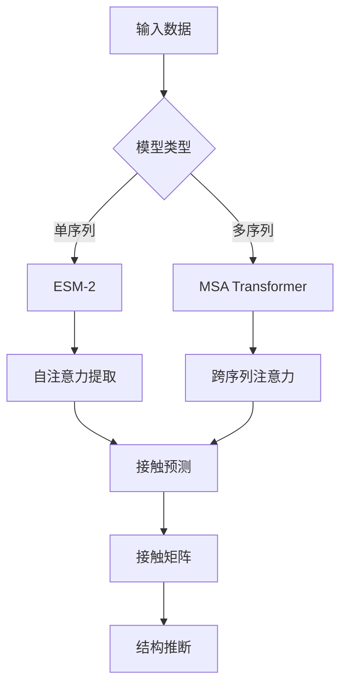

---
slug:18-contact-prediction-from-self-attention
blog_type:normal
---


通过自注意力进行接触预测是ESM模型的一项基本能力，能够仅从序列预测蛋白质的3D结构。该方法利用transformer模型中学习到的注意力模式来推断残基-残基接触，无需多重序列比对。

## 架构概述

ESM模型通过两种互补的方法预测接触：

### 单序列接触预测 (ESM-2)

ESM-2直接使用自注意力权重从单个蛋白质序列预测接触。模型通过其transformer层处理序列，并提取与结构接触相关的注意力模式。

### 基于MSA的接触预测 (MSA Transformer)

MSA Transformer同时处理多重序列比对，利用进化信息提高接触预测准确性。该方法捕获同源序列间的共进化信号。



## 实现细节

### 接触预测流程

接触预测过程涉及几个关键步骤：

1. **序列处理**：将蛋白质序列转换为token表示
2. **模型推理**：通过transformer层处理以提取注意力权重
3. **接触评分**：将注意力模式转换为接触概率
4. **评估**：将预测与真实结构进行比较

核心接触预测功能在ESM模型的`predict_contacts`方法中实现 [esm/model/esm2.py#L146](esm/model/esm2.py#L146)：

```python
def predict_contacts(self, tokens):
    # 从所有层提取注意力权重
    # 转换为接触预测
    # 返回接触概率矩阵
```

### 接触定义

接触基于碳-beta原子距离定义，阈值为8.0埃。对于甘氨酸残基，使用几何约束从N、CA和C原子推断碳-beta位置 [examples/contact_prediction.ipynb#L350](examples/contact_prediction.ipynb#L350)：

```python
def contacts_from_pdb(structure, distance_threshold=8.0, chain=None):
    # 提取原子坐标
    # 计算C-beta位置（甘氨酸进行推断）
    # 计算成对距离
    # 生成二进制接触矩阵
```

### 评估指标

接触预测性能在不同距离范围内进行评估：

| 范围 | 定义 | 序列间隔 |
|-------|------------|-------------------|
| 局部 | 3-6残基 | 短程相互作用 |
| 短程 | 6-12残基 | 二级结构元件 |
| 中程 | 12-24残基 | 结构域级相互作用 |
| 长程 | >24残基 | 长程接触 |

指标包括不同top-L/2、top-L/5和top-L/10水平的精确度，以及AUC分数 [examples/contact_prediction.ipynb#L450](examples/contact_prediction.ipynb#L450)。

## 性能比较

基于三个测试蛋白（1a3a、5ahw、1xcr）的基准测试结果：

### ESM-2单序列性能
- **长程P@L**：40-86%（取决于蛋白质）
- **中程P@L**：26-34%
- **短程P@L**：20-29%

### MSA Transformer性能
- **长程P@L**：72-89%（显著提升）
- **中程P@L**：31-33%
- **短程P@L**：24-31%

MSA Transformer始终优于单序列预测，特别是对于长程接触，证明了进化信息的价值。

<CgxTip>
MSA Transformer的优越性能来自于同时处理多个同源序列，捕获单序列模型无法访问的共进化约束。</CgxTip>

## 可视化与分析

接触预测可视化为热图，显示预测的接触概率与真实接触的对比：

- **蓝点**：正确预测的接触（真阳性）
- **红点**：错误预测（假阳性）  
- **灰点**：遗漏的接触（假阴性）

可视化清楚地显示了模型仅从序列信息中捕获长程结构模式的能力 [examples/contact_prediction.ipynb#L650](examples/contact_prediction.ipynb#L650)。

## 使用示例

### 单序列接触预测

```python
import esm

# 加载模型
model, alphabet = esm.pretrained.esm2_t33_650M_UR50D()
model = model.eval().cuda()
batch_converter = alphabet.get_batch_converter()

# 准备序列
sequence_data = [("protein1", "MKTAYIAKQRQISFVKSHFSRQLEERLGLIEVQAVDHERGLVDRFYKVELAPTHKGGFGLRGDGFNICKDG")]
batch_labels, batch_strs, batch_tokens = batch_converter(sequence_data)
batch_tokens = batch_tokens.to(device)

# 预测接触
contact_predictions = model.predict_contacts(batch_tokens)[0].cpu()
```

### 基于MSA的接触预测

```python
# 加载MSA transformer
msa_model, msa_alphabet = esm.pretrained.esm_msa1b_t12_100M_UR50S()
msa_model = msa_model.eval().cuda()
msa_converter = msa_alphabet.get_batch_converter()

# 准备MSA数据
msa_data = read_msa("protein_alignment.a3m")
msa_data = greedy_select(msa_data, num_seqs=128)  # 如需要则子采样

# 预测接触
batch_labels, batch_strs, batch_tokens = msa_converter([msa_data])
batch_tokens = batch_tokens.to(device)
contact_predictions = msa_model.predict_contacts(batch_tokens)[0].cpu()
```

<CgxTip>
为了获得最佳MSA Transformer性能，请使用具有良好覆盖率的多样化序列比对。`greedy_select`函数可以在对大型MSA进行子采样时最大化序列多样性。</CgxTip>

## 与结构预测的集成

ESM模型的接触预测可作为下游结构预测方法的约束：

1. **距离几何**：将接触转换为距离约束
2. **折叠识别**：使用接触识别结构模板
3. **从头建模**：用接触约束指导片段组装

接触预测能力代表了基于序列的理解与结构建模之间的桥梁，支持蛋白质设计、功能预测和变异效应分析等应用。

## 后续步骤

为全面了解ESM的结构能力：

- [ESMFold结构预测系统](10-esmfold-structure-prediction-system) - 端到端结构预测
- [蛋白质Transformer架构](12-transformer-architecture-for-proteins) - 深入探讨模型架构
- [MSA Transformer用于多重序列比对](13-msa-transformer-for-multiple-sequence-alignment) - MSA处理细节

接触预测功能展示了transformer模型如何直接从序列数据中学习结构原理，为计算生物学和蛋白质工程开辟了新的可能性。