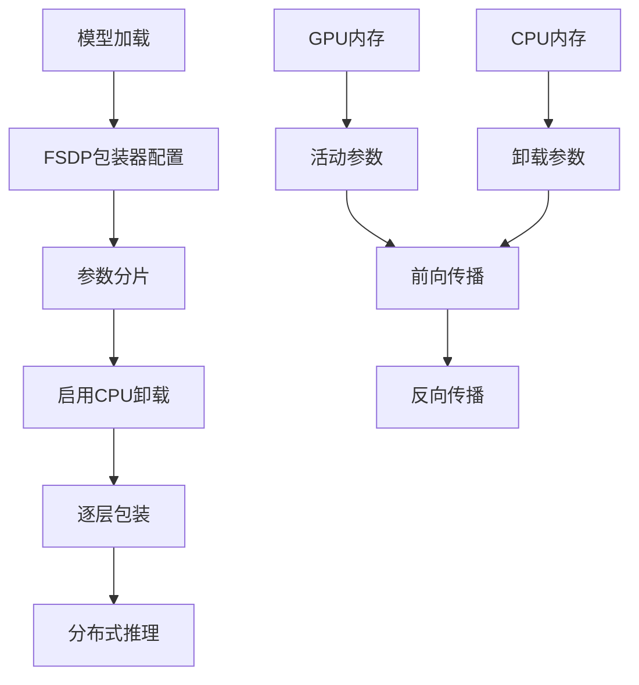

---
slug:19-cpu-offloading-with-fsdp
blog_type:normal
---


借助完全分片数据并行（FSDP）实现的CPU卸载是一项先进的内存优化技术，它通过策略性地将参数和梯度卸载到CPU内存，从而能够在有限的GPU资源上运行大型ESM模型。这种方法对于处理最大的ESM-2模型（如150亿参数变体）特别有价值，否则这些模型会超出GPU内存容量。

## 理解FSDP架构

FSDP实现了一种复杂的内存管理策略，将模型参数、梯度和优化器状态分布在GPU和CPU内存中。关键创新在于**完全分片**方法，即每个GPU工作器在任何给定时间仅存储总模型参数的一部分，从而大幅降低每GPU内存需求。



该实现利用Meta的FairScale库提供此功能，ESM提供了为蛋白质语言模型应用这些优化的简化接口。

## 实现细节

ESM模型的核心FSDP配置涉及几个控制内存管理行为的关键参数：

| 参数 | 用途 | 推荐设置 |
|-----------|---------|-------------------|
| `mixed_precision` | 启用FP16训练/推理 | True |
| `flatten_parameters` | 优化参数存储 | True |
| `state_dict_device` | 控制模型状态存储位置 | torch.device("cpu") |
| `cpu_offload` | 启用参数卸载到CPU | True |

初始化过程从分布式设置和模型数据下载开始，然后应用FSDP包装器[esm2_infer_fairscale_fsdp_cpu_offloading.py](examples/esm2_infer_fairscale_fsdp_cpu_offloading.py#L8-L24)：

```python
# 初始化分布式环境
torch.distributed.init_process_group(backend="nccl", init_method=url, world_size=1, rank=0)

# 配置FSDP参数
fsdp_params = dict(
    mixed_precision=True,
    flatten_parameters=True,
    state_dict_device=torch.device("cpu"),
    cpu_offload=True,
)
```

## 逐层优化策略

ESM FSDP实现的一个关键方面是**逐层包装策略**。不是将整个模型作为单个单元包装，而是每个transformer层都单独用FSDP包装[esm2_infer_fairscale_fsdp_cpu_offloading.py](examples/esm2_infer_fairscale_fsdp_cpu_offloading.py#L29-L35)：

```python
# 分别用FSDP包装每一层
for name, child in model.named_children():
    if name == "layers":
        for layer_name, layer in child.named_children():
            wrapped_layer = wrap(layer)
            setattr(child, layer_name, wrapped_layer)
model = wrap(model)
```

这种细粒度方法提供了几个优势：
- **精细内存控制**：每层可以独立卸载
- **改进并行性**：不同层可以同时处理
- **减少通信开销**：在CPU和GPU之间传输更小的参数块

## 模型兼容性和用例

带CPU卸载的FSDP专为内存受限的最大ESM模型设计。主要目标是**ESM-2 150亿参数模型**[esm/pretrained.py](esm/pretrained.py#L390-L397)，它包含48个transformer层，需要大量内存资源：

```python
def esm2_t48_15B_UR50D():
    """48层ESM-2模型，包含150亿参数，在UniRef50上训练。
    如果加载此模型时出现OOM，请参阅README了解如何使用FSDP和ZeRO CPU卸载
    """
```

<CgxTip>
逐层FSDP包装对于获得最佳性能至关重要。与ESM实现中使用的细粒度方法相比，简单包装整个模型会导致内存利用效率低下和推理速度变慢。
</CgxTip>

## 性能考虑

虽然CPU卸载大幅减少GPU内存需求，但它引入了CPU-GPU数据传输的额外计算开销。性能影响取决于几个因素：

- **PCIe带宽**：决定CPU和GPU内存之间的传输速度
- **模型架构**：更深的模型从细粒度卸载中受益更多
- **批次大小**：更大的批次可以摊销传输成本
- **序列长度**：更长的序列需要更频繁的参数交换

混合精度设置通过减少传输期间的内存带宽需求来帮助缓解一些性能成本。

## 与ESM工作流集成

FSDP实现与标准ESM工作流无缝集成。在使用FSDP包装初始化模型后，推理使用与常规模型相同的接口进行[esm2_infer_fairscale_fsdp_cpu_offloading.py](examples/esm2_infer_fairscale_fsdp_cpu_offloading.py#L37-L57)：

```python
# 标准ESM推理流水线
batch_labels, batch_strs, batch_tokens = batch_converter(data)
batch_tokens = batch_tokens.cuda()
with torch.no_grad():
    results = model(batch_tokens, repr_layers=[48], return_contacts=True)
```

这种兼容性确保现有的ESM应用程序可以利用FSDP优化，而无需重大代码修改。

<CgxTip>
为了获得CPU卸载的最佳性能，请确保系统有足够的CPU内存（通常是模型大小的2-3倍）和CPU与GPU之间快速的PCIe连接。
</CgxTip>

## 后续步骤

要探索相关的性能优化技术，可以考虑阅读[内存高效分块推理](20-memory-efficient-chunked-inference)以了解替代内存管理策略，或查看[批处理和嵌入](21-batch-processing-and-embeddings)以了解吞吐量优化技术。如需理解底层模型架构，请参阅[ESM-2架构和设计](9-esm-2-architecture-and-design)。