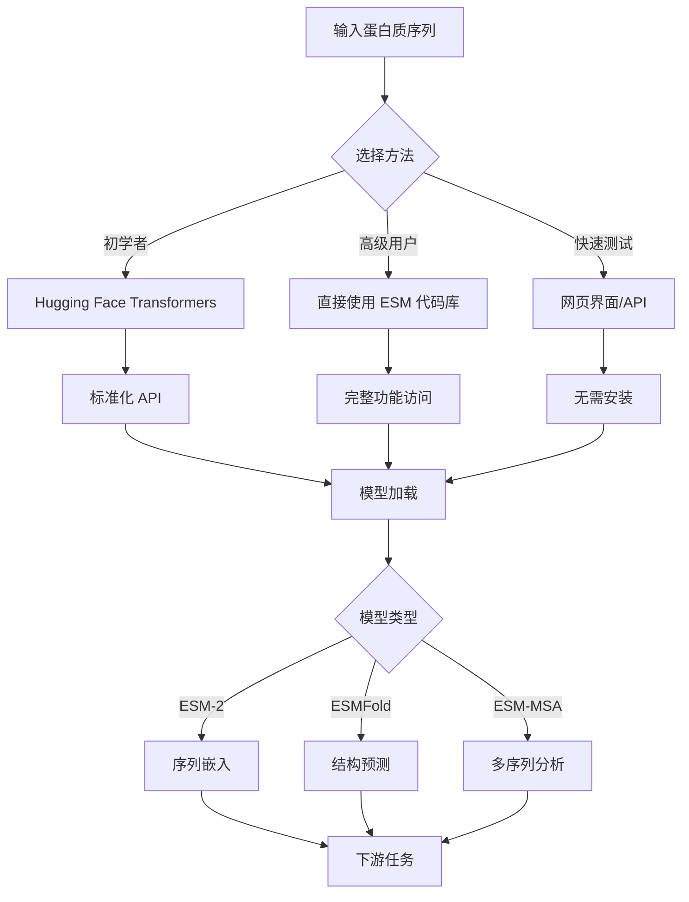

---
slug:2-quick-start
blog_type:normal
---


本快速入门指南提供了多种使用 ESM（Evolutionary Scale Modeling）进行蛋白质序列分析和结构预测的入门方法。无论你偏好简化的 API、直接使用代码库，还是基于网页的工具，ESM 都能为不同的工作流程和专业水平提供灵活的切入点。

## ESM 入门指南

ESM 提供三种主要快速入门方法，每种方法适用于不同的使用场景和技术需求：

### 方法 1：Hugging Face Transformers（推荐初学者使用）

最简单的入门方式是通过 Hugging Face transformers 库，它提供了标准化的 API 和简化的依赖管理：

```python
from transformers import AutoTokenizer, EsmModel

# 加载 ESM 模型和分词器
tokenizer = AutoTokenizer.from_pretrained("facebook/esm2_t33_650M_UR50D")
model = EsmModel.from_pretrained("facebook/esm2_t33_650M_UR50D")

# 处理蛋白质序列
sequences = ["MKTVRQERLKSIVRILERSKEPVSGAQLAEELSVSRQVIVQDIAYLRSLGYNIVATPRGYVLAGG"]
inputs = tokenizer(sequences, return_tensors="pt", padding=True)

# 获取嵌入向量
with torch.no_grad():
    outputs = model(**inputs)
    embeddings = outputs.last_hidden_state
```

### 方法 2：基于网页的访问

无需安装即可快速测试：

- **ColabFold 集成**：通过 [Google Colab](https://colabreseaarch.google.com/github/sokrypton/ColabFold/blob/main/ESMFold.ipynb) 在浏览器中直接运行 ESMFold
- **API 访问**：使用 REST API 进行结构预测：

```bash
curl -X POST --data "KVFGRCELAAAMKRHGLDNYRGYSLGNWVCAAKFESNFNTQATNRNTDGSTDYGILQINSRWWCNDGRTPGSRNLCNIPCSALLSSDITASVNCAKKIVSDGNGMNAWVAWRNRCKGTDVQAWIRGCRL" https://api.esmatlas.com/foldSequence/v1/pdb/
```

- **网页界面**：通过 [ESM Metagenomic Atlas](https://esmatlas.com/resources?action=fold) 访问

### 方法 3：直接安装代码库

获取完整功能和高级特性：

```bash
# 基础安装
pip install fair-esm

# 安装最新特性
pip install git+https://github.com/facebookresearch/esm.git

# 安装 ESMFold（需要 Python <= 3.9 和 CUDA）
pip install "fair-esm[esmfold]"
pip install 'dllogger @ git+https://github.com/NVIDIA/dllogger.git'
pip install 'openfold @ git+https://github.com/aqlaboratory/openfold.git@4b41059694619831a7db195b7e0988fc4ff3a307'
```

<CgxTip>ESMFold 需要特定的环境配置，包括 Python ≤ 3.9、兼容 CUDA 的 PyTorch，以及用于 OpenFold 编译的 `nvcc`。</CgxTip>

## 基本使用示例

### 加载和使用 ESM 模型

```python
import torch
import esm

# 加载 ESM-2 模型
model, alphabet = esm.pretrained.esm2_t33_650M_UR50D()
batch_converter = alphabet.get_batch_converter()
model.eval()  # 禁用 dropout 以获得确定性结果

# 准备数据
data = [
    ("protein1", "MKTVRQERLKSIVRILERSKEPVSGAQLAEELSVSRQVIVQDIAYLRSLGYNIVATPRGYVLAGG"),
    ("protein2", "KALTARQQEVFDLIRDHISQTGMPPTRAEIAQRLGFRSPNAAEEHLKALARKGVIEIVSGASRGIRLLQEE"),
    ("protein2 with mask","KALTARQQEVFDLIRD<mask>ISQTGMPPTRAEIAQRLGFRSPNAAEEHLKALARKGVIEIVSGASRGIRLLQEE"),
]
batch_labels, batch_strs, batch_tokens = batch_converter(data)
batch_lens = (batch_tokens != alphabet.padding_idx).sum(1)

# 提取表示
with torch.no_grad():
    results = model(batch_tokens, repr_layers=[33], return_contacts=True)
token_representations = results["representations"][33]

# 生成序列级表示
sequence_representations = []
for i, tokens_len in enumerate(batch_lens):
    sequence_representations.append(token_representations[i, 1 : tokens_len - 1].mean(0))
```

### PyTorch Hub 集成

ESM 还支持 PyTorch Hub，无需安装即可即时访问：

```python
import torch
model, alphabet = torch.hub.load("facebookresearch/esm:main", "esm2_t33_650M_UR50D")
```

## 可用模型选项

ESM 提供了针对不同任务和计算资源优化的各种模型：

| 模型系列 | 规模 | 参数量 | 最适用场景 |
|---------|------|--------|-----------|
| ESM-2 Small | 8M | 6 层 | 快速原型设计、资源受限环境 |
| ESM-2 Medium | 35M | 12 层 | 平衡性能与速度 |
| ESM-2 Large | 650M | 33 层 | 高质量嵌入向量 |
| ESM-2 XLarge | 3B | 36 层 | 研究级精度 |
| ESMFold | 3B | 48 个折叠块 | 结构预测 |

<CgxTip>开发和测试阶段建议使用较小模型（8M-35M 参数），生产环境再扩展至更大模型。</CgxTip>

## 架构概览



## 后续步骤

完成此快速入门后，可以考虑以下学习路径：

- **[安装与设置](3-installation-and-setup)**：详细的环境配置指南
- **[基础蛋白质序列处理](4-basic-protein-sequence-processing)**：学习数据处理基础知识
- **[模型加载与预训练权重](5-model-loading-and-pretrained-weights)**：了解模型选择和加载方法
- **[概述](1-overview)**：全面了解 ESM 的能力

对于特定应用，可以探索：
- **[ESMFold 结构预测系统](10-esmfold-structure-prediction-system)**：用于蛋白质结构预测
- **[零样本变异预测](16-zero-shot-variant-prediction)**：用于突变分析
- **[逆向折叠与蛋白质设计](15-inverse-folding-and-protein-design)**：用于蛋白质工程

ESM 代码库在 `examples/` 目录中提供了全面的示例，包括用于接触预测、变异预测和逆向折叠任务的 notebook。