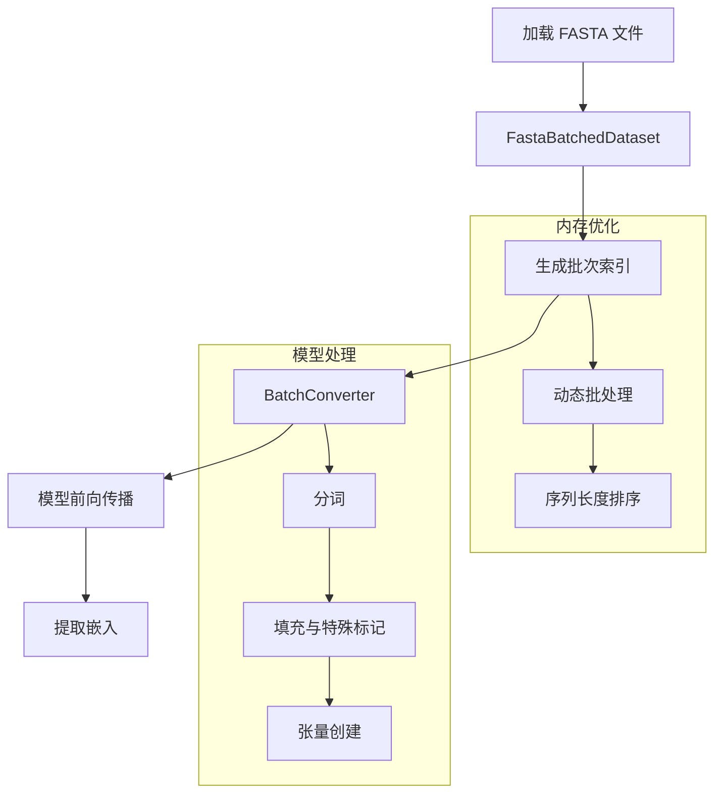

---
slug:21-batch-processing-and-embeddings
blog_type:normal
---


批处理和嵌入是 ESM（进化规模建模）框架中的基本操作，能够高效处理多个蛋白质序列并提取有意义的表示。本文档介绍了批量处理蛋白质序列和生成嵌入的核心组件与工作流程。

## 核心数据处理组件

ESM 提供了一个全面的数据处理流水线，围绕三个主要类构建，它们协同工作以高效处理批量操作。

### FastaBatchedDataset

`FastaBatchedDataset` 类是从 FASTA 文件加载和组织蛋白质序列的基础 [esm/data.py#L19-L90](esm/data.py#L19-L90)。该类自动解析 FASTA 文件，提取序列标签和序列，并提供智能批处理功能。

```python
# 从 FASTA 文件初始化
dataset = FastaBatchedDataset.from_file("proteins.fasta")

# 获取针对内存使用优化的批次索引
batch_indices = dataset.get_batch_indices(toks_per_batch=4096)
```

该类包含一个复杂的 `get_batch_indices` 方法，根据序列长度和可用内存约束优化批次形成，确保高效的 GPU 利用率。

### Alphabet 和分词

`Alphabet` 类管理蛋白质序列的词汇表和分词过程 [esm/data.py#L91-L252](esm/data.py#L91-L252)。它处理氨基酸字符与神经网络使用的数值索引之间的映射。

主要特性包括：
- 支持特殊标记（CLS、EOS、MASK、PAD）
- 可配置的分词策略
- 与批次转换器的集成

### BatchConverter

`BatchConverter` 类是将原始序列数据转换为模型就绪张量的主力 [esm/data.py#L253-L299](esm/data.py#L253-L299)。它处理填充、特殊标记插入和张量创建。

```python
# 从字母表创建批次转换器
batch_converter = alphabet.get_batch_converter(truncation_seq_length=1024)

# 将原始序列转换为张量
labels, sequences, tokens = batch_converter([
    ("protein1", "MKTVRQERLKSIVRILERSKEPVSGAQLAEELSVSRQVIVQDIAYLRSLGYNIVATPRGYVLAGG"),
    ("protein2", "KALTARQQEVFDLIRDHISQTGMPPTRAEIAQRLGFRSPNAAEEHLKALARKGVIEIVSGASRGIRLLQEE")
])
```

转换器通过填充较短序列并根据模型架构要求添加特殊标记来自动处理可变序列长度。

## 批处理工作流程

典型的批处理工作流程遵循以下结构化序列：



## 嵌入生成

ESM 模型在 Transformer 架构的多个层生成丰富的嵌入。嵌入提取过程通过模型的 forward 方法处理，支持可配置的表示层。

### 多层表示

ESM-2 模型提供对所有 Transformer 层表示的访问 [esm/model/esm2.py#L77-L145](esm/model/esm2.py#L77-L145)：

```python
# 从特定层生成嵌入
results = model(
    batch_tokens, 
    repr_layers=[0, 6, 12, 33],  # 从多个层提取
    need_head_weights=False,
    return_contacts=False
)

# 访问嵌入
embeddings = results["representations"]
layer_33_embeddings = embeddings[33]  # 最终层嵌入
```

### 嵌入维度

不同的 ESM 模型变体提供不同的嵌入维度：

| 模型 | 参数量 | 嵌入维度 | 层数 | 使用场景 |
|-------|------------|---------------|--------|----------|
| ESM-2 8M | 8M | 320 | 6 | 快速原型设计 |
| ESM-2 35M | 35M | 480 | 12 | 平衡性能 |
| ESM-2 150M | 150M | 640 | 30 | 高质量嵌入 |
| ESM-2 650M | 650M | 1280 | 33 | 生产级别 |
| ESM-2 3B | 3B | 1280 | 36 | 最高精度 |

## 高效内存处理

对于大规模批处理，ESM 提供了几种优化策略：

### 使用 FSDP 进行 CPU 卸载

该框架支持完全分片数据并行（FSDP）与 CPU 卸载，用于处理像 15B 参数 ESM-2 这样的大规模模型 [examples/esm2_infer_fairscale_fsdp_cpu_offloading.py#L1-L57](examples/esm2_infer_fairscale_fsdp_cpu_offloading.py#L1-L57)：

```python
# 使用 CPU 卸载初始化 FSDP
fsdp_params = dict(
    mixed_precision=True,
    flatten_parameters=True,
    state_dict_device=torch.device("cpu"),
    cpu_offload=True,
)

with enable_wrap(wrapper_cls=FSDP, **fsdp_params):
    model, vocab = esm.pretrained.load_model_and_alphabet_core(
        model_name, model_data, regression_data
    )
```

<CgxTip>
CPU 卸载通过将参数存储在 CPU 上，并在计算期间仅在需要时将它们传输到 GPU，从而能够处理超出 GPU 内存限制的模型。
</CgxTip>

### 动态批处理

`FastaBatchedDataset.get_batch_indices()` 方法实现了智能批处理，在最大化吞吐量的同时优化内存使用：

```python
# 生成内存最优的批次
batch_indices = dataset.get_batch_indices(
    toks_per_batch=8192,  # 每批次的目标标记数
    extra_toks_per_seq=2  # 考虑特殊标记
)
```

这种方法按长度对序列进行排序并分组，以最小化填充开销，同时保持在内存约束范围内。

## 高级批处理模式

### 变异预测批处理

对于变异预测任务，ESM 展示了复杂的批处理策略，能够处理多种评分方法 [examples/variant-prediction/predict.py#L1-L242](examples/variant-prediction/predict.py#L1-L242)：

```python
# 野生型边际评分策略
if args.scoring_strategy == "wt-marginals":
    with torch.no_grad():
        token_probs = torch.log_softmax(model(batch_tokens.cuda())["logits"], dim=-1)
    df[model_location] = df.apply(
        lambda row: label_row(row[args.mutation_col], args.sequence, token_probs, alphabet, args.offset_idx),
        axis=1,
    )
```

### MSA 处理

对于多序列比对（MSA）数据，框架通过 `MSABatchConverter` 提供专门的批处理 [esm/data.py#L300-L338](esm/data.py#L300-L338)：

```python
# 处理 MSA 数据
msa_data = read_msa(msa_path, nseq=400)
batch_converter = MSABatchConverter(alphabet)
batch_labels, batch_strs, batch_tokens = batch_converter(msa_data)
```

## 性能优化策略

### 批大小调整

最优批大小因模型和硬件配置而异：

| 模型 | GPU 内存 | 推荐批大小 |
|-------|------------|------------------------|
| ESM-2 8M | 8GB | 32-64 个序列 |
| ESM-2 150M | 16GB | 8-16 个序列 |
| ESM-2 650M | 24GB | 4-8 个序列 |
| ESM-2 3B | 40GB | 1-2 个序列 |

### 序列长度管理

对于非常长的序列，请考虑以下策略：

1. **截断**：在 `BatchConverter` 中使用 `truncation_seq_length` 参数
2. **分块**：将长序列分割为重叠的块
3. **分层处理**：分别处理段并组合嵌入

<CgxTip>
截断序列时，请考虑生物学背景，并确保为特定应用保留关键区域。
</CgxTip>

## 与下游任务的集成

批处理的嵌入作为各种下游应用的输入：

- **结构预测**：ESMFold 使用嵌入生成 3D 结构
- **功能预测**：分类模型使用嵌入作为特征
- **蛋白质设计**：嵌入指导序列优化算法
- **变异效应预测**：比较序列变体之间的嵌入

ESM 批处理系统的模块化设计能够与这些应用无缝集成，同时保持计算效率。

有关更高级的优化技术，请参阅[使用 FSDP 进行 CPU 卸载](19-cpu-offloading-with-fsdp)和[内存高效分块推理](20-memory-efficient-chunked-inference)。