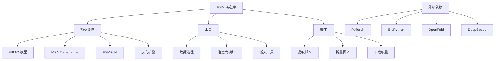

---
slug:3-installation-and-setup
blog_type:normal
---


本指南涵盖 Meta AI Research 的 ESM（Evolutionary Scale Modeling）蛋白质语言模型的完整安装和设置流程。ESM 提供了用于蛋白质序列分析、结构预测和设计的最先进的 transformer 模型。

## 系统要求

ESM 支持多种安装方法，各有不同的系统要求：

| 安装方法 | Python 版本 | CUDA 支持 | 依赖项 | 推荐用途 |
|-------------------|----------------|--------------|--------------|-----------------|
| **pip install** | 3.7+ | 可选 | 最少依赖 | 快速开始，基本使用 |
| **pip with esmfold** | ≤3.9 | 必需 | 完整 ESMFold 堆栈 | 结构预测 |
| **conda environment** | 3.7 | 必需 | 完整堆栈 | 开发，可重现性 |
| **PyTorch Hub** | 任意 | 可选 | 仅 PyTorch | 测试，最小化设置 |

<CgxTip>若要使用 ESMFold 功能，请确保你有兼容 CUDA 的 PyTorch 和 `nvcc` 编译器，因为 OpenFold 需要 CUDA 编译。</CgxTip>

## 安装方法

### 方法 1：快速 pip 安装

安装 ESM 以进行基本蛋白质序列处理的最简单方法：

```bash
# 安装最新版本
pip install fair-esm

# 或从当前主分支安装最新开发版
pip install git+https://github.com/facebookresearch/esm.git
```

此安装提供对 ESM-2、ESM-1v、ESM-MSA 和反向折叠模型的访问，但不包括 ESMFold 依赖项。

### 方法 2：ESMFold 安装

使用 ESMFold 获得完整的结构预测功能：

```bash
# 安装带有 ESMFold 依赖项的 ESM
pip install "fair-esm[esmfold]"

# 安装额外必需的包
pip install 'dllogger @ git+https://github.com/NVIDIA/dllogger.git'
pip install 'openfold @ git+https://github.com/aqlaboratory/openfold.git@4b41059694619831a7db195b7e0988fc4ff3a307'
```

**重要提示**：ESMFold 要求 Python ≤3.9 和兼容 CUDA 的 PyTorch 安装，并需要 `nvcc` 可用。

### 方法 3：Conda 环境

创建包含所有依赖项的完整、可重现环境：

```bash
# 从提供的配置文件创建 conda 环境
conda env create -f environment.yml

# 激活环境
conda activate esmfold
```

Conda 环境包含 ESMFold 所需的所有必要包，包括特定版本的 PyTorch、OpenMM，以及 HHsuite 和 Kalign2 等生物信息学工具。

### 方法 4：PyTorch Hub

无需本地安装即可快速测试：

```python
import torch
model, alphabet = torch.hub.load("facebookresearch/esm:main", "esm2_t33_650M_UR50D")
```

## 架构概述

ESM 采用模块化架构，为不同功能提供独立组件：



## 项目结构

ESM 代码库组织为逻辑模块：

```
esm/
├── __init__.py              # 主包初始化
├── pretrained.py            # 预训练模型加载函数
├── model/                   # 核心模型实现
│   ├── esm1.py             # ESM-1 架构
│   ├── esm2.py             # ESM-2 架构
│   └── msa_transformer.py  # MSA Transformer
├── esmfold/v1/             # ESMFold 结构预测
├── inverse_folding/        # 反向折叠模型
├── modules.py              # 神经网络模块
├── data.py                 # 数据处理工具
└── scripts/                # 命令行工具
```

## 下载预训练权重

ESM 提供多种不同大小和功能的预训练模型。使用下载脚本获取模型权重：

```bash
# 下载所有可用模型到当前目录
bash scripts/download_weights.sh

# 下载到指定目录
bash scripts/download_weights.sh /path/to/weights/
```

该脚本需要 `aria2c` 进行高效的多线程下载，并会自动恢复中断的下载。

### 可用模型

| 模型 | 参数量 | 训练数据 | 主要用途 |
|-------|------------|---------------|-------------|
| ESM-2 (650M) | 650M | UniRef50 | 通用蛋白质分析 |
| ESM-2 (3B) | 3B | UniRef50 | 高性能任务 |
| ESM-2 (15B) | 15B | UniRef50 | 最先进性能 |
| ESMFold | 3B | PDB + UniRef50 | 结构预测 |
| MSA Transformer | 1B | UniRef50 + MSA | 多序列分析 |
| ESM-1v | 650M | UniRef90 | 变异效应预测 |
| ESM-IF1 | 142M | CATH + UniRef50 | 反向折叠 |

## 验证和测试

安装后，使用此基本测试验证设置：

```python
import torch
import esm

# 测试基本模型加载
try:
    model, alphabet = esm.pretrained.esm2_t33_650M_UR50D()
    batch_converter = alphabet.get_batch_converter()
    model.eval()
    print("✓ ESM-2 模型加载成功")
except Exception as e:
    print(f"✗ 加载 ESM-2 时出错: {e}")

# 如果已安装，测试 ESMFold
try:
    import esm.esmfold.v1
    print("✓ ESMFold 模块可用")
except ImportError:
    print("! ESMFold 未安装（可选）")

# 测试基本功能
data = [("protein1", "MKTVRQERLKSIVRILERSKEPVSGAQLAEELSVSRQVIVQDIAYLRSLGYNIVATPRGYVLAGG")]
batch_labels, batch_strs, batch_tokens = batch_converter(data)
print(f"✓ 数据处理正常：输入形状 {batch_tokens.shape}")
```

## 常见问题和解决方案

### CUDA 兼容性

如果 ESMFold 安装失败：
1. 验证 CUDA 安装：`nvcc --version`
2. 检查 PyTorch CUDA 兼容性：`torch.cuda.is_available()`
3. 确保 CUDA 工具包和 PyTorch 版本匹配

### 内存要求

大型模型（3B+ 参数）需要大量 GPU 内存：
- ESM-2 (3B)：至少约 12GB GPU 内存
- ESM-2 (15B)：推荐约 60GB GPU 内存
- 对大型模型使用 CPU 卸载：参见 [使用 FSDP 进行 CPU 卸载](19-cpu-offloading-with-fsdp)

### 依赖冲突

如果遇到依赖冲突：
1. 使用提供的 conda 环境进行干净设置
2. 在虚拟环境中安装：`python -m venv esm_env`
3. 检查 [environment.yml](environment.yml) 中的特定包版本

## 后续步骤

成功安装后，请继续：

- [基本蛋白质序列处理](4-basic-protein-sequence-processing) 学习基本 ESM 用法
- [模型加载和预训练权重](5-model-loading-and-pretrained-weights) 了解详细模型选项
- [ESMFold 结构预测系统](10-esmfold-structure-prediction-system) 进行结构预测工作流

## 其他资源

- **示例**：浏览 [examples/](examples/) 目录中的 Jupyter 笔记本和脚本
- **文档**：代码库中提供完整的 API 文档
- **社区**：在 GitHub 代码库加入讨论并报告问题
- **ESM Atlas**：访问 [esmatlas.com](https://esmatlas.com) 获取预计算的蛋白质结构

<CgxTip>对于生产部署，考虑使用带有 conda 环境的 Docker 容器化方法，以确保在不同计算环境中的可重现性。</CgxTip>