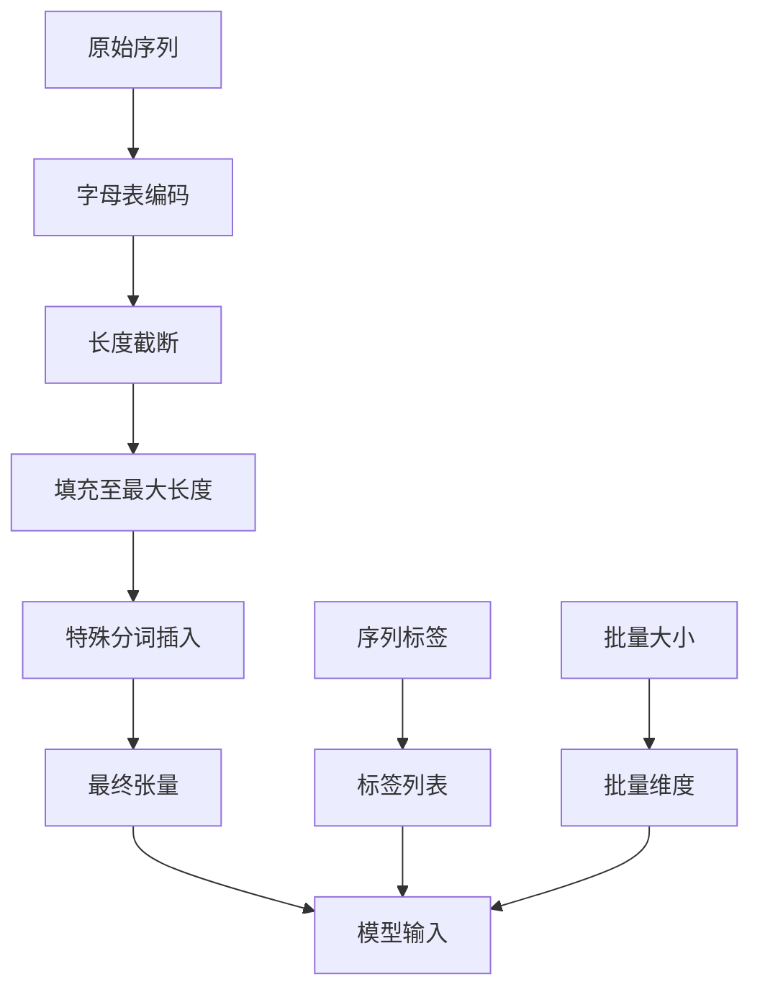
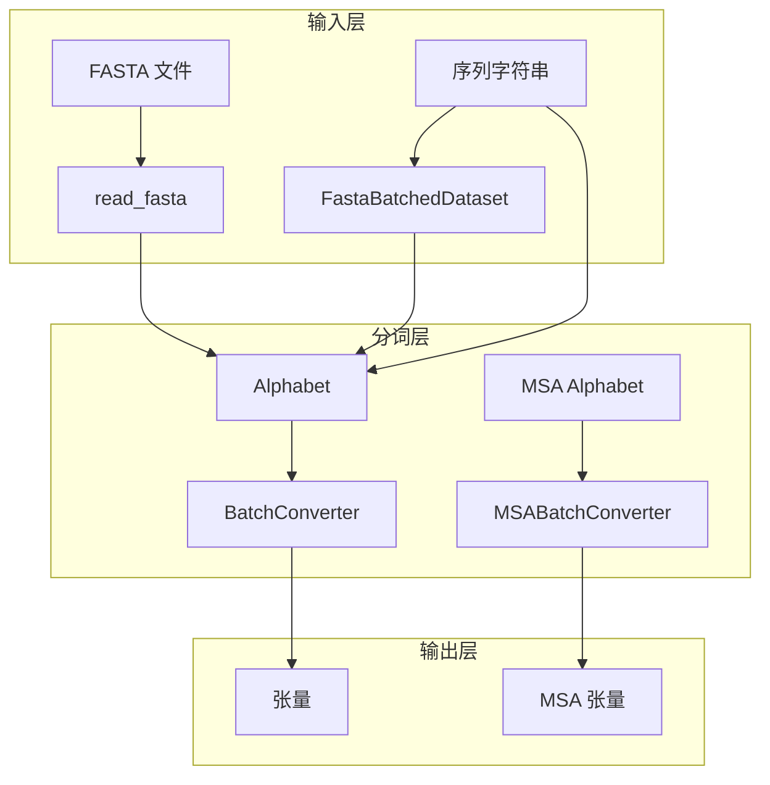

---
slug:4-basic-protein-sequence-processing
blog_type:normal
---


欢迎使用 ESM（Evolutionary Scale Modeling）库处理蛋白质序列的基础指南。本页面涵盖了构成所有 ESM 模型基础的核心数据处理能力，从序列读取到张量转换。

## 理解 ESM 中的蛋白质序列数据

ESM 使用复杂的分词系统处理蛋白质序列，将氨基酸序列转换为适合神经网络模型的数值表示。核心数据处理管道包括读取蛋白质序列、应用适当的分词以及将它们转换为批量张量。

该库定义了一个全面的**蛋白质字母表**，包含 26 个标准氨基酸分词以及用于填充、掩码和序列边界的特殊分词 [esm/constants.py#L7-L11]：

```python
proteinseq_toks = {
    'toks': ['L', 'A', 'G', 'V', 'S', 'E', 'R', 'T', 'I', 'D', 'P', 'K', 'Q', 'N', 'F', 'Y', 'M', 'H', 'W', 'C', 'X', 'B', 'U', 'Z', 'O', '.', '-']
}
```

## 核心数据处理组件

### FASTA 文件处理

ESM 提供了强大的工具来读取 FASTA 文件，这是蛋白质序列数据的标准格式。`read_fasta()` 函数 [esm/data.py#L339-L351] 提供灵活的解析选项：

```python
def read_fasta(path, keep_gaps=True, keep_insertions=True, to_upper=False):
    # 生成 (描述, 序列) 元组的生成器
```

**关键参数：**
- `keep_gaps`：在处理多序列比对时保留比对间隙（破折号）
- `keep_insertions`：保留 MSA 文件中常见的小写插入字符
- `to_upper`：将序列转换为大写以进行标准化

对于批量处理多个序列，ESM 提供了 `FastaBatchedDataset` 类 [esm/data.py#L19-L90]，它可以高效地从 FASTA 文件加载和管理大型蛋白质序列集合。

### 字母表和分词系统

`Alphabet` 类 [esm/data.py#L91-L180] 作为中央分词枢纽，管理氨基酸字符和数值索引之间的映射。每种模型架构都有特定的字母表配置：

| 模型 | 特殊分词 | BOS/EOS | MSA 支持 |
|-------|----------------|---------|-------------|
| ESM-1 | `<null_0>`, `<pad>`, `<eos>`, `<unk>`, `<cls>`, `<mask>`, `<sep>` | 仅 BOS | 否 |
| ESM-1b | `<cls>`, `<pad>`, `<eos>`, `<unk>`, `<mask>` | BOS + EOS | 否 |
| MSA Transformer | `<cls>`, `<pad>`, `<eos>`, `<unk>`, `<mask>` | 仅 BOS | 是 |

<CgxTip>
字母表通过将未知氨基酸映射到 `<unk>` 分词索引来自动处理它们，确保对各种蛋白质序列的稳健处理。
</CgxTip>

### 批量转换管道

`BatchConverter` 类 [esm/data.py#L253-L299] 通过系统化过程将原始序列数据转换为模型就绪的张量：



转换器处理关键的预处理步骤：
- **序列编码**：将氨基酸字符串转换为分词索引
- **长度管理**：如果指定则应用截断
- **填充**：添加填充分词以确保统一的批量维度
- **特殊分词**：根据模型要求插入序列开始（BOS）和序列结束（EOS）分词

## 实际使用示例

### 基本序列处理

```python
import torch
from esm.data import Alphabet, BatchConverter

# 为 ESM-1b 模型创建字母表
alphabet = Alphabet.from_architecture("ESM-1b")
batch_converter = alphabet.get_batch_converter()

# 准备原始数据（标签、序列对）
raw_batch = [
    ("protein1", "MKTAYIAKQRQISFVKSHFSRQLEERLGLIEVQAVDHERGLVDRFYKVELAPTHKGGFGLRGDGFNICKDG"),
    ("protein2", "MSLLTEALENLTPGELTLVDVETLKRFADKLLALHGKDVTREDVIEVLGNGKGRKKGVIYDLNKNP")
]

# 转换为张量
labels, strs, tokens = batch_converter(raw_batch)
print(f"批量形状: {tokens.shape}")  # [batch_size, sequence_length]
```

### FASTA 文件处理

```python
from esm.data import FastaBatchedDataset, read_fasta

# 从 FASTA 文件加载序列
dataset = FastaBatchedDataset.from_file("examples/data/few_proteins.fasta")

# 访问单个序列
for label, sequence in dataset:
    print(f"标签: {label}")
    print(f"序列: {sequence[:50]}...")  # 显示前 50 个字符
    break

# 使用自动长度管理进行批量处理
batch_indices = dataset.get_batch_indices(toks_per_batch=1024)
for batch_idx in batch_indices:
    batch_data = [dataset[i] for i in batch_idx]
    # 处理批量...
```

## 架构概述

数据处理管道遵循关注点分离的模块化设计：



这种架构能够灵活处理不同的蛋白质数据类型，同时在模型变体之间保持一致的接口。

<CgxTip>
对于多序列比对（MSA）数据，使用 `MSABatchConverter`，它可以处理序列比对格式并维持同源序列的层次结构。
</CgxTip>

## 数据格式规范

### 支持的输入格式

| 格式 | 描述 | 用例 |
|--------|-------------|----------|
| FASTA | 带 `>` 标头的标准蛋白质序列格式 | 单个序列、蛋白质数据库 |
| MSA (A3M) | 带间隙的多序列比对 | 进化分析、MSA Transformer |
| 原始字符串 | 直接序列输入 | 程序化序列生成 |

### 分词索引映射

字母表维持分词和索引之间的双向映射：

- **标准氨基酸**：L, A, G, V, S, E, R, T, I, D, P, K, Q, N, F, Y, M, H, W, C
- **特殊字符**：X（未知）、B、U、Z、O、.（间隙）、-（比对间隙）
- **特殊分词**：`<pad>`、`<cls>`、`<mask>`、`<eos>`、`<unk>`

## 下一步

既然你已经了解了基本的蛋白质序列处理，你就可以探索：

- **[模型加载和预训练权重](5-model-loading-and-pre-trained-weights)**：学习如何加载和使用预训练的 ESM 模型
- **[安装和设置](3-installation-and-setup)**：确保你的环境配置正确
- **[快速开始](2-quick-start)**：通过完整示例获得实践经验

这里涵盖的数据处理基础支持所有高级 ESM 功能，从单序列分析到复杂的蛋白质设计任务。