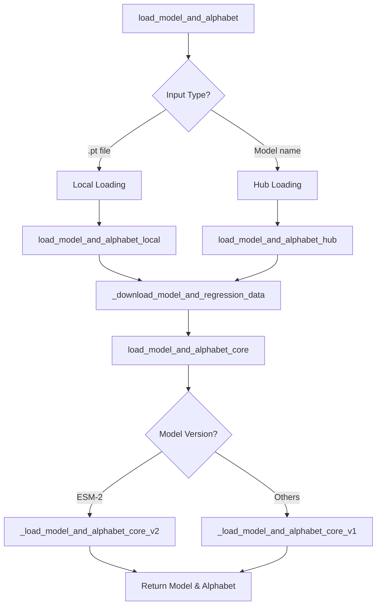

---
slug:5-model-loading-and-pre-trained-weights
blog_type:normal
---


ESM 提供了一个全面的系统，用于加载各种架构和规模的预训练蛋白质语言模型。本指南涵盖了完整的模型加载基础设施、可用的预训练模型，以及处理不同模型变体的最佳实践。

## 模型加载架构

ESM 加载系统采用分层设计，支持基于远程 hub 的加载和本地文件加载。主要入口是 `load_model_and_alphabet()` 函数，该函数根据输入格式自动确定加载策略。



加载系统处理模型权重和用于接触预测任务的可选回归权重。模型从 Facebook 的公共服务器下载，并使用 PyTorch 的 hub 基础设施在本地缓存 [来源](esm/pretrained.py#L52-L59)。

## 可用的预训练模型

ESM 提供了一系列全面的预训练模型，涵盖不同的架构和规模：

### ESM-2 模型（最新一代）

| 模型 | 层数 | 参数量 | 训练数据 | 使用场景 |
|-------|--------|------------|---------------|----------|
| `esm2_t6_8M_UR50D` | 6 | 8M | UniRef50 | 轻量级实验 |
| `esm2_t12_35M_UR50D` | 12 | 35M | UniRef50 | 平衡性能 |
| `esm2_t30_150M_UR50D` | 30 | 150M | UniRef50 | 生产任务 |
| `esm2_t33_650M_UR50D` | 33 | 650M | UniRef50 | 高性能 |
| `esm2_t36_3B_UR50D` | 36 | 3B | UniRef50 | 研究级 |
| `esm2_t48_15B_UR50D` | 48 | 15B | UniRef50 | 最先进水平 |

### ESM-1 模型（旧版）

| 模型 | 层数 | 参数量 | 训练数据 |
|-------|--------|------------|---------------|
| `esm1_t6_43M_UR50S` | 6 | 43M | UniRef50 Sparse |
| `esm1_t12_85M_UR50S` | 12 | 85M | UniRef50 Sparse |
| `esm1b_t33_650M_UR50S` | 33 | 650M | UniRef50 Sparse |

### 专用模型

**ESM-1v（变异预测集成）：**
- 5 个模型集成（`esm1v_t33_650M_UR90S_1` 到 `_5`）
- 在 UniRef90 上训练，用于零样本变异预测

**MSA Transformer：**
- `esm_msa1_t12_100M_UR50S` 和 `esm_msa1b_t12_100M_UR50S`
- 专为多序列比对任务设计

**ESM-Fold 模型：**
- 从 `esmfold_v0` 到 `esmfold_v1` 的结构预测变体
- 用于消融研究的基线模型

**逆向折叠：**
- `esm_if1_gvp4_t16_142M_UR50` 用于蛋白质设计任务

## 加载方法

### 基于 Hub 的加载（推荐）

最简单的加载方式是通过 hub 系统按名称加载：

```python
import esm

# 加载 ESM-2 模型
model, alphabet = esm.pretrained.esm2_t33_650M_UR50D()

# 加载 ESM-1v 集成模型
model, alphabet = esm.pretrained.esm1v_t33_650M_UR90S_1()

# 加载 ESM-Fold
model, alphabet = esm.pretrained.esmfold_v1()
```

所有模型都从 `https://dl.fbaipublicfiles.com/fair-esm/models/` 自动下载并缓存在你的 PyTorch hub 目录中 [来源](esm/pretrained.py#L53)。

### 本地文件加载

对于离线使用或自定义模型，从本地文件加载：

```python
import esm

# 从本地 .pt 文件加载
model, alphabet = esm.pretrained.load_model_and_alphabet("path/to/model.pt")
```

本地加载时会自动搜索并置的回归权重（例如 `model-contact-regression.pt`）（如果可用）[来源](esm/pretrained.py#L67-L77)。

### PyTorch Hub 集成

ESM 模型也可以通过 PyTorch 的 hub 系统访问：

```python
import torch

# 通过 torch.hub 加载
model, alphabet = torch.hub.load('facebookresearch/esm:main', 'esm2_t33_650M_UR50D')
```

<CgxTip>
15B 参数的 ESM-2 模型需要特殊的内存管理。按照 README 中的说明使用带有 CPU 卸载的 FSDP，以避免 OOM 错误 [来源](esm/pretrained.py#L390-L397)。
</CgxTip>

## 模型状态和回归权重

ESM 模型包含用于接触预测任务的可选回归权重。加载系统根据模型类型自动处理这些权重：

- **带回归权重的模型**：ESM-1、ESM-2（完整训练）、MSA Transformer
- **不带回归权重的模型**：ESM-1v、ESM-IF、部分训练的 ESM-2 模型

系统会验证模型状态一致性，并在预期但缺少回归权重时提供警告 [来源](esm/pretrained.py#L186-L221)。

## 版本兼容性

ESM 使用版本特定的加载例程来处理架构差异：

- **ESM-2 模型**：使用 `_load_model_and_alphabet_core_v2()` 和更新的架构
- **旧版模型**：使用 `_load_model_and_alphabet_core_v1()` 以保持兼容性

这确保了在支持新模型功能的同时保持向后兼容性 [来源](esm/pretrained.py#L190-L193)。

## 内存和性能考虑

对于大型模型（3B+ 参数），考虑以下优化策略：

1. **CPU 卸载**：对 15B 模型使用带有 ZeRO CPU 卸载的 FSDP
2. **梯度检查点**：减少训练期间的内存使用
3. **混合精度**：在支持的地方使用 fp16/bf16
4. **批量大小调整**：根据可用的 GPU 内存进行调整

<CgxTip>
模型下载进度默认禁用（`progress=False`），以避免在生产环境中日志杂乱 [来源](esm/pretrained.py#L33)。
</CgxTip>

## 后续步骤

加载模型后，探索以下相关功能：

- **[基础蛋白质序列处理](4-basic-protein-sequence-processing)**：学习处理蛋白质序列和字母表
- **[ESM-2 架构和设计](9-esm-2-architecture-and-design)**：了解模型架构细节
- **[零样本变异预测](16-zero-shot-variant-prediction)**：将模型应用于变异效应预测
- **[使用 FSDP 进行 CPU 卸载](19-cpu-offloading-with-fsdp)**：优化大型模型的内存使用

ESM 加载系统为访问不同规模和专业化的最先进蛋白质语言模型提供了坚实的基础，支持从轻量级实验到生产规模蛋白质分析的各种应用。