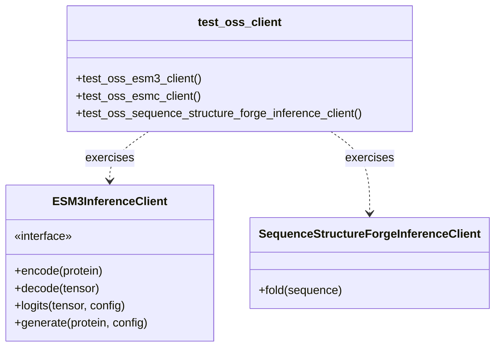

# CI Pipeline & Code Quality

> **Relevant source files**
> * [.github/workflows/ci.yml](https://github.com/Biohub/esm/blob/82ee3555/.github/workflows/ci.yml)
> * [.pre-commit-config.yaml](https://github.com/Biohub/esm/blob/82ee3555/.pre-commit-config.yaml)
> * [pyproject.toml](https://github.com/Biohub/esm/blob/82ee3555/pyproject.toml)
> * [tests/oss_pytests/test_oss_client.py](https://github.com/Biohub/esm/blob/82ee3555/tests/oss_pytests/test_oss_client.py)

The ESM repository utilizes a robust Continuous Integration (CI) pipeline designed to maintain high code quality standards, ensure architectural integrity through strict linting and typing, and validate model inference logic via both unit and integration tests. The pipeline is powered by GitHub Actions and leverages `pixi` for deterministic environment management.

## CI Workflow Overview

The CI pipeline is defined in `.github/workflows/ci.yml` and consists of two primary parallel jobs: `test-precommit` and `test-esm`.

### Workflow Architecture

The following diagram illustrates the flow from code submission to verification.

**CI Pipeline Data Flow**

Sources: `.github/workflows/ci.yml:1-38`, `.github/workflows/ci.yml:38-54`

## Environment Management with Pixi

The repository uses `pixi` as its package manager to ensure consistent environments across local development and CI runners `.github/workflows/ci.yml:28-33`.

* **Default Environment**: Contains core dependencies for model execution `pyproject.toml:101-101`.
* **Dev Environment**: Extends the default environment with testing and linting tools such as `pytest`, `ruff`, and `ty` `pyproject.toml:87-95`, `pyproject.toml:102-102`.
* **Task Automation**: Pixi tasks like `lint-all` and `cov-test` encapsulate complex CLI commands for easy execution in CI `pyproject.toml:99-101`.

Sources: `pyproject.toml:68-103`, `.github/workflows/ci.yml:28-33`

## Code Quality Tooling

The project enforces strict standards through several integrated tools configured in `pyproject.toml` and `.pre-commit-config.yaml`.

### Linting and Formatting

* **Ruff**: Used for both linting and formatting. It targets Python 3.12 and includes specialized support for `.ipynb` files `pyproject.toml:104-105`.
* **Configuration**: Specific rules are enabled (e.g., `F` for Pyflakes, `I` for Isort) while certain tensor-specific behaviors like `E712` (variable == False) are ignored to accommodate PyTorch semantics `pyproject.toml:107-122`. Ruff is configured to run with `--fix` in the pre-commit hook `.pre-commit-config.yaml:22`.

### Static Type Checking

* **Ty**: A type checker that provides strict LSP override-compatibility checking. It is configured to ignore `invalid-method-override`, `unused-ignore-comment`, and `unused-type-ignore-comment` rules to accommodate duck-typed ML code and optional dependencies like `flash_attn` and `zstd` `pyproject.toml:151-169`.
* **Pre-commit Integration**: `ty` runs as a local hook in pre-commit, checking the entire project (`always_run: true`, `pass_filenames: false`) within the `pixi` environment `.pre-commit-config.yaml:26-35`.

### Architectural Constraints

* **Import Linter**: Ensures that the internal package structure remains decoupled and follows the intended dependency graph. It is configured with `root_package = "esm"` `pyproject.toml:171-172`, and runs as a pre-commit hook `.pre-commit-config.yaml:14-17`.

### Secret Scanning

* **Gitleaks**: Integrated as a pre-commit hook to scan for sensitive information or secrets before commits are made `.pre-commit-config.yaml:36-39`.

Sources: `pyproject.toml:104-172`, `.pre-commit-config.yaml:1-39`

## Testing Infrastructure

The test suite is divided into unit tests and Docker-based integration tests.

### Pytest Configuration

The repository uses `pytest-xdist` to run tests in parallel (`-n auto`) to reduce CI time `pyproject.toml:53-53`. Coverage is tracked for the `esm` package, and a summary of missing coverage is reported while skipping fully covered files `pyproject.toml:50-52`. The `test_oss_client.py` file is ignored in the main pytest run as it is specifically designed for Docker integration tests `pyproject.toml:54`.

### Docker Integration Tests

For SDK validation, the CI runs a specific set of tests inside a Docker environment to simulate production usage.

* **DOCKER_TAG Strategy**: The CI uses the GitHub commit SHA (`${{ github.sha }}`) as the `DOCKER_TAG` to ensure the container image matches the exact code being tested `.github/workflows/ci.yml:57-57`.
* **Integration Execution**: The `make build-oss-ci` and `make start-docker-oss` commands are used to build the Docker image and then spin up containers to run tests against the Biohub API using the `ESM_API_KEY` secret `.github/workflows/ci.yml:59-64`.
* **Cleanup**: A `cleanup docker containers` step is included to ensure that any hanging Docker containers are removed, even if previous steps fail `.github/workflows/ci.yml:67-70`.

**Code Entity Mapping: SDK Test Suite**

Sources: `tests/oss_pytests/test_oss_client.py:24-91`, `.github/workflows/ci.yml:55-65`

## Coverage and Reporting

The CI pipeline automatically comments on Pull Requests with a coverage report.

* **Comment Generation**: The `MishaKav/pytest-coverage-comment` action processes `pytest-coverage.txt` and `pytest.xml` to generate a visual summary `.github/workflows/ci.yml:73-81`.
* **GitHub Summary**: A HTML coverage summary is also appended to the GitHub Actions step summary for quick inspection `.github/workflows/ci.yml:83-87`.

Sources: `.github/workflows/ci.yml:73-87`