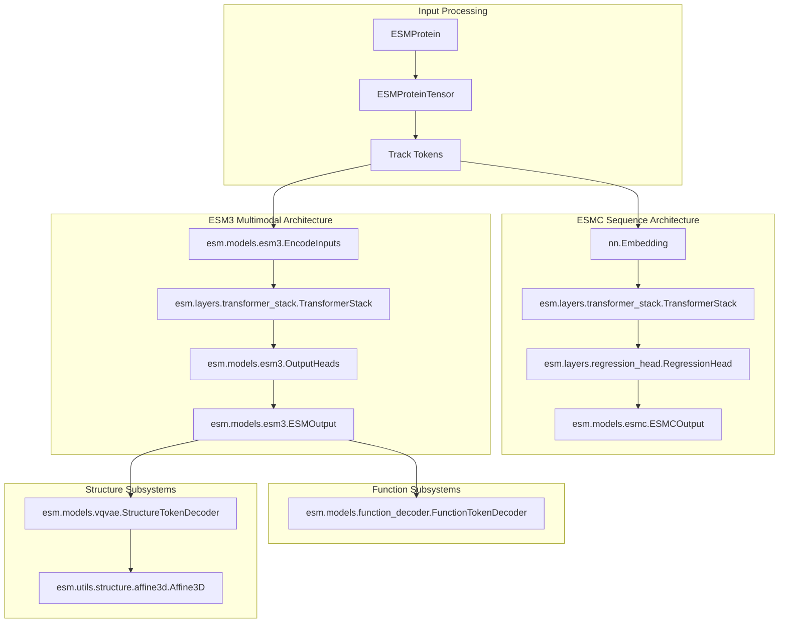

# Core Model Architectures

> **Relevant source files**
> * [esm/layers/transformer_stack.py](https://github.com/Biohub/esm/blob/82ee3555/esm/layers/transformer_stack.py)
> * [esm/models/esm3.py](https://github.com/Biohub/esm/blob/82ee3555/esm/models/esm3.py)
> * [esm/models/esmc.py](https://github.com/Biohub/esm/blob/82ee3555/esm/models/esmc.py)
> * [esm/utils/structure/input_builder.py](https://github.com/Biohub/esm/blob/82ee3555/esm/utils/structure/input_builder.py)

This page provides a high-level technical overview of the neural network architectures that power the ESM ecosystem. The codebase supports three primary model families: **ESM3**, a multimodal generative model; **ESMC**, a sequence-only transformer; and **ESMFold2**, a diffusion-based structure prediction model. These models are built upon a shared library of optimized transformer layers and specialized tokenizers.

## Architectural Overview

The ESM repository transitions from traditional protein language modeling to a multimodal, multi-track architecture. While **ESMC** focuses on high-efficiency sequence embeddings, **ESM3** integrates sequence, structure, and function into a unified transformer backbone. **ESMFold2** extends these capabilities to high-fidelity all-atom structure prediction.

### Component Relationship Diagram

The following diagram illustrates how the core classes and modules interact to process protein data across different model families.

**Sources:** [esm/models/esm3.py L62-L185](https://github.com/Biohub/esm/blob/82ee3555/esm/models/esm3.py#L62-L185)

 [esm/models/esmc.py L45-L191](https://github.com/Biohub/esm/blob/82ee3555/esm/models/esmc.py#L45-L191)

 [esm/models/vqvae.py L179-L205](https://github.com/Biohub/esm/blob/82ee3555/esm/models/vqvae.py#L179-L205)

 [esm/models/function_decoder.py L54-L125](https://github.com/Biohub/esm/blob/82ee3555/esm/models/function_decoder.py#L54-L125)

---

## ESM3: Multimodal Generative Model

**ESM3** is a multimodal transformer designed to reason across different "tracks" of protein information simultaneously. It treats proteins as a collection of synchronized sequences: amino acids, structural coordinates (discretized), secondary structure, solvent accessibility, and functional annotations.

* **Multimodal Embedding:** The `EncodeInputs` class [esm/models/esm3.py L62-L148](https://github.com/Biohub/esm/blob/82ee3555/esm/models/esm3.py#L62-L148)  sums embeddings from all tracks, including sequence, structure tokens, SS8, SASA, and function tokens.
* **Transformer Backbone:** A `TransformerStack` [esm/layers/transformer_stack.py L11-L20](https://github.com/Biohub/esm/blob/82ee3555/esm/layers/transformer_stack.py#L11-L20)  processes the combined embeddings using rotary position embeddings and optional Flash Attention.
* **Output Heads:** The `OutputHeads` class [esm/models/esm3.py L151-L185](https://github.com/Biohub/esm/blob/82ee3555/esm/models/esm3.py#L151-L185)  provides independent regression heads for every input track, enabling the model to predict or "fill in" masked values for any modality.

For a deep dive into the multimodal tracks and forward pass, see **[ESM3 – Multimodal Protein Language Model](/Biohub/esm/2.1-esm3-multimodal-protein-language-model)**.

---

## ESMC: Efficient Sequence Embeddings

**ESMC** (ESM Central) is a sequence-only transformer architecture optimized for scale and speed. It is the successor to the ESM-2 family, providing state-of-the-art embeddings for downstream tasks and masked language modeling.

* **Optimized Attention:** ESMC natively supports `unpad_input` and `pad_input` logic [esm/models/esmc.py L151-L180](https://github.com/Biohub/esm/blob/82ee3555/esm/models/esmc.py#L151-L180)  to handle variable-length sequences efficiently when using Flash Attention.
* **Variants:** Available in 300M, 600M, and 6B parameter variants [esm/models/esmc.py L80-L96](https://github.com/Biohub/esm/blob/82ee3555/esm/models/esmc.py#L80-L96)
* **Output:** Returns `ESMCOutput` [esm/models/esmc.py L37-L42](https://github.com/Biohub/esm/blob/82ee3555/esm/models/esmc.py#L37-L42)  containing logits, embeddings, and optionally all hidden states and attention maps.

For details on the sequence-only architecture and Flash Attention integration, see **[ESMC – Sequence Embedding Model](/Biohub/esm/2.2-esmc-sequence-embedding-model)**.

---

## ESMFold2: Structure Prediction

**ESMFold2** is a diffusion-based structure prediction model. Unlike the original ESMFold, which used a folding trunk, ESMFold2 leverages a diffusion process to generate all-atom coordinates.

* **Input Handling:** Uses `StructurePredictionInput` [esm/utils/structure/input_builder.py L75-L79](https://github.com/Biohub/esm/blob/82ee3555/esm/utils/structure/input_builder.py#L75-L79)  to construct complex payloads including MSAs, ligands, and multi-chain information. The `serialize_structure_prediction_input` function [esm/utils/structure/input_builder.py L82-L154](https://github.com/Biohub/esm/blob/82ee3555/esm/utils/structure/input_builder.py#L82-L154)  handles serialization.
* **Complex Support:** Natively handles `ProteinInput`, `DNAInput`, `RNAInput`, and `LigandInput` [esm/utils/structure/input_builder.py L22-L50](https://github.com/Biohub/esm/blob/82ee3555/esm/utils/structure/input_builder.py#L22-L50)
* **Diffusion Pipeline:** Operates on `StructurePredictionInput` to iteratively refine atomic positions.

For details on the diffusion pipeline and multi-chain support, see **[ESMFold2 – All-Atom Structure Prediction](/Biohub/esm/2.3-esmfold2-all-atom-structure-prediction)**.

---

## Support Architectures: VQ-VAE & Function Decoders

To enable the transformer to "see" and "write" 3D structures and complex functions, ESM3 utilizes specialized compression and expansion models.

### Structure VQ-VAE

The `StructureTokenEncoder` and `StructureTokenDecoder` [esm/models/vqvae.py L179-L205](https://github.com/Biohub/esm/blob/82ee3555/esm/models/vqvae.py#L179-L205)

 implement a Vector Quantized Variational Autoencoder.

* **Encoder:** Maps 3D coordinates to a discrete set of 4096 structure tokens using a `GeometricEncoderStack`.
* **Decoder:** Reconstructs the protein backbone (`Affine3D`) from these discrete tokens.

### Function Decoder

The `FunctionTokenDecoder` [esm/models/function_decoder.py L54-L125](https://github.com/Biohub/esm/blob/82ee3555/esm/models/function_decoder.py#L54-L125)

 translates abstract function tokens into human-readable InterPro annotations and TF-IDF keyword vectors. It uses a `TransformerStack` to expand depth-8 function tokens into high-dimensional classification logits.

For details, see **[VQ-VAE Structure Tokenizer & Function Decoder](/Biohub/esm/2.4-vq-vae-structure-tokenizer-and-function-decoder)**.

---

## Reusable Building Blocks

The models share a core library of neural network components located in `esm.layers`.

| Component | Description | File |
| --- | --- | --- |
| `TransformerStack` | Reusable stack of transformer blocks with configurable geometry and attention. | [esm/layers/transformer_stack.py L10-L61](https://github.com/Biohub/esm/blob/82ee3555/esm/layers/transformer_stack.py#L10-L61) |
| `UnifiedTransformerBlock` | A single transformer layer supporting both plain and geometric attention. | [esm/layers/blocks.py](https://github.com/Biohub/esm/blob/82ee3555/esm/layers/blocks.py) |
| `RegressionHead` | Standard MLP head for projecting hidden states to output vocabularies. | [esm/layers/regression_head.py L13-L24](https://github.com/Biohub/esm/blob/82ee3555/esm/layers/regression_head.py#L13-L24) |
| `EMACodebook` | The quantization layer used in the Structure VQ-VAE. | [esm/layers/codebook.py](https://github.com/Biohub/esm/blob/82ee3555/esm/layers/codebook.py) |

For technical specifications of these layers, see **[Transformer Building Blocks](/Biohub/esm/2.5-transformer-building-blocks)**.

---

**Sources:**

* `ESM3` and `ESMOutput`: [esm/models/esm3.py L50-L211](https://github.com/Biohub/esm/blob/82ee3555/esm/models/esm3.py#L50-L211)
* `ESMC` and `ESMCOutput`: [esm/models/esmc.py L37-L78](https://github.com/Biohub/esm/blob/82ee3555/esm/models/esmc.py#L37-L78)
* `FunctionTokenDecoder`: [esm/models/function_decoder.py L54-L125](https://github.com/Biohub/esm/blob/82ee3555/esm/models/function_decoder.py#L54-L125)
* `StructureTokenEncoder`: [esm/models/vqvae.py L179-L205](https://github.com/Biohub/esm/blob/82ee3555/esm/models/vqvae.py#L179-L205)
* `TransformerStack`: [esm/layers/transformer_stack.py L10-L61](https://github.com/Biohub/esm/blob/82ee3555/esm/layers/transformer_stack.py#L10-L61)
* `RegressionHead`: [esm/layers/regression_head.py L13-L24](https://github.com/Biohub/esm/blob/82ee3555/esm/layers/regression_head.py#L13-L24)
* `StructurePredictionInput`, `ProteinInput`, `DNAInput`, `RNAInput`, `LigandInput`, `serialize_structure_prediction_input`: [esm/utils/structure/input_builder.py L22-L154](https://github.com/Biohub/esm/blob/82ee3555/esm/utils/structure/input_builder.py#L22-L154)