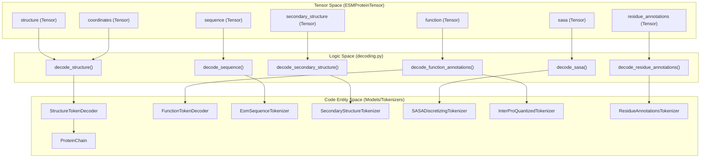
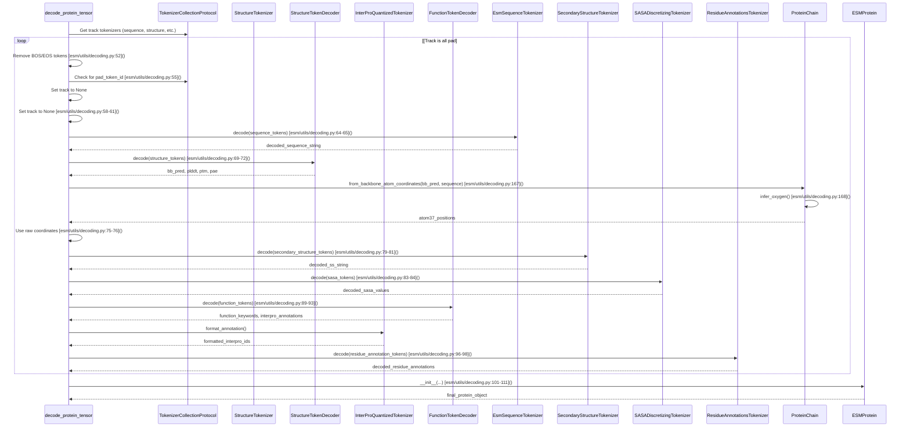

# Decoding Tensors Back to Proteins

> **Relevant source files**
> * [esm/utils/decoding.py](https://github.com/Biohub/esm/blob/82ee3555/esm/utils/decoding.py)
> * [esm/utils/sampling.py](https://github.com/Biohub/esm/blob/82ee3555/esm/utils/sampling.py)

The decoding pipeline is the inverse of the tokenization process, transforming discrete multi-track tensors back into human-readable protein representations. This process involves structural reconstruction from VQ-VAE latent codes, merging hierarchical function annotations, and extracting confidence metrics such as pLDDT and PAE.

## The Decoding Lifecycle

The primary entry point for this process is `decode_protein_tensor` [esm/utils/decoding.py L31-L36](https://github.com/Biohub/esm/blob/82ee3555/esm/utils/decoding.py#L31-L36)

 This function orchestrates the conversion of an `ESMProteinTensor`—which contains tokenized tracks for sequence, structure, SASA, secondary structure, and function—into a rich `ESMProtein` object [esm/utils/decoding.py L101-L111](https://github.com/Biohub/esm/blob/82ee3555/esm/utils/decoding.py#L101-L111)

### Data Flow and Entity Mapping

The following diagram illustrates how the decoding functions map to the specific components of the `ESMProteinTensor` and which model entities are responsible for the transformation.

**Tensor to Protein Entity Mapping**

**Sources:** [esm/utils/decoding.py L31-L111](https://github.com/Biohub/esm/blob/82ee3555/esm/utils/decoding.py#L31-L111)

 [esm/utils/function/encode_decode.py L84-L133](https://github.com/Biohub/esm/blob/82ee3555/esm/utils/function/encode_decode.py#L84-L133)

---

## Structural Reconstruction

Structural decoding is the most complex part of the pipeline, as it involves converting discrete indices back into 3D atomic coordinates.

### StructureTokenDecoder and Oxygen Inference

The `decode_structure` function [esm/utils/decoding.py L138-L143](https://github.com/Biohub/esm/blob/82ee3555/esm/utils/decoding.py#L138-L143)

 takes structural tokens and passes them to the `StructureTokenDecoder` [esm/utils/decoding.py L153](https://github.com/Biohub/esm/blob/82ee3555/esm/utils/decoding.py#L153-L153)

1. **Backbone Prediction**: The decoder returns backbone coordinates (`bb_pred`) for N, CA, and C atoms [esm/utils/decoding.py L154-L156](https://github.com/Biohub/esm/blob/82ee3555/esm/utils/decoding.py#L154-L156)
2. **Chain Assembly**: These coordinates are used to initialize a `ProteinChain` via `from_backbone_atom_coordinates` [esm/utils/decoding.py L167](https://github.com/Biohub/esm/blob/82ee3555/esm/utils/decoding.py#L167-L167)
3. **Oxygen Inference**: Since the VQ-VAE primarily handles backbone tokens, the carbonyl oxygen (O) positions are geometrically inferred using `chain.infer_oxygen()` [esm/utils/decoding.py L168](https://github.com/Biohub/esm/blob/82ee3555/esm/utils/decoding.py#L168-L168)
4. **Final Representation**: The result is a full Atom37 tensor representing the reconstructed backbone [esm/utils/decoding.py L169](https://github.com/Biohub/esm/blob/82ee3555/esm/utils/decoding.py#L169-L169)

### Confidence Metrics Extraction

During the decoding of the structure track, the model also provides estimates of its own prediction quality:

* **pLDDT**: Extracted from the decoder output and stripped of BOS/EOS tokens [esm/utils/decoding.py L159-L161](https://github.com/Biohub/esm/blob/82ee3555/esm/utils/decoding.py#L159-L161)
* **pTM & PAE**: Extracted directly from the decoder's auxiliary heads if available [esm/utils/decoding.py L163-L165](https://github.com/Biohub/esm/blob/82ee3555/esm/utils/decoding.py#L163-L165)

**Sources:** [esm/utils/decoding.py L138-L171](https://github.com/Biohub/esm/blob/82ee3555/esm/utils/decoding.py#L138-L171)

 [esm/utils/structure/protein_chain.py L56-L58](https://github.com/Biohub/esm/blob/82ee3555/esm/utils/structure/protein_chain.py#L56-L58)

---

## Function and Residue Annotation Decoding

Function decoding merges two distinct types of data: global/domain-level InterPro annotations and site-specific residue annotations.

### InterPro and Keyword Merging

The `decode_function_annotations` function [esm/utils/decoding.py L89-L93](https://github.com/Biohub/esm/blob/82ee3555/esm/utils/decoding.py#L89-L93)

 (which internally calls `decode_function_tokens` [esm/utils/function/encode_decode.py L84-L91](https://github.com/Biohub/esm/blob/82ee3555/esm/utils/function/encode_decode.py#L84-L91)

) uses the `FunctionTokenDecoder` to process predicted logits:

1. **Keyword Extraction**: It retrieves predicted function keywords from the decoder [esm/utils/function/encode_decode.py L125](https://github.com/Biohub/esm/blob/82ee3555/esm/utils/function/encode_decode.py#L125-L125)
2. **InterPro Formatting**: InterPro annotations are decoded and formatted back into standard IPR identifiers (e.g., "IPR001234") using the `InterProQuantizedTokenizer.format_annotation` method [esm/utils/function/encode_decode.py L126-L132](https://github.com/Biohub/esm/blob/82ee3555/esm/utils/function/encode_decode.py#L126-L132)

### Residue Annotation Processing

Residue-level annotations (like active sites or binding regions) are decoded via `decode_residue_annotations` [esm/utils/decoding.py L96-L98](https://github.com/Biohub/esm/blob/82ee3555/esm/utils/decoding.py#L96-L98)

 (which internally calls `decode_residue_annotation_tokens` [esm/utils/function/encode_decode.py L136-L141](https://github.com/Biohub/esm/blob/82ee3555/esm/utils/function/encode_decode.py#L136-L141)

).

* **Depth Traversal**: The function iterates through the multi-track residue annotation tensor (up to `MAX_RESIDUE_ANNOTATIONS` [esm/utils/sampling.py L12](https://github.com/Biohub/esm/blob/82ee3555/esm/utils/sampling.py#L12-L12) ) [esm/utils/function/encode_decode.py L158](https://github.com/Biohub/esm/blob/82ee3555/esm/utils/function/encode_decode.py#L158-L158)
* **Label Mapping**: Token IDs are mapped back to labels using the `ResidueAnnotationsTokenizer.vocabulary` [esm/utils/function/encode_decode.py L164-L165](https://github.com/Biohub/esm/blob/82ee3555/esm/utils/function/encode_decode.py#L164-L165)
* **Merging**: Contiguous residue predictions of the same type are merged into single `FunctionAnnotation` objects using `merge_annotations` [esm/utils/function/encode_decode.py L170](https://github.com/Biohub/esm/blob/82ee3555/esm/utils/function/encode_decode.py#L170-L170)

**Sources:** [esm/utils/function/encode_decode.py L84-L180](https://github.com/Biohub/esm/blob/82ee3555/esm/utils/function/encode_decode.py#L84-L180)

 [esm/utils/decoding.py L89-L99](https://github.com/Biohub/esm/blob/82ee3555/esm/utils/decoding.py#L89-L99)

 [esm/utils/sampling.py L12](https://github.com/Biohub/esm/blob/82ee3555/esm/utils/sampling.py#L12-L12)

---

## Handling Special Tokens and Padding

A critical step in decoding is the removal of structural markers used during model inference.

| Step | Logic | File Reference |
| --- | --- | --- |
| **BOS/EOS Removal** | Slices tokens using `tokens[1:-1]` to remove Start/End markers. | [esm/utils/decoding.py L52](https://github.com/Biohub/esm/blob/82ee3555/esm/utils/decoding.py#L52-L52) |
| **Mask Detection** | If a track contains mask tokens, it is treated as `None` to prevent invalid decoding. | [esm/utils/decoding.py L58-L61](https://github.com/Biohub/esm/blob/82ee3555/esm/utils/decoding.py#L58-L61) |
| **Pad Cleanup** | If a track consists entirely of pad tokens, it is discarded. | [esm/utils/decoding.py L55-L56](https://github.com/Biohub/esm/blob/82ee3555/esm/utils/decoding.py#L55-L56) |
| **Sequence Cleanup** | Removes whitespace and converts internal mask strings to short format. | [esm/utils/decoding.py L130-L131](https://github.com/Biohub/esm/blob/82ee3555/esm/utils/decoding.py#L130-L131) |

### Tokenizer Interaction Diagram

This diagram shows how `decode_protein_tensor` interacts with the various tokenizer classes to perform its duties.

**Decoding Interaction Diagram**

**Sources:** [esm/utils/decoding.py L31-L111](https://github.com/Biohub/esm/blob/82ee3555/esm/utils/decoding.py#L31-L111)

 [esm/utils/encoding.py L156-L182](https://github.com/Biohub/esm/blob/82ee3555/esm/utils/encoding.py#L156-L182)