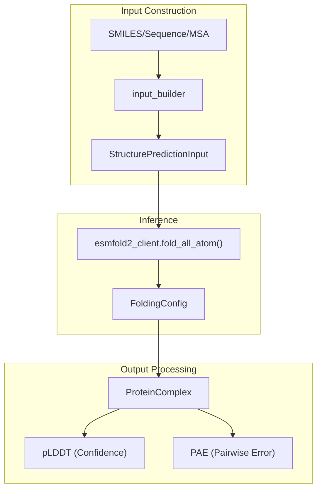
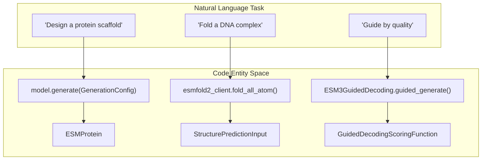

# ESM3 & ESMFold2 Tutorials

> **Relevant source files**
> * [cookbook/local/open_generate.ipynb](https://github.com/Biohub/esm/blob/82ee3555/cookbook/local/open_generate.ipynb)
> * [cookbook/local/raw_forwards.py](https://github.com/Biohub/esm/blob/82ee3555/cookbook/local/raw_forwards.py)
> * [cookbook/snippets/esm3.py](https://github.com/Biohub/esm/blob/82ee3555/cookbook/snippets/esm3.py)
> * [cookbook/snippets/fold_invfold.py](https://github.com/Biohub/esm/blob/82ee3555/cookbook/snippets/fold_invfold.py)
> * [cookbook/tutorials/esm3_generate.ipynb](https://github.com/Biohub/esm/blob/82ee3555/cookbook/tutorials/esm3_generate.ipynb)
> * [cookbook/tutorials/esm3_guided_generation.ipynb](https://github.com/Biohub/esm/blob/82ee3555/cookbook/tutorials/esm3_guided_generation.ipynb)
> * [cookbook/tutorials/esmfold2.ipynb](https://github.com/Biohub/esm/blob/82ee3555/cookbook/tutorials/esmfold2.ipynb)
> * [cookbook/tutorials/esmprotein.ipynb](https://github.com/Biohub/esm/blob/82ee3555/cookbook/tutorials/esmprotein.ipynb)
> * [cookbook/tutorials/gfp_design.ipynb](https://github.com/Biohub/esm/blob/82ee3555/cookbook/tutorials/gfp_design.ipynb)

This page provides a technical walkthrough of the tutorial notebooks for ESM3 and ESMFold2. These tutorials demonstrate the practical application of the multimodal ESM3 generative model and the diffusion-based ESMFold2 structure prediction model. They cover core data structures like `ESMProtein`, generative workflows for protein design, and complex folding tasks involving multiple chains and ligands.

### ESMProtein and Multimodal Tracks

The `ESMProtein` class is the central data structure for ESM3, representing a protein across five promptable tracks: sequence, structure (coordinates), secondary structure (SS8), solvent-accessible surface area (SASA), and function annotations [cookbook/tutorials/esmprotein.ipynb L23-L31](https://github.com/Biohub/esm/blob/82ee3555/cookbook/tutorials/esmprotein.ipynb#L23-L31)

#### Track Specifications

| Track | Description | Data Representation |
| --- | --- | --- |
| **Sequence** | Amino acid sequence | 1-letter string [cookbook/tutorials/esmprotein.ipynb L101-L102](https://github.com/Biohub/esm/blob/82ee3555/cookbook/tutorials/esmprotein.ipynb#L101-L102) |
| **Coordinates** | 3D atomic positions | `(N, 37, 3)` tensor (Atom37 format) [cookbook/tutorials/esmprotein.ipynb L121-L125](https://github.com/Biohub/esm/blob/82ee3555/cookbook/tutorials/esmprotein.ipynb#L121-L125) |
| **SS8** | 8-class secondary structure | DSSP classification codes [cookbook/tutorials/esmprotein.ipynb L27](https://github.com/Biohub/esm/blob/82ee3555/cookbook/tutorials/esmprotein.ipynb#L27-L27) |
| **SASA** | Solvent accessibility | Discretized surface area values [cookbook/tutorials/esmprotein.ipynb L28](https://github.com/Biohub/esm/blob/82ee3555/cookbook/tutorials/esmprotein.ipynb#L28-L28) |
| **Function** | InterPro annotations | Quantized function tokens [cookbook/tutorials/esmprotein.ipynb L29](https://github.com/Biohub/esm/blob/82ee3555/cookbook/tutorials/esmprotein.ipynb#L29-L29) |

Users can instantiate `ESMProtein` from existing structures using the `ProteinChain` utility, which supports fetching from RCSB or loading local PDB/mmCIF files [cookbook/tutorials/esmprotein.ipynb L83-L94](https://github.com/Biohub/esm/blob/82ee3555/cookbook/tutorials/esmprotein.ipynb#L83-L94)

**Sources:** [cookbook/tutorials/esmprotein.ipynb L23-L125](https://github.com/Biohub/esm/blob/82ee3555/cookbook/tutorials/esmprotein.ipynb#L23-L125)

---

### ESM3 Generative Workflows

ESM3 is a generative masked language model that uses iterative sampling to fill in masked positions across tracks [cookbook/tutorials/esm3_generate.ipynb L11-L12](https://github.com/Biohub/esm/blob/82ee3555/cookbook/tutorials/esm3_generate.ipynb#L11-L12)

#### Protein Generation Pipeline

The generation process typically follows an iterative loop where the model predicts tokens for masked positions, which are then sampled and fed back as context for the next step [cookbook/tutorials/esm3_generate.ipynb L11-L12](https://github.com/Biohub/esm/blob/82ee3555/cookbook/tutorials/esm3_generate.ipynb#L11-L12)

1. **Prompt Construction**: Defining a partial `ESMProtein` (e.g., a structural motif or a partial sequence) [cookbook/tutorials/esm3_generate.ipynb L78-L86](https://github.com/Biohub/esm/blob/82ee3555/cookbook/tutorials/esm3_generate.ipynb#L78-L86)
2. **Model Selection**: Choosing between local inference via `ESM3.from_pretrained()` or remote inference via `esm.sdk.client()` [cookbook/local/open_generate.ipynb L63-L85](https://github.com/Biohub/esm/blob/82ee3555/cookbook/local/open_generate.ipynb#L63-L85)
3. **Iterative Sampling**: Executing `model.generate()` with a `GenerationConfig` specifying the target track and number of steps [cookbook/tutorials/esm3_generate.ipynb L182-L185](https://github.com/Biohub/esm/blob/82ee3555/cookbook/tutorials/esm3_generate.ipynb#L182-L185)

#### Case Study: GFP Design

The `gfp_design.ipynb` tutorial replicates the computational chain-of-thought used to design **esmGFP** [cookbook/tutorials/gfp_design.ipynb L9-L11](https://github.com/Biohub/esm/blob/82ee3555/cookbook/tutorials/gfp_design.ipynb#L9-L11)

 It demonstrates prompting the model with structural fragments of a known GFP (PDB 1QY3) and allowing ESM3 to generate a novel scaffold that preserves the essential chromophore-binding environment [cookbook/tutorials/gfp_design.ipynb L149-L151](https://github.com/Biohub/esm/blob/82ee3555/cookbook/tutorials/gfp_design.ipynb#L149-L151)

**Sources:** [cookbook/tutorials/esm3_generate.ipynb L11-L185](https://github.com/Biohub/esm/blob/82ee3555/cookbook/tutorials/esm3_generate.ipynb#L11-L185)

 [cookbook/local/open_generate.ipynb L63-L85](https://github.com/Biohub/esm/blob/82ee3555/cookbook/local/open_generate.ipynb#L63-L85)

 [cookbook/tutorials/gfp_design.ipynb L9-L151](https://github.com/Biohub/esm/blob/82ee3555/cookbook/tutorials/gfp_design.ipynb#L9-L151)

---

### Guided Generation and Constraints

Guided generation allows users to steer ESM3 outputs toward specific properties using a scoring function [cookbook/tutorials/esm3_guided_generation.ipynb L9-L10](https://github.com/Biohub/esm/blob/82ee3555/cookbook/tutorials/esm3_guided_generation.ipynb#L9-L10)

#### Implementation Entities

The system uses derivative-free guidance (Soft Value-Based Decoding) and constrained optimization (MDMM) [cookbook/tutorials/esm3_guided_generation.ipynb L17-L18](https://github.com/Biohub/esm/blob/82ee3555/cookbook/tutorials/esm3_guided_generation.ipynb#L17-L18)

* **`GuidedDecodingScoringFunction`**: An abstract base class where users implement `__call__(protein: ESMProtein) -> float` [cookbook/tutorials/esm3_guided_generation.ipynb L79-L80](https://github.com/Biohub/esm/blob/82ee3555/cookbook/tutorials/esm3_guided_generation.ipynb#L79-L80)
* **`ESM3GuidedDecoding`**: The orchestration class that wraps a model client and a scoring function to perform `guided_generate()` [cookbook/tutorials/esm3_guided_generation.ipynb L143-L145](https://github.com/Biohub/esm/blob/82ee3555/cookbook/tutorials/esm3_guided_generation.ipynb#L143-L145)

#### Examples of Guidance

* **Quality Guidance**: Maximizing the Predicted Template Modeling (pTM) score [cookbook/tutorials/esm3_guided_generation.ipynb L67-L70](https://github.com/Biohub/esm/blob/82ee3555/cookbook/tutorials/esm3_guided_generation.ipynb#L67-L70)
* **Hard Constraints**: Generating proteins with specific amino acid exclusions (e.g., "no Cysteines") [cookbook/tutorials/esm3_guided_generation.ipynb L22](https://github.com/Biohub/esm/blob/82ee3555/cookbook/tutorials/esm3_guided_generation.ipynb#L22-L22)
* **Biophysical Guidance**: Minimizing the radius of gyration to maximize globularity [cookbook/tutorials/esm3_guided_generation.ipynb L23](https://github.com/Biohub/esm/blob/82ee3555/cookbook/tutorials/esm3_guided_generation.ipynb#L23-L23)

**Sources:** [cookbook/tutorials/esm3_guided_generation.ipynb L9-L145](https://github.com/Biohub/esm/blob/82ee3555/cookbook/tutorials/esm3_guided_generation.ipynb#L9-L145)

---

### ESMFold2 Structure Prediction

ESMFold2 extends the folding capabilities to multi-chain complexes, nucleic acids, and small molecules [cookbook/tutorials/esmfold2.ipynb L13](https://github.com/Biohub/esm/blob/82ee3555/cookbook/tutorials/esmfold2.ipynb#L13-L13)

#### Input Assembly with input_builder

The `esm.utils.structure.input_builder` is used to construct complex biological systems [cookbook/tutorials/esmfold2.ipynb L31](https://github.com/Biohub/esm/blob/82ee3555/cookbook/tutorials/esmfold2.ipynb#L31-L31)

* **Protein-Nucleic Acid Complexes**: Combining `ProteinInput`, `DNAInput`, and `RNAInput` [cookbook/tutorials/esmfold2.ipynb L17-L18](https://github.com/Biohub/esm/blob/82ee3555/cookbook/tutorials/esmfold2.ipynb#L17-L18)
* **Small Molecules & Modifications**: Defining ligands via SMILES strings and specifying covalent bonds between peptide and ligand atoms [cookbook/tutorials/esmfold2.ipynb L21-L22](https://github.com/Biohub/esm/blob/82ee3555/cookbook/tutorials/esmfold2.ipynb#L21-L22)
* **Evolutionary Context**: Passing a Multiple Sequence Alignment (MSA) to the model to improve accuracy [cookbook/tutorials/esmfold2.ipynb L36](https://github.com/Biohub/esm/blob/82ee3555/cookbook/tutorials/esmfold2.ipynb#L36-L36)

#### Data Flow Diagram: ESMFold2 Folding Pipeline

Title: ESMFold2 Multi-Component Folding Flow

**Sources:** [cookbook/tutorials/esmfold2.ipynb L13-L81](https://github.com/Biohub/esm/blob/82ee3555/cookbook/tutorials/esmfold2.ipynb#L13-L81)

---

### Local Inference Scripts

While the Biohub Platform provides remote access, the `cookbook/local` directory demonstrates running models on local hardware using Hugging Face weights [cookbook/local/open_generate.ipynb L16](https://github.com/Biohub/esm/blob/82ee3555/cookbook/local/open_generate.ipynb#L16-L16)

#### Key Classes for Local Execution

* **`ESM3`**: The local model implementation class [cookbook/local/open_generate.ipynb L42](https://github.com/Biohub/esm/blob/82ee3555/cookbook/local/open_generate.ipynb#L42-L42)
* **`huggingfacehub_login`**: Utility for authenticating and downloading weights [cookbook/local/open_generate.ipynb L60-L63](https://github.com/Biohub/esm/blob/82ee3555/cookbook/local/open_generate.ipynb#L60-L63)
* **`ProteinChain`**: Used for local PDB parsing and Atom37 coordinate handling [cookbook/local/open_generate.ipynb L44](https://github.com/Biohub/esm/blob/82ee3555/cookbook/local/open_generate.ipynb#L44-L44)

The `cookbook/local/raw_forwards.py` script provides examples of direct model interaction for inverse folding and conditioned prediction, bypassing the higher-level SDK client abstractions.

Title: Local ESM3 Raw Forward Pass

**Sources:** [cookbook/local/open_generate.ipynb L16-L63](https://github.com/Biohub/esm/blob/82ee3555/cookbook/local/open_generate.ipynb#L16-L63)

 [cookbook/local/raw_forwards.py L22-L46](https://github.com/Biohub/esm/blob/82ee3555/cookbook/local/raw_forwards.py#L22-L46)

 [cookbook/local/raw_forwards.py L50-L85](https://github.com/Biohub/esm/blob/82ee3555/cookbook/local/raw_forwards.py#L50-L85)

 [cookbook/local/raw_forwards.py L89-L143](https://github.com/Biohub/esm/blob/82ee3555/cookbook/local/raw_forwards.py#L89-L143)

#### System Mapping: Natural Language to Code Entities

Title: Generation System Mapping

**Sources:** [cookbook/local/open_generate.ipynb L16-L63](https://github.com/Biohub/esm/blob/82ee3555/cookbook/local/open_generate.ipynb#L16-L63)

 [cookbook/tutorials/esm3_guided_generation.ipynb L55-L159](https://github.com/Biohub/esm/blob/82ee3555/cookbook/tutorials/esm3_guided_generation.ipynb#L55-L159)

 [cookbook/tutorials/esmfold2.ipynb L79-L81](https://github.com/Biohub/esm/blob/82ee3555/cookbook/tutorials/esmfold2.ipynb#L79-L81)

---

### Summary of Tutorial Resources

| Notebook | Focus | Primary API |
| --- | --- | --- |
| `esmprotein.ipynb` | Data representation | `ESMProtein` [cookbook/tutorials/esmprotein.ipynb L16-L17](https://github.com/Biohub/esm/blob/82ee3555/cookbook/tutorials/esmprotein.ipynb#L16-L17) |
| `esm3_generate.ipynb` | Basic generation | `model.generate()` [cookbook/tutorials/esm3_generate.ipynb L11-L12](https://github.com/Biohub/esm/blob/82ee3555/cookbook/tutorials/esm3_generate.ipynb#L11-L12) |
| `gfp_design.ipynb` | Functional design | `GenerationConfig` [cookbook/tutorials/gfp_design.ipynb L70-L71](https://github.com/Biohub/esm/blob/82ee3555/cookbook/tutorials/gfp_design.ipynb#L70-L71) |
| `esm3_guided_generation.ipynb` | Constrained sampling | `ESM3GuidedDecoding` [cookbook/tutorials/esm3_guided_generation.ipynb L55](https://github.com/Biohub/esm/blob/82ee3555/cookbook/tutorials/esm3_guided_generation.ipynb#L55-L55) |
| `esmfold2.ipynb` | Complex folding | `fold_all_atom()` [cookbook/tutorials/esmfold2.ipynb L13](https://github.com/Biohub/esm/blob/82ee3555/cookbook/tutorials/esmfold2.ipynb#L13-L13) |
| `open_generate.ipynb` | Local GPU execution | `ESM3.from_pretrained()` [cookbook/local/open_generate.ipynb L63](https://github.com/Biohub/esm/blob/82ee3555/cookbook/local/open_generate.ipynb#L63-L63) |

**Sources:** [cookbook/tutorials/esmprotein.ipynb](https://github.com/Biohub/esm/blob/82ee3555/cookbook/tutorials/esmprotein.ipynb)

 [cookbook/tutorials/esm3_generate.ipynb](https://github.com/Biohub/esm/blob/82ee3555/cookbook/tutorials/esm3_generate.ipynb)

 [cookbook/tutorials/gfp_design.ipynb](https://github.com/Biohub/esm/blob/82ee3555/cookbook/tutorials/gfp_design.ipynb)

 [cookbook/tutorials/esm3_guided_generation.ipynb](https://github.com/Biohub/esm/blob/82ee3555/cookbook/tutorials/esm3_guided_generation.ipynb)

 [cookbook/tutorials/esmfold2.ipynb](https://github.com/Biohub/esm/blob/82ee3555/cookbook/tutorials/esmfold2.ipynb)

 [cookbook/local/open_generate.ipynb](https://github.com/Biohub/esm/blob/82ee3555/cookbook/local/open_generate.ipynb)