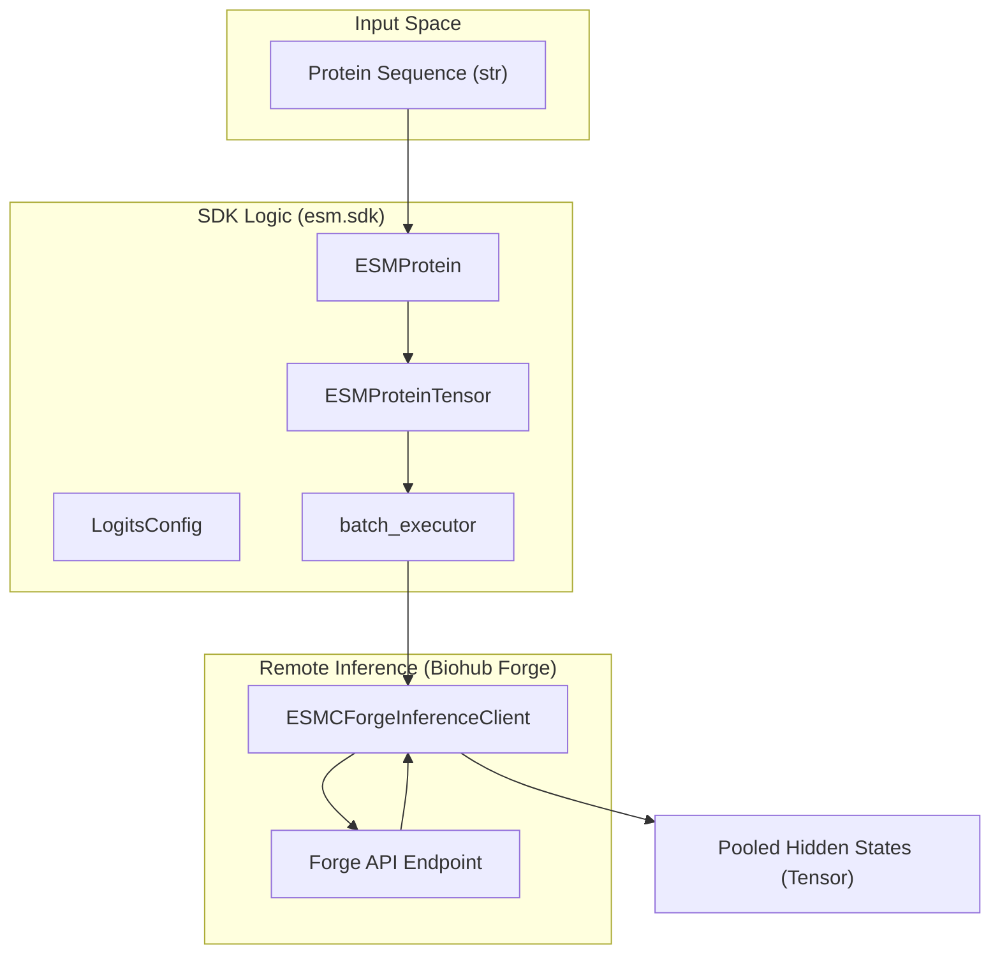
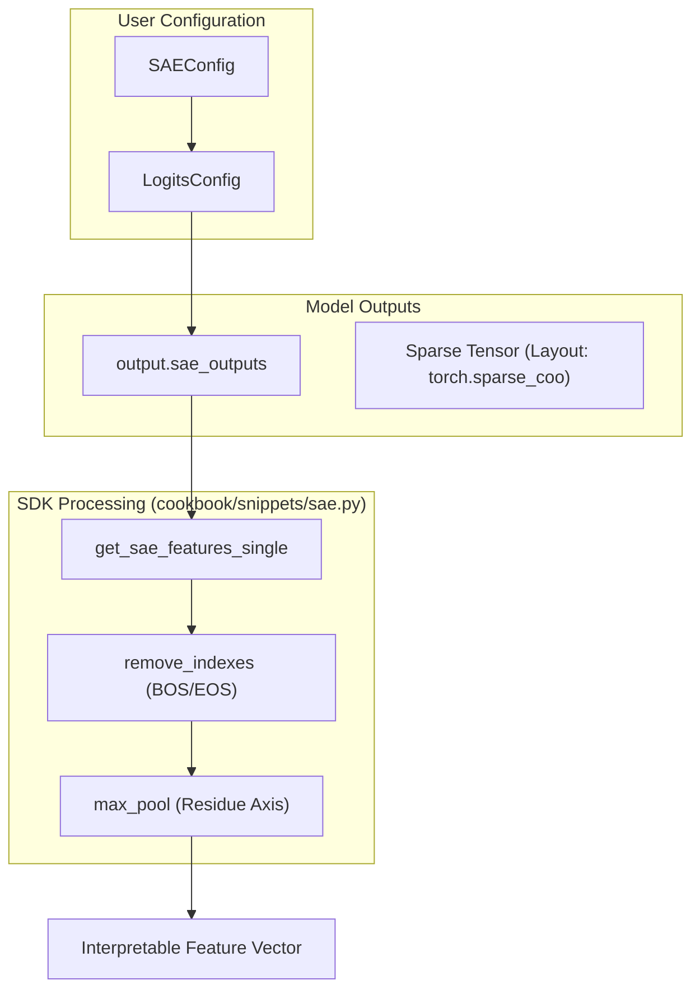

# ESMC Tutorials

> **Relevant source files**
> * [cookbook/snippets/esmc.py](https://github.com/Biohub/esm/blob/82ee3555/cookbook/snippets/esmc.py)
> * [cookbook/snippets/sae.py](https://github.com/Biohub/esm/blob/82ee3555/cookbook/snippets/sae.py)
> * [cookbook/snippets/sae_example.py](https://github.com/Biohub/esm/blob/82ee3555/cookbook/snippets/sae_example.py)
> * [cookbook/snippets/sparse_utils.py](https://github.com/Biohub/esm/blob/82ee3555/cookbook/snippets/sparse_utils.py)
> * [cookbook/tutorials/README.md](https://github.com/Biohub/esm/blob/82ee3555/cookbook/tutorials/README.md?plain=1)
> * [cookbook/tutorials/binder_design.py](https://github.com/Biohub/esm/blob/82ee3555/cookbook/tutorials/binder_design.py)
> * [cookbook/tutorials/embed.ipynb](https://github.com/Biohub/esm/blob/82ee3555/cookbook/tutorials/embed.ipynb)
> * [cookbook/tutorials/esmc_finetune.ipynb](https://github.com/Biohub/esm/blob/82ee3555/cookbook/tutorials/esmc_finetune.ipynb)
> * [cookbook/tutorials/esmc_layer_sweep.ipynb](https://github.com/Biohub/esm/blob/82ee3555/cookbook/tutorials/esmc_layer_sweep.ipynb)
> * [cookbook/tutorials/esmc_mutation_scoring.ipynb](https://github.com/Biohub/esm/blob/82ee3555/cookbook/tutorials/esmc_mutation_scoring.ipynb)
> * [cookbook/tutorials/esmc_sae_feature_interpretation.ipynb](https://github.com/Biohub/esm/blob/82ee3555/cookbook/tutorials/esmc_sae_feature_interpretation.ipynb)
> * [esm/models/esmfold2/prepare_input.py](https://github.com/Biohub/esm/blob/82ee3555/esm/models/esmfold2/prepare_input.py)

This page provides a detailed technical walkthrough of the ESMC (Evolutionary Scale Modeling - Sequence Only) tutorial notebooks. These tutorials demonstrate how to leverage the ESMC model family for sequence embedding, mutational analysis, functional classification, and interpretable feature extraction.

The ESMC model family focuses on sequence-only transformer architectures designed for high-throughput protein representation learning [cookbook/tutorials/esmc_layer_sweep.ipynb L10-L15](https://github.com/Biohub/esm/blob/82ee3555/cookbook/tutorials/esmc_layer_sweep.ipynb#L10-L15)

## Sequence Embedding and Hidden State Analysis

The foundational task for ESMC is generating numerical representations (embeddings) from raw protein sequences. The `embed.ipynb` notebook demonstrates how to interface with the Biohub platform to extract these representations.

### Implementation Flow

The embedding process involves three primary steps using the SDK:

1. **Client Initialization**: Creating an `ESMCInferenceClient` (specifically `ESMCForgeInferenceClient`) using `esmc_client` [cookbook/tutorials/embed.ipynb L64-L67](https://github.com/Biohub/esm/blob/82ee3555/cookbook/tutorials/embed.ipynb#L64-L67)
2. **Encoding**: Converting a raw string sequence into an `ESMProtein` object and then an `ESMProteinTensor` [cookbook/tutorials/embed.ipynb L92-L94](https://github.com/Biohub/esm/blob/82ee3555/cookbook/tutorials/embed.ipynb#L92-L94)
3. **Logits/Embedding Retrieval**: Calling the `.logits()` method with a `LogitsConfig` that specifies which layers and pooling strategies to return [cookbook/tutorials/embed.ipynb L87-L95](https://github.com/Biohub/esm/blob/82ee3555/cookbook/tutorials/embed.ipynb#L87-L95)

### Hidden State Strategies

For large models like **ESMC-6B** (80 layers), returning all hidden states for all positions is memory-intensive. The SDK supports two strategies:

* **Mean-Pooling**: Returning the average hidden state across the sequence for all layers simultaneously [cookbook/tutorials/embed.ipynb L107-L108](https://github.com/Biohub/esm/blob/82ee3555/cookbook/tutorials/embed.ipynb#L107-L108)
* **Layer Selection**: Requesting specific layers (e.g., the `ith_hidden_layer`) to reduce payload size [cookbook/tutorials/embed.ipynb L109-L111](https://github.com/Biohub/esm/blob/82ee3555/cookbook/tutorials/embed.ipynb#L109-L111)

### Data Flow for Sequence Embedding

The following diagram illustrates the flow from a raw sequence to a pooled embedding using the `batch_executor` for efficiency.

**Sequence Embedding Data Flow**

Sources: [cookbook/tutorials/embed.ipynb L84-L97](https://github.com/Biohub/esm/blob/82ee3555/cookbook/tutorials/embed.ipynb#L84-L97)

 [cookbook/tutorials/embed.ipynb L120-L126](https://github.com/Biohub/esm/blob/82ee3555/cookbook/tutorials/embed.ipynb#L120-L126)

---

## Mutation Scoring and Entropy Analysis

The `esmc_mutation_scoring.ipynb` tutorial focuses on zero-shot analysis of protein sequences, specifically using the **PETase** enzyme as a case study [cookbook/tutorials/esmc_mutation_scoring.ipynb L10-L15](https://github.com/Biohub/esm/blob/82ee3555/cookbook/tutorials/esmc_mutation_scoring.ipynb#L10-L15)

### Key Metrics

1. **Positional Entropy**: Calculated from the model's predicted probability distribution at a masked position. Low entropy indicates the model is highly certain about the amino acid, suggesting a constrained/conserved site [cookbook/tutorials/esmc_mutation_scoring.ipynb L41-L45](https://github.com/Biohub/esm/blob/82ee3555/cookbook/tutorials/esmc_mutation_scoring.ipynb#L41-L45)
2. **Log-Likelihood Ratios (LLRs)**: A comparison of the log-probability of a mutant amino acid ($x_{mut}$) versus the wild-type amino acid ($x_{wt}$): $$LLR = \log(P(x_{mut})) - \log(P(x_{wt}))$$ Positive LLRs suggest the mutation is tolerated or favored by the model's learned evolutionary distribution [cookbook/tutorials/esmc_mutation_scoring.ipynb L48-L51](https://github.com/Biohub/esm/blob/82ee3555/cookbook/tutorials/esmc_mutation_scoring.ipynb#L48-L51)

### Implementation

The tutorial uses `get_esmc_model_tokenizers()` to access the vocabulary and map model outputs back to amino acid identities [cookbook/tutorials/esmc_mutation_scoring.ipynb L110-L111](https://github.com/Biohub/esm/blob/82ee3555/cookbook/tutorials/esmc_mutation_scoring.ipynb#L110-L111)

 [cookbook/tutorials/esmc_mutation_scoring.ipynb L199-L201](https://github.com/Biohub/esm/blob/82ee3555/cookbook/tutorials/esmc_mutation_scoring.ipynb#L199-L201)

Sources: [cookbook/tutorials/esmc_mutation_scoring.ipynb L30-L51](https://github.com/Biohub/esm/blob/82ee3555/cookbook/tutorials/esmc_mutation_scoring.ipynb#L30-L51)

 [cookbook/tutorials/esmc_mutation_scoring.ipynb L196-L201](https://github.com/Biohub/esm/blob/82ee3555/cookbook/tutorials/esmc_mutation_scoring.ipynb#L196-L201)

---

## Layer Sweeps for Classification

The `esmc_layer_sweep.ipynb` notebook addresses the "optimal layer" problem. Transformers build representations hierarchically, and the final layer is not always the most informative for downstream tasks like Enzyme Commission (EC) classification [cookbook/tutorials/esmc_layer_sweep.ipynb L10-L12](https://github.com/Biohub/esm/blob/82ee3555/cookbook/tutorials/esmc_layer_sweep.ipynb#L10-L12)

### Sweep Workflow

1. **Dataset Preparation**: Fetching curated enzymes (e.g., SwissProt) with EC labels [cookbook/tutorials/esmc_layer_sweep.ipynb L53-L55](https://github.com/Biohub/esm/blob/82ee3555/cookbook/tutorials/esmc_layer_sweep.ipynb#L53-L55)
2. **Multi-Layer Extraction**: Extracting mean-pooled embeddings for all layers of a model (e.g., 36 layers for ESMC-600M) [cookbook/tutorials/esmc_layer_sweep.ipynb L115-L117](https://github.com/Biohub/esm/blob/82ee3555/cookbook/tutorials/esmc_layer_sweep.ipynb#L115-L117)
3. **Linear Probing**: Training a simple `LogisticRegression` classifier on each layer's embeddings using cross-validation [cookbook/tutorials/esmc_layer_sweep.ipynb L92-L95](https://github.com/Biohub/esm/blob/82ee3555/cookbook/tutorials/esmc_layer_sweep.ipynb#L92-L95)
4. **Performance Mapping**: Plotting the Matthews Correlation Coefficient (MCC) against the layer index to find the performance peak [cookbook/tutorials/esmc_layer_sweep.ipynb L51-L53](https://github.com/Biohub/esm/blob/82ee3555/cookbook/tutorials/esmc_layer_sweep.ipynb#L51-L53)

### Heuristics for Layer Selection

* **Functional Properties** (stability, solubility): Recommended second-to-last layer `[-2]` [cookbook/tutorials/esmc_layer_sweep.ipynb L48](https://github.com/Biohub/esm/blob/82ee3555/cookbook/tutorials/esmc_layer_sweep.ipynb#L48-L48)
* **High-level Similarity** (EC numbers, GO terms): Recommended layer ~3/4 of the way through the network [cookbook/tutorials/esmc_layer_sweep.ipynb L49](https://github.com/Biohub/esm/blob/82ee3555/cookbook/tutorials/esmc_layer_sweep.ipynb#L49-L49)

Sources: [cookbook/tutorials/esmc_layer_sweep.ipynb L35-L55](https://github.com/Biohub/esm/blob/82ee3555/cookbook/tutorials/esmc_layer_sweep.ipynb#L35-L55)

 [cookbook/tutorials/esmc_layer_sweep.ipynb L85-L101](https://github.com/Biohub/esm/blob/82ee3555/cookbook/tutorials/esmc_layer_sweep.ipynb#L85-L101)

---

## Fine-Tuning with PEFT (LoRA)

For tasks where zero-shot or linear probing is insufficient, the `esmc_finetune.ipynb` notebook demonstrates parameter-efficient fine-tuning (PEFT) using **LoRA** (Low-Rank Adaptation) [cookbook/tutorials/esmc_finetune.ipynb L8-L11](https://github.com/Biohub/esm/blob/82ee3555/cookbook/tutorials/esmc_finetune.ipynb#L8-L11)

### Integration with HuggingFace

The tutorial utilizes the `ESMCForSequenceClassification` class and the `peft` library [cookbook/tutorials/esmc_finetune.ipynb L40-L41](https://github.com/Biohub/esm/blob/82ee3555/cookbook/tutorials/esmc_finetune.ipynb#L40-L41)

 [cookbook/tutorials/esmc_finetune.ipynb L52](https://github.com/Biohub/esm/blob/82ee3555/cookbook/tutorials/esmc_finetune.ipynb#L52-L52)

1. **LoraConfig**: Defines the rank ($r$), alpha, and target modules (typically attention layers) for adaptation [cookbook/tutorials/esmc_finetune.ipynb L41](https://github.com/Biohub/esm/blob/82ee3555/cookbook/tutorials/esmc_finetune.ipynb#L41-L41)
2. **get_peft_model**: Wraps the base ESMC model with LoRA adapters, drastically reducing the number of trainable parameters [cookbook/tutorials/esmc_finetune.ipynb L41](https://github.com/Biohub/esm/blob/82ee3555/cookbook/tutorials/esmc_finetune.ipynb#L41-L41)

Sources: [cookbook/tutorials/esmc_finetune.ipynb L8-L12](https://github.com/Biohub/esm/blob/82ee3555/cookbook/tutorials/esmc_finetune.ipynb#L8-L12)

 [cookbook/tutorials/esmc_finetune.ipynb L36-L54](https://github.com/Biohub/esm/blob/82ee3555/cookbook/tutorials/esmc_finetune.ipynb#L36-L54)

---

## SAE Feature Interpretation

The `esmc_sae_feature_interpretation.ipynb` notebook introduces **Sparse Autoencoders (SAEs)** as a tool for mechanistic interpretability [cookbook/tutorials/esmc_sae_feature_interpretation.ipynb L10-L13](https://github.com/Biohub/esm/blob/82ee3555/cookbook/tutorials/esmc_sae_feature_interpretation.ipynb#L10-L13)

### Top-K SAE Architecture

The ESMC SAEs use a **Top-K** activation strategy:

* **Expansion**: Dense embeddings (e.g., from ESMC-6B) are expanded into a 16,384-dimensional feature space [cookbook/tutorials/esmc_sae_feature_interpretation.ipynb L22](https://github.com/Biohub/esm/blob/82ee3555/cookbook/tutorials/esmc_sae_feature_interpretation.ipynb#L22-L22)
* **Sparsity**: Only the top $k=64$ features are kept active per residue, forcing the model to decompose information into monosemantic "concepts" [cookbook/tutorials/esmc_sae_feature_interpretation.ipynb L20-L24](https://github.com/Biohub/esm/blob/82ee3555/cookbook/tutorials/esmc_sae_feature_interpretation.ipynb#L20-L24)

### SAE Implementation in SDK

Users request SAE features by passing an `SAEConfig` inside a `LogitsConfig` to the `client.logits()` method [cookbook/snippets/sae.py L24-L26](https://github.com/Biohub/esm/blob/82ee3555/cookbook/snippets/sae.py#L24-L26)

**SAE Feature Extraction Logic**

### Interpretation Workflow

1. **Feature Extraction**: Obtain unpooled features for a protein (e.g., ATP Synthase) [cookbook/tutorials/esmc_sae_feature_interpretation.ipynb L122-L126](https://github.com/Biohub/esm/blob/82ee3555/cookbook/tutorials/esmc_sae_feature_interpretation.ipynb#L122-L126)
2. **Peak Identification**: Find features with high activation on specific residues (e.g., Walker A/B motifs) [cookbook/tutorials/esmc_sae_feature_interpretation.ipynb L126-L127](https://github.com/Biohub/esm/blob/82ee3555/cookbook/tutorials/esmc_sae_feature_interpretation.ipynb#L126-L127)
3. **Normalization**: Use `normalize_features=True` to down-weight common, non-specific features using TF-IDF-like logic [cookbook/snippets/sae_example.py L15-L17](https://github.com/Biohub/esm/blob/82ee3555/cookbook/snippets/sae_example.py#L15-L17)

Sources: [cookbook/tutorials/esmc_sae_feature_interpretation.ipynb L14-L33](https://github.com/Biohub/esm/blob/82ee3555/cookbook/tutorials/esmc_sae_feature_interpretation.ipynb#L14-L33)

 [cookbook/snippets/sae.py L10-L41](https://github.com/Biohub/esm/blob/82ee3555/cookbook/snippets/sae.py#L10-L41)

 [cookbook/snippets/sae_example.py L8-L40](https://github.com/Biohub/esm/blob/82ee3555/cookbook/snippets/sae_example.py#L8-L40)