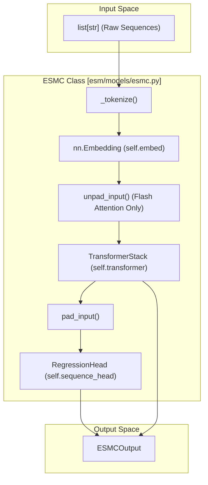

# ESMC – Sequence Embedding Model

> **Relevant source files**
> * [esm/layers/attention.py](https://github.com/Biohub/esm/blob/82ee3555/esm/layers/attention.py)
> * [esm/layers/blocks.py](https://github.com/Biohub/esm/blob/82ee3555/esm/layers/blocks.py)
> * [esm/models/esmc.py](https://github.com/Biohub/esm/blob/82ee3555/esm/models/esmc.py)
> * [esm/utils/misc.py](https://github.com/Biohub/esm/blob/82ee3555/esm/utils/misc.py)
> * [esm/utils/structure/input_builder.py](https://github.com/Biohub/esm/blob/82ee3555/esm/utils/structure/input_builder.py)

The **ESMC** (Evolutionary Scale Modeling - Core) is a sequence-only transformer model designed for efficient protein sequence embedding and masked language modeling. Unlike the multimodal ESM3, ESMC focuses exclusively on the amino acid sequence track, utilizing a streamlined architecture that supports high-performance inference through Flash Attention and optimized variable-length sequence handling.

## Architecture Overview

The ESMC architecture consists of a sequence embedding layer, a stack of transformer blocks, and a regression head for sequence token prediction. It is implemented in the `ESMC` class, which inherits from both `nn.Module` and `ESMCInferenceClient` [esm/models/esmc.py L45-L53](https://github.com/Biohub/esm/blob/82ee3555/esm/models/esmc.py#L45-L53)

### Key Components

| Component | Description | Code Entity |
| --- | --- | --- |
| **Embedding Layer** | Maps sequence tokens to the model's hidden dimension ($d_{model}$). | `self.embed` [esm/models/esmc.py L64](https://github.com/Biohub/esm/blob/82ee3555/esm/models/esmc.py#L64-L64) |
| **Transformer Backbone** | A stack of transformer layers with optional Flash Attention support. | `self.transformer` [esm/models/esmc.py L67-L74](https://github.com/Biohub/esm/blob/82ee3555/esm/models/esmc.py#L67-L74) |
| **Sequence Head** | A regression head that predicts logits over the 64-token amino acid vocabulary. | `self.sequence_head` [esm/models/esmc.py L76](https://github.com/Biohub/esm/blob/82ee3555/esm/models/esmc.py#L76-L76) |
| **Tokenizer** | Handles conversion between raw strings and integer tensors. | `self.tokenizer` [esm/models/esmc.py L77](https://github.com/Biohub/esm/blob/82ee3555/esm/models/esmc.py#L77-L77) |

Sources:

* [esm/models/esmc.py L45-L78](https://github.com/Biohub/esm/blob/82ee3555/esm/models/esmc.py#L45-L78)
* [esm/layers/transformer_stack.py L17-L50](https://github.com/Biohub/esm/blob/82ee3555/esm/layers/transformer_stack.py#L17-L50)

---

## Data Flow & Forward Pass

The ESMC forward pass is optimized for batching variable-length sequences. It employs a "pad-unpad" strategy when Flash Attention is enabled to avoid redundant computation on padding tokens.

### Sequence Processing Diagram

The following diagram illustrates the flow from raw sequence input to model output, highlighting the interaction between the `ESMC` class and the underlying `TransformerStack`.

**ESMC Sequence Processing Flow**



### Implementation Details

1. **Tokenization**: Raw sequences are tokenized using `encoding.tokenize_sequence` and stacked into a batch using `stack_variable_length_tensors` [esm/models/esmc.py L106-L115](https://github.com/Biohub/esm/blob/82ee3555/esm/models/esmc.py#L106-L115)
2. **Unpadding**: If `use_flash_attn` is True, the model uses `unpad_input` to flatten the batch into a single sequence of non-padding tokens [esm/models/esmc.py L151-L163](https://github.com/Biohub/esm/blob/82ee3555/esm/models/esmc.py#L151-L163)
3. **Transformer Execution**: The `TransformerStack` processes the tokens. It uses `FlashMultiHeadAttention` if enabled, which requires a boolean `sequence_id` mask [esm/layers/attention.py L99-L143](https://github.com/Biohub/esm/blob/82ee3555/esm/layers/attention.py#L99-L143)
4. **Repadding**: After the transformer blocks, the flattened tensors are restored to their original `[B, L, D]` shape using `pad_input` before being passed to the output head [esm/models/esmc.py L171-L180](https://github.com/Biohub/esm/blob/82ee3555/esm/models/esmc.py#L171-L180)

Sources:

* [esm/models/esmc.py L123-L191](https://github.com/Biohub/esm/blob/82ee3555/esm/models/esmc.py#L123-L191)
* [esm/layers/attention.py L99-L143](https://github.com/Biohub/esm/blob/82ee3555/esm/layers/attention.py#L99-L143)
* [esm/utils/misc.py L180-L210](https://github.com/Biohub/esm/blob/82ee3555/esm/utils/misc.py#L180-L210)

---

## Flash Attention & Variable Length Support

ESMC is built to handle the high-throughput requirements of protein sequence embedding. It integrates `flash_attn` for both memory efficiency and speed.

### Flash Attention Integration

The `FlashMultiHeadAttention` class [esm/layers/attention.py L99](https://github.com/Biohub/esm/blob/82ee3555/esm/layers/attention.py#L99-L99)

 implements the optimized attention mechanism. It uses `TritonRotaryEmbedding` for positional encoding [esm/layers/attention.py L108](https://github.com/Biohub/esm/blob/82ee3555/esm/layers/attention.py#L108-L108)

 and calls `flash_attn_varlen_qkvpacked_func` for the core computation [esm/layers/attention.py L138](https://github.com/Biohub/esm/blob/82ee3555/esm/layers/attention.py#L138-L138)

### Constraints

* **Boolean Masks**: When using Flash Attention, the `sequence_id` must be a boolean mask [esm/models/esmc.py L156-L158](https://github.com/Biohub/esm/blob/82ee3555/esm/models/esmc.py#L156-L158)
* **Attention Weights**: Flash Attention does not support returning attention weights. If `output_attentions=True` is requested, the model must fall back to standard `MultiHeadAttention` [esm/models/esmc.py L152-L155](https://github.com/Biohub/esm/blob/82ee3555/esm/models/esmc.py#L152-L155)

Sources:

* [esm/layers/attention.py L99-L143](https://github.com/Biohub/esm/blob/82ee3555/esm/layers/attention.py#L99-L143)
* [esm/models/esmc.py L151-L165](https://github.com/Biohub/esm/blob/82ee3555/esm/models/esmc.py#L151-L165)

---

## Model Outputs: ESMCOutput

The model returns an `ESMCOutput` dataclass containing the following fields:

| Field | Type | Description |
| --- | --- | --- |
| `sequence_logits` | `torch.Tensor` | Logits over the amino acid vocabulary. |
| `embeddings` | `torch.Tensor` | Final hidden state of the model. |
| `hidden_states` | `torch.Tensor` | A stack of hidden states from all transformer layers. |
| `attentions` | `tuple[torch.Tensor]` | (Optional) Attention maps if Flash Attention is disabled. |

Sources:

* [esm/models/esmc.py L37-L42](https://github.com/Biohub/esm/blob/82ee3555/esm/models/esmc.py#L37-L42)

---

## Pretrained Factory & Variants

The `ESMC.from_pretrained` factory function provides a unified interface for loading different model scales.

### Loading a Model

```markdown
# Example: Loading the 600M variantmodel = ESMC.from_pretrained("esmc_600m", device="cuda")
```

### Supported Variants

The model scale is determined by the `d_model`, `n_heads`, and `n_layers` parameters passed to the `ESMC` constructor during the loading process via `load_local_model` [esm/models/esmc.py L80-L96](https://github.com/Biohub/esm/blob/82ee3555/esm/models/esmc.py#L80-L96)

 Common variants include:

* **ESMC 300M**
* **ESMC 600M** (Default) [esm/utils/constants/models.py L10](https://github.com/Biohub/esm/blob/82ee3555/esm/utils/constants/models.py#L10-L10)
* **ESMC 6B**

Sources:

* [esm/models/esmc.py L79-L96](https://github.com/Biohub/esm/blob/82ee3555/esm/models/esmc.py#L79-L96)
* [esm/pretrained.py](https://github.com/Biohub/esm/blob/82ee3555/esm/pretrained.py)
* [esm/utils/constants/models.py L10](https://github.com/Biohub/esm/blob/82ee3555/esm/utils/constants/models.py#L10-L10)

---

## SDK Interface Implementation

`ESMC` implements the `ESMCInferenceClient` interface, providing high-level methods for protein analysis:

* **`encode(input: ESMProtein)`**: Converts an `ESMProtein` object into an `ESMProteinTensor` by tokenizing the sequence [esm/models/esmc.py L193-L202](https://github.com/Biohub/esm/blob/82ee3555/esm/models/esmc.py#L193-L202)
* **`decode(input: ESMProteinTensor)`**: Converts tensors back into an `ESMProtein` object [esm/models/esmc.py L204-L213](https://github.com/Biohub/esm/blob/82ee3555/esm/models/esmc.py#L204-L213)
* **`logits(...)`**: Returns the sequence logits for a given protein tensor, supporting both single and batched inputs [esm/models/esmc.py L215-L224](https://github.com/Biohub/esm/blob/82ee3555/esm/models/esmc.py#L215-L224)

Sources:

* [esm/models/esmc.py L193-L224](https://github.com/Biohub/esm/blob/82ee3555/esm/models/esmc.py#L193-L224)
* [esm/sdk/api.py](https://github.com/Biohub/esm/blob/82ee3555/esm/sdk/api.py)