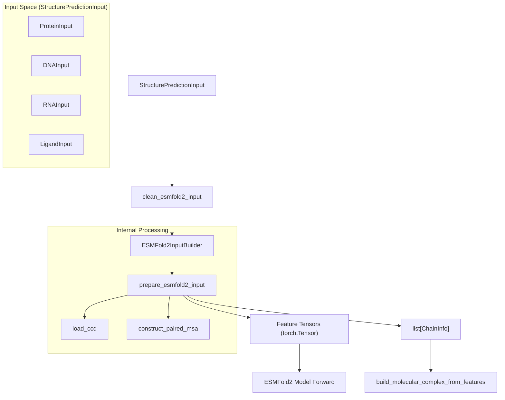
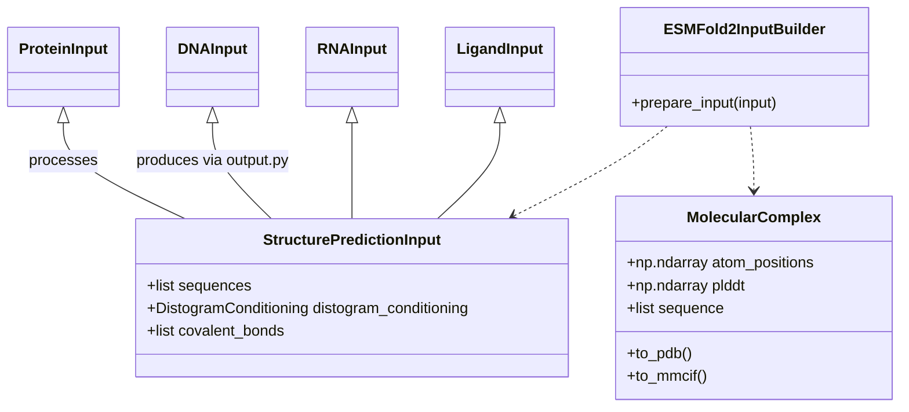

# ESMFold2 – All-Atom Structure Prediction

> **Relevant source files**
> * [cookbook/tutorials/binder_design.ipynb](https://github.com/Biohub/esm/blob/82ee3555/cookbook/tutorials/binder_design.ipynb)
> * [cookbook/tutorials/esmc_sae_feature_interpretation.ipynb](https://github.com/Biohub/esm/blob/82ee3555/cookbook/tutorials/esmc_sae_feature_interpretation.ipynb)
> * [esm/models/esmfold2/conformers.py](https://github.com/Biohub/esm/blob/82ee3555/esm/models/esmfold2/conformers.py)
> * [esm/models/esmfold2/constants.py](https://github.com/Biohub/esm/blob/82ee3555/esm/models/esmfold2/constants.py)
> * [esm/models/esmfold2/output.py](https://github.com/Biohub/esm/blob/82ee3555/esm/models/esmfold2/output.py)
> * [esm/models/esmfold2/paired_msa.py](https://github.com/Biohub/esm/blob/82ee3555/esm/models/esmfold2/paired_msa.py)
> * [esm/models/esmfold2/prepare_input.py](https://github.com/Biohub/esm/blob/82ee3555/esm/models/esmfold2/prepare_input.py)
> * [esm/models/esmfold2/processor.py](https://github.com/Biohub/esm/blob/82ee3555/esm/models/esmfold2/processor.py)
> * [esm/models/esmfold2/types.py](https://github.com/Biohub/esm/blob/82ee3555/esm/models/esmfold2/types.py)
> * [esm/utils/constants/models.py](https://github.com/Biohub/esm/blob/82ee3555/esm/utils/constants/models.py)

ESMFold2 is a diffusion-based structure prediction pipeline designed for high-accuracy all-atom modeling of proteins, nucleic acids, and small molecule ligands. Unlike the original ESMFold which used a folding trunk to predict coordinates directly, ESMFold2 leverages a generative approach to handle complex hetero-complexes and multi-chain assemblies.

## Pipeline Overview

The ESMFold2 pipeline follows a structured flow from high-level sequence and constraint definitions to low-level tensor representations, culminating in a diffusion-based structure generation process.

### Code Entity Space to System Flow

The following diagram bridges the high-level input types to the internal processing classes used to prepare data for the model.

Sources: [esm/models/esmfold2/processor.py L143-L186](https://github.com/Biohub/esm/blob/82ee3555/esm/models/esmfold2/processor.py#L143-L186)

 [esm/models/esmfold2/prepare_input.py L1-L5](https://github.com/Biohub/esm/blob/82ee3555/esm/models/esmfold2/prepare_input.py#L1-L5)

## Input Specification

The entry point for all predictions is the `StructurePredictionInput` dataclass. It serves as a container for sequences, Multiple Sequence Alignments (MSAs), and spatial conditioning.

### Support for Hetero-complexes

ESMFold2 supports a variety of molecular inputs defined in `esm.models.esmfold2.types`:

* **`ProteinInput`**: Supports amino acid sequences, MSAs, and post-translational `Modification` objects [esm/models/esmfold2/types.py L11-L19](https://github.com/Biohub/esm/blob/82ee3555/esm/models/esmfold2/types.py#L11-L19)
* **`DNAInput` / `RNAInput`**: Supports nucleic acid sequences [esm/models/esmfold2/types.py L14-L18](https://github.com/Biohub/esm/blob/82ee3555/esm/models/esmfold2/types.py#L14-L18)
* **`LigandInput`**: Supports small molecules defined by Chemical Component Dictionary (CCD) codes [esm/models/esmfold2/types.py L15-L19](https://github.com/Biohub/esm/blob/82ee3555/esm/models/esmfold2/types.py#L15-L19)

### Conditioning and Constraints

Predictions can be guided by external information:

* **`DistogramConditioning`**: Provides distance constraints between specific atoms [esm/models/esmfold2/types.py L13-L19](https://github.com/Biohub/esm/blob/82ee3555/esm/models/esmfold2/types.py#L13-L19)
* **`CovalentBond`**: Explicitly defines bonds between entities, such as protein-ligand linkages [esm/models/esmfold2/types.py L12-L19](https://github.com/Biohub/esm/blob/82ee3555/esm/models/esmfold2/types.py#L12-L19)

## Input Preparation & Tokenization

The `ESMFold2InputBuilder` orchestrates the conversion of high-level inputs into model-ready tensors.

### The Cleaning Phase

Before tokenization, `clean_esmfold2_input` handles sequence normalization. It expands polyprotein sequences (separated by `|`) into individual `ProteinInput` objects and groups identical sequences to optimize the MSA representation [esm/models/esmfold2/processor.py L86-L181](https://github.com/Biohub/esm/blob/82ee3555/esm/models/esmfold2/processor.py#L86-L181)

 This function also converts `|` chainbreak tokens to `:` in the sequence and raises an error if `covalent_bonds` are provided with chainbreaks [esm/models/esmfold2/processor.py L94-L112](https://github.com/Biohub/esm/blob/82ee3555/esm/models/esmfold2/processor.py#L94-L112)

### Atom and Token Generation

The core logic resides in `prepare_esmfold2_input`. This function iterates through the provided sequences to build two primary metadata lists:

1. **`TokenInfo`**: Metadata for every residue or atom-token (in the case of ligands/modifications), tracking `asym_id`, `entity_id`, and `res_type` [esm/models/esmfold2/prepare_input.py L81-L93](https://github.com/Biohub/esm/blob/82ee3555/esm/models/esmfold2/prepare_input.py#L81-L93)
2. **`AtomInfo`**: Detailed metadata for every atom, including element symbols, atomic numbers, and idealized coordinates retrieved from the CCD [esm/models/esmfold2/prepare_input.py L68-L78](https://github.com/Biohub/esm/blob/82ee3555/esm/models/esmfold2/prepare_input.py#L68-L78)

The `tokenize_protein` function handles protein sequences, applying modifications and generating tokens and atoms. Modified residues are atom-tokenized (one token per atom), while standard residues produce one token with all heavy atoms [esm/models/esmfold2/prepare_input.py L190-L205](https://github.com/Biohub/esm/blob/82ee3555/esm/models/esmfold2/prepare_input.py#L190-L205)

 Similarly, `tokenize_dna`, `tokenize_rna`, and `tokenize_ligand` handle their respective molecule types.

### CCD Conformer Loading

For ligands and modified residues, ESMFold2 uses the Chemical Component Dictionary (CCD). The `load_ccd` utility downloads or loads a serialized RDKit-based dictionary to provide "Computed" or "Ideal" coordinates for atom-level initialization [esm/models/esmfold2/conformers.py L36-L76](https://github.com/Biohub/esm/blob/82ee3555/esm/models/esmfold2/conformers.py#L36-L76)

 The `get_idealized_atom_pos` and `get_ligand_idealized_atom_pos` functions retrieve these positions based on residue type or name and atom name [esm/models/esmfold2/conformers.py L155-L192](https://github.com/Biohub/esm/blob/82ee3555/esm/models/esmfold2/conformers.py#L155-L192)

Sources: [esm/models/esmfold2/prepare_input.py L176-L203](https://github.com/Biohub/esm/blob/82ee3555/esm/models/esmfold2/prepare_input.py#L176-L203)

 [esm/models/esmfold2/processor.py L143-L152](https://github.com/Biohub/esm/blob/82ee3555/esm/models/esmfold2/processor.py#L143-L152)

## Multiple Sequence Alignment (MSA)

ESMFold2 utilizes paired MSAs for multi-chain protein complexes. The `construct_paired_msa` function is responsible for this process [esm/models/esmfold2/paired_msa.py L105](https://github.com/Biohub/esm/blob/82ee3555/esm/models/esmfold2/paired_msa.py#L105-L105)

| Feature | Implementation |
| --- | --- |
| **Taxonomy Pairing** | Uses `key=N` tokens in FASTA headers to pair sequences from the same organism [esm/models/esmfold2/paired_msa.py L3-L7](https://github.com/Biohub/esm/blob/82ee3555/esm/models/esmfold2/paired_msa.py#L3-L7)    The `_taxonomy_from_header` function extracts this information [esm/models/esmfold2/paired_msa.py L35-L39](https://github.com/Biohub/esm/blob/82ee3555/esm/models/esmfold2/paired_msa.py#L35-L39) |
| **Block-Diagonalization** | Unpaired sequences are placed in chain-specific blocks to prevent false inter-chain correlations [esm/models/esmfold2/paired_msa.py L192-L200](https://github.com/Biohub/esm/blob/82ee3555/esm/models/esmfold2/paired_msa.py#L192-L200) |
| **Insertion Handling** | Strips lowercase letters and `.` from A3M formats, storing them as `deletion_count` [esm/models/esmfold2/paired_msa.py L42-L78](https://github.com/Biohub/esm/blob/82ee3555/esm/models/esmfold2/paired_msa.py#L42-L78)    The `msa_to_res_type_and_deletions` function performs this conversion [esm/models/esmfold2/paired_msa.py L42-L87](https://github.com/Biohub/esm/blob/82ee3555/esm/models/esmfold2/paired_msa.py#L42-L87) |

The `construct_paired_msa` function takes `chain_msas`, `chain_query_res_types`, `token_asym_ids`, and `token_res_ids` as input to build the final MSA features [esm/models/esmfold2/paired_msa.py L105-L120](https://github.com/Biohub/esm/blob/82ee3555/esm/models/esmfold2/paired_msa.py#L105-L120)

 It returns `msa_residues`, `deletion_value`, and `is_paired` arrays [esm/models/esmfold2/paired_msa.py L125-L130](https://github.com/Biohub/esm/blob/82ee3555/esm/models/esmfold2/paired_msa.py#L125-L130)

Sources: [esm/models/esmfold2/paired_msa.py L86-L121](https://github.com/Biohub/esm/blob/82ee3555/esm/models/esmfold2/paired_msa.py#L86-L121)

## Output Construction

After the model performs the forward pass (diffusion sampling), the raw coordinate tensors must be mapped back to a structured molecular format.

### MolecularComplex Assembly

The `build_molecular_complex_from_features` function performs the following steps:

1. **Filtering**: Applies the `atom_mask` to remove non-existent or unpredicted atoms [esm/models/esmfold2/output.py L33-L37](https://github.com/Biohub/esm/blob/82ee3555/esm/models/esmfold2/output.py#L33-L37)
2. **Mapping**: Uses `chain_infos` (the metadata generated during input prep) to assign atoms to their respective residues and chains [esm/models/esmfold2/output.py L52-L56](https://github.com/Biohub/esm/blob/82ee3555/esm/models/esmfold2/output.py#L52-L56)
3. **Ligand Collapse**: For non-polymer chains (`MOL_TYPE_NONPOLYMER`), it collapses multiple atom-tokens into a single residue entry for the final `MolecularComplex` [esm/models/esmfold2/output.py L57-L82](https://github.com/Biohub/esm/blob/82ee3555/esm/models/esmfold2/output.py#L57-L82)
4. **Confidence Extraction**: Maps per-token pLDDT scores from the model back to the residues [esm/models/esmfold2/output.py L92-L94](https://github.com/Biohub/esm/blob/82ee3555/esm/models/esmfold2/output.py#L92-L94)

### Result Mapping

The output is encapsulated in a `MolecularComplex`, which provides methods for exporting to PDB or mmCIF formats via `esm.utils.structure.molecular_complex`.

Sources: [esm/models/esmfold2/output.py L18-L126](https://github.com/Biohub/esm/blob/82ee3555/esm/models/esmfold2/output.py#L18-L126)

 [esm/models/esmfold2/processor.py L10-L18](https://github.com/Biohub/esm/blob/82ee3555/esm/models/esmfold2/processor.py#L10-L18)