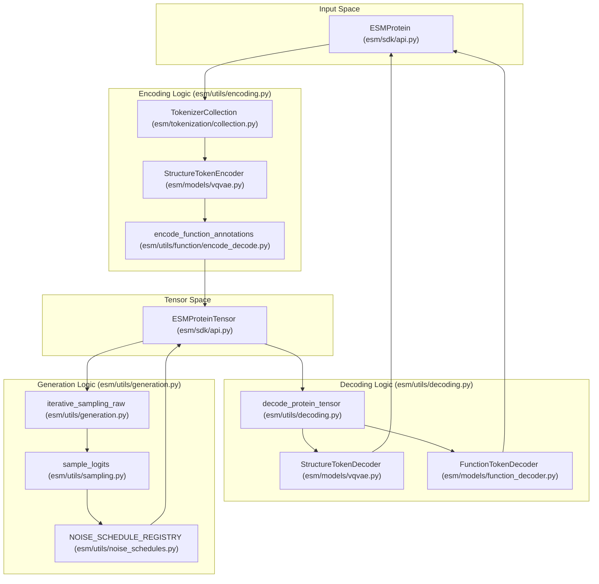

# Encoding, Decoding & Generation Pipeline

> **Relevant source files**
> * [esm/utils/decoding.py](https://github.com/Biohub/esm/blob/82ee3555/esm/utils/decoding.py)
> * [esm/utils/encoding.py](https://github.com/Biohub/esm/blob/82ee3555/esm/utils/encoding.py)
> * [esm/utils/generation.py](https://github.com/Biohub/esm/blob/82ee3555/esm/utils/generation.py)
> * [esm/utils/sampling.py](https://github.com/Biohub/esm/blob/82ee3555/esm/utils/sampling.py)

The ESM3 ecosystem revolves around a unified pipeline that converts high-level protein descriptions into discrete tensor representations, performs iterative generation via masked language modeling, and decodes those tensors back into physically realizable protein structures and annotations. This lifecycle is managed by the `ESM3InferenceClient` and supported by specialized utility modules in `esm.utils`.

### High-Level Pipeline Flow

The pipeline operates across three primary stages:

1. **Encoding**: Converting an `ESMProtein` object (containing sequences, coordinates, and labels) into an `ESMProteinTensor` using track-specific tokenizers and VQ-VAE encoders.
2. **Generation**: Using the transformer backbone to fill in masked tokens across multiple tracks (sequence, structure, function, etc.) through iterative sampling.
3. **Decoding**: Converting the predicted `ESMProteinTensor` back into an `ESMProtein` object, which involves backbone reconstruction from structure tokens and keyword extraction from function tokens.

### Data Flow Diagram

The following diagram maps the conceptual pipeline stages to the specific code entities and data structures used in the ESM repository.

**Pipeline Entity Mapping**

**Sources:** [esm/sdk/api.py L11-L21](https://github.com/Biohub/esm/blob/82ee3555/esm/sdk/api.py#L11-L21)

 [esm/utils/encoding.py L144-L152](https://github.com/Biohub/esm/blob/82ee3555/esm/utils/encoding.py#L144-L152)

 [esm/utils/decoding.py L31-L36](https://github.com/Biohub/esm/blob/82ee3555/esm/utils/decoding.py#L31-L36)

 [esm/utils/generation.py L99-L103](https://github.com/Biohub/esm/blob/82ee3555/esm/utils/generation.py#L99-L103)

---

### 6.1 Encoding Proteins into Tensors

The encoding phase transforms human-readable protein data into the discrete multi-track format required by ESM3. This process involves:

* **Sequence Tokenization**: Mapping amino acids to vocabulary indices using `tokenize_sequence` [esm/utils/encoding.py L35-L45](https://github.com/Biohub/esm/blob/82ee3555/esm/utils/encoding.py#L35-L45)
* **Structure Quantization**: Using the `StructureTokenEncoder` [esm/models/vqvae.py L6](https://github.com/Biohub/esm/blob/82ee3555/esm/models/vqvae.py#L6-L6)  via `tokenize_structure` [esm/utils/encoding.py L48-L97](https://github.com/Biohub/esm/blob/82ee3555/esm/utils/encoding.py#L48-L97)  to map 3D coordinates into discrete structure tokens.
* **Function Encoding**: Converting `FunctionAnnotation` objects into multi-depth tensors using `encode_function_annotations` [esm/utils/function/encode_decode.py L13-L19](https://github.com/Biohub/esm/blob/82ee3555/esm/utils/function/encode_decode.py#L13-L19)  and `tokenize_function_annotations` [esm/utils/encoding.py L138-L152](https://github.com/Biohub/esm/blob/82ee3555/esm/utils/encoding.py#L138-L152)
* **Special Tokens**: Automatic addition of `BOS` (Beginning of Sequence) and `EOS` (End of Sequence) tokens to every track, as seen in `get_default_sequence_tokens` [esm/utils/encoding.py L156-L169](https://github.com/Biohub/esm/blob/82ee3555/esm/utils/encoding.py#L156-L169)

For details, see [Encoding Proteins into Tensors](/Biohub/esm/6.1-encoding-proteins-into-tensors).

**Sources:** [esm/utils/encoding.py L35-L45](https://github.com/Biohub/esm/blob/82ee3555/esm/utils/encoding.py#L35-L45)

 [esm/models/vqvae.py L6](https://github.com/Biohub/esm/blob/82ee3555/esm/models/vqvae.py#L6-L6)

 [esm/utils/encoding.py L48-L97](https://github.com/Biohub/esm/blob/82ee3555/esm/utils/encoding.py#L48-L97)

 [esm/utils/function/encode_decode.py L13-L19](https://github.com/Biohub/esm/blob/82ee3555/esm/utils/function/encode_decode.py#L13-L19)

 [esm/utils/encoding.py L138-L152](https://github.com/Biohub/esm/blob/82ee3555/esm/utils/encoding.py#L138-L152)

 [esm/utils/encoding.py L156-L169](https://github.com/Biohub/esm/blob/82ee3555/esm/utils/encoding.py#L156-L169)

---

### 6.2 Decoding Tensors Back to Proteins

Decoding is the inverse process, reconstructing physical properties from model outputs. Key components include:

* **Backbone Reconstruction**: The `StructureTokenDecoder` [esm/models/vqvae.py L10](https://github.com/Biohub/esm/blob/82ee3555/esm/models/vqvae.py#L10-L10)  converts structure tokens back into 3D coordinates via `decode_structure` [esm/utils/decoding.py L138-L169](https://github.com/Biohub/esm/blob/82ee3555/esm/utils/decoding.py#L138-L169)  The pipeline then uses `ProteinChain.infer_oxygen()` [esm/utils/decoding.py L168](https://github.com/Biohub/esm/blob/82ee3555/esm/utils/decoding.py#L168-L168)  to complete the backbone.
* **Annotation Merging**: `decode_function_tokens` [esm/utils/function/encode_decode.py L84-L91](https://github.com/Biohub/esm/blob/82ee3555/esm/utils/function/encode_decode.py#L84-L91)  uses a `FunctionTokenDecoder` [esm/models/function_decoder.py L9](https://github.com/Biohub/esm/blob/82ee3555/esm/models/function_decoder.py#L9-L9)  to convert high-dimensional logits into a list of `FunctionAnnotation` objects.
* **Metric Extraction**: The decoder extracts confidence metrics like `pLDDT`, `pTM`, and `PAE` directly from the structure decoder's output [esm/utils/decoding.py L159-L165](https://github.com/Biohub/esm/blob/82ee3555/esm/utils/decoding.py#L159-L165)

For details, see [Decoding Tensors Back to Proteins](/Biohub/esm/6.2-decoding-tensors-back-to-proteins).

**Sources:** [esm/models/vqvae.py L10](https://github.com/Biohub/esm/blob/82ee3555/esm/models/vqvae.py#L10-L10)

 [esm/utils/decoding.py L138-L169](https://github.com/Biohub/esm/blob/82ee3555/esm/utils/decoding.py#L138-L169)

 [esm/utils/decoding.py L168](https://github.com/Biohub/esm/blob/82ee3555/esm/utils/decoding.py#L168-L168)

 [esm/utils/function/encode_decode.py L84-L91](https://github.com/Biohub/esm/blob/82ee3555/esm/utils/function/encode_decode.py#L84-L91)

 [esm/models/function_decoder.py L9](https://github.com/Biohub/esm/blob/82ee3555/esm/models/function_decoder.py#L9-L9)

 [esm/utils/decoding.py L159-L165](https://github.com/Biohub/esm/blob/82ee3555/esm/utils/decoding.py#L159-L165)

---

### 6.3 Iterative Masked Generation

Generation in ESM3 is an iterative process where the model unmasks tokens over a series of steps. The `iterative_sampling_raw` function [esm/utils/generation.py L99-L128](https://github.com/Biohub/esm/blob/82ee3555/esm/utils/generation.py#L99-L128)

 orchestrates this by:

* **Noise Scheduling**: Determining the unmasking rate using schedules like `cosine`, `linear`, or `cubic` from the `NOISE_SCHEDULE_REGISTRY` [esm/utils/noise_schedules.py L1](https://github.com/Biohub/esm/blob/82ee3555/esm/utils/noise_schedules.py#L1-L1)
* **Multi-Track Sampling**: Simultaneously sampling sequence, structure, and function tracks using functions like `sample_logits` [esm/utils/sampling.py L153-L197](https://github.com/Biohub/esm/blob/82ee3555/esm/utils/sampling.py#L153-L197)  `sample_function_logits` [esm/utils/sampling.py L201-L206](https://github.com/Biohub/esm/blob/82ee3555/esm/utils/sampling.py#L201-L206)  and `sample_residue_annotation_logits` [esm/utils/sampling.py L208-L213](https://github.com/Biohub/esm/blob/82ee3555/esm/utils/sampling.py#L208-L213)  while maintaining consistency between them.
* **Temperature Control**: Applying sampling temperatures defined in `SamplingTrackConfig` [esm/sdk/api.py L20](https://github.com/Biohub/esm/blob/82ee3555/esm/sdk/api.py#L20-L20)  to control the diversity of the generated proteins.

For details, see [Iterative Masked Generation](/Biohub/esm/6.3-iterative-masked-generation).

**Sources:** [esm/utils/generation.py L99-L128](https://github.com/Biohub/esm/blob/82ee3555/esm/utils/generation.py#L99-L128)

 [esm/utils/noise_schedules.py L1](https://github.com/Biohub/esm/blob/82ee3555/esm/utils/noise_schedules.py#L1-L1)

 [esm/utils/sampling.py L153-L197](https://github.com/Biohub/esm/blob/82ee3555/esm/utils/sampling.py#L153-L197)

 [esm/utils/sampling.py L201-L206](https://github.com/Biohub/esm/blob/82ee3555/esm/utils/sampling.py#L201-L206)

 [esm/utils/sampling.py L208-L213](https://github.com/Biohub/esm/blob/82ee3555/esm/utils/sampling.py#L208-L213)

 [esm/sdk/api.py L20](https://github.com/Biohub/esm/blob/82ee3555/esm/sdk/api.py#L20-L20)

---

### Utility Entity Association

This table bridges the high-level pipeline concepts to the specific classes and functions implemented in the codebase.

| Pipeline Stage | Code Entity | File Path |
| --- | --- | --- |
| **Encoding** | `tokenize_structure` | [esm/utils/encoding.py L48](https://github.com/Biohub/esm/blob/82ee3555/esm/utils/encoding.py#L48-L48) |
| **Encoding** | `encode_function_annotations` | [esm/utils/function/encode_decode.py L13](https://github.com/Biohub/esm/blob/82ee3555/esm/utils/function/encode_decode.py#L13-L13) |
| **Generation** | `iterative_sampling_raw` | [esm/utils/generation.py L99](https://github.com/Biohub/esm/blob/82ee3555/esm/utils/generation.py#L99-L99) |
| **Generation** | `get_sampling_mask` | [esm/utils/sampling.py L29](https://github.com/Biohub/esm/blob/82ee3555/esm/utils/sampling.py#L29-L29) |
| **Decoding** | `decode_protein_tensor` | [esm/utils/decoding.py L31](https://github.com/Biohub/esm/blob/82ee3555/esm/utils/decoding.py#L31-L31) |
| **Decoding** | `decode_structure` | [esm/utils/decoding.py L138](https://github.com/Biohub/esm/blob/82ee3555/esm/utils/decoding.py#L138-L138) |

**Sources:** [esm/utils/encoding.py L48-L54](https://github.com/Biohub/esm/blob/82ee3555/esm/utils/encoding.py#L48-L54)

 [esm/utils/function/encode_decode.py L13-L19](https://github.com/Biohub/esm/blob/82ee3555/esm/utils/function/encode_decode.py#L13-L19)

 [esm/utils/generation.py L99-L103](https://github.com/Biohub/esm/blob/82ee3555/esm/utils/generation.py#L99-L103)

 [esm/utils/sampling.py L29](https://github.com/Biohub/esm/blob/82ee3555/esm/utils/sampling.py#L29-L29)

 [esm/utils/decoding.py L31-L36](https://github.com/Biohub/esm/blob/82ee3555/esm/utils/decoding.py#L31-L36)

 [esm/utils/decoding.py L138-L143](https://github.com/Biohub/esm/blob/82ee3555/esm/utils/decoding.py#L138-L143)