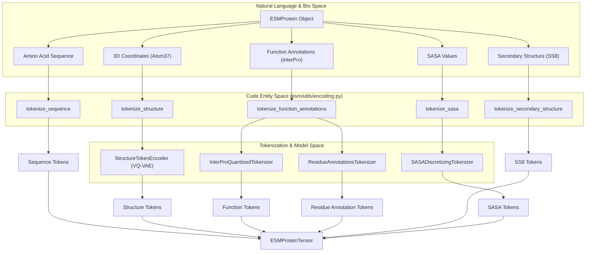
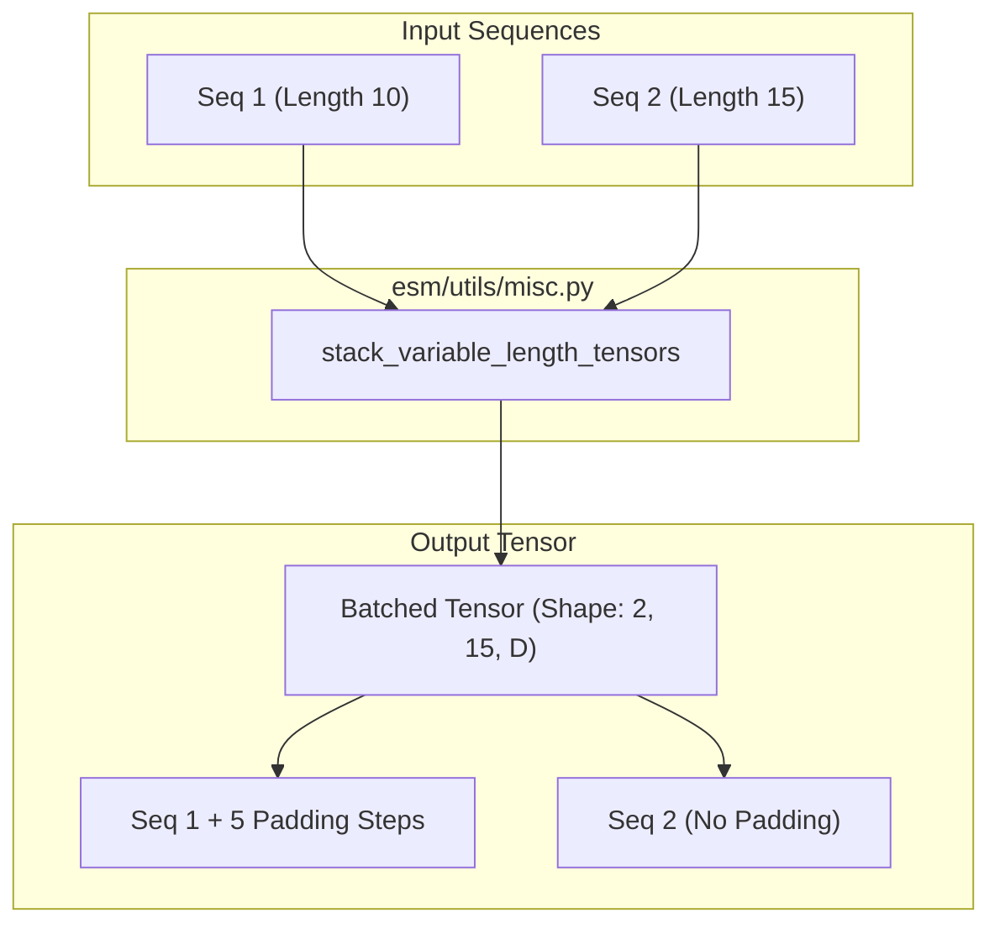

# Encoding Proteins into Tensors

> **Relevant source files**
> * [esm/layers/attention.py](https://github.com/Biohub/esm/blob/82ee3555/esm/layers/attention.py)
> * [esm/utils/encoding.py](https://github.com/Biohub/esm/blob/82ee3555/esm/utils/encoding.py)
> * [esm/utils/generation.py](https://github.com/Biohub/esm/blob/82ee3555/esm/utils/generation.py)
> * [esm/utils/misc.py](https://github.com/Biohub/esm/blob/82ee3555/esm/utils/misc.py)

This page documents the technical process of transforming high-level protein representations (sequence, structure, annotations) into the tensor formats required by ESM models. This pipeline involves tokenization across multiple tracks, coordinate handling, and the addition of special tokens (BOS/EOS) to facilitate multimodal transformer processing.

## Overview of the Encoding Pipeline

The encoding process bridges the gap between the `ESMProtein` SDK object and the `ESMProteinTensor` representation. Each biological "track" (Sequence, Structure, Secondary Structure, SASA, Function) is processed by its respective tokenizer or encoder.

### Data Flow: Protein to Tensor

The following diagram illustrates how different protein attributes are routed through specific code entities to produce the final tensorized representation.

**Diagram: ESMProtein to ESMProteinTensor Data Flow**

**Sources:** [esm/utils/encoding.py L35-L152](https://github.com/Biohub/esm/blob/82ee3555/esm/utils/encoding.py#L35-L152)

 [esm/sdk/api.py L1-L50](https://github.com/Biohub/esm/blob/82ee3555/esm/sdk/api.py#L1-L50)

---

## Structural Encoding

Structure encoding is the most complex part of the pipeline, as it involves converting continuous 3D coordinates into discrete tokens using a pre-trained VQ-VAE.

### tokenize_structure

The `tokenize_structure` function converts raw coordinates into structural tokens and processed coordinate tensors [esm/utils/encoding.py L48-L54](https://github.com/Biohub/esm/blob/82ee3555/esm/utils/encoding.py#L48-L54)

1. **Coordinate Preparation**: It uses `ProteinChain.from_atom37` to standardize input coordinates [esm/utils/encoding.py L56-L58](https://github.com/Biohub/esm/blob/82ee3555/esm/utils/encoding.py#L56-L58)
2. **VQ-VAE Encoding**: The `StructureTokenEncoder` processes the coordinates and residue indices to produce discrete `structure_tokens` [esm/utils/encoding.py L77-L79](https://github.com/Biohub/esm/blob/82ee3555/esm/utils/encoding.py#L77-L79)
3. **Padding and Special Tokens**: If `add_special_tokens` is True, the function pads coordinates with `inf` and structure tokens with `mask_token_id`. It then explicitly sets the first and last tokens to `bos_token_id` and `eos_token_id` respectively [esm/utils/encoding.py L85-L96](https://github.com/Biohub/esm/blob/82ee3555/esm/utils/encoding.py#L85-L96)

**Sources:** [esm/utils/encoding.py L48-L97](https://github.com/Biohub/esm/blob/82ee3555/esm/utils/encoding.py#L48-L97)

 [esm/models/vqvae.py L1-L50](https://github.com/Biohub/esm/blob/82ee3555/esm/models/vqvae.py#L1-L50)

---

## Function and Residue Annotation Encoding

Function annotations are encoded into two distinct tracks: one for high-level InterPro/TF-IDF keywords and another for site-specific residue annotations.

### encode_function_annotations

Located in `esm/utils/function/encode_decode.py`, this function performs the following steps:

1. **Validation**: Ensures annotation indices are 1-indexed and inclusive within the sequence length [esm/utils/function/encode_decode.py L27-L30](https://github.com/Biohub/esm/blob/82ee3555/esm/utils/function/encode_decode.py#L27-L30)
2. **Label Sorting**: Iterates through `FunctionAnnotation` objects to determine if they belong to `InterProQuantizedTokenizer` (keywords/IPR terms) or `ResidueAnnotationsTokenizer` (site-specific labels) [esm/utils/function/encode_decode.py L34-L49](https://github.com/Biohub/esm/blob/82ee3555/esm/utils/function/encode_decode.py#L34-L49)
3. **Tokenization**: * `ft_annotations` are passed to the function tokenizer to create a `(length, depth)` tensor [esm/utils/function/encode_decode.py L54-L59](https://github.com/Biohub/esm/blob/82ee3555/esm/utils/function/encode_decode.py#L54-L59) * `ra_annotations` are processed into residue annotation IDs [esm/utils/function/encode_decode.py L62-L79](https://github.com/Biohub/esm/blob/82ee3555/esm/utils/function/encode_decode.py#L62-L79)

**Sources:** [esm/utils/function/encode_decode.py L13-L81](https://github.com/Biohub/esm/blob/82ee3555/esm/utils/function/encode_decode.py#L13-L81)

 [esm/tokenization/function_tokenizer.py L1-L50](https://github.com/Biohub/esm/blob/82ee3555/esm/tokenization/function_tokenizer.py#L1-L50)

---

## Default Token Generation

When specific tracks are missing (e.g., in unconditional generation or when only a sequence is provided), the system generates "default" tokens consisting of mask tokens bounded by BOS and EOS markers.

| Helper Function | Track | Logic |
| --- | --- | --- |
| `get_default_sequence_tokens` | Sequence | `[BOS] + [MASK] * L + [EOS]` [esm/utils/encoding.py L156-L169](https://github.com/Biohub/esm/blob/82ee3555/esm/utils/encoding.py#L156-L169) |
| `get_default_structure_tokens` | Structure | `[BOS] + [MASK] * L + [EOS]` [esm/utils/encoding.py L172-L182](https://github.com/Biohub/esm/blob/82ee3555/esm/utils/encoding.py#L172-L182) |
| `get_default_secondary_structure_tokens` | SS8 | `[BOS] + [MASK] * L + [EOS]` [esm/utils/encoding.py L185-L194](https://github.com/Biohub/esm/blob/82ee3555/esm/utils/encoding.py#L185-L194) |
| `get_default_sasa_tokens` | SASA | `[BOS] + [MASK] * L + [EOS]` [esm/utils/encoding.py L197-L206](https://github.com/Biohub/esm/blob/82ee3555/esm/utils/encoding.py#L197-L206) |

**Sources:** [esm/utils/encoding.py L156-L206](https://github.com/Biohub/esm/blob/82ee3555/esm/utils/encoding.py#L156-L206)

---

## Tensor Concatenation and Padding

The final step of encoding involves assembling the individual track tensors into a single batch.

### stack_variable_length_tensors

This utility handles the creation of batches from proteins of different lengths.

* **Logic**: It determines the maximum dimensions across the batch and pads shorter sequences with a `constant_value` (usually 0 or a specific pad token) [esm/utils/misc.py L180-L209](https://github.com/Biohub/esm/blob/82ee3555/esm/utils/misc.py#L180-L209)
* **Data Flow**: `[L1, D], [L2, D] -> [Batch, Max_L, D]` [esm/utils/misc.py L193-L195](https://github.com/Biohub/esm/blob/82ee3555/esm/utils/misc.py#L193-L195)

**Diagram: Batch Tensor Construction**

**Sources:** [esm/utils/misc.py L180-L209](https://github.com/Biohub/esm/blob/82ee3555/esm/utils/misc.py#L180-L209)

---

## Key Utility Functions

* **`rbf`**: Computes Radial Basis Function encodings for distances, used in geometric featurization [esm/utils/misc.py L105-L115](https://github.com/Biohub/esm/blob/82ee3555/esm/utils/misc.py#L105-L115)
* **`knn_graph`**: Constructs a K-Nearest Neighbors graph based on 3D coordinates, with fallbacks to sequence distance when coordinates are missing or masked [esm/utils/misc.py L135-L177](https://github.com/Biohub/esm/blob/82ee3555/esm/utils/misc.py#L135-L177)
* **`slice_any_object`**: A polymorphic slicer that handles lists, strings, numpy arrays, and torch tensors uniformly, essential for manipulating protein fragments during encoding [esm/utils/misc.py L74-L102](https://github.com/Biohub/esm/blob/82ee3555/esm/utils/misc.py#L74-L102)

**Sources:** [esm/utils/misc.py L74-L177](https://github.com/Biohub/esm/blob/82ee3555/esm/utils/misc.py#L74-L177)