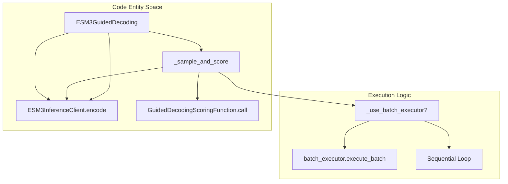
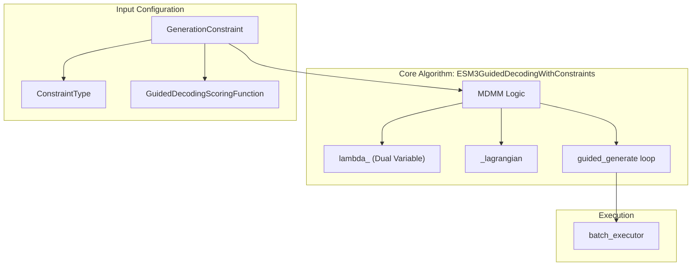

# Experimental: Guided & Constrained Generation

> **Relevant source files**
> * [esm/sdk/experimental/constrained_generation.py](https://github.com/Biohub/esm/blob/82ee3555/esm/sdk/experimental/constrained_generation.py)
> * [esm/sdk/experimental/guided_generation.py](https://github.com/Biohub/esm/blob/82ee3555/esm/sdk/experimental/guided_generation.py)

This page documents the experimental extensions to the ESM SDK for performing guided and constrained protein generation. These tools allow for derivative-free guidance using soft value-based scoring and constrained optimization via the Modified Differential Method of Multipliers (MDMM).

## Overview

The experimental modules provide advanced control over the ESM3 generation process beyond simple masking and sampling.

* **Guided Decoding**: Implements derivative-free guidance where a scoring function evaluates "denoised" intermediate protein states to guide the sampling path [esm/sdk/experimental/guided_generation.py L29-L32](https://github.com/Biohub/esm/blob/82ee3555/esm/sdk/experimental/guided_generation.py#L29-L32)
* **Constrained Generation**: Extends guided decoding by allowing users to define specific equality or inequality constraints (e.g., "ensure solubility > X") that the model should satisfy during generation [esm/sdk/experimental/constrained_generation.py L94-L105](https://github.com/Biohub/esm/blob/82ee3555/esm/sdk/experimental/constrained_generation.py#L94-L105)

### Data Flow: Guided Generation

The following diagram illustrates how the `ESM3GuidedDecoding` class interacts with the inference client and scoring functions to iteratively unmask tokens.

**Guided Generation Logic Flow**

Sources: [esm/sdk/experimental/guided_generation.py L34-L152](https://github.com/Biohub/esm/blob/82ee3555/esm/sdk/experimental/guided_generation.py#L34-L152)

 [esm/sdk/experimental/guided_generation.py L88-L104](https://github.com/Biohub/esm/blob/82ee3555/esm/sdk/experimental/guided_generation.py#L88-L104)

---

## Guided Decoding

The `ESM3GuidedDecoding` class implements a method for steering the generation process toward high-reward regions without requiring gradients from the scoring function.

### Key Components

* **`GuidedDecodingScoringFunction`**: An abstract base class that users must implement. It takes an `ESMProtein` and returns a scalar `float` reward [esm/sdk/experimental/guided_generation.py L22-L25](https://github.com/Biohub/esm/blob/82ee3555/esm/sdk/experimental/guided_generation.py#L22-L25)
* **`guided_generate`**: The main entry point. It divides the generation into `num_decoding_steps`. At each step, it generates multiple candidates (`num_samples_per_step`), scores them, and selects the best one to proceed to the next step [esm/sdk/experimental/guided_generation.py L53-L152](https://github.com/Biohub/esm/blob/82ee3555/esm/sdk/experimental/guided_generation.py#L53-L152)

### Parallel Execution

If the client is an `ESM3ForgeInferenceClient`, the decoding process automatically utilizes `batch_executor` to parallelize the sampling and scoring of candidates across remote workers [esm/sdk/experimental/guided_generation.py L106-L117](https://github.com/Biohub/esm/blob/82ee3555/esm/sdk/experimental/guided_generation.py#L106-L117)

Sources: [esm/sdk/experimental/guided_generation.py L22-L51](https://github.com/Biohub/esm/blob/82ee3555/esm/sdk/experimental/guided_generation.py#L22-L51)

 [esm/sdk/experimental/guided_generation.py L106-L117](https://github.com/Biohub/esm/blob/82ee3555/esm/sdk/experimental/guided_generation.py#L106-L117)

---

## Constrained Generation (MDMM)

The `ESM3GuidedDecodingWithConstraints` class extends the guided decoding framework to handle specific constraints using the **Modified Differential Method of Multipliers (MDMM)**. This allows the system to satisfy constraints (like $f(x) \ge \text{threshold}$) without manually tuning penalty weights [esm/sdk/experimental/constrained_generation.py L94-L105](https://github.com/Biohub/esm/blob/82ee3555/esm/sdk/experimental/constrained_generation.py#L94-L105)

### Constraint Types

Constraints are defined using the `GenerationConstraint` dataclass and the `ConstraintType` enum [esm/sdk/experimental/constrained_generation.py L29-L36](https://github.com/Biohub/esm/blob/82ee3555/esm/sdk/experimental/constrained_generation.py#L29-L36)

| Constraint Type | Mathematical Form | Description |
| --- | --- | --- |
| `GREATER_EQUAL` | $f(x) \ge \text{threshold}$ | Reward must be at least the target value. |
| `LESS_EQUAL` | $f(x) \le \text{threshold}$ | Reward must be at most the target value. |
| `EQUAL` | $f(x) = \text{threshold}$ | Reward must equal the target value. |

### Implementation of MDMM

The algorithm maintains a "dual variable" ($\lambda$) for each constraint. At each decoding step, it updates $\lambda$ based on whether the constraint is satisfied [esm/sdk/experimental/constrained_generation.py L72-L80](https://github.com/Biohub/esm/blob/82ee3555/esm/sdk/experimental/constrained_generation.py#L72-L80)

 The selection of the best sample is performed by minimizing the Lagrangian:
$$\mathcal{L}(x, \lambda) = f(x) + \sum \lambda_i g_i(x) + \frac{\gamma}{2} \sum g_i(x)^2$$

**Constrained Decoding System Architecture**

Sources: [esm/sdk/experimental/constrained_generation.py L29-L56](https://github.com/Biohub/esm/blob/82ee3555/esm/sdk/experimental/constrained_generation.py#L29-L56)

 [esm/sdk/experimental/constrained_generation.py L189-L205](https://github.com/Biohub/esm/blob/82ee3555/esm/sdk/experimental/constrained_generation.py#L189-L205)

 [esm/sdk/experimental/constrained_generation.py L94-L135](https://github.com/Biohub/esm/blob/82ee3555/esm/sdk/experimental/constrained_generation.py#L94-L135)

---

## Key Classes and Interfaces

### GuidedDecodingScoringFunction

An interface for providing rewards to the generation loop.

* **File**: `esm/sdk/experimental/guided_generation.py` [esm/sdk/experimental/guided_generation.py L22-L25](https://github.com/Biohub/esm/blob/82ee3555/esm/sdk/experimental/guided_generation.py#L22-L25)
* **Method**: `__call__(self, protein: ESMProtein) -> float`

### GenerationConstraint

A container for a scoring function and its associated threshold/type.

* **File**: `esm/sdk/experimental/constrained_generation.py` [esm/sdk/experimental/constrained_generation.py L35-L56](https://github.com/Biohub/esm/blob/82ee3555/esm/sdk/experimental/constrained_generation.py#L35-L56)
* **Key Methods**: * `g(x)`: Converts the constraint into a canonical form where $g(x) \le 0$ [esm/sdk/experimental/constrained_generation.py L58-L70](https://github.com/Biohub/esm/blob/82ee3555/esm/sdk/experimental/constrained_generation.py#L58-L70) * `update_lambda(g, eta, gamma)`: Updates the dual variable $\lambda$ using the MDMM update rule [esm/sdk/experimental/constrained_generation.py L72-L80](https://github.com/Biohub/esm/blob/82ee3555/esm/sdk/experimental/constrained_generation.py#L72-L80)

### ESM3GuidedDecodingWithConstraints

The primary driver for constrained generation.

* **File**: `esm/sdk/experimental/constrained_generation.py` [esm/sdk/experimental/constrained_generation.py L94-L126](https://github.com/Biohub/esm/blob/82ee3555/esm/sdk/experimental/constrained_generation.py#L94-L126)
* **Parameters**: * `damping` ($\gamma$): Penalty term coefficient for MDMM [esm/sdk/experimental/constrained_generation.py L113](https://github.com/Biohub/esm/blob/82ee3555/esm/sdk/experimental/constrained_generation.py#L113-L113) * `learning_rate` ($\eta$): Step size for dual variable updates [esm/sdk/experimental/constrained_generation.py L114](https://github.com/Biohub/esm/blob/82ee3555/esm/sdk/experimental/constrained_generation.py#L114-L114)

Sources: [esm/sdk/experimental/guided_generation.py L22-L25](https://github.com/Biohub/esm/blob/82ee3555/esm/sdk/experimental/guided_generation.py#L22-L25)

 [esm/sdk/experimental/constrained_generation.py L29-L91](https://github.com/Biohub/esm/blob/82ee3555/esm/sdk/experimental/constrained_generation.py#L29-L91)

 [esm/sdk/experimental/constrained_generation.py L94-L126](https://github.com/Biohub/esm/blob/82ee3555/esm/sdk/experimental/constrained_generation.py#L94-L126)