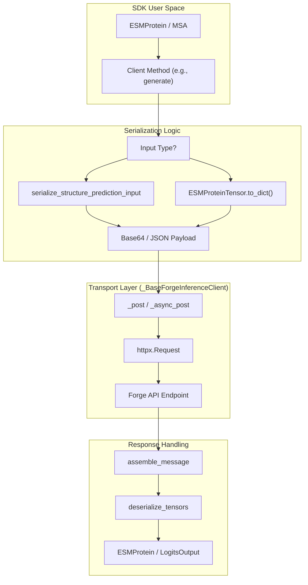
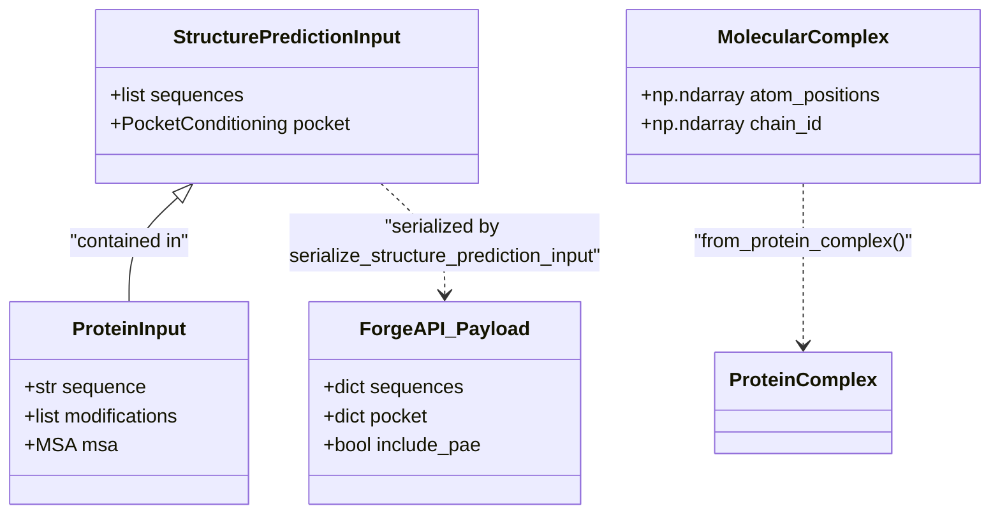

# Forge / Biohub Platform Client

> **Relevant source files**
> * [esm/sdk/base_forge_client.py](https://github.com/Biohub/esm/blob/82ee3555/esm/sdk/base_forge_client.py)
> * [esm/sdk/forge.py](https://github.com/Biohub/esm/blob/82ee3555/esm/sdk/forge.py)
> * [esm/sdk/retry.py](https://github.com/Biohub/esm/blob/82ee3555/esm/sdk/retry.py)
> * [esm/utils/constants/api.py](https://github.com/Biohub/esm/blob/82ee3555/esm/utils/constants/api.py)
> * [esm/utils/forge_context_manager.py](https://github.com/Biohub/esm/blob/82ee3555/esm/utils/forge_context_manager.py)
> * [esm/utils/msa/filter_sequences.py](https://github.com/Biohub/esm/blob/82ee3555/esm/utils/msa/filter_sequences.py)

The Forge client ecosystem provides the remote execution backend for the ESM SDK, allowing users to perform inference on ESM3, ESMC, and ESMFold2 without local GPU resources. These clients manage the full request/response lifecycle, including data serialization, authentication via API tokens, and robust error handling with retry logic.

### Transport Layer: _BaseForgeInferenceClient

All Forge clients inherit from `_BaseForgeInferenceClient` [esm/sdk/base_forge_client.py L10-L11](https://github.com/Biohub/esm/blob/82ee3555/esm/sdk/base_forge_client.py#L10-L11)

 which abstracts the underlying HTTP transport using `httpx`. It manages connection pooling for both synchronous and asynchronous requests.

| Feature | Implementation |
| --- | --- |
| **Authentication** | Bearer token passed in the `Authorization` header [esm/sdk/base_forge_client.py L28](https://github.com/Biohub/esm/blob/82ee3555/esm/sdk/base_forge_client.py#L28-L28) |
| **HTTP Engine** | Uses `httpx.Client` for sync and `httpx.AsyncClient` for async operations [esm/sdk/base_forge_client.py L38-L47](https://github.com/Biohub/esm/blob/82ee3555/esm/sdk/base_forge_client.py#L38-L47) |
| **Payload Assembly** | Uses `assemble_message` to combine headers and body into a processed dictionary [esm/sdk/base_forge_client.py L91](https://github.com/Biohub/esm/blob/82ee3555/esm/sdk/base_forge_client.py#L91-L91) |
| **Serialization** | Supports standard JSON and optimized binary formats via `return-bytes` headers [esm/sdk/base_forge_client.py L81-L83](https://github.com/Biohub/esm/blob/82ee3555/esm/sdk/base_forge_client.py#L81-L83) |

**Sources:**

* [esm/sdk/base_forge_client.py L10-L47](https://github.com/Biohub/esm/blob/82ee3555/esm/sdk/base_forge_client.py#L10-L47)
* [esm/sdk/base_forge_client.py L85-L102](https://github.com/Biohub/esm/blob/82ee3555/esm/sdk/base_forge_client.py#L85-L102)

---

### Client Implementations

#### 1. SequenceStructureForgeInferenceClient

This client handles structural tasks, specifically protein folding (Sequence → Structure) and inverse folding (Structure → Sequence). It integrates with `ESMFold2` and handles complex inputs like MSAs and multi-chain complexes.

* **Folding**: Converts a sequence and optional `MSA` into a 3D `ESMProtein` [esm/sdk/forge.py L133-L177](https://github.com/Biohub/esm/blob/82ee3555/esm/sdk/forge.py#L133-L177)
* **Inverse Folding**: Takes 3D coordinates and returns the predicted sequence [esm/sdk/forge.py L204-L268](https://github.com/Biohub/esm/blob/82ee3555/esm/sdk/forge.py#L204-L268)
* **Complex Support**: Uses `serialize_structure_prediction_input` to handle `ProteinInput`, `RNAInput`, `DNAInput`, and `LigandInput` [esm/sdk/forge.py L44-L45](https://github.com/Biohub/esm/blob/82ee3555/esm/sdk/forge.py#L44-L45)

#### 2. ESM3ForgeInferenceClient

The primary interface for the multimodal ESM3 model. It implements the `ESM3InferenceClient` protocol, supporting:

* `generate`: Iterative sampling across sequence, structure, and function tracks [esm/sdk/forge.py L347-L384](https://github.com/Biohub/esm/blob/82ee3555/esm/sdk/forge.py#L347-L384)
* `forward_and_sample`: Single-step forward pass and token sampling [esm/sdk/forge.py L386-L425](https://github.com/Biohub/esm/blob/82ee3555/esm/sdk/forge.py#L386-L425)
* `encode`/`decode`: Conversion between `ESMProtein` and `ESMProteinTensor` using remote tokenizers [esm/sdk/forge.py L288-L345](https://github.com/Biohub/esm/blob/82ee3555/esm/sdk/forge.py#L288-L345)

#### 3. ESMCForgeInferenceClient

A specialized client for the ESMC (Sequence-only) model family. It focuses on high-throughput sequence embeddings and logit generation [esm/sdk/forge.py L539-L577](https://github.com/Biohub/esm/blob/82ee3555/esm/sdk/forge.py#L539-L577)

**Sources:**

* [esm/sdk/forge.py L102-L130](https://github.com/Biohub/esm/blob/82ee3555/esm/sdk/forge.py#L102-L130)
* [esm/sdk/forge.py L270-L286](https://github.com/Biohub/esm/blob/82ee3555/esm/sdk/forge.py#L270-L286)
* [esm/sdk/forge.py L539-L550](https://github.com/Biohub/esm/blob/82ee3555/esm/sdk/forge.py#L539-L550)

---

### Data Flow & Serialization

The client bridges the gap between high-level Python objects and wire-compatible JSON/Pickle payloads.

#### Request Lifecycle Diagram

This diagram illustrates how a request moves from the SDK's high-level entities into the Forge transport layer.

**Forge Request Lifecycle**

**Sources:**

* [esm/sdk/forge.py L133-L177](https://github.com/Biohub/esm/blob/82ee3555/esm/sdk/forge.py#L133-L177)
* [esm/sdk/base_forge_client.py L104-L162](https://github.com/Biohub/esm/blob/82ee3555/esm/sdk/base_forge_client.py#L104-L162)
* [esm/utils/structure/input_builder.py L44-L45](https://github.com/Biohub/esm/blob/82ee3555/esm/utils/structure/input_builder.py#L44-L45)

---

### Retry Logic and Error Handling

The client utilizes a custom `retry_decorator` [esm/sdk/retry.py L41-L85](https://github.com/Biohub/esm/blob/82ee3555/esm/sdk/retry.py#L41-L85)

 built on the `tenacity` library to handle transient network issues and API rate limits.

| Error Code | Action | Reason |
| --- | --- | --- |
| `429` | Retry | Rate limit exceeded [esm/sdk/retry.py L23](https://github.com/Biohub/esm/blob/82ee3555/esm/sdk/retry.py#L23-L23) |
| `500`, `502`, `504` | Retry | Server-side transient failure [esm/sdk/retry.py L24-L28](https://github.com/Biohub/esm/blob/82ee3555/esm/sdk/retry.py#L24-L28) |
| `400`, `401`, `403` | Fail | Client-side error (Invalid input/auth) [esm/sdk/retry.py L18-L28](https://github.com/Biohub/esm/blob/82ee3555/esm/sdk/retry.py#L18-L28) |

The retry mechanism uses **incremental backoff**, starting at `min_retry_wait` and increasing by 1 second per attempt up to `max_retry_wait` [esm/sdk/retry.py L59-L61](https://github.com/Biohub/esm/blob/82ee3555/esm/sdk/retry.py#L59-L61)

**Sources:**

* [esm/sdk/retry.py L18-L28](https://github.com/Biohub/esm/blob/82ee3555/esm/sdk/retry.py#L18-L28)
* [esm/sdk/retry.py L41-L85](https://github.com/Biohub/esm/blob/82ee3555/esm/sdk/retry.py#L41-L85)

---

### MSA and Complex Handling

For folding tasks, the client manages MSA (Multiple Sequence Alignment) depth. If an MSA exceeds `ESMFOLD2_MAX_MSA_SEQS` (default 4096), the client issues a warning and the server performs truncation [esm/sdk/forge.py L153-L159](https://github.com/Biohub/esm/blob/82ee3555/esm/sdk/forge.py#L153-L159)

#### Entity Mapping Diagram

This diagram maps the SDK's structural data classes to their API representations.

**Structural Entity Mapping**

**Sources:**

* [esm/utils/structure/input_builder.py L42-L45](https://github.com/Biohub/esm/blob/82ee3555/esm/utils/structure/input_builder.py#L42-L45)
* [esm/utils/structure/molecular_complex.py L46-L49](https://github.com/Biohub/esm/blob/82ee3555/esm/utils/structure/molecular_complex.py#L46-L49)
* [esm/sdk/forge.py L133-L177](https://github.com/Biohub/esm/blob/82ee3555/esm/sdk/forge.py#L133-L177)
* [esm/utils/constants/models.py L10-L12](https://github.com/Biohub/esm/blob/82ee3555/esm/utils/constants/models.py#L10-L12)