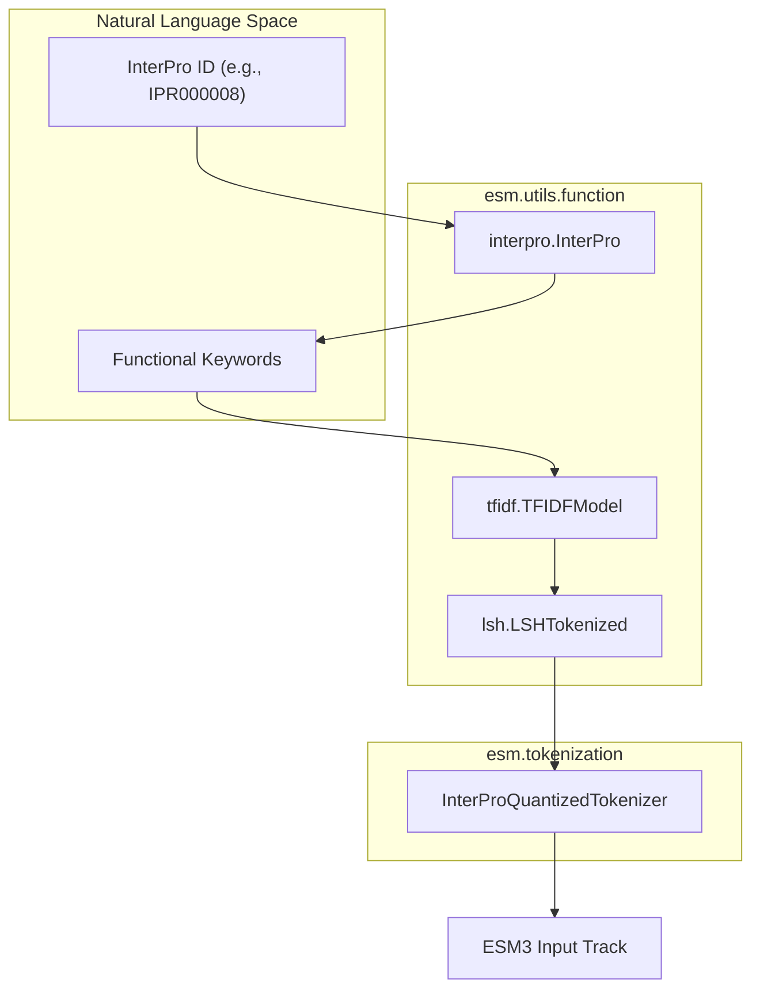

# Function & Residue Annotation Tokenizers

> **Relevant source files**
> * [LICENSE.md](https://github.com/Biohub/esm/blob/82ee3555/LICENSE.md?plain=1)
> * [esm/data/ParentChildTreeFile.txt](https://github.com/Biohub/esm/blob/82ee3555/esm/data/ParentChildTreeFile.txt)
> * [esm/data/entry_list_safety_29026.list](https://github.com/Biohub/esm/blob/82ee3555/esm/data/entry_list_safety_29026.list)
> * [esm/data/interpro_29026_to_keywords_58641.csv](https://github.com/Biohub/esm/blob/82ee3555/esm/data/interpro_29026_to_keywords_58641.csv)
> * [esm/data/keyword_idf_safety_filtered_58641.npy](https://github.com/Biohub/esm/blob/82ee3555/esm/data/keyword_idf_safety_filtered_58641.npy)
> * [esm/data/keyword_vocabulary_safety_filtered_58641.txt](https://github.com/Biohub/esm/blob/82ee3555/esm/data/keyword_vocabulary_safety_filtered_58641.txt)
> * [esm/tokenization/function_tokenizer.py](https://github.com/Biohub/esm/blob/82ee3555/esm/tokenization/function_tokenizer.py)
> * [esm/utils/constants/esm3.py](https://github.com/Biohub/esm/blob/82ee3555/esm/utils/constants/esm3.py)
> * [esm/utils/function/encode_decode.py](https://github.com/Biohub/esm/blob/82ee3555/esm/utils/function/encode_decode.py)
> * [esm/utils/function/interpro.py](https://github.com/Biohub/esm/blob/82ee3555/esm/utils/function/interpro.py)
> * [esm/utils/function/lsh.py](https://github.com/Biohub/esm/blob/82ee3555/esm/utils/function/lsh.py)
> * [esm/utils/function/tfidf.py](https://github.com/Biohub/esm/blob/82ee3555/esm/utils/function/tfidf.py)
> * [esm/utils/types.py](https://github.com/Biohub/esm/blob/82ee3555/esm/utils/types.py)

The ESM3 model family utilizes specialized tokenization tracks to represent protein function and site-specific residue annotations. Unlike sequence or structure tokens, these tokenizers handle sparse, multi-label, and hierarchical biological data by mapping InterPro accessions and functional keywords into a discrete token space suitable for transformer architectures.

## 1. InterProQuantizedTokenizer

The `InterProQuantizedTokenizer` is responsible for converting high-level functional descriptions (InterPro IDs and keywords) into a multi-token representation. It employs a Locality Sensitive Hashing (LSH) approach to compress high-dimensional TF-IDF vectors into a depth-8 sequence of discrete tokens [esm/tokenization/function_tokenizer.py L30-L35](https://github.com/Biohub/esm/blob/82ee3555/esm/tokenization/function_tokenizer.py#L30-L35)

### 1.1 Implementation & Data Flow

The tokenizer transforms functional annotations into tokens through a multi-stage pipeline:

1. **TF-IDF Vectorization**: Keywords associated with an InterPro ID or free-text annotations are converted into a sparse vector using a precomputed vocabulary and Inverse Document Frequency (IDF) weights [esm/tokenization/function_tokenizer.py L120-L124](https://github.com/Biohub/esm/blob/82ee3555/esm/tokenization/function_tokenizer.py#L120-L124)
2. **LSH Hashing**: The TF-IDF vector is projected through multiple hyperplanes. Each projection generates a bit, and groups of bits are combined to form a token ID [esm/utils/function/lsh.py L23-L31](https://github.com/Biohub/esm/blob/82ee3555/esm/utils/function/lsh.py#L23-L31)
3. **Depth-8 Encoding**: To capture the complexity of functional space, the tokenizer produces 8 tokens per position (depth=8), allowing the model to attend to different functional facets simultaneously [esm/tokenization/function_tokenizer.py L59-L60](https://github.com/Biohub/esm/blob/82ee3555/esm/tokenization/function_tokenizer.py#L59-L60)

### 1.2 System Architecture Diagram

The following diagram illustrates the flow from raw biological labels to the quantized token indices used by the ESM3 `TransformerStack`.

**Function Tokenization Pipeline**



Sources: [esm/tokenization/function_tokenizer.py L30-L90](https://github.com/Biohub/esm/blob/82ee3555/esm/tokenization/function_tokenizer.py#L30-L90)

 [esm/utils/function/tfidf.py L13-L33](https://github.com/Biohub/esm/blob/82ee3555/esm/utils/function/tfidf.py#L13-L33)

 [esm/utils/function/lsh.py L33-L72](https://github.com/Biohub/esm/blob/82ee3555/esm/utils/function/lsh.py#L33-L72)

---

## 2. ResidueAnnotationsTokenizer

The `ResidueAnnotationsTokenizer` handles site-specific annotations, such as active sites, binding sites, or post-translational modifications (PTMs). Unlike the functional tokenizer which describes global or domain-level properties, this tokenizer maps labels to specific residue indices [esm/tokenization/residue_tokenizer.py L15-L20](https://github.com/Biohub/esm/blob/82ee3555/esm/tokenization/residue_tokenizer.py#L15-L20)

### 2.1 Multi-Label Handling

Since a single residue can have multiple annotations (e.g., both a binding site and a phosphorylation site), the tokenizer represents these as a set of labels per position.

* **Vocabulary**: Tokens are prefixed with `<ra:...>` and contain comma-separated internal IDs [esm/tokenization/residue_tokenizer.py L152-L158](https://github.com/Biohub/esm/blob/82ee3555/esm/tokenization/residue_tokenizer.py#L152-L158)
* **Encoding**: The `encode` method produces a tensor of shape `(length, max_annotations)`, where `max_annotations` (default 16) defines the maximum number of simultaneous labels tracked per residue [esm/tokenization/residue_tokenizer.py L167-L178](https://github.com/Biohub/esm/blob/82ee3555/esm/tokenization/residue_tokenizer.py#L167-L178)

**Residue Annotation Data Mapping**

```mermaid
flowchart TD

DESC["interpro_site_descriptions"]
START["interpro_site_starts"]
RES["interpro_site_residues"]
MAP["_description2id"]
VOCAB["vocab_to_index"]
POS["Positional ID Set"]
TOK[""]
TENSOR["torch.Tensor (L, 16)"]
VALID["Sequence Mismatch Check"]

DESC --> MAP
START --> POS
MAP --> POS
POS --> TOK
TOK --> TENSOR
RES --> VALID

subgraph ResidueAnnotationsTokenizer ["ResidueAnnotationsTokenizer"]
    MAP
    VOCAB
end

subgraph subGraph0 ["Input Data (Sample)"]
    DESC
    START
    RES
end
```

Sources: [esm/tokenization/residue_tokenizer.py L73-L158](https://github.com/Biohub/esm/blob/82ee3555/esm/tokenization/residue_tokenizer.py#L73-L158)

 [esm/tokenization/residue_tokenizer.py L167-L183](https://github.com/Biohub/esm/blob/82ee3555/esm/tokenization/residue_tokenizer.py#L167-L183)

---

## 3. Supporting Utilities

### 3.1 InterPro Hierarchy (interpro.py)

The `InterPro` class manages the ontology and metadata. It parses the `ParentChildTreeFile.txt` to build a directed acyclic graph (DAG) of functional relationships [esm/utils/function/interpro.py L94-L107](https://github.com/Biohub/esm/blob/82ee3555/esm/utils/function/interpro.py#L94-L107)

* **Entry Types**: Categorizes IDs into `FAMILY`, `DOMAIN`, `ACTIVE_SITE`, etc. [esm/utils/function/interpro.py L57-L79](https://github.com/Biohub/esm/blob/82ee3555/esm/utils/function/interpro.py#L57-L79)
* **Graph Utility**: Uses `networkx.DiGraph` to navigate parent-child relationships between functional terms [esm/utils/function/interpro.py L164-L178](https://github.com/Biohub/esm/blob/82ee3555/esm/utils/function/interpro.py#L164-L178)

### 3.2 TF-IDF Vectorization (tfidf.py)

The `TFIDFModel` mimics the behavior of `scikit-learn`'s TfidfVectorizer with sublinear scaling.

* **Encoding**: Converts a list of terms into a `scipy.sparse.csr_matrix` [esm/utils/function/tfidf.py L34-L54](https://github.com/Biohub/esm/blob/82ee3555/esm/utils/function/tfidf.py#L34-L54)
* **Normalization**: Vectors are L2-normalized to ensure consistent input for the LSH projection [esm/utils/function/tfidf.py L50](https://github.com/Biohub/esm/blob/82ee3555/esm/utils/function/tfidf.py#L50-L50)

### 3.3 Locality Sensitive Hashing (lsh.py)

The `LSHTokenized` class implements the quantization logic.

* **Hyperplanes**: Random (or pre-trained) hyperplanes are used to partition the vector space [esm/utils/function/lsh.py L8-L22](https://github.com/Biohub/esm/blob/82ee3555/esm/utils/function/lsh.py#L8-L22)
* **Multi-Table**: Supports multiple LSH tables to generate the depth-8 token representation required by the function tokenizer [esm/utils/function/lsh.py L33-L62](https://github.com/Biohub/esm/blob/82ee3555/esm/utils/function/lsh.py#L33-L62)

| Component | File Path | Key Class/Logic |
| --- | --- | --- |
| **Function Tokenizer** | `esm/tokenization/function_tokenizer.py` | `InterProQuantizedTokenizer` |
| **Residue Tokenizer** | `esm/tokenization/residue_tokenizer.py` | `ResidueAnnotationsTokenizer` |
| **Ontology Manager** | `esm/utils/function/interpro.py` | `InterPro` (Graph-based) |
| **Vector Space** | `esm/utils/function/tfidf.py` | `TFIDFModel` (Sparse vectors) |
| **Quantization** | `esm/utils/function/lsh.py` | `LSHTokenized` (Bitstream to Tokens) |

Sources: [esm/tokenization/function_tokenizer.py L30-L46](https://github.com/Biohub/esm/blob/82ee3555/esm/tokenization/function_tokenizer.py#L30-L46)

 [esm/tokenization/residue_tokenizer.py L15-L20](https://github.com/Biohub/esm/blob/82ee3555/esm/tokenization/residue_tokenizer.py#L15-L20)

 [esm/utils/function/interpro.py L94-L100](https://github.com/Biohub/esm/blob/82ee3555/esm/utils/function/interpro.py#L94-L100)

 [esm/utils/function/tfidf.py L13-L18](https://github.com/Biohub/esm/blob/82ee3555/esm/utils/function/tfidf.py#L13-L18)

 [esm/utils/function/lsh.py L33-L41](https://github.com/Biohub/esm/blob/82ee3555/esm/utils/function/lsh.py#L33-L41)