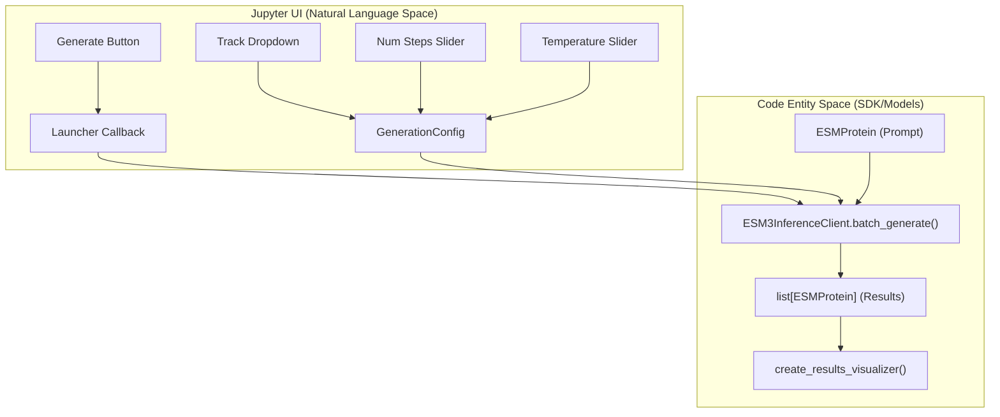
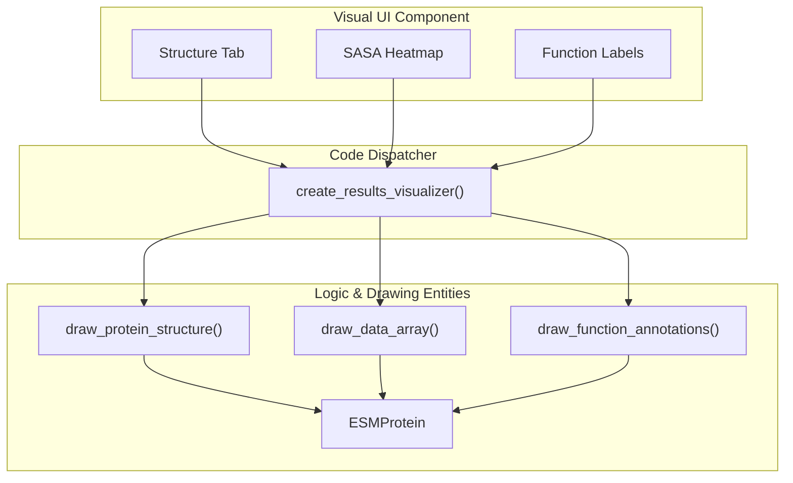

# Generation, Prediction & Inverse Folding Views

> **Relevant source files**
> * [esm/widgets/components/function_annotator.py](https://github.com/Biohub/esm/blob/82ee3555/esm/widgets/components/function_annotator.py)
> * [esm/widgets/utils/protein_import.py](https://github.com/Biohub/esm/blob/82ee3555/esm/widgets/utils/protein_import.py)
> * [esm/widgets/views/esm3_prompt_selector.py](https://github.com/Biohub/esm/blob/82ee3555/esm/widgets/views/esm3_prompt_selector.py)
> * [esm/widgets/views/generation.py](https://github.com/Biohub/esm/blob/82ee3555/esm/widgets/views/generation.py)
> * [esm/widgets/views/inverse_folding.py](https://github.com/Biohub/esm/blob/82ee3555/esm/widgets/views/inverse_folding.py)

The `esm.widgets` package provides a suite of interactive Jupyter-based interfaces for interacting with ESM3 models. These views encapsulate complex orchestration logic, including batch generation, multi-track prediction pipelines, and specialized tasks like inverse folding.

## ESM3 Generation Launcher

The `create_esm3_generation_launcher` function is the primary entry point for triggering protein generation tasks within the UI [esm/widgets/views/esm3_generation_launcher.py L21-L35](https://github.com/Biohub/esm/blob/82ee3555/esm/widgets/views/esm3_generation_launcher.py#L21-L35)

 It orchestrates the flow between user-defined parameters, the `ESM3InferenceClient`, and the visualization of results.

### Implementation Details

The launcher manages several generation parameters through `ipywidgets`:

* **Track Selection**: Users choose between `sequence`, `structure`, `secondary_structure`, `sasa`, or `function` [esm/widgets/views/esm3_generation_launcher.py L49-L53](https://github.com/Biohub/esm/blob/82ee3555/esm/widgets/views/esm3_generation_launcher.py#L49-L53)
* **Sampling Controls**: Includes `num_steps` (denoising steps), `temperature`, `top_p`, and `num_samples` [esm/widgets/views/esm3_generation_launcher.py L54-L101](https://github.com/Biohub/esm/blob/82ee3555/esm/widgets/views/esm3_generation_launcher.py#L54-L101)
* **Batch Execution**: The launcher calls `client_.batch_generate` to process multiple samples in parallel, passing a list of `ESMProtein` objects and corresponding `GenerationConfig` instances [esm/widgets/views/esm3_generation_launcher.py L171-L173](https://github.com/Biohub/esm/blob/82ee3555/esm/widgets/views/esm3_generation_launcher.py#L171-L173)

### Data Flow: Generation Launcher

The following diagram shows how the UI components map to SDK entities during a generation request.

**UI to SDK Generation Mapping**



Sources: [esm/widgets/views/esm3_generation_launcher.py L49-L101](https://github.com/Biohub/esm/blob/82ee3555/esm/widgets/views/esm3_generation_launcher.py#L49-L101)

 [esm/widgets/views/esm3_generation_launcher.py L139-L144](https://github.com/Biohub/esm/blob/82ee3555/esm/widgets/views/esm3_generation_launcher.py#L139-L144)

 [esm/widgets/views/esm3_generation_launcher.py L171-L173](https://github.com/Biohub/esm/blob/82ee3555/esm/widgets/views/esm3_generation_launcher.py#L171-L173)

## Prediction UI

The `create_prediction_ui` provides a sequential track prediction pipeline [esm/widgets/views/prediction.py L14](https://github.com/Biohub/esm/blob/82ee3555/esm/widgets/views/prediction.py#L14-L14)

 Unlike the generation launcher which focuses on a single track, the prediction view typically follows a fixed pipeline to fill in all missing modalities for a given sequence or structure.

### Sequential Track Pipeline

When a user clicks "Predict", the UI executes a loop across multiple tracks:

1. **Input**: Accepts raw sequence via `Textarea` or a `ProteinChain` via `ProteinImporter` [esm/widgets/views/prediction.py L18-L30](https://github.com/Biohub/esm/blob/82ee3555/esm/widgets/views/prediction.py#L18-L30)
2. **Orchestration**: Iterates through `["structure", "secondary_structure", "sasa", "function"]` [esm/widgets/views/prediction.py L89](https://github.com/Biohub/esm/blob/82ee3555/esm/widgets/views/prediction.py#L89-L89)
3. **Inference**: For each track, it calls `client.generate(protein, config=GenerationConfig(track=track))` [esm/widgets/views/prediction.py L94-L96](https://github.com/Biohub/esm/blob/82ee3555/esm/widgets/views/prediction.py#L94-L96)
4. **Result Aggregation**: The final `ESMProtein` containing all predicted tracks is passed to `create_results_visualizer` and displayed in a `widgets.Tab` [esm/widgets/views/prediction.py L104-L139](https://github.com/Biohub/esm/blob/82ee3555/esm/widgets/views/prediction.py#L104-L139)

Sources: [esm/widgets/views/prediction.py L80-L147](https://github.com/Biohub/esm/blob/82ee3555/esm/widgets/views/prediction.py#L80-L147)

## Inverse Folding View

The Inverse Folding view is a specialized configuration of the generation pipeline focused on predicting a protein sequence given a fixed backbone structure [esm/widgets/views/inverse_folding.py L14](https://github.com/Biohub/esm/blob/82ee3555/esm/widgets/views/inverse_folding.py#L14-L14)

### Implementation

* **Input Handling**: Uses `ProteinImporter` to load a structure, then strips all attributes except the structure coordinates (`protein.sequence = None`, etc.) [esm/widgets/views/inverse_folding.py L27-L37](https://github.com/Biohub/esm/blob/82ee3555/esm/widgets/views/inverse_folding.py#L27-L37)
* **Generation Configuration**: Executes a single-step generation on the `sequence` track [esm/widgets/views/inverse_folding.py L67-L70](https://github.com/Biohub/esm/blob/82ee3555/esm/widgets/views/inverse_folding.py#L67-L70) : ``` client.generate(input=protein, config=GenerationConfig(track="sequence", num_steps=1)) ```
* **Output**: Displays the generated sequence using the `sequence` modality of the results visualizer [esm/widgets/views/inverse_folding.py L74-L79](https://github.com/Biohub/esm/blob/82ee3555/esm/widgets/views/inverse_folding.py#L74-L79)

Sources: [esm/widgets/views/inverse_folding.py L27-L37](https://github.com/Biohub/esm/blob/82ee3555/esm/widgets/views/inverse_folding.py#L27-L37)

 [esm/widgets/views/inverse_folding.py L67-L70](https://github.com/Biohub/esm/blob/82ee3555/esm/widgets/views/inverse_folding.py#L67-L70)

## Results Visualization Dispatch

The `create_results_visualizer` function acts as a central dispatcher that selects the appropriate drawing utility based on the modality of the generated data [esm/widgets/components/results_visualizer.py L21-L36](https://github.com/Biohub/esm/blob/82ee3555/esm/widgets/components/results_visualizer.py#L21-L36)

| Modality | Visualization Logic | Code Reference |
| --- | --- | --- |
| **Structure** | Renders 3D structure with pLDDT coloring. | [esm/widgets/components/results_visualizer.py L85-L90](https://github.com/Biohub/esm/blob/82ee3555/esm/widgets/components/results_visualizer.py#L85-L90) |
| **Sequence** | Displays monospace text with line breaks. | [esm/widgets/components/results_visualizer.py L61-L67](https://github.com/Biohub/esm/blob/82ee3555/esm/widgets/components/results_visualizer.py#L61-L67) |
| **SASA** | Draws a 1D heat map using `draw_data_array`. | [esm/widgets/components/results_visualizer.py L68-L74](https://github.com/Biohub/esm/blob/82ee3555/esm/widgets/components/results_visualizer.py#L68-L74) |
| **Function** | Renders InterPro/Keyword labels. | [esm/widgets/components/results_visualizer.py L91-L97](https://github.com/Biohub/esm/blob/82ee3555/esm/widgets/components/results_visualizer.py#L91-L97) |

### Visualization System Mapping

This diagram bridges the visual components seen by the user to the underlying drawing functions and data models.

**Visualization Component Mapping**



Sources: [esm/widgets/components/results_visualizer.py L21-L36](https://github.com/Biohub/esm/blob/82ee3555/esm/widgets/components/results_visualizer.py#L21-L36)

 [esm/widgets/components/results_visualizer.py L61-L97](https://github.com/Biohub/esm/blob/82ee3555/esm/widgets/components/results_visualizer.py#L61-L97)

## Function Annotation UI

The `create_function_annotator` provides a searchable interface for adding InterPro tags and keywords to a generation prompt [esm/widgets/components/function_annotator.py L26-L30](https://github.com/Biohub/esm/blob/82ee3555/esm/widgets/components/function_annotator.py#L26-L30)

* **Trie-based Search**: It uses a `pygtrie.CharTrie` populated from the `InterProQuantizedTokenizer` vocabulary to provide autocomplete suggestions for valid function tokens [esm/widgets/components/function_annotator.py L12-L23](https://github.com/Biohub/esm/blob/82ee3555/esm/widgets/components/function_annotator.py#L12-L23)
* **Range Selection**: An `IntRangeSlider` allows users to specify the residue range (start/end) where the function annotation should apply [esm/widgets/components/function_annotator.py L54-L65](https://github.com/Biohub/esm/blob/82ee3555/esm/widgets/components/function_annotator.py#L54-L65)
* **Callback Integration**: Validated annotations are passed back to the `PromptManagerCollection` via `add_annotation_callback` [esm/widgets/components/function_annotator.py L100-L102](https://github.com/Biohub/esm/blob/82ee3555/esm/widgets/components/function_annotator.py#L100-L102)

Sources: [esm/widgets/components/function_annotator.py L12-L23](https://github.com/Biohub/esm/blob/82ee3555/esm/widgets/components/function_annotator.py#L12-L23)

 [esm/widgets/components/function_annotator.py L31-L66](https://github.com/Biohub/esm/blob/82ee3555/esm/widgets/components/function_annotator.py#L31-L66)