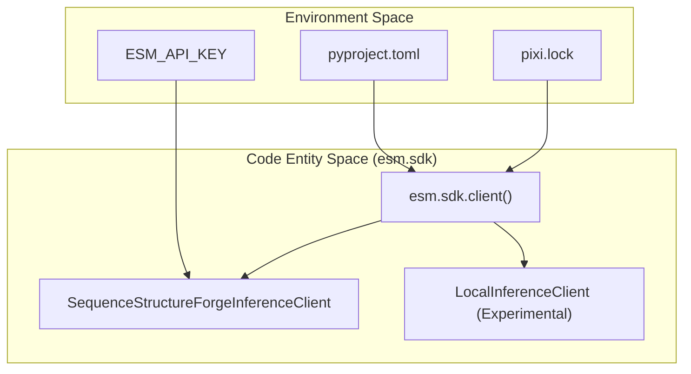
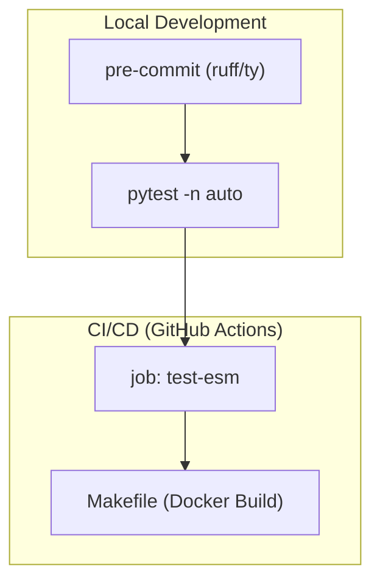

# Getting Started & Installation

> **Relevant source files**
> * [README.md](https://github.com/Biohub/esm/blob/82ee3555/README.md?plain=1)
> * [pixi.lock](https://github.com/Biohub/esm/blob/82ee3555/pixi.lock)
> * [pyproject.toml](https://github.com/Biohub/esm/blob/82ee3555/pyproject.toml)

This page provides a comprehensive guide to setting up the ESM repository for development and research. It covers environment configuration using `pixi` and `pip`, authentication for remote inference, and the fundamental data flow between local environments and the Biohub Platform.

## 1. Environment Setup

The ESM repository supports two primary installation methods: **Pixi** (recommended for development) and **Pip** (for integration into existing environments). The project requires Python 3.12 [pyproject.toml L6](https://github.com/Biohub/esm/blob/82ee3555/pyproject.toml#L6-L6)

### Method A: Pixi (Recommended)

`pixi` is used to manage reproducible environments, handling both Python dependencies and system-level requirements like `cmake` and `pkg-config` [pyproject.toml L73-L78](https://github.com/Biohub/esm/blob/82ee3555/pyproject.toml#L73-L78)

1. **Install Pixi**: Follow the instructions at [pixi.sh](https://pixi.sh).
2. **Initialize Environment**: ``` pixi install ``` This command reads `pyproject.toml` and `pixi.lock` to create a locked environment in the `.pixi` directory [pyproject.toml L68-L71](https://github.com/Biohub/esm/blob/82ee3555/pyproject.toml#L68-L71)
3. **Activate Shell**: ``` pixi shell ```

### Method B: Pip

If you prefer standard pip, ensure you have Python 3.12 installed.

```
pip install esm@git+https://github.com/Biohub/esm.git@main
```

*Note: The project depends on a specific fork of the `transformers` library [pyproject.toml L25](https://github.com/Biohub/esm/blob/82ee3555/pyproject.toml#L25-L25)*

### Core Dependencies

The following key libraries are required for ESM operations:

| Library | Purpose |
| --- | --- |
| `torch` | Neural network backend (>=2.2.0) [pyproject.toml L24](https://github.com/Biohub/esm/blob/82ee3555/pyproject.toml#L24-L24) |
| `transformers` | Hugging Face models, specifically a Biohub fork [pyproject.toml L25](https://github.com/Biohub/esm/blob/82ee3555/pyproject.toml#L25-L25) |
| `biotite` | Protein structure parsing and manipulation [pyproject.toml L28](https://github.com/Biohub/esm/blob/82ee3555/pyproject.toml#L28-L28) |
| `rdkit` | Handling small molecules and ligands [pyproject.toml L29](https://github.com/Biohub/esm/blob/82ee3555/pyproject.toml#L29-L29) |
| `msgpack-numpy` | Efficient serialization for API requests [pyproject.toml L30](https://github.com/Biohub/esm/blob/82ee3555/pyproject.toml#L30-L30) |
| `ipywidgets` | Powering the interactive Jupyter UI [pyproject.toml L40](https://github.com/Biohub/esm/blob/82ee3555/pyproject.toml#L40-L40) |

Sources: [pyproject.toml L24-L47](https://github.com/Biohub/esm/blob/82ee3555/pyproject.toml#L24-L47)

---

## 2. Configuration & Authentication

ESM supports both local model execution and remote inference via the Biohub Platform (Forge). To use remote inference, you must configure an API key.

### API Key Configuration

The SDK looks for the `ESM_API_KEY` environment variable. You can set this in your shell or via a `.env` file.

```javascript
export ESM_API_KEY="your_api_key_here"
```

### Execution Modes

The system is designed to be backend-agnostic through the `esm.sdk` interfaces.

| Mode | Description | Implementation |
| --- | --- | --- |
| **Local** | Models run on your local GPU/CPU. | Uses `esm.models` and `torch`. |
| **Remote** | Models run on Biohub Forge or SageMaker. | Uses `SequenceStructureForgeInferenceClient`. |

### System Initialization Flow

The following diagram illustrates how the environment and configuration are used to initialize a client.

**Client Initialization Architecture**



Sources: [pyproject.toml L1-L47](https://github.com/Biohub/esm/blob/82ee3555/pyproject.toml#L1-L47)

 [README.md L99-L102](https://github.com/Biohub/esm/blob/82ee3555/README.md?plain=1#L99-L102)

---

## 3. Running Your First Example

Once installed, you can verify the setup by running a simple sequence embedding or structure prediction.

### Local Inference Example

The repository includes a `cookbook` directory with scripts for local execution. For ESMC, you can use the Hugging Face `transformers` library directly.

```javascript
import torchfrom transformers import AutoModelForMaskedLM, AutoTokenizerfrom huggingface_hub import login # login with your Hugging Face credentialslogin() # example GFP sequencesequences = ["MSKGEELFTGVVPILVELDGDVNGHKFSVSGEGEGDATYGKLTLKFICTTGKLPVPWPTLVTTFSYGVQCFSRYPDHMKQHDFFKSAMPEGYVQERTIFFKDDGNYKTRAEVKFEGDTLVNRIELKGIDFKEDGNILGHKLEYNYNSHNVYIMADKQKNGIKVNFKIRHNIEDGSVQLADHYQQNTPIGDGPVLLPDNHYLSTQSALSKDPNEKRDHMVLLEFVTAAGITHGMDELYK"] model = AutoModelForMaskedLM.from_pretrained(    "biohub/ESMC-6B",    device_map="auto",).eval()tokenizer = AutoTokenizer.from_pretrained("biohub/ESMC-6B") inputs = tokenizer(sequences, return_tensors="pt", padding=True)inputs = {k: v.to(model.device) for k, v in inputs.items()}with torch.inference_mode():    output = model(**inputs) # To return hidden states from all transformer layers:# output = model(**inputs, output_hidden_states=True)
```

Sources: [README.md L69-L94](https://github.com/Biohub/esm/blob/82ee3555/README.md?plain=1#L69-L94)

### Remote SDK Example

Using the SDK to interact with ESMC via the Biohub Platform:

```javascript
from esm.sdk import esmc_clientfrom esm.sdk.api import ESMProtein, LogitsConfig # Human carbonic anhydrase II (PDB 2CBA)protein = ESMProtein(    sequence=(        "MSHHWGYGKHNGPEHWHKDFPIAKGERQSPVDIDTHTAKYDPSLKPLSVSYDQATSLRILNNGHAFNVEFDD"        "SQDKAVLKGGPLDGTYRLIQFHFHWGSLDGQGSEHTVDKKKYAAELHLVHWNTKYGDFGKAVQQPDGLAVL"        "GIFLKVGSAKPGLQKVVDVLDSIKTKGKSADFTNFDPRGLLPESLDYWTYPGSLTTPPLLECVTWIVLKEP"        "ISVSSEQVLKFRKLNFNGEGEPEELMVDNWRPAQPLKNRQIKASFK"    ))model = esmc_client(    model="esmc-600m-2024-12", url="https://biohub.ai", token="<your API token>") protein_tensor = model.encode(protein)logits_output = model.logits(    protein_tensor, LogitsConfig(sequence=True, return_embeddings=True)) print(logits_output.logits, logits_output.embeddings)
```

Sources: [README.md L112-L134](https://github.com/Biohub/esm/blob/82ee3555/README.md?plain=1#L112-L134)

---

## 4. Development Workflow

### Code Quality Tools

The project uses `ruff` for linting and `ty` (a type checker) for type checking, managed via `pre-commit` [pyproject.toml L104-L140](https://github.com/Biohub/esm/blob/82ee3555/pyproject.toml#L104-L140)

* **Linting**: `pixi run lint-all` [pyproject.toml L97](https://github.com/Biohub/esm/blob/82ee3555/pyproject.toml#L97-L97)
* **Testing**: `pytest` is configured to ignore specific client tests that require remote credentials by default [pyproject.toml L49-L55](https://github.com/Biohub/esm/blob/82ee3555/pyproject.toml#L49-L55)

### Testing Architecture

The test suite is split between unit tests and integration tests.

**Testing and CI Data Flow**



Sources: [pyproject.toml L49-L55](https://github.com/Biohub/esm/blob/82ee3555/pyproject.toml#L49-L55)

 [pyproject.toml L89-L98](https://github.com/Biohub/esm/blob/82ee3555/pyproject.toml#L89-L98)

 [pyproject.toml L104-L140](https://github.com/Biohub/esm/blob/82ee3555/pyproject.toml#L104-L140)

---

## 5. Summary of Project Metadata

* **Version**: 3.3.0 [pyproject.toml L3](https://github.com/Biohub/esm/blob/82ee3555/pyproject.toml#L3-L3)
* **Python Requirement**: >=3.12, <3.13 [pyproject.toml L6](https://github.com/Biohub/esm/blob/82ee3555/pyproject.toml#L6-L6)
* **Supported Platforms**: linux-64, osx-arm64 [pyproject.toml L70](https://github.com/Biohub/esm/blob/82ee3555/pyproject.toml#L70-L70)
* **License**: LICENSE.md [pyproject.toml L7](https://github.com/Biohub/esm/blob/82ee3555/pyproject.toml#L7-L7)

Sources:

* [pyproject.toml L1-L143](https://github.com/Biohub/esm/blob/82ee3555/pyproject.toml#L1-L143)
* [pixi.lock L1-L87](https://github.com/Biohub/esm/blob/82ee3555/pixi.lock#L1-L87)