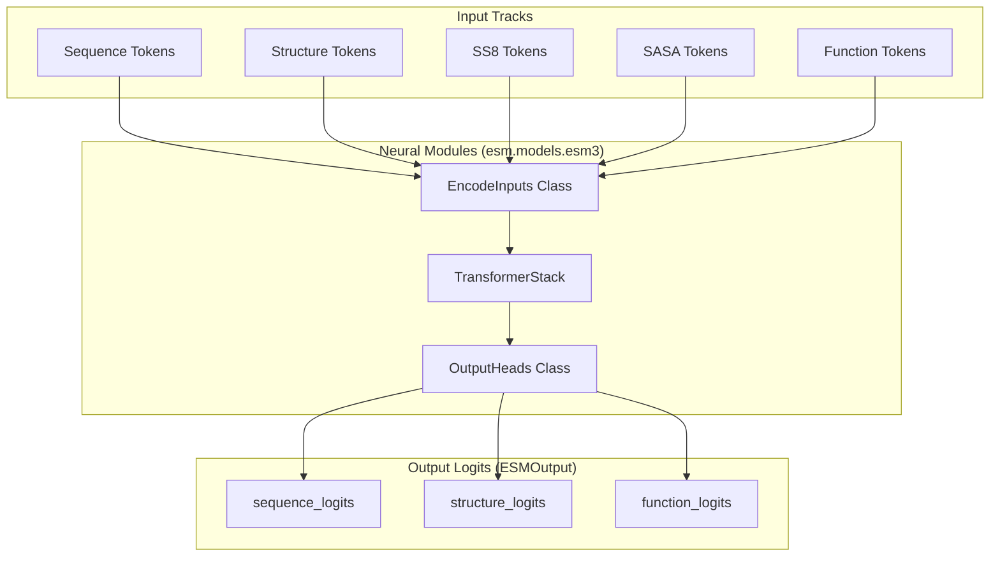

# Glossary

> **Relevant source files**
> * [LICENSE.md](https://github.com/Biohub/esm/blob/82ee3555/LICENSE.md?plain=1)
> * [README.md](https://github.com/Biohub/esm/blob/82ee3555/README.md?plain=1)
> * [cookbook/tutorials/binder_design.ipynb](https://github.com/Biohub/esm/blob/82ee3555/cookbook/tutorials/binder_design.ipynb)
> * [esm/models/esmfold2/processor.py](https://github.com/Biohub/esm/blob/82ee3555/esm/models/esmfold2/processor.py)
> * [esm/sdk/api.py](https://github.com/Biohub/esm/blob/82ee3555/esm/sdk/api.py)
> * [esm/tokenization/function_tokenizer.py](https://github.com/Biohub/esm/blob/82ee3555/esm/tokenization/function_tokenizer.py)
> * [esm/utils/constants/esm3.py](https://github.com/Biohub/esm/blob/82ee3555/esm/utils/constants/esm3.py)
> * [esm/utils/constants/models.py](https://github.com/Biohub/esm/blob/82ee3555/esm/utils/constants/models.py)
> * [esm/utils/encoding.py](https://github.com/Biohub/esm/blob/82ee3555/esm/utils/encoding.py)
> * [esm/utils/function/tfidf.py](https://github.com/Biohub/esm/blob/82ee3555/esm/utils/function/tfidf.py)
> * [esm/utils/generation.py](https://github.com/Biohub/esm/blob/82ee3555/esm/utils/generation.py)
> * [esm/utils/residue_constants.py](https://github.com/Biohub/esm/blob/82ee3555/esm/utils/residue_constants.py)
> * [esm/utils/types.py](https://github.com/Biohub/esm/blob/82ee3555/esm/utils/types.py)

This page provides technical definitions for domain-specific terms, abbreviations, and architectural concepts used throughout the ESM codebase. It serves as a reference for onboarding engineers to understand the mapping between biological concepts and their implementation in code.

## 1. Core Model Entities

### ESMC (Evolutionary Scale Modeling - Sequence)

The latest generation of sequence-only protein language models. Unlike ESM2, ESMC is designed for stronger long-range structural understanding and scales up to 6B parameters [README.md L12-L13](https://github.com/Biohub/esm/blob/82ee3555/README.md?plain=1#L12-L13)

 It uses a standard transformer architecture with optional Flash Attention support [esm/models/esmc.py L67-L74](https://github.com/Biohub/esm/blob/82ee3555/esm/models/esmc.py#L67-L74)

* **Code Pointer:** `ESMC` class in [esm/models/esmc.py L45](https://github.com/Biohub/esm/blob/82ee3555/esm/models/esmc.py#L45-L45)

### ESM3 (Multimodal Protein Language Model)

A multimodal generative model that operates on multiple "tracks" of protein data, including sequence, structure, secondary structure, SASA, and function annotations [esm/models/esm3.py L188-L209](https://github.com/Biohub/esm/blob/82ee3555/esm/models/esm3.py#L188-L209)

* **Code Pointer:** `ESM3` class in [esm/models/esm3.py L188](https://github.com/Biohub/esm/blob/82ee3555/esm/models/esm3.py#L188-L188)

### ESMFold2

A state-of-the-art structure prediction model built on top of the ESMC 6B backbone [README.md L21](https://github.com/Biohub/esm/blob/82ee3555/README.md?plain=1#L21-L21)

 It supports all-atom folding of proteins, nucleic acids, and ligands [cookbook/tutorials/esmfold2.ipynb L13](https://github.com/Biohub/esm/blob/82ee3555/cookbook/tutorials/esmfold2.ipynb#L13-L13)

* **Code Pointer:** `esmfold2_client` factory in [esm/sdk/__init__.py](https://github.com/Biohub/esm/blob/82ee3555/esm/sdk/__init__.py)  (not directly provided in snippets, but implied by usage).

Sources: [README.md L12-L13](https://github.com/Biohub/esm/blob/82ee3555/README.md?plain=1#L12-L13)

 [README.md L21](https://github.com/Biohub/esm/blob/82ee3555/README.md?plain=1#L21-L21)

 [esm/models/esmc.py L45](https://github.com/Biohub/esm/blob/82ee3555/esm/models/esmc.py#L45-L45)

 [esm/models/esmc.py L67-L74](https://github.com/Biohub/esm/blob/82ee3555/esm/models/esmc.py#L67-L74)

 [esm/models/esm3.py L188-L209](https://github.com/Biohub/esm/blob/82ee3555/esm/models/esm3.py#L188-L209)

 [cookbook/tutorials/esmfold2.ipynb L13](https://github.com/Biohub/esm/blob/82ee3555/cookbook/tutorials/esmfold2.ipynb#L13-L13)

---

## 2. Biological Data Representations

### Atom37

A standardized 3D coordinate representation where every amino acid residue is represented by exactly 37 possible atom positions (following the AlphaFold/AlphaFold2 convention) [esm/utils/structure/protein_chain.py L143-L154](https://github.com/Biohub/esm/blob/82ee3555/esm/utils/structure/protein_chain.py#L143-L154)

 This allows for fixed-size tensor operations regardless of the specific residue type.

* **Code Pointer:** `atom37_positions` attribute in `ProteinChain` [esm/utils/structure/protein_chain.py L152](https://github.com/Biohub/esm/blob/82ee3555/esm/utils/structure/protein_chain.py#L152-L152)

### SASA (Solvent Accessible Surface Area)

A measure of how much of a residue's surface is exposed to the surrounding solvent. In ESM3, this is discretized into 15 bins for tokenization [esm/utils/constants/esm3.py L77-L93](https://github.com/Biohub/esm/blob/82ee3555/esm/utils/constants/esm3.py#L77-L93)

* **Code Pointer:** `SASADiscretizingTokenizer` in [esm/tokenization/sasa_tokenizer.py L15](https://github.com/Biohub/esm/blob/82ee3555/esm/tokenization/sasa_tokenizer.py#L15-L15)

### pLDDT (predicted Local Distance Difference Test)

A per-residue confidence score (0-100) predicted by the model. It indicates the model's local confidence in the predicted structure [esm/sdk/api.py L36](https://github.com/Biohub/esm/blob/82ee3555/esm/sdk/api.py#L36-L36)

* **Code Pointer:** `plddt` attribute in `ESMProtein` [esm/sdk/api.py L36](https://github.com/Biohub/esm/blob/82ee3555/esm/sdk/api.py#L36-L36)

### InterPro

A database of protein families, domains, and functional sites. InterPro IDs are used as a form of function annotation in ESM3 [esm/tokenization/function_tokenizer.py L30-L35](https://github.com/Biohub/esm/blob/82ee3555/esm/tokenization/function_tokenizer.py#L30-L35)

* **Code Pointer:** `InterProQuantizedTokenizer` in [esm/tokenization/function_tokenizer.py L29](https://github.com/Biohub/esm/blob/82ee3555/esm/tokenization/function_tokenizer.py#L29-L29)

Sources: [esm/sdk/api.py L36](https://github.com/Biohub/esm/blob/82ee3555/esm/sdk/api.py#L36-L36)

 [esm/utils/structure/protein_chain.py L152](https://github.com/Biohub/esm/blob/82ee3555/esm/utils/structure/protein_chain.py#L152-L152)

 [esm/tokenization/sasa_tokenizer.py L15](https://github.com/Biohub/esm/blob/82ee3555/esm/tokenization/sasa_tokenizer.py#L15-L15)

 [esm/utils/constants/esm3.py L77-L93](https://github.com/Biohub/esm/blob/82ee3555/esm/utils/constants/esm3.py#L77-L93)

 [esm/tokenization/function_tokenizer.py L29](https://github.com/Biohub/esm/blob/82ee3555/esm/tokenization/function_tokenizer.py#L29-L29)

 [esm/tokenization/function_tokenizer.py L30-L35](https://github.com/Biohub/esm/blob/82ee3555/esm/tokenization/function_tokenizer.py#L30-L35)

---

## 3. Technical & Implementation Terms

### Tracks

In the context of ESM3, a "track" refers to one of the parallel streams of data (sequence, structure, etc.) that the model processes simultaneously [esm/sdk/api.py L29-L35](https://github.com/Biohub/esm/blob/82ee3555/esm/sdk/api.py#L29-L35)

* **Code Pointer:** `ESMProtein` dataclass attributes like `sequence`, `secondary_structure`, `sasa`, `function_annotations`, `coordinates` [esm/sdk/api.py L29-L35](https://github.com/Biohub/esm/blob/82ee3555/esm/sdk/api.py#L29-L35)

### VQ-VAE (Vector Quantized Variational Autoencoder)

Used to compress continuous 3D protein structures into discrete "structure tokens" that the transformer can process [esm/models/vqvae.py](https://github.com/Biohub/esm/blob/82ee3555/esm/models/vqvae.py)

 The `StructureTokenEncoder` quantizes the input coordinates, and the `StructureTokenDecoder` reconstructs them.

* **Code Pointer:** `StructureTokenEncoder` [esm/models/vqvae.py L16](https://github.com/Biohub/esm/blob/82ee3555/esm/models/vqvae.py#L16-L16)  and `StructureTokenDecoder` [esm/models/vqvae.py L16](https://github.com/Biohub/esm/blob/82ee3555/esm/models/vqvae.py#L16-L16)

### LSH (Locality Sensitive Hashing)

Used in the `InterProQuantizedTokenizer` to encode and decode InterPro function annotations into discrete tokens. It maps high-dimensional TF-IDF vectors to a lower-dimensional space, allowing for efficient similarity searches and tokenization [esm/tokenization/function_tokenizer.py L30-L35](https://github.com/Biohub/esm/blob/82ee3555/esm/tokenization/function_tokenizer.py#L30-L35)

* **Code Pointer:** `lsh.LSHTokenized` class used within `InterProQuantizedTokenizer` [esm/tokenization/function_tokenizer.py L83-L90](https://github.com/Biohub/esm/blob/82ee3555/esm/tokenization/function_tokenizer.py#L83-L90)

### TF-IDF (Term Frequency-Inverse Document Frequency)

A numerical statistic reflecting how important a word is to a document in a collection or corpus. In ESM, it's used to represent function keywords, which are then processed by LSH for tokenization [esm/tokenization/function_tokenizer.py L120-L124](https://github.com/Biohub/esm/blob/82ee3555/esm/tokenization/function_tokenizer.py#L120-L124)

* **Code Pointer:** `tfidf.TFIDFModel` class used within `InterProQuantizedTokenizer` [esm/tokenization/function_tokenizer.py L120-L124](https://github.com/Biohub/esm/blob/82ee3555/esm/tokenization/function_tokenizer.py#L120-L124)  defined in [esm/utils/function/tfidf.py L13](https://github.com/Biohub/esm/blob/82ee3555/esm/utils/function/tfidf.py#L13-L13)

### ESMProtein

A dataclass representing a protein, holding various biological "tracks" such as sequence, secondary structure, SASA, function annotations, and 3D coordinates, along with predicted metrics like pLDDT [esm/sdk/api.py L27-L49](https://github.com/Biohub/esm/blob/82ee3555/esm/sdk/api.py#L27-L49)

 It provides methods for loading from PDB/ProteinChain/ProteinComplex and converting to PDB/ProteinChain/ProteinComplex [esm/sdk/api.py L68-L181](https://github.com/Biohub/esm/blob/82ee3555/esm/sdk/api.py#L68-L181)

* **Code Pointer:** `ESMProtein` class definition [esm/sdk/api.py L27-L49](https://github.com/Biohub/esm/blob/82ee3555/esm/sdk/api.py#L27-L49)

### ESMProteinTensor

A dataclass that holds the tokenized tensor representations of an `ESMProtein` object, ready for input into the model. It contains tensors for sequence, structure, secondary structure, SASA, function, and residue annotations, along with attention masks and other metadata [esm/sdk/api.py L20](https://github.com/Biohub/esm/blob/82ee3555/esm/sdk/api.py#L20-L20)

* **Code Pointer:** `ESMProteinTensor` class definition [esm/sdk/api.py L20](https://github.com/Biohub/esm/blob/82ee3555/esm/sdk/api.py#L20-L20)

### StructurePredictionInput

A dataclass used by ESMFold2 to define the input for structure prediction, including protein sequences, optional distogram conditioning, and covalent bonds [esm/models/esmfold2/types.py L10](https://github.com/Biohub/esm/blob/82ee3555/esm/models/esmfold2/types.py#L10-L10)

 It can handle multiple protein chains and other molecular entities.

* **Code Pointer:** `StructurePredictionInput` class definition [esm/models/esmfold2/types.py L10](https://github.com/Biohub/esm/blob/82ee3555/esm/models/esmfold2/types.py#L10-L10)

### ESMFold2InputBuilder

A utility class responsible for preparing and cleaning input data for the ESMFold2 model. It handles tasks like grouping identical protein sequences, converting chainbreak tokens, and managing modifications [esm/models/esmfold2/processor.py L86-L184](https://github.com/Biohub/esm/blob/82ee3555/esm/models/esmfold2/processor.py#L86-L184)

* **Code Pointer:** `ESMFold2InputBuilder` class definition [esm/models/esmfold2/processor.py L184](https://github.com/Biohub/esm/blob/82ee3555/esm/models/esmfold2/processor.py#L184-L184)

Sources: [esm/sdk/api.py L20](https://github.com/Biohub/esm/blob/82ee3555/esm/sdk/api.py#L20-L20)

 [esm/sdk/api.py L27-L49](https://github.com/Biohub/esm/blob/82ee3555/esm/sdk/api.py#L27-L49)

 [esm/sdk/api.py L29-L35](https://github.com/Biohub/esm/blob/82ee3555/esm/sdk/api.py#L29-L35)

 [esm/sdk/api.py L68-L181](https://github.com/Biohub/esm/blob/82ee3555/esm/sdk/api.py#L68-L181)

 [esm/models/vqvae.py L16](https://github.com/Biohub/esm/blob/82ee3555/esm/models/vqvae.py#L16-L16)

 [esm/tokenization/function_tokenizer.py L30-L35](https://github.com/Biohub/esm/blob/82ee3555/esm/tokenization/function_tokenizer.py#L30-L35)

 [esm/tokenization/function_tokenizer.py L83-L90](https://github.com/Biohub/esm/blob/82ee3555/esm/tokenization/function_tokenizer.py#L83-L90)

 [esm/tokenization/function_tokenizer.py L120-L124](https://github.com/Biohub/esm/blob/82ee3555/esm/tokenization/function_tokenizer.py#L120-L124)

 [esm/utils/function/tfidf.py L13](https://github.com/Biohub/esm/blob/82ee3555/esm/utils/function/tfidf.py#L13-L13)

 [esm/models/esmfold2/types.py L10](https://github.com/Biohub/esm/blob/82ee3555/esm/models/esmfold2/types.py#L10-L10)

 [esm/models/esmfold2/processor.py L86-L184](https://github.com/Biohub/esm/blob/82ee3555/esm/models/esmfold2/processor.py#L86-L184)

 [esm/models/esmfold2/processor.py L184](https://github.com/Biohub/esm/blob/82ee3555/esm/models/esmfold2/processor.py#L184-L184)

---

## 4. Architectural Mapping Diagrams

### Diagram 1: Protein Data Lifecycle

This diagram maps the transition from biological file formats to SDK objects and finally to model-ready tensors.

Sources: [esm/sdk/api.py L27-L136](https://github.com/Biohub/esm/blob/82ee3555/esm/sdk/api.py#L27-L136)

 [esm/utils/structure/protein_chain.py L143-L163](https://github.com/Biohub/esm/blob/82ee3555/esm/utils/structure/protein_chain.py#L143-L163)

 [esm/utils/encoding.py L1-L50](https://github.com/Biohub/esm/blob/82ee3555/esm/utils/encoding.py#L1-L50)

### Diagram 2: ESM3 Multimodal Architecture

This diagram bridges the conceptual "Tracks" to the specific neural network modules in `esm/models/esm3.py`.

Sources: [esm/models/esm3.py L62-L148](https://github.com/Biohub/esm/blob/82ee3555/esm/models/esm3.py#L62-L148)

 [esm/models/esm3.py L151-L185](https://github.com/Biohub/esm/blob/82ee3555/esm/models/esm3.py#L151-L185)

 [esm/models/esm3.py L211-L230](https://github.com/Biohub/esm/blob/82ee3555/esm/models/esm3.py#L211-L230)

---

## 5. Summary Table of Key Classes

| Term | Class/Entity | File Path | Description |
| --- | --- | --- | --- |
| **Protein Container** | `ESMProtein` | [esm/sdk/api.py L27-L48](https://github.com/Biohub/esm/blob/82ee3555/esm/sdk/api.py#L27-L48) | High-level SDK object containing all tracks (sequence, coords, etc.) |
| **Tensor Container** | `ESMProteinTensor` | [esm/sdk/api.py L20](https://github.com/Biohub/esm/blob/82ee3555/esm/sdk/api.py#L20-L20) | PyTorch tensor representation of a protein for model input |
| **Transformer** | `TransformerStack` | [esm/layers/transformer_stack.py L14](https://github.com/Biohub/esm/blob/82ee3555/esm/layers/transformer_stack.py#L14-L14) | The core neural backbone used by both ESM3 and ESMC |
| **Sequence Head** | `RegressionHead` | [esm/layers/regression_head.py L13](https://github.com/Biohub/esm/blob/82ee3555/esm/layers/regression_head.py#L13-L13) | Linear layer that maps transformer outputs to token vocabularies |
| **Structure Decoder** | `StructureTokenDecoder` | [esm/models/vqvae.py L16](https://github.com/Biohub/esm/blob/82ee3555/esm/models/vqvae.py#L16-L16) | Converts structure tokens back into 3D coordinates |
| **Function Decoder** | `FunctionTokenDecoder` | [esm/models/function_decoder.py L54](https://github.com/Biohub/esm/blob/82ee3555/esm/models/function_decoder.py#L54-L54) | Decodes function tokens into InterPro and keyword annotations |
| **Function Tokenizer** | `InterProQuantizedTokenizer` | [esm/tokenization/function_tokenizer.py L29](https://github.com/Biohub/esm/blob/82ee3555/esm/tokenization/function_tokenizer.py#L29-L29) | Tokenizes InterPro IDs and keywords using TF-IDF and LSH |
| **TF-IDF Model** | `TFIDFModel` | [esm/utils/function/tfidf.py L13](https://github.com/Biohub/esm/blob/82ee3555/esm/utils/function/tfidf.py#L13-L13) | Implements Term-Frequency / Inverse Document Frequency for keyword vectorization |
| **ESMFold2 Input Builder** | `ESMFold2InputBuilder` | [esm/models/esmfold2/processor.py L184](https://github.com/Biohub/esm/blob/82ee3555/esm/models/esmfold2/processor.py#L184-L184) | Prepares and cleans input for ESMFold2 structure prediction |

Sources: [esm/sdk/api.py L20](https://github.com/Biohub/esm/blob/82ee3555/esm/sdk/api.py#L20-L20)

 [esm/sdk/api.py L27-L48](https://github.com/Biohub/esm/blob/82ee3555/esm/sdk/api.py#L27-L48)

 [esm/models/esm3.py L51-L185](https://github.com/Biohub/esm/blob/82ee3555/esm/models/esm3.py#L51-L185)

 [esm/models/esmc.py L38-L42](https://github.com/Biohub/esm/blob/82ee3555/esm/models/esmc.py#L38-L42)

 [esm/models/function_decoder.py L54-L125](https://github.com/Biohub/esm/blob/82ee3555/esm/models/function_decoder.py#L54-L125)

 [esm/tokenization/function_tokenizer.py L29](https://github.com/Biohub/esm/blob/82ee3555/esm/tokenization/function_tokenizer.py#L29-L29)

 [esm/utils/function/tfidf.py L13](https://github.com/Biohub/esm/blob/82ee3555/esm/utils/function/tfidf.py#L13-L13)

 [esm/models/esmfold2/processor.py L184](https://github.com/Biohub/esm/blob/82ee3555/esm/models/esmfold2/processor.py#L184-L184)