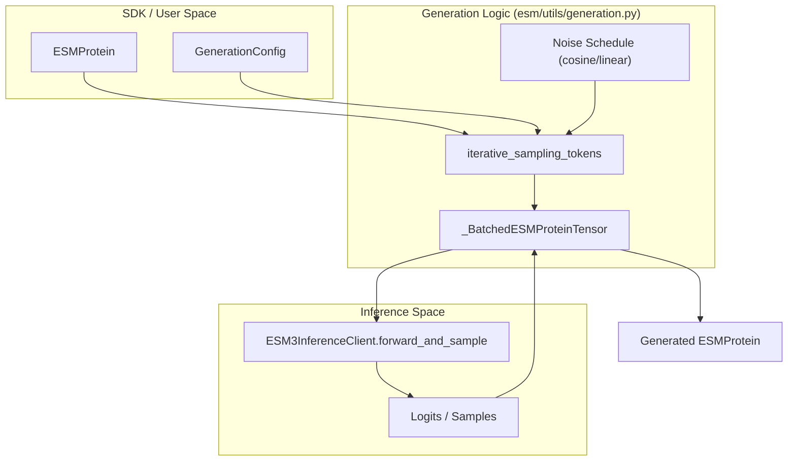
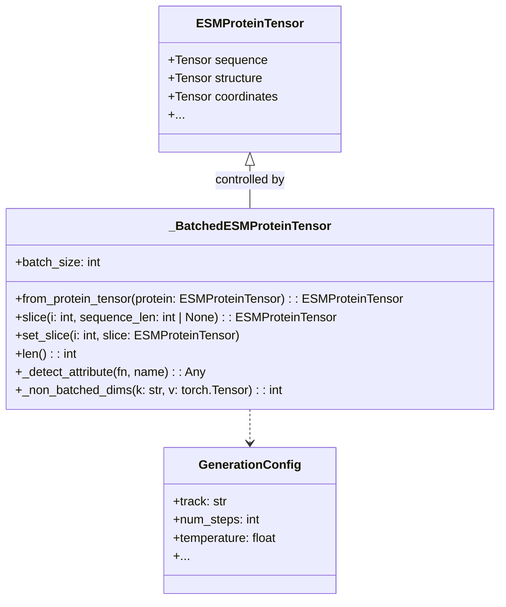

# Iterative Masked Generation

> **Relevant source files**
> * [esm/utils/decoding.py](https://github.com/Biohub/esm/blob/82ee3555/esm/utils/decoding.py)
> * [esm/utils/encoding.py](https://github.com/Biohub/esm/blob/82ee3555/esm/utils/encoding.py)
> * [esm/utils/generation.py](https://github.com/Biohub/esm/blob/82ee3555/esm/utils/generation.py)
> * [esm/utils/sampling.py](https://github.com/Biohub/esm/blob/82ee3555/esm/utils/sampling.py)

Iterative masked generation is the core mechanism for protein design and refinement in ESM3. Unlike standard autoregressive models that generate sequences from left to right, ESM3 uses a Masked Language Modeling (MLM) approach where tokens across multiple tracks (sequence, structure, function, etc.) are iteratively unmasked and sampled based on a noise schedule.

## Generation Loop Overview

The generation process is orchestrated by two primary functions in `esm/utils/generation.py`: `iterative_sampling_raw` and `iterative_sampling_tokens`. These functions manage the transition from masked inputs to fully realized protein designs by repeatedly calling the model's forward pass and sampling from the resulting logits.

### Key Components

* **Noise Schedules**: Define the rate at which tokens are unmasked over the course of the generation steps.
* **Sampling Strategies**: Determine how to select the next set of tokens to unmask (e.g., random vs. lowest entropy).
* **Track-Specific Logic**: Custom handling for different modalities like InterPro function tokens or SASA.

### Data Flow Diagram

The following diagram illustrates how the `iterative_sampling_tokens` function bridges the high-level `ESM3InferenceClient` with the underlying tensor manipulations.

**Iterative Sampling Data Flow**

Sources: [esm/utils/generation.py L100-L128](https://github.com/Biohub/esm/blob/82ee3555/esm/utils/generation.py#L100-L128)

 [esm/utils/generation.py L228-L310](https://github.com/Biohub/esm/blob/82ee3555/esm/utils/generation.py#L228-L310)

 [esm/sdk/api.py L340-L360](https://github.com/Biohub/esm/blob/82ee3555/esm/sdk/api.py#L340-L360)

## Noise Schedules and Unmasking

The generation process proceeds over $T$ steps. At each step, a fraction of the currently masked tokens is selected for unmasking. The number of tokens to unmask is determined by a noise schedule registered in `NOISE_SCHEDULE_REGISTRY` [esm/utils/noise_schedules.py L1-L10](https://github.com/Biohub/esm/blob/82ee3555/esm/utils/noise_schedules.py#L1-L10)

| Schedule | Description | Implementation |
| --- | --- | --- |
| **Linear** | Constant number of tokens unmasked per step. | `linear_schedule` |
| **Cosine** | Follows a cosine curve; fewer tokens unmasked at the start/end. | `cosine_schedule` |
| **Cubic** | Aggressive unmasking in the middle of the trajectory. | `cubic_schedule` |

### Unmasking Strategies

When choosing which specific tokens to unmask at step $t$, the system supports two primary strategies defined in `get_sampling_mask` [esm/utils/sampling.py L246-L270](https://github.com/Biohub/esm/blob/82ee3555/esm/utils/sampling.py#L246-L270)

:

1. **Random**: Tokens are selected uniformly at random from the current mask.
2. **Entropy-based**: The model's confidence (negative entropy) is used to pick the tokens it is most "certain" about first.

Sources: [esm/utils/generation.py L270-L285](https://github.com/Biohub/esm/blob/82ee3555/esm/utils/generation.py#L270-L285)

 [esm/utils/sampling.py L246-L270](https://github.com/Biohub/esm/blob/82ee3555/esm/utils/sampling.py#L246-L270)

## Track-Specific Sampling Logic

ESM3 is multimodal, and different tracks require different sampling treatments. These are handled by specialized functions in `esm/utils/sampling.py`.

### Sequence and Structure

Standard tracks use `sample_logits`, which supports temperature scaling and `top_p` (nucleus) sampling [esm/utils/sampling.py L153-L198](https://github.com/Biohub/esm/blob/82ee3555/esm/utils/sampling.py#L153-L198)

* **Temperature Annealing**: Often used to reduce randomness as generation progresses.
* **Invalid ID Masking**: Prevents the model from sampling special tokens like `<pad>` or `<cls>` during generation [esm/utils/sampling.py L177-L180](https://github.com/Biohub/esm/blob/82ee3555/esm/utils/sampling.py#L177-L180)

### Function and Residue Annotations

* **Function (InterPro)**: Uses `sample_function_logits`. Since function tokens are hierarchical (depth 8), the sampler must handle multi-dimensional output and a `p_none_threshold` to decide if a residue has no annotation [esm/utils/sampling.py L200-L220](https://github.com/Biohub/esm/blob/82ee3555/esm/utils/sampling.py#L200-L220)  The `InterProQuantizedTokenizer` is used for this track [esm/tokenization/function_tokenizer.py](https://github.com/Biohub/esm/blob/82ee3555/esm/tokenization/function_tokenizer.py)
* **Residue Annotations**: Uses `sample_residue_annotation_logits` to handle the binary/multi-label nature of site annotations [esm/utils/sampling.py L223-L243](https://github.com/Biohub/esm/blob/82ee3555/esm/utils/sampling.py#L223-L243)

Sources: [esm/utils/sampling.py L153-L243](https://github.com/Biohub/esm/blob/82ee3555/esm/utils/sampling.py#L153-L243)

 [esm/utils/generation.py L320-L350](https://github.com/Biohub/esm/blob/82ee3555/esm/utils/generation.py#L320-L350)

 [esm/tokenization/function_tokenizer.py](https://github.com/Biohub/esm/blob/82ee3555/esm/tokenization/function_tokenizer.py)

## Batching and Error Handling

The `iterative_sampling_tokens` implementation uses a specialized internal class, `_BatchedESMProteinTensor`, to manage heterogeneous protein lengths in a single GPU batch.

### The _BatchedESMProteinTensor Class

This class extends `ESMProteinTensor` to add batch dimensions and provides utilities for slicing and updating specific proteins within a batch [esm/utils/sampling.py L42-L108](https://github.com/Biohub/esm/blob/82ee3555/esm/utils/sampling.py#L42-L108)

 It includes methods like `from_protein_tensor` to convert a single `ESMProteinTensor` into a batched one, `slice` to extract a single protein's tensors, and `set_slice` to update a specific protein's data within the batch [esm/utils/sampling.py L45-L94](https://github.com/Biohub/esm/blob/82ee3555/esm/utils/sampling.py#L45-L94)

 The `_non_batched_dims` helper function determines the expected number of non-batch dimensions for each track, which is crucial for correct tensor manipulation [esm/utils/sampling.py L17-L40](https://github.com/Biohub/esm/blob/82ee3555/esm/utils/sampling.py#L17-L40)

**Tensor Management Logic**

Sources: [esm/utils/sampling.py L42-L108](https://github.com/Biohub/esm/blob/82ee3555/esm/utils/sampling.py#L42-L108)

 [esm/utils/sampling.py L17-L40](https://github.com/Biohub/esm/blob/82ee3555/esm/utils/sampling.py#L17-L40)

### Error Handling

During iterative generation, individual proteins in a batch may fail (e.g., due to length constraints or remote API timeouts). The `iterative_sampling_raw` function handles these by appending `ESMProteinError` objects to the output list. If a specific index in the batch fails, the system continues generating for the remaining proteins, ensuring that a single failure does not crash a large batch job [esm/utils/generation.py L118-L121](https://github.com/Biohub/esm/blob/82ee3555/esm/utils/generation.py#L118-L121)

 The `iterative_sampling_tokens` function also includes a `try-except` block to catch `ESMProteinError` during the batch processing and mark the corresponding protein as failed [esm/utils/generation.py L250-L265](https://github.com/Biohub/esm/blob/82ee3555/esm/utils/generation.py#L250-L265)

Sources: [esm/utils/sampling.py L42-L108](https://github.com/Biohub/esm/blob/82ee3555/esm/utils/sampling.py#L42-L108)

 [esm/utils/generation.py L100-L128](https://github.com/Biohub/esm/blob/82ee3555/esm/utils/generation.py#L100-L128)

 [esm/utils/generation.py L250-L265](https://github.com/Biohub/esm/blob/82ee3555/esm/utils/generation.py#L250-L265)

## Implementation Detail: iterative_sampling_tokens

The primary entry point for complex generation tasks is `iterative_sampling_tokens` [esm/utils/generation.py L228-L310](https://github.com/Biohub/esm/blob/82ee3555/esm/utils/generation.py#L228-L310)

1. **Initialization**: It converts a list of `ESMProtein` objects into a `_BatchedESMProteinTensor` and prepares the `SamplingConfig` [esm/utils/generation.py L238-L245](https://github.com/Biohub/esm/blob/82ee3555/esm/utils/generation.py#L238-L245)  It also initializes the `current_tokens` with masked inputs using `_make_masked_inputs` and `_stack_protein_tensors` [esm/utils/generation.py L239-L245](https://github.com/Biohub/esm/blob/82ee3555/esm/utils/generation.py#L239-L245)
2. **Step Loop**: * Calculates the `mask_ratio` based on the current step and the chosen `noise_schedule` [esm/utils/generation.py L270-L272](https://github.com/Biohub/esm/blob/82ee3555/esm/utils/generation.py#L270-L272) * Calls `client.forward_and_sample` to get the model's predictions for all tracks [esm/utils/generation.py L290-L295](https://github.com/Biohub/esm/blob/82ee3555/esm/utils/generation.py#L290-L295) * Determines which tokens to "keep" (unmask) using `get_sampling_mask` [esm/utils/generation.py L280-L285](https://github.com/Biohub/esm/blob/82ee3555/esm/utils/generation.py#L280-L285) * Updates the batch tensor with the newly sampled tokens, applying temperature annealing if specified [esm/utils/generation.py L300-L305](https://github.com/Biohub/esm/blob/82ee3555/esm/utils/generation.py#L300-L305)
3. **Finalization**: Once all steps are complete, the resulting tensors are decoded back into `ESMProtein` objects using `client.decode` [esm/utils/generation.py L310-L315](https://github.com/Biohub/esm/blob/82ee3555/esm/utils/generation.py#L310-L315)  The `_trim_sequence_tensor_dataclass` utility is used to remove padding before decoding [esm/utils/generation.py L37-L60](https://github.com/Biohub/esm/blob/82ee3555/esm/utils/generation.py#L37-L60)

Sources: [esm/utils/generation.py L228-L310](https://github.com/Biohub/esm/blob/82ee3555/esm/utils/generation.py#L228-L310)

 [esm/utils/sampling.py L246-L270](https://github.com/Biohub/esm/blob/82ee3555/esm/utils/sampling.py#L246-L270)

 [esm/utils/generation.py L37-L60](https://github.com/Biohub/esm/blob/82ee3555/esm/utils/generation.py#L37-L60)