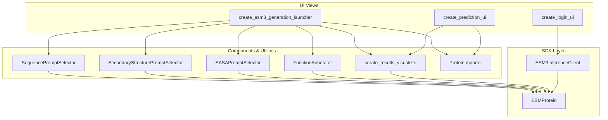
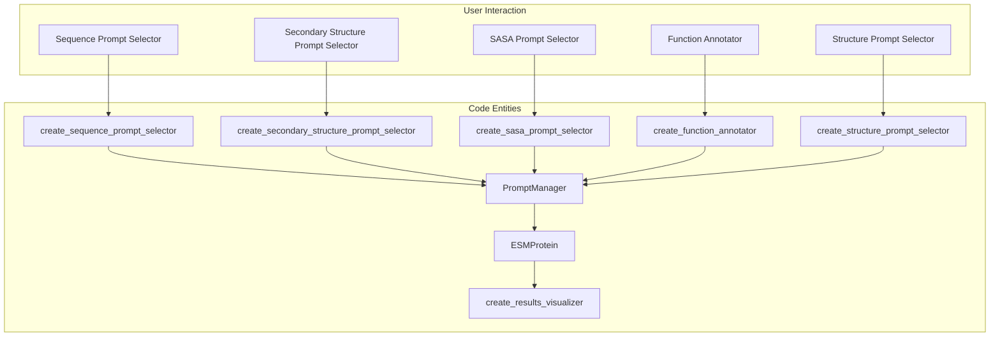

# Jupyter Widgets & Interactive UI

> **Relevant source files**
> * [esm/widgets/components/results_visualizer.py](https://github.com/Biohub/esm/blob/82ee3555/esm/widgets/components/results_visualizer.py)
> * [esm/widgets/components/secondary_structure_prompt_selector.py](https://github.com/Biohub/esm/blob/82ee3555/esm/widgets/components/secondary_structure_prompt_selector.py)
> * [esm/widgets/components/sequence_prompt_selector.py](https://github.com/Biohub/esm/blob/82ee3555/esm/widgets/components/sequence_prompt_selector.py)
> * [esm/widgets/utils/clients.py](https://github.com/Biohub/esm/blob/82ee3555/esm/widgets/utils/clients.py)
> * [esm/widgets/views/esm3_generation_launcher.py](https://github.com/Biohub/esm/blob/82ee3555/esm/widgets/views/esm3_generation_launcher.py)
> * [esm/widgets/views/login.py](https://github.com/Biohub/esm/blob/82ee3555/esm/widgets/views/login.py)
> * [esm/widgets/views/prediction.py](https://github.com/Biohub/esm/blob/82ee3555/esm/widgets/views/prediction.py)

The `esm.widgets` package provides a comprehensive set of Jupyter-based interactive components for interacting with ESM3 and ESMC models. These widgets facilitate complex tasks such as multi-track protein generation, property prediction, and high-quality 3D visualization directly within a notebook environment. The UI bridges the gap between high-level design intentions (e.g., "design a protein with this motif and this function") and the underlying SDK and model calls.

## System Architecture Overview

The interactive UI is built on `ipywidgets` and follows a modular pattern where views orchestrate specialized components. It interacts with the `ESM3InferenceClient` and `ESMCInferenceClient` to perform computations either locally or via the Biohub Forge platform.

### Component Relationship Diagram

This diagram illustrates how high-level UI views utilize components and SDK clients to process protein data.

**Sources:** [esm/widgets/views/esm3_generation_launcher.py L21-L122](https://github.com/Biohub/esm/blob/82ee3555/esm/widgets/views/esm3_generation_launcher.py#L21-L122)

 [esm/widgets/views/prediction.py L14-L41](https://github.com/Biohub/esm/blob/82ee3555/esm/widgets/views/prediction.py#L14-L41)

 [esm/widgets/views/login.py L11-L49](https://github.com/Biohub/esm/blob/82ee3555/esm/widgets/views/login.py#L11-L49)

## Authentication & Client Initialization

Before performing inference, users must initialize a client. The UI provides a unified login interface that handles:

* **Inference Options:** Choosing between the remote **Forge/Biohub Platform API** (full model access) or **Local** execution (supports `esm3-sm-open-v1`) [esm/widgets/views/login.py L17-L24](https://github.com/Biohub/esm/blob/82ee3555/esm/widgets/views/login.py#L17-L24)
* **Token Management:** Input and persistence of `ESM_API_KEY` via environment variables [esm/widgets/views/login.py L107-L112](https://github.com/Biohub/esm/blob/82ee3555/esm/widgets/views/login.py#L107-L112)
* **Client Factory:** Using `get_forge_client` or `get_local_client` to instantiate the appropriate `ESM3InferenceClient` [esm/widgets/views/login.py L143-L148](https://github.com/Biohub/esm/blob/82ee3555/esm/widgets/views/login.py#L143-L148)

For details, see [Authentication & Client Initialization Widgets](/Biohub/esm/8.1-authentication-and-client-initialization-widgets).

**Sources:** [esm/widgets/views/login.py L11-L170](https://github.com/Biohub/esm/blob/82ee3555/esm/widgets/views/login.py#L11-L170)

 [esm/widgets/utils/clients.py L7-L8](https://github.com/Biohub/esm/blob/82ee3555/esm/widgets/utils/clients.py#L7-L8)

## Generation & Prediction Views

The UI supports two primary workflows for protein engineering:

### 1. Multimodal Generation

The generation view allows users to "compile" a prompt by specifying a target length and adding constraints across multiple tracks (sequence, structure, function).

* **Generation Launcher:** The `create_esm3_generation_launcher` function orchestrates `batch_generate` calls with configurable `GenerationConfig` parameters like `temperature`, `top_p`, and `num_steps` [esm/widgets/views/esm3_generation_launcher.py L54-L101](https://github.com/Biohub/esm/blob/82ee3555/esm/widgets/views/esm3_generation_launcher.py#L54-L101)
* **Iterative Design:** Users can copy generated results back into the prompt for iterative refinement [esm/widgets/views/esm3_generation_launcher.py L206-L212](https://github.com/Biohub/esm/blob/82ee3555/esm/widgets/views/esm3_generation_launcher.py#L206-L212)

### 2. Sequential Prediction

The `create_prediction_ui` function focuses on a "one-to-many" track pipeline. Given a sequence or structure, it sequentially predicts all other modalities (Structure -> SS8 -> SASA -> Function) using the `client.generate` interface [esm/widgets/views/prediction.py L89-L101](https://github.com/Biohub/esm/blob/82ee3555/esm/widgets/views/prediction.py#L89-L101)

For details, see [Generation, Prediction & Inverse Folding Views](/Biohub/esm/8.2-generation-prediction-and-inverse-folding-views).

**Sources:** [esm/widgets/views/esm3_generation_launcher.py L21-L122](https://github.com/Biohub/esm/blob/82ee3555/esm/widgets/views/esm3_generation_launcher.py#L21-L122)

 [esm/widgets/views/prediction.py L14-L160](https://github.com/Biohub/esm/blob/82ee3555/esm/widgets/views/prediction.py#L14-L160)

## Prompt Selectors & Results Visualizer

These components handle the data entry and result inspection for `ESMProtein` objects.

### Interactive Data Mapping

This diagram shows how UI components map user interactions to specific `ESMProtein` fields and SDK operations.

**Sources:** [esm/widgets/components/sequence_prompt_selector.py L12-L20](https://github.com/Biohub/esm/blob/82ee3555/esm/widgets/components/sequence_prompt_selector.py#L12-L20)

 [esm/widgets/components/secondary_structure_prompt_selector.py L13-L21](https://github.com/Biohub/esm/blob/82ee3555/esm/widgets/components/secondary_structure_prompt_selector.py#L13-L21)

 [esm/widgets/components/results_visualizer.py L21-L43](https://github.com/Biohub/esm/blob/82ee3555/esm/widgets/components/results_visualizer.py#L21-L43)

### Key Components:

* **Prompt Selectors:** Components like `create_sequence_prompt_selector` [esm/widgets/components/sequence_prompt_selector.py L12-L20](https://github.com/Biohub/esm/blob/82ee3555/esm/widgets/components/sequence_prompt_selector.py#L12-L20)  and `create_secondary_structure_prompt_selector` [esm/widgets/components/secondary_structure_prompt_selector.py L13-L21](https://github.com/Biohub/esm/blob/82ee3555/esm/widgets/components/secondary_structure_prompt_selector.py#L13-L21)  allow users to define constraints on specific regions of a protein. These selectors manage ranges and values, often using a `PromptManager` [esm/widgets/utils/prompting.py L11-L12](https://github.com/Biohub/esm/blob/82ee3555/esm/widgets/utils/prompting.py#L11-L12)  to collect and organize user inputs.
* **Function Annotator:** Uses a `pygtrie` to provide auto-suggestions for InterPro tags and TF-IDF keywords, allowing users to apply labels to specific residue ranges.
* **Results Visualizer:** The `create_results_visualizer` function is a dispatching component that renders generated proteins based on modality [esm/widgets/components/results_visualizer.py L21-L43](https://github.com/Biohub/esm/blob/82ee3555/esm/widgets/components/results_visualizer.py#L21-L43)  It includes 3D structure visualization (colored by pLDDT), sequence alignment views, and SASA/SS8 charts. The `draw_function_annotations` [esm/widgets/utils/drawing/draw_function_annotations.py L11-L13](https://github.com/Biohub/esm/blob/82ee3555/esm/widgets/utils/drawing/draw_function_annotations.py#L11-L13)  and `draw_protein_structure` [esm/widgets/utils/drawing/draw_protein_structure.py L11-L13](https://github.com/Biohub/esm/blob/82ee3555/esm/widgets/utils/drawing/draw_protein_structure.py#L11-L13)  utilities are used for rendering.
* **Protein Importer:** A utility for loading reference proteins from PDB IDs or local files to serve as templates for motifs.

For details, see [Prompt Selectors & Results Visualizer](/Biohub/esm/8.3-prompt-selectors-and-results-visualizer).

**Sources:** [esm/widgets/components/results_visualizer.py L21-L132](https://github.com/Biohub/esm/blob/82ee3555/esm/widgets/components/results_visualizer.py#L21-L132)

 [esm/widgets/utils/drawing/draw_function_annotations.py L11-L13](https://github.com/Biohub/esm/blob/82ee3555/esm/widgets/utils/drawing/draw_function_annotations.py#L11-L13)

 [esm/widgets/utils/drawing/draw_protein_structure.py L11-L13](https://github.com/Biohub/esm/blob/82ee3555/esm/widgets/utils/drawing/draw_protein_structure.py#L11-L13)