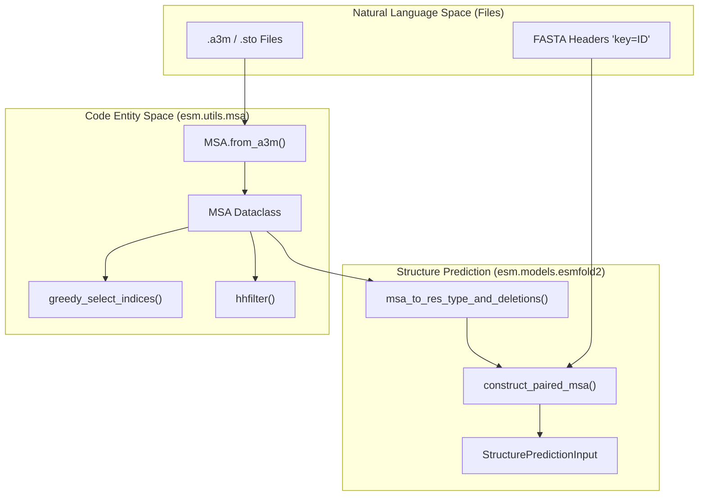
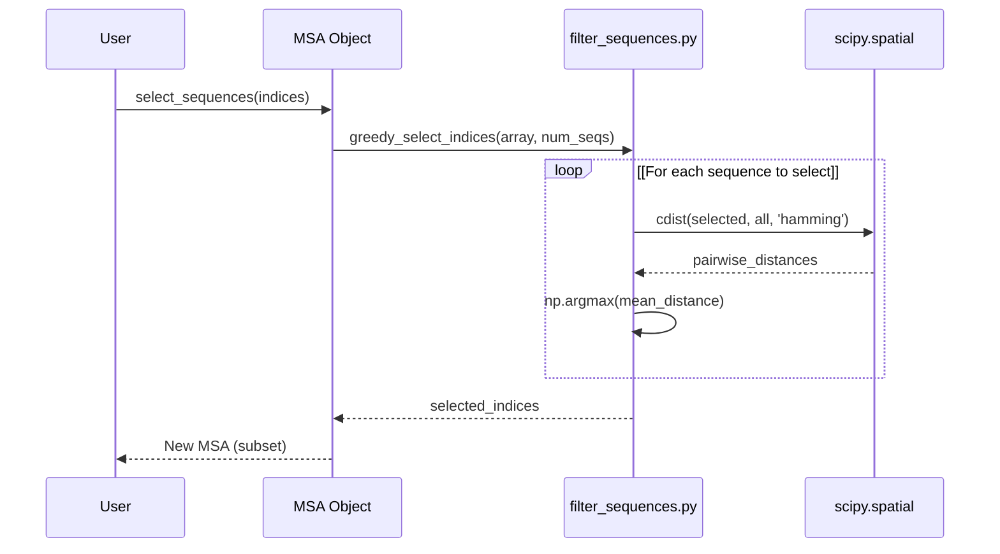

# MSA Utilities

> **Relevant source files**
> * [esm/models/esmfold2/paired_msa.py](https://github.com/Biohub/esm/blob/82ee3555/esm/models/esmfold2/paired_msa.py)
> * [esm/sdk/base_forge_client.py](https://github.com/Biohub/esm/blob/82ee3555/esm/sdk/base_forge_client.py)
> * [esm/utils/msa/__init__.py](https://github.com/Biohub/esm/blob/82ee3555/esm/utils/msa/__init__.py)
> * [esm/utils/msa/filter_sequences.py](https://github.com/Biohub/esm/blob/82ee3555/esm/utils/msa/filter_sequences.py)
> * [esm/utils/msa/msa.py](https://github.com/Biohub/esm/blob/82ee3555/esm/utils/msa/msa.py)
> * [esm/utils/msa/msa_test.py](https://github.com/Biohub/esm/blob/82ee3555/esm/utils/msa/msa_test.py)
> * [esm/utils/parsing.py](https://github.com/Biohub/esm/blob/82ee3555/esm/utils/parsing.py)

The Multiple Sequence Alignment (MSA) utilities provide a robust framework for handling, filtering, and processing protein sequence alignments. These utilities support core ESM operations, including diversity-based sequence selection for MSA Transformer models and taxonomy-based pairing for ESMFold2 multimer structure prediction.

## The MSA Dataclass

The core of the MSA system is the `MSA` class [esm/utils/msa/msa.py L47-L196](https://github.com/Biohub/esm/blob/82ee3555/esm/utils/msa/msa.py#L47-L196)

 a `SequentialDataclass` that provides an object-oriented interface for manipulating alignments. It stores data as a list of `FastaEntry` objects, which contain headers and sequences.

### Key Features and Methods

* **Factory Methods**: Supports loading from `.a3m` (A3M), `.sto` (Stockholm), and raw sequence lists [esm/utils/msa/msa.py L76-L174](https://github.com/Biohub/esm/blob/82ee3555/esm/utils/msa/msa.py#L76-L174)
* **Serialization**: Implements `to_bytes` and `from_bytes` for efficient storage and transport, preserving both sequences and headers [esm/utils/msa/msa.py L122-L160](https://github.com/Biohub/esm/blob/82ee3555/esm/utils/msa/msa.py#L122-L160)
* **Subselection**: Methods like `select_sequences` and `select_positions` allow for slicing the MSA by rows or columns while maintaining internal consistency [esm/utils/msa/msa.py L200-L203](https://github.com/Biohub/esm/blob/82ee3555/esm/utils/msa/msa.py#L200-L203)
* **Insertion Handling**: Provides `remove_insertions_from_sequence` to strip lowercase letters and dots from A3M formatted sequences [esm/utils/msa/msa.py L23-L25](https://github.com/Biohub/esm/blob/82ee3555/esm/utils/msa/msa.py#L23-L25)
* **Deletion Counts**: The `MSA` class can store per-match-column deletion counts, particularly when loaded from A3M files, which is crucial for ESMFold2's featurization [esm/utils/msa/msa.py L37](https://github.com/Biohub/esm/blob/82ee3555/esm/utils/msa/msa.py#L37-L37)  These deletion counts are preserved through slicing, padding, and stacking operations [esm/utils/msa/msa_test.py L87-L149](https://github.com/Biohub/esm/blob/82ee3555/esm/utils/msa/msa_test.py#L87-L149)

### Data Representation

The `MSA` class lazily computes a NumPy character array (`|S1`) of the sequences for high-performance numerical operations [esm/utils/msa/msa.py L177-L178](https://github.com/Biohub/esm/blob/82ee3555/esm/utils/msa/msa.py#L177-L178)

| Attribute | Type | Description |
| --- | --- | --- |
| `entries` | `list[FastaEntry]` | Raw header/sequence pairs [esm/utils/msa/msa.py L37](https://github.com/Biohub/esm/blob/82ee3555/esm/utils/msa/msa.py#L37-L37) |
| `deletions` | `np.ndarray | None` |
| `sequences` | `list[str]` | Property returning all sequence strings [esm/utils/msa/msa.py L40-L41](https://github.com/Biohub/esm/blob/82ee3555/esm/utils/msa/msa.py#L40-L41) |
| `headers` | `list[str]` | Property returning all header strings [esm/utils/msa/msa.py L44-L45](https://github.com/Biohub/esm/blob/82ee3555/esm/utils/msa/msa.py#L44-L45) |
| `depth` | `int` | Number of sequences in the MSA [esm/utils/msa/msa.py L169-L170](https://github.com/Biohub/esm/blob/82ee3555/esm/utils/msa/msa.py#L169-L170) |
| `seqlen` | `int` | Length of the alignment [esm/utils/msa/msa.py L173-L174](https://github.com/Biohub/esm/blob/82ee3555/esm/utils/msa/msa.py#L173-L174) |

**Sources:** [esm/utils/msa/msa.py L28-L196](https://github.com/Biohub/esm/blob/82ee3555/esm/utils/msa/msa.py#L28-L196)

 [esm/utils/parsing.py L6](https://github.com/Biohub/esm/blob/82ee3555/esm/utils/parsing.py#L6-L6)

 [esm/utils/msa/msa_test.py L87-L149](https://github.com/Biohub/esm/blob/82ee3555/esm/utils/msa/msa_test.py#L87-L149)

---

## Sequence Selection and Filtering

The library provides two primary mechanisms for reducing MSA depth while preserving information: greedy selection and `hhfilter` wrapping.

### Greedy Diversity Selection

The `greedy_select_indices` function [esm/utils/msa/filter_sequences.py L11-L45](https://github.com/Biohub/esm/blob/82ee3555/esm/utils/msa/filter_sequences.py#L11-L45)

 implements the algorithm used in the MSA Transformer paper. It iteratively selects sequences that maximize the average Hamming distance to the already selected set.

1. Start with the query sequence (index 0).
2. Calculate the Hamming distance between the current set and all remaining sequences using `scipy.spatial.distance.cdist` [esm/utils/msa/filter_sequences.py L38](https://github.com/Biohub/esm/blob/82ee3555/esm/utils/msa/filter_sequences.py#L38-L38)
3. Add the sequence that maximizes the average distance [esm/utils/msa/filter_sequences.py L39](https://github.com/Biohub/esm/blob/82ee3555/esm/utils/msa/filter_sequences.py#L39-L39)
4. Repeat until `num_seqs` is reached.

### HHFilter Wrapper

The `hhfilter` function [esm/utils/msa/filter_sequences.py L48-L82](https://github.com/Biohub/esm/blob/82ee3555/esm/utils/msa/filter_sequences.py#L48-L82)

 provides a Python interface to the `hhfilter` binary from the HH-suite. It filters MSAs based on sequence identity, coverage, and diversity. It writes the input sequences to a temporary FASTA file, executes the `hhfilter` command, and then parses the output to return the indices of the filtered sequences [esm/utils/msa/filter_sequences.py L57-L82](https://github.com/Biohub/esm/blob/82ee3555/esm/utils/msa/filter_sequences.py#L57-L82)

**Sources:** [esm/utils/msa/filter_sequences.py L11-L82](https://github.com/Biohub/esm/blob/82ee3555/esm/utils/msa/filter_sequences.py#L11-L82)

---

## Paired MSA for ESMFold2

For multimer structure prediction, ESMFold2 requires "paired" MSAs where sequences from different chains are aligned based on their taxonomic origin.

### Taxonomy Extraction

Taxonomy IDs are parsed from FASTA headers using the regex `key=(-?\d+)`. If no key is found, it defaults to `-1` (unpaired) [esm/models/esmfold2/paired_msa.py L35-L39](https://github.com/Biohub/esm/blob/82ee3555/esm/models/esmfold2/paired_msa.py#L35-L39)

### The Pairing Pipeline

The `construct_paired_msa` function [esm/models/esmfold2/paired_msa.py L106-L188](https://github.com/Biohub/esm/blob/82ee3555/esm/models/esmfold2/paired_msa.py#L106-L188)

 builds the complex MSA features required by the model:

1. **Per-chain Tables**: For each chain, it converts the `MSA` object into residue type arrays, deletion count arrays, and extracts taxonomy IDs [esm/models/esmfold2/paired_msa.py L137-L152](https://github.com/Biohub/esm/blob/82ee3555/esm/models/esmfold2/paired_msa.py#L137-L152)
2. **Grouping by Taxonomy**: Sequences from different chains are grouped by their taxonomy ID, excluding the query row and unpaired entries (`key=-1`) [esm/models/esmfold2/paired_msa.py L154-L160](https://github.com/Biohub/esm/blob/82ee3555/esm/models/esmfold2/paired_msa.py#L154-L160)
3. **Pairing**: Rows are created by combining sequences with matching taxonomy IDs. The function prioritizes taxonomies with more distinct chains [esm/models/esmfold2/paired_msa.py L161-L164](https://github.com/Biohub/esm/blob/82ee3555/esm/models/esmfold2/paired_msa.py#L161-L164)
4. **Block-Diagonalization**: Sequences that cannot be paired (unpaired or unique to a chain) are placed in the MSA as block-diagonal entries, where the other chain positions are padded with gaps [esm/models/esmfold2/paired_msa.py L1-L7](https://github.com/Biohub/esm/blob/82ee3555/esm/models/esmfold2/paired_msa.py#L1-L7)
5. **Feature Generation**: Returns `msa_residues` (token IDs), `deletion_value` (insertion counts), and `is_paired` masks [esm/models/esmfold2/paired_msa.py L114-L121](https://github.com/Biohub/esm/blob/82ee3555/esm/models/esmfold2/paired_msa.py#L114-L121)

**Sources:** [esm/models/esmfold2/paired_msa.py L1-L188](https://github.com/Biohub/esm/blob/82ee3555/esm/models/esmfold2/paired_msa.py#L1-L188)

---

## System Integration Diagrams

### MSA Data Flow: From File to Model

This diagram shows how raw MSA files are processed and transformed into the inputs required by structure prediction models like ESMFold2.

**Sources:** [esm/utils/msa/msa.py L56-L71](https://github.com/Biohub/esm/blob/82ee3555/esm/utils/msa/msa.py#L56-L71)

 [esm/utils/msa/filter_sequences.py L11-L45](https://github.com/Biohub/esm/blob/82ee3555/esm/utils/msa/filter_sequences.py#L11-L45)

 [esm/models/esmfold2/paired_msa.py L86-L121](https://github.com/Biohub/esm/blob/82ee3555/esm/models/esmfold2/paired_msa.py#L86-L121)

 [esm/utils/structure/input_builder.py L75-L80](https://github.com/Biohub/esm/blob/82ee3555/esm/utils/structure/input_builder.py#L75-L80)

### MSA Selection Logic

The following diagram details the interaction between the `MSA` class and the filtering utilities.

**Sources:** [esm/utils/msa/msa.py L184-L187](https://github.com/Biohub/esm/blob/82ee3555/esm/utils/msa/msa.py#L184-L187)

 [esm/utils/msa/filter_sequences.py L11-L45](https://github.com/Biohub/esm/blob/82ee3555/esm/utils/msa/filter_sequences.py#L11-L45)

---

## Utility Summary Table

| Function | File Path | Description |
| --- | --- | --- |
| `parse_fasta` | `esm/utils/parsing.py` | Generator yielding `FastaEntry` from strings [esm/utils/parsing.py L9-L37](https://github.com/Biohub/esm/blob/82ee3555/esm/utils/parsing.py#L9-L37) |
| `msa_to_res_type_and_deletions` | `esm/models/esmfold2/paired_msa.py` | Converts MSA to residue IDs and insertion counts, handling a3m insertion conventions [esm/models/esmfold2/paired_msa.py L42-L78](https://github.com/Biohub/esm/blob/82ee3555/esm/models/esmfold2/paired_msa.py#L42-L78) |
| `serialize_structure_prediction_input` | `esm/utils/structure/input_builder.py` | Converts `StructurePredictionInput` (containing MSAs) to JSON-safe dict [esm/utils/structure/input_builder.py L82-L153](https://github.com/Biohub/esm/blob/82ee3555/esm/utils/structure/input_builder.py#L82-L153) |
| `remove_insertions_from_sequence` | `esm/utils/msa/msa.py` | Removes A3M insertion characters (lowercase/dots) [esm/utils/msa/msa.py L23-L25](https://github.com/Biohub/esm/blob/82ee3555/esm/utils/msa/msa.py#L23-L25) |
| `a3m_deletion_counts` | `esm/utils/msa/msa.py` | Calculates per-match-column count of preceding a3m insertions [esm/utils/msa/msa.py L32-L44](https://github.com/Biohub/esm/blob/82ee3555/esm/utils/msa/msa.py#L32-L44) |

**Sources:** [esm/utils/parsing.py L9-L37](https://github.com/Biohub/esm/blob/82ee3555/esm/utils/parsing.py#L9-L37)

 [esm/models/esmfold2/paired_msa.py L42-L78](https://github.com/Biohub/esm/blob/82ee3555/esm/models/esmfold2/paired_msa.py#L42-L78)

 [esm/utils/structure/input_builder.py L82-L153](https://github.com/Biohub/esm/blob/82ee3555/esm/utils/structure/input_builder.py#L82-L153)

 [esm/utils/msa/msa.py L23-L25](https://github.com/Biohub/esm/blob/82ee3555/esm/utils/msa/msa.py#L23-L25)

 [esm/utils/msa/msa.py L32-L44](https://github.com/Biohub/esm/blob/82ee3555/esm/utils/msa/msa.py#L32-L44)