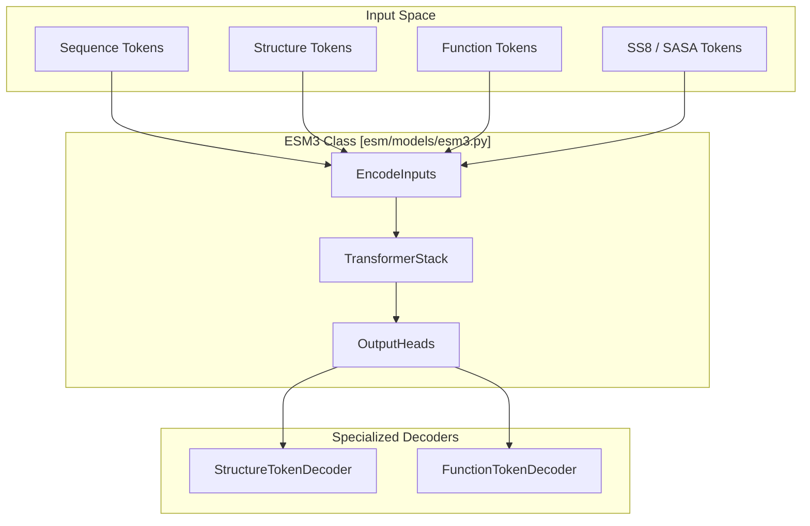
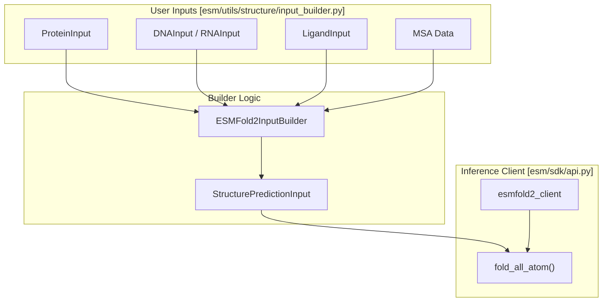

# Model Families & Capabilities

> **Relevant source files**
> * [README.md](https://github.com/Biohub/esm/blob/82ee3555/README.md?plain=1)
> * [esm/models/function_decoder.py](https://github.com/Biohub/esm/blob/82ee3555/esm/models/function_decoder.py)
> * [esm/pretrained.py](https://github.com/Biohub/esm/blob/82ee3555/esm/pretrained.py)

This page provides a technical comparison of the three primary model families within the ESM ecosystem: **ESMC**, **ESM3**, and **ESMFold2**. These models represent a transition from sequence-only language modeling to multimodal protein design and high-fidelity structure prediction.

## Overview of Model Families

The repository supports two execution modes for these models: **Local Inference** (via Hugging Face weights and local PyTorch execution) and **Remote Inference** (via the Biohub Platform API).

| Feature | ESMC | ESM3 | ESMFold2 |
| --- | --- | --- | --- |
| **Primary Task** | Sequence Representation | Multimodal Design/Generation | Structure Prediction |
| **Architecture** | Transformer (Sequence) | Multimodal Transformer | Diffusion-based Folding |
| **Inputs** | Amino Acid Sequence | Seq, Struct, SS8, SASA, Func | Seq, MSA, Templates |
| **Scale Variants** | 300M, 600M, 6B | Open Small (v1) | 6B Backbone |
| **Key Use Case** | Embeddings, Variant Effect | De novo design, Inverse folding | High-accuracy folding |

Sources: [README.md L10-L37](https://github.com/Biohub/esm/blob/82ee3555/README.md?plain=1#L10-L37)

 [esm/utils/constants/models.py L2-L13](https://github.com/Biohub/esm/blob/82ee3555/esm/utils/constants/models.py#L2-L13)

---

## ESMC: Sequence Embedding Model

ESMC is the latest generation of protein language models, optimized for learning biological representations from billions of sequences [README.md L10-L12](https://github.com/Biohub/esm/blob/82ee3555/README.md?plain=1#L10-L12)

 It serves as the foundation for the ESM Atlas and SAE-based interpretability [README.md L35-L37](https://github.com/Biohub/esm/blob/82ee3555/README.md?plain=1#L35-L37)

### Architecture & Implementation

ESMC utilizes a standard Transformer backbone with support for **Flash Attention** to handle long-range structural dependencies efficiently [esm/models/esmc.py L61-L74](https://github.com/Biohub/esm/blob/82ee3555/esm/models/esmc.py#L61-L74)

* **Class**: `ESMC` [esm/models/esmc.py L45](https://github.com/Biohub/esm/blob/82ee3555/esm/models/esmc.py#L45-L45)
* **Backbone**: `TransformerStack` [esm/models/esmc.py L67-L74](https://github.com/Biohub/esm/blob/82ee3555/esm/models/esmc.py#L67-L74)
* **Output**: `ESMCOutput` containing `sequence_logits`, `embeddings`, and `hidden_states` [esm/models/esmc.py L38-L42](https://github.com/Biohub/esm/blob/82ee3555/esm/models/esmc.py#L38-L42)

### Model Scales & Factory Functions

Models can be instantiated locally using the `ESMC.from_pretrained()` method or specific factory functions in `esm.pretrained`.

| Model Constant | Parameters | Factory Function |
| --- | --- | --- |
| `ESMC_300M` | 300 Million | `ESMC_300M_202412` [esm/pretrained.py L66-L77](https://github.com/Biohub/esm/blob/82ee3555/esm/pretrained.py#L66-L77) |
| `ESMC_600M` | 600 Million | `ESMC_600M_202412` [esm/pretrained.py L79-L90](https://github.com/Biohub/esm/blob/82ee3555/esm/pretrained.py#L79-L90) |
| `ESMC_6B` | 6 Billion | `ESMC_6B_202412` [esm/pretrained.py L92-L105](https://github.com/Biohub/esm/blob/82ee3555/esm/pretrained.py#L92-L105) |

Sources: [esm/models/esmc.py L79-L96](https://github.com/Biohub/esm/blob/82ee3555/esm/models/esmc.py#L79-L96)

 [esm/pretrained.py L66-L105](https://github.com/Biohub/esm/blob/82ee3555/esm/pretrained.py#L66-L105)

 [esm/utils/constants/models.py L9-L11](https://github.com/Biohub/esm/blob/82ee3555/esm/utils/constants/models.py#L9-L11)

---

## ESM3: Multimodal Protein Language Model

ESM3 is a generative world model capable of reasoning across multiple "tracks" of protein data simultaneously [esm/models/esm3.py L188-L190](https://github.com/Biohub/esm/blob/82ee3555/esm/models/esm3.py#L188-L190)

 It uses a unified vocabulary to represent sequence, structure (via VQ-VAE tokens), and function [esm/models/esm3.py L62-L102](https://github.com/Biohub/esm/blob/82ee3555/esm/models/esm3.py#L62-L102)

### Data Flow & Component Mapping

The following diagram illustrates how the `ESM3` class coordinates various sub-models to process multimodal inputs.

**ESM3 Multimodal Integration**

Sources: [esm/models/esm3.py L62-L185](https://github.com/Biohub/esm/blob/82ee3555/esm/models/esm3.py#L62-L185)

 [esm/models/esm3.py L211-L218](https://github.com/Biohub/esm/blob/82ee3555/esm/models/esm3.py#L211-L218)

### Key Components

* **`EncodeInputs`**: Projects all tracks (Sequence, pLDDT, Structure, SS8, SASA, Function, Residue) into a shared `d_model` embedding space [esm/models/esm3.py L62-L148](https://github.com/Biohub/esm/blob/82ee3555/esm/models/esm3.py#L62-L148)
* **`StructureTokenEncoder/Decoder`**: A VQ-VAE that discretizes 3D coordinates into 4096 discrete tokens [esm/models/vqvae.py L179-L187](https://github.com/Biohub/esm/blob/82ee3555/esm/models/vqvae.py#L179-L187)  [esm/utils/constants/esm3.py L13-L20](https://github.com/Biohub/esm/blob/82ee3555/esm/utils/constants/esm3.py#L13-L20)
* **`FunctionTokenDecoder`**: Decodes function tokens into InterPro annotations and keyword TF-IDF vectors [esm/models/function_decoder.py L54-L125](https://github.com/Biohub/esm/blob/82ee3555/esm/models/function_decoder.py#L54-L125)

Sources: [esm/models/esm3.py L15-L16](https://github.com/Biohub/esm/blob/82ee3555/esm/models/esm3.py#L15-L16)

 [esm/pretrained.py L108-L125](https://github.com/Biohub/esm/blob/82ee3555/esm/pretrained.py#L108-L125)

---

## ESMFold2: All-Atom Structure Prediction

ESMFold2 is built upon the ESMC 6B backbone and is optimized for predicting the structures of complex biological systems, including proteins, nucleic acids (DNA/RNA), and small-molecule ligands [README.md L21-L28](https://github.com/Biohub/esm/blob/82ee3555/README.md?plain=1#L21-L28)

### Capabilities

* **Multi-chain Support**: Can fold protein-protein, protein-nucleic acid, and antibody-antigen complexes [cookbook/tutorials/esmfold2.ipynb L15-L18](https://github.com/Biohub/esm/blob/82ee3555/cookbook/tutorials/esmfold2.ipynb#L15-L18)
* **Non-canonical Support**: Handles non-canonical amino acids via CCD codes and covalent modifications [cookbook/tutorials/esmfold2.ipynb L19-L22](https://github.com/Biohub/esm/blob/82ee3555/cookbook/tutorials/esmfold2.ipynb#L19-L22)
* **MSA Integration**: Supports Multiple Sequence Alignments to improve prediction accuracy [cookbook/tutorials/esmfold2.ipynb L23-L25](https://github.com/Biohub/esm/blob/82ee3555/cookbook/tutorials/esmfold2.ipynb#L23-L25)

### System Architecture

The folding process is managed via the `ESMFold2InputBuilder` which assembles various molecular inputs into a `StructurePredictionInput` payload for the diffusion engine.

**ESMFold2 Input Assembly**

Sources: [cookbook/tutorials/esmfold2.ipynb L79-L81](https://github.com/Biohub/esm/blob/82ee3555/cookbook/tutorials/esmfold2.ipynb#L79-L81)

 [esm/utils/constants/models.py L12-L14](https://github.com/Biohub/esm/blob/82ee3555/esm/utils/constants/models.py#L12-L14)

---

## Model Selection Guide

| If you want to... | Use This Model | Implementation |
| --- | --- | --- |
| Generate a new protein sequence for a specific fold | **ESM3** | `esm.models.esm3.ESM3` |
| Extract features for a downstream classifier | **ESMC** | `esm.models.esmc.ESMC` |
| Predict the 3D structure of a protein-DNA complex | **ESMFold2** | `esm.sdk.esmfold2_client` |
| Interpret model features using SAEs | **ESMC** | `esm.models.esmc.ESMC` |
| Perform inverse folding (Structure $\rightarrow$ Sequence) | **ESM3** | `ESM3.forward_and_sample` |

Sources: [README.md L10-L37](https://github.com/Biohub/esm/blob/82ee3555/README.md?plain=1#L10-L37)

 [esm/models/esm3.py L188-L190](https://github.com/Biohub/esm/blob/82ee3555/esm/models/esm3.py#L188-L190)

 [esm/models/esmc.py L45-L48](https://github.com/Biohub/esm/blob/82ee3555/esm/models/esmc.py#L45-L48)